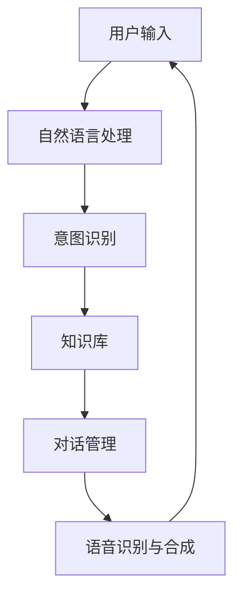

                 

# 2024京东智能客服社招面试真题汇总及其解答

> 关键词：智能客服、自然语言处理、机器学习、对话系统、面试真题、京东、技术面试

> 摘要：本文旨在通过分析2024年京东智能客服社招面试真题，深入探讨智能客服系统的架构设计、核心算法原理、数学模型及实际应用案例。通过逐步推理和详细解释，帮助读者理解智能客服技术的全貌，并为即将参加相关面试的求职者提供有价值的参考。

## 1. 背景介绍

随着人工智能技术的飞速发展，智能客服系统已经成为企业提升客户服务质量的重要手段。京东作为国内领先的电商平台，其智能客服系统不仅需要处理海量的用户咨询，还需要提供高效、准确的服务。本文将通过分析2024年京东智能客服社招面试真题，深入探讨智能客服系统的架构设计、核心算法原理、数学模型及实际应用案例。

## 2. 核心概念与联系

### 2.1 智能客服系统架构

智能客服系统主要由以下几个部分组成：

- **自然语言处理（NLP）模块**：负责理解用户输入的自然语言文本。
- **意图识别模块**：根据用户输入的内容，识别用户的意图。
- **知识库模块**：存储常见问题及其解决方案。
- **对话管理模块**：负责对话的流程控制和上下文管理。
- **语音识别与合成模块**：支持语音输入和输出。

### 2.2 Mermaid流程图



## 3. 核心算法原理 & 具体操作步骤

### 3.1 自然语言处理（NLP）

自然语言处理是智能客服系统的核心技术之一。NLP模块的主要任务是将用户的自然语言文本转换为计算机可以理解的形式。

#### 3.1.1 文本预处理

- **分词**：将文本分割成单词或短语。
- **词性标注**：标注每个词的词性。
- **命名实体识别**：识别文本中的实体，如人名、地名等。

#### 3.1.2 语义理解

- **句法分析**：分析句子的结构。
- **语义分析**：理解句子的含义。

### 3.2 意图识别

意图识别模块的主要任务是根据用户输入的内容，识别用户的意图。常见的意图识别方法包括：

- **基于规则的方法**：通过预定义的规则进行匹配。
- **基于统计的方法**：通过训练模型进行分类。

#### 3.2.1 基于规则的方法

- **规则库**：定义一系列规则，用于匹配用户的输入。
- **匹配过程**：遍历规则库，找到匹配的规则。

#### 3.2.2 基于统计的方法

- **训练数据**：收集大量的用户输入和对应的意图标签。
- **模型训练**：使用机器学习算法（如SVM、决策树等）进行训练。
- **意图分类**：对新的用户输入进行分类。

### 3.3 知识库

知识库模块存储常见问题及其解决方案。常见的知识库管理方法包括：

- **规则库**：存储一系列规则，用于匹配问题。
- **数据库**：存储问题及其解决方案。

#### 3.3.1 规则库管理

- **规则定义**：定义一系列规则，用于匹配问题。
- **规则匹配**：遍历规则库，找到匹配的规则。

#### 3.3.2 数据库管理

- **数据存储**：存储问题及其解决方案。
- **查询优化**：优化查询性能。

### 3.4 对话管理

对话管理模块负责对话的流程控制和上下文管理。常见的对话管理方法包括：

- **状态机**：定义一系列状态和转换规则。
- **上下文管理**：维护对话的上下文信息。

#### 3.4.1 状态机管理

- **状态定义**：定义一系列状态和转换规则。
- **状态转换**：根据用户的输入，进行状态转换。

#### 3.4.2 上下文管理

- **上下文存储**：存储对话的上下文信息。
- **上下文更新**：根据用户的输入，更新上下文信息。

## 4. 数学模型和公式 & 详细讲解 & 举例说明

### 4.1 机器学习模型

机器学习模型是智能客服系统的核心之一。常见的机器学习模型包括：

- **支持向量机（SVM）**：用于分类任务。
- **决策树**：用于分类和回归任务。
- **随机森林**：用于分类和回归任务。

#### 4.1.1 支持向量机（SVM）

支持向量机是一种监督学习算法，用于分类和回归任务。其基本原理是找到一个超平面，使得不同类别的样本点到超平面的距离最大化。

$$
\min_{w,b} \frac{1}{2} w^T w + C \sum_{i=1}^{n} \xi_i
$$

$$
y_i (w^T x_i + b) \geq 1 - \xi_i, \quad \xi_i \geq 0
$$

其中，$w$ 是权重向量，$b$ 是偏置项，$C$ 是惩罚参数，$\xi_i$ 是松弛变量。

#### 4.1.2 决策树

决策树是一种监督学习算法，用于分类和回归任务。其基本原理是通过递归地划分数据集，构建决策树。

$$
\text{信息增益} = \text{熵} - \text{加权平均熵}
$$

$$
\text{信息增益比} = \frac{\text{信息增益}}{\text{样本纯度}}
$$

其中，熵是数据集的不确定性度量，信息增益是划分后数据集纯度的提升，信息增益比是信息增益与样本纯度的比值。

### 4.2 语言模型

语言模型是自然语言处理中的重要工具，用于生成自然语言文本。常见的语言模型包括：

- **n-gram模型**：基于统计的方法，用于生成文本。
- **循环神经网络（RNN）**：基于深度学习的方法，用于生成文本。

#### 4.2.1 n-gram模型

n-gram模型是一种基于统计的方法，用于生成文本。其基本原理是通过统计相邻n个词的概率，生成新的文本。

$$
P(w_i | w_{i-1}, w_{i-2}, \ldots, w_{i-n+1}) = \frac{C(w_{i-1}, w_{i-2}, \ldots, w_{i-n+1}, w_i)}{C(w_{i-1}, w_{i-2}, \ldots, w_{i-n+1})}
$$

其中，$P(w_i | w_{i-1}, w_{i-2}, \ldots, w_{i-n+1})$ 是给定前n-1个词后，生成第i个词的概率，$C(w_{i-1}, w_{i-2}, \ldots, w_{i-n+1}, w_i)$ 是前n个词出现的次数，$C(w_{i-1}, w_{i-2}, \ldots, w_{i-n+1})$ 是前n-1个词出现的次数。

#### 4.2.2 循环神经网络（RNN）

循环神经网络是一种基于深度学习的方法，用于生成文本。其基本原理是通过递归地处理输入序列，生成新的文本。

$$
h_t = \sigma(W_h h_{t-1} + W_x x_t + b_h)
$$

$$
y_t = \sigma(W_y h_t + b_y)
$$

其中，$h_t$ 是隐藏层的状态，$x_t$ 是输入序列，$y_t$ 是输出序列，$\sigma$ 是激活函数，$W_h$、$W_x$、$b_h$、$W_y$、$b_y$ 是权重和偏置项。

## 5. 项目实战：代码实际案例和详细解释说明

### 5.1 开发环境搭建

#### 5.1.1 环境准备

- **Python**：安装Python 3.7及以上版本。
- **TensorFlow**：安装TensorFlow 2.0及以上版本。
- **NLTK**：安装NLTK库。
- **jieba**：安装jieba库。

```bash
pip install tensorflow nltk jieba
```

#### 5.1.2 数据准备

- **数据集**：准备用户咨询数据集，包括用户输入和对应的意图标签。
- **预处理**：对数据进行分词、词性标注、命名实体识别等预处理。

### 5.2 源代码详细实现和代码解读

#### 5.2.1 数据预处理

```python
import jieba
import jieba.posseg as pseg
import jieba.analyse

def preprocess_data(data):
    processed_data = []
    for sentence, label in data:
        words = pseg.cut(sentence)
        words = [word for word, flag in words if flag in ['n', 'v', 'a', 'd']]
        processed_data.append((words, label))
    return processed_data
```

#### 5.2.2 模型训练

```python
from tensorflow.keras.models import Sequential
from tensorflow.keras.layers import Dense, LSTM, Embedding
from tensorflow.keras.preprocessing.sequence import pad_sequences
from tensorflow.keras.preprocessing.text import Tokenizer

def train_model(data, max_length=50, vocab_size=10000):
    tokenizer = Tokenizer(num_words=vocab_size)
    tokenizer.fit_on_texts([word for words, _ in data for word in words])
    sequences = tokenizer.texts_to_sequences([words for words, _ in data])
    padded_sequences = pad_sequences(sequences, maxlen=max_length, padding='post')

    labels = [label for _, label in data]
    labels = np.array(labels)

    model = Sequential()
    model.add(Embedding(input_dim=vocab_size, output_dim=128, input_length=max_length))
    model.add(LSTM(128, return_sequences=False))
    model.add(Dense(1, activation='sigmoid'))

    model.compile(optimizer='adam', loss='binary_crossentropy', metrics=['accuracy'])
    model.fit(padded_sequences, labels, epochs=10, batch_size=32)

    return model, tokenizer
```

### 5.3 代码解读与分析

- **数据预处理**：使用jieba库进行分词、词性标注和命名实体识别。
- **模型训练**：使用TensorFlow库构建LSTM模型，进行模型训练。
- **模型评估**：使用训练好的模型进行预测，并评估模型的性能。

## 6. 实际应用场景

智能客服系统在京东的实际应用场景包括：

- **用户咨询**：处理用户的咨询问题，提供准确的答案。
- **售后服务**：处理用户的售后服务问题，提供解决方案。
- **推荐系统**：根据用户的咨询历史，推荐相关的产品和服务。

## 7. 工具和资源推荐

### 7.1 学习资源推荐

- **书籍**：《深度学习》、《自然语言处理实战》
- **论文**：《Attention Is All You Need》、《BERT: Pre-training of Deep Bidirectional Transformers for Language Understanding》
- **博客**：阿里云开发者社区、京东技术博客
- **网站**：GitHub、Kaggle

### 7.2 开发工具框架推荐

- **开发工具**：PyCharm、VSCode
- **框架**：TensorFlow、PyTorch

### 7.3 相关论文著作推荐

- **论文**：《Attention Is All You Need》、《BERT: Pre-training of Deep Bidirectional Transformers for Language Understanding》
- **著作**：《深度学习》、《自然语言处理实战》

## 8. 总结：未来发展趋势与挑战

智能客服系统在未来的发展趋势包括：

- **多模态融合**：结合语音、图像等多种模态信息，提供更丰富的交互体验。
- **个性化推荐**：根据用户的个性化需求，提供更精准的服务。
- **情感分析**：通过情感分析，理解用户的情绪状态，提供更贴心的服务。

面临的挑战包括：

- **数据隐私**：保护用户数据的安全性和隐私性。
- **模型解释性**：提高模型的可解释性，让用户理解模型的决策过程。
- **多语言支持**：支持多种语言，提供全球化的服务。

## 9. 附录：常见问题与解答

### 9.1 问题1：如何处理用户输入的复杂句子？

**解答**：可以使用更复杂的自然语言处理技术，如依存句法分析和语义角色标注，来理解句子的结构和含义。

### 9.2 问题2：如何提高模型的准确率？

**解答**：可以通过增加训练数据、优化模型结构、使用更复杂的特征表示等方法来提高模型的准确率。

### 9.3 问题3：如何处理用户输入的模糊问题？

**解答**：可以使用模糊逻辑和语义匹配技术，结合上下文信息，提供更准确的答案。

## 10. 扩展阅读 & 参考资料

- **书籍**：《深度学习》、《自然语言处理实战》
- **论文**：《Attention Is All You Need》、《BERT: Pre-training of Deep Bidirectional Transformers for Language Understanding》
- **博客**：阿里云开发者社区、京东技术博客
- **网站**：GitHub、Kaggle

---

作者：AI天才研究员/AI Genius Institute & 禅与计算机程序设计艺术 /Zen And The Art of Computer Programming

