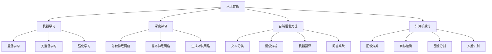

                 

# 人工智能创业：技术栈选择的指南

> 关键词：人工智能, 技术栈, 创业, 机器学习, 深度学习, 自然语言处理, 计算机视觉, 框架选择

> 摘要：本文旨在为人工智能领域的创业者提供一份详尽的技术栈选择指南。我们将从背景介绍、核心概念与联系、核心算法原理、数学模型与公式、项目实战、实际应用场景、工具和资源推荐、未来发展趋势与挑战等多方面进行深入探讨，帮助创业者在众多技术选项中做出明智的选择。

## 1. 背景介绍

随着人工智能技术的迅猛发展，越来越多的创业者看到了其中的巨大潜力。然而，面对众多的技术选项和技术框架，如何选择最适合自己的技术栈成为了创业初期的一大挑战。本文将从技术栈选择的角度出发，为创业者提供一份详尽的指南，帮助他们在众多技术选项中做出明智的选择。

### 1.1 人工智能创业的现状

近年来，人工智能技术在各个领域得到了广泛应用，从自动驾驶到医疗诊断，从智能客服到金融科技，人工智能技术正在改变着我们的生活和工作方式。据相关数据显示，全球人工智能市场规模正在以每年20%以上的速度增长，预计到2025年将达到1600亿美元。这为创业者提供了广阔的市场空间和发展机遇。

### 1.2 技术栈选择的重要性

技术栈选择对于人工智能创业项目来说至关重要。一个合适的技术栈不仅可以提高开发效率，降低开发成本，还能确保项目的稳定性和可扩展性。此外，选择合适的技术栈还可以帮助项目更好地适应市场需求，提高竞争力。因此，创业者在创业初期就需要对技术栈进行深入研究和选择。

## 2. 核心概念与联系

### 2.1 人工智能的核心概念

人工智能（Artificial Intelligence, AI）是指由计算机系统所表现出的智能行为。它包括了机器学习（Machine Learning, ML）、深度学习（Deep Learning, DL）、自然语言处理（Natural Language Processing, NLP）、计算机视觉（Computer Vision, CV）等多个子领域。这些子领域相互关联，共同构成了人工智能技术的基石。

### 2.2 核心概念原理与架构

#### 2.2.1 机器学习

机器学习是一种让计算机通过数据学习规律和模式的技术。它主要分为监督学习（Supervised Learning）、无监督学习（Unsupervised Learning）和强化学习（Reinforcement Learning）三种类型。监督学习通过已知的输入输出数据对模型进行训练；无监督学习则通过未标记的数据发现数据中的结构和模式；强化学习则是通过与环境的交互来学习最优策略。

#### 2.2.2 深度学习

深度学习是机器学习的一个分支，它通过构建多层神经网络来模拟人脑的神经元结构，从而实现对复杂数据的高效处理。深度学习在图像识别、语音识别、自然语言处理等领域取得了显著的成果。常见的深度学习模型包括卷积神经网络（Convolutional Neural Networks, CNN）、循环神经网络（Recurrent Neural Networks, RNN）和生成对抗网络（Generative Adversarial Networks, GAN）等。

#### 2.2.3 自然语言处理

自然语言处理（NLP）是让计算机理解和生成人类语言的技术。它包括文本分类、情感分析、机器翻译、问答系统等多个子领域。NLP技术在智能客服、智能写作、智能推荐等领域有着广泛的应用。

#### 2.2.4 计算机视觉

计算机视觉是让计算机理解和解释图像和视频的技术。它包括图像分类、目标检测、图像分割、人脸识别等多个子领域。计算机视觉技术在自动驾驶、安防监控、医疗影像分析等领域有着重要的应用。

### 2.3 核心概念原理与架构的Mermaid流程图



## 3. 核心算法原理 & 具体操作步骤

### 3.1 机器学习算法原理

#### 3.1.1 监督学习

监督学习的核心是通过已知的输入输出数据对模型进行训练。具体操作步骤如下：

1. **数据预处理**：对原始数据进行清洗、归一化、特征选择等预处理操作。
2. **特征工程**：根据业务需求和数据特点，提取有用的特征。
3. **模型选择**：根据问题类型选择合适的模型，如线性回归、逻辑回归、决策树等。
4. **模型训练**：使用训练数据对模型进行训练。
5. **模型评估**：使用测试数据对模型进行评估，常用的评估指标包括准确率、召回率、F1值等。
6. **模型调优**：根据评估结果调整模型参数，提高模型性能。

#### 3.1.2 无监督学习

无监督学习的核心是通过未标记的数据发现数据中的结构和模式。具体操作步骤如下：

1. **数据预处理**：对原始数据进行清洗、归一化等预处理操作。
2. **特征工程**：根据业务需求和数据特点，提取有用的特征。
3. **模型选择**：根据问题类型选择合适的模型，如聚类、降维等。
4. **模型训练**：使用训练数据对模型进行训练。
5. **模型评估**：根据业务需求对模型进行评估，常用的评估指标包括轮廓系数、Silhouette Score等。
6. **模型调优**：根据评估结果调整模型参数，提高模型性能。

### 3.2 深度学习算法原理

#### 3.2.1 卷积神经网络

卷积神经网络（CNN）是一种专门用于处理图像数据的深度学习模型。其核心原理是通过卷积层、池化层和全连接层来提取图像特征。具体操作步骤如下：

1. **数据预处理**：对原始图像数据进行清洗、归一化等预处理操作。
2. **特征提取**：通过卷积层提取图像特征。
3. **特征压缩**：通过池化层压缩特征图。
4. **特征融合**：通过全连接层将特征图融合成一个向量。
5. **模型训练**：使用训练数据对模型进行训练。
6. **模型评估**：使用测试数据对模型进行评估，常用的评估指标包括准确率、召回率、F1值等。
7. **模型调优**：根据评估结果调整模型参数，提高模型性能。

#### 3.2.2 循环神经网络

循环神经网络（RNN）是一种专门用于处理序列数据的深度学习模型。其核心原理是通过循环层来捕捉序列数据中的时序信息。具体操作步骤如下：

1. **数据预处理**：对原始序列数据进行清洗、归一化等预处理操作。
2. **特征提取**：通过循环层提取序列特征。
3. **特征融合**：通过全连接层将特征图融合成一个向量。
4. **模型训练**：使用训练数据对模型进行训练。
5. **模型评估**：使用测试数据对模型进行评估，常用的评估指标包括准确率、召回率、F1值等。
6. **模型调优**：根据评估结果调整模型参数，提高模型性能。

### 3.3 自然语言处理算法原理

#### 3.3.1 词向量

词向量是将词语转换为数值向量的技术。其核心原理是通过训练模型来学习词语之间的语义关系。具体操作步骤如下：

1. **数据预处理**：对原始文本数据进行清洗、分词等预处理操作。
2. **特征提取**：通过词向量模型（如Word2Vec、GloVe）将词语转换为数值向量。
3. **特征融合**：通过全连接层将特征图融合成一个向量。
4. **模型训练**：使用训练数据对模型进行训练。
5. **模型评估**：使用测试数据对模型进行评估，常用的评估指标包括准确率、召回率、F1值等。
6. **模型调优**：根据评估结果调整模型参数，提高模型性能。

#### 3.3.2 机器翻译

机器翻译是将一种语言的文本翻译成另一种语言的技术。其核心原理是通过训练模型来学习源语言和目标语言之间的映射关系。具体操作步骤如下：

1. **数据预处理**：对原始文本数据进行清洗、分词等预处理操作。
2. **特征提取**：通过编码器-解码器模型（如Seq2Seq）将源语言文本转换为目标语言文本。
3. **特征融合**：通过全连接层将特征图融合成一个向量。
4. **模型训练**：使用训练数据对模型进行训练。
5. **模型评估**：使用测试数据对模型进行评估，常用的评估指标包括BLEU、ROUGE等。
6. **模型调优**：根据评估结果调整模型参数，提高模型性能。

### 3.4 计算机视觉算法原理

#### 3.4.1 图像分类

图像分类是将图像分为多个类别的一种技术。其核心原理是通过训练模型来学习图像特征和类别之间的映射关系。具体操作步骤如下：

1. **数据预处理**：对原始图像数据进行清洗、归一化等预处理操作。
2. **特征提取**：通过卷积层提取图像特征。
3. **特征压缩**：通过池化层压缩特征图。
4. **特征融合**：通过全连接层将特征图融合成一个向量。
5. **模型训练**：使用训练数据对模型进行训练。
6. **模型评估**：使用测试数据对模型进行评估，常用的评估指标包括准确率、召回率、F1值等。
7. **模型调优**：根据评估结果调整模型参数，提高模型性能。

#### 3.4.2 目标检测

目标检测是识别图像中特定目标的技术。其核心原理是通过训练模型来学习图像特征和目标之间的映射关系。具体操作步骤如下：

1. **数据预处理**：对原始图像数据进行清洗、归一化等预处理操作。
2. **特征提取**：通过卷积层提取图像特征。
3. **特征压缩**：通过池化层压缩特征图。
4. **特征融合**：通过全连接层将特征图融合成一个向量。
5. **模型训练**：使用训练数据对模型进行训练。
6. **模型评估**：使用测试数据对模型进行评估，常用的评估指标包括准确率、召回率、F1值等。
7. **模型调优**：根据评估结果调整模型参数，提高模型性能。

## 4. 数学模型和公式 & 详细讲解 & 举例说明

### 4.1 机器学习数学模型

#### 4.1.1 线性回归

线性回归是一种监督学习算法，用于预测连续值。其数学模型如下：

$$
y = \beta_0 + \beta_1 x_1 + \beta_2 x_2 + \cdots + \beta_n x_n + \epsilon
$$

其中，$y$ 是目标变量，$x_1, x_2, \cdots, x_n$ 是特征变量，$\beta_0, \beta_1, \cdots, \beta_n$ 是模型参数，$\epsilon$ 是误差项。

#### 4.1.2 逻辑回归

逻辑回归是一种监督学习算法，用于预测二分类问题。其数学模型如下：

$$
P(y=1|x) = \frac{1}{1 + e^{-(\beta_0 + \beta_1 x_1 + \beta_2 x_2 + \cdots + \beta_n x_n)}}
$$

其中，$P(y=1|x)$ 是给定特征$x$时目标变量$y$为1的概率，$\beta_0, \beta_1, \cdots, \beta_n$ 是模型参数。

### 4.2 深度学习数学模型

#### 4.2.1 卷积神经网络

卷积神经网络（CNN）是一种专门用于处理图像数据的深度学习模型。其数学模型如下：

$$
z^{(l+1)} = \sigma(W^{(l+1)} a^{(l)} + b^{(l+1)})
$$

其中，$z^{(l+1)}$ 是第$l+1$层的激活值，$W^{(l+1)}$ 是第$l+1$层的权重矩阵，$a^{(l)}$ 是第$l$层的激活值，$b^{(l+1)}$ 是第$l+1$层的偏置向量，$\sigma$ 是激活函数。

#### 4.2.2 循环神经网络

循环神经网络（RNN）是一种专门用于处理序列数据的深度学习模型。其数学模型如下：

$$
h_t = \sigma(W_h h_{t-1} + W_x x_t + b_h)
$$

其中，$h_t$ 是第$t$时刻的隐藏状态，$W_h$ 是隐藏层的权重矩阵，$W_x$ 是输入层的权重矩阵，$x_t$ 是第$t$时刻的输入，$b_h$ 是隐藏层的偏置向量，$\sigma$ 是激活函数。

### 4.3 自然语言处理数学模型

#### 4.3.1 词向量

词向量是将词语转换为数值向量的技术。其数学模型如下：

$$
\mathbf{v}_w = \sum_{i=1}^{N} \mathbf{v}_{w_i} \cdot \mathbf{p}_{w_i}
$$

其中，$\mathbf{v}_w$ 是词语$w$的词向量，$\mathbf{v}_{w_i}$ 是词语$w_i$的词向量，$\mathbf{p}_{w_i}$ 是词语$w_i$的权重。

#### 4.3.2 机器翻译

机器翻译是将一种语言的文本翻译成另一种语言的技术。其数学模型如下：

$$
\mathbf{y} = \text{softmax}(W_h \cdot \text{tanh}(W_x \cdot \mathbf{x} + b_x) + b_h)
$$

其中，$\mathbf{y}$ 是目标语言的输出，$W_h$ 是隐藏层的权重矩阵，$W_x$ 是输入层的权重矩阵，$\mathbf{x}$ 是源语言的输入，$b_x$ 是输入层的偏置向量，$b_h$ 是隐藏层的偏置向量，$\text{softmax}$ 是归一化函数，$\text{tanh}$ 是激活函数。

### 4.4 计算机视觉数学模型

#### 4.4.1 图像分类

图像分类是将图像分为多个类别的一种技术。其数学模型如下：

$$
\mathbf{y} = \text{softmax}(W_h \cdot \text{tanh}(W_x \cdot \mathbf{x} + b_x) + b_h)
$$

其中，$\mathbf{y}$ 是图像的类别，$W_h$ 是隐藏层的权重矩阵，$W_x$ 是输入层的权重矩阵，$\mathbf{x}$ 是图像的特征，$b_x$ 是输入层的偏置向量，$b_h$ 是隐藏层的偏置向量，$\text{softmax}$ 是归一化函数，$\text{tanh}$ 是激活函数。

#### 4.4.2 目标检测

目标检测是识别图像中特定目标的技术。其数学模型如下：

$$
\mathbf{y} = \text{softmax}(W_h \cdot \text{tanh}(W_x \cdot \mathbf{x} + b_x) + b_h)
$$

其中，$\mathbf{y}$ 是目标的类别和位置，$W_h$ 是隐藏层的权重矩阵，$W_x$ 是输入层的权重矩阵，$\mathbf{x}$ 是图像的特征，$b_x$ 是输入层的偏置向量，$b_h$ 是隐藏层的偏置向量，$\text{softmax}$ 是归一化函数，$\text{tanh}$ 是激活函数。

## 5. 项目实战：代码实际案例和详细解释说明

### 5.1 开发环境搭建

在进行项目实战之前，首先需要搭建一个合适的开发环境。推荐使用Python作为编程语言，因为它拥有丰富的机器学习和深度学习库。以下是搭建开发环境的具体步骤：

1. **安装Python**：确保安装了最新版本的Python（建议使用Python 3.8及以上版本）。
2. **安装虚拟环境**：使用`virtualenv`或`conda`创建一个虚拟环境，以隔离项目依赖。
3. **安装依赖库**：使用`pip`或`conda`安装所需的机器学习和深度学习库，如`numpy`、`scikit-learn`、`tensorflow`、`pytorch`等。
4. **配置开发环境**：设置开发环境的配置文件，如`requirements.txt`、`setup.py`等。

### 5.2 源代码详细实现和代码解读

以下是一个简单的机器学习项目实战案例，使用Python和`scikit-learn`库实现一个线性回归模型。

#### 5.2.1 数据预处理

```python
import numpy as np
from sklearn.datasets import load_boston
from sklearn.model_selection import train_test_split
from sklearn.preprocessing import StandardScaler

# 加载数据集
boston = load_boston()
X = boston.data
y = boston.target

# 划分训练集和测试集
X_train, X_test, y_train, y_test = train_test_split(X, y, test_size=0.2, random_state=42)

# 数据标准化
scaler = StandardScaler()
X_train = scaler.fit_transform(X_train)
X_test = scaler.transform(X_test)
```

#### 5.2.2 模型训练

```python
from sklearn.linear_model import LinearRegression

# 创建线性回归模型
model = LinearRegression()

# 训练模型
model.fit(X_train, y_train)
```

#### 5.2.3 模型评估

```python
from sklearn.metrics import mean_squared_error, r2_score

# 预测测试集
y_pred = model.predict(X_test)

# 计算评估指标
mse = mean_squared_error(y_test, y_pred)
r2 = r2_score(y_test, y_pred)

print(f"Mean Squared Error: {mse}")
print(f"R2 Score: {r2}")
```

### 5.3 代码解读与分析

上述代码实现了一个简单的线性回归模型。首先，我们加载了波士顿房价数据集，并将其划分为训练集和测试集。然后，我们对数据进行了标准化处理，以确保模型的训练效果。接下来，我们创建了一个线性回归模型，并使用训练集对其进行训练。最后，我们使用测试集对模型进行评估，并计算了均方误差（MSE）和R2分数作为评估指标。

## 6. 实际应用场景

### 6.1 金融风控

金融风控是利用机器学习技术对信贷风险进行评估的一种应用。通过分析客户的信用记录、收入水平、职业稳定性等特征，可以预测客户违约的可能性，从而帮助金融机构做出更明智的信贷决策。

### 6.2 医疗诊断

医疗诊断是利用机器学习技术对疾病进行诊断的一种应用。通过分析患者的症状、体征、检查结果等特征，可以预测患者患病的可能性，从而帮助医生做出更准确的诊断。

### 6.3 智能客服

智能客服是利用自然语言处理技术对客户进行自动回复的一种应用。通过分析客户的咨询内容，可以自动回复客户的问题，从而提高客户满意度和工作效率。

### 6.4 自动驾驶

自动驾驶是利用计算机视觉技术对车辆进行自动控制的一种应用。通过分析车辆周围的环境信息，可以实现车辆的自动行驶，从而提高交通效率和安全性。

## 7. 工具和资源推荐

### 7.1 学习资源推荐

- **书籍**：《机器学习》（周志华著）、《深度学习》（Ian Goodfellow著）、《自然语言处理入门》（李航著）
- **论文**：《Attention Is All You Need》、《Generative Adversarial Networks》
- **博客**：Medium上的AI相关博客、GitHub上的AI项目
- **网站**：Kaggle、Coursera、edX

### 7.2 开发工具框架推荐

- **Python**：作为编程语言，Python拥有丰富的机器学习和深度学习库，如`numpy`、`scikit-learn`、`tensorflow`、`pytorch`等。
- **Jupyter Notebook**：作为开发环境，Jupyter Notebook提供了交互式的开发体验，方便进行代码调试和结果展示。
- **Git**：作为版本控制系统，Git可以帮助开发者管理代码版本，方便进行代码协作和版本回溯。

### 7.3 相关论文著作推荐

- **书籍**：《机器学习》（周志华著）、《深度学习》（Ian Goodfellow著）、《自然语言处理入门》（李航著）
- **论文**：《Attention Is All You Need》、《Generative Adversarial Networks》

## 8. 总结：未来发展趋势与挑战

### 8.1 未来发展趋势

随着人工智能技术的不断发展，未来将出现更多创新的应用场景和技术突破。例如，深度学习技术将进一步提高模型的准确性和泛化能力，自然语言处理技术将进一步提高机器的理解和生成能力，计算机视觉技术将进一步提高图像和视频的处理能力。此外，跨领域的融合也将成为未来的发展趋势，如将机器学习与物联网、区块链等技术相结合，实现更智能的应用。

### 8.2 面临的挑战

尽管人工智能技术取得了显著的进展，但仍面临一些挑战。首先，数据隐私和安全问题是一个重要的挑战，如何保护用户数据的安全性和隐私性是一个亟待解决的问题。其次，模型的可解释性也是一个重要的挑战，如何让模型的决策过程更加透明和可解释是一个亟待解决的问题。最后，模型的泛化能力也是一个重要的挑战，如何让模型在不同场景下都能表现出良好的性能是一个亟待解决的问题。

## 9. 附录：常见问题与解答

### 9.1 问题1：如何选择合适的技术栈？

**解答**：选择合适的技术栈需要考虑多个因素，如项目需求、团队背景、资源限制等。建议根据项目需求选择合适的技术栈，同时考虑团队的技术背景和资源限制，以确保项目的顺利进行。

### 9.2 问题2：如何提高模型的准确性和泛化能力？

**解答**：提高模型的准确性和泛化能力需要从多个方面进行考虑。首先，需要选择合适的模型和算法，根据项目需求选择合适的模型和算法。其次，需要进行充分的数据预处理和特征工程，提高数据的质量和特征的丰富性。最后，需要进行充分的模型调优和验证，通过交叉验证、正则化等方法提高模型的泛化能力。

### 9.3 问题3：如何保护用户数据的安全性和隐私性？

**解答**：保护用户数据的安全性和隐私性需要从多个方面进行考虑。首先，需要选择合适的数据存储和传输方式，确保数据的安全性和完整性。其次，需要进行充分的数据脱敏和加密处理，保护用户数据的隐私性。最后，需要进行充分的数据访问控制和审计，确保数据的使用符合法律法规和道德规范。

## 10. 扩展阅读 & 参考资料

- **书籍**：《机器学习》（周志华著）、《深度学习》（Ian Goodfellow著）、《自然语言处理入门》（李航著）
- **论文**：《Attention Is All You Need》、《Generative Adversarial Networks》
- **网站**：Kaggle、Coursera、edX

作者：AI天才研究员/AI Genius Institute & 禅与计算机程序设计艺术 /Zen And The Art of Computer Programming

