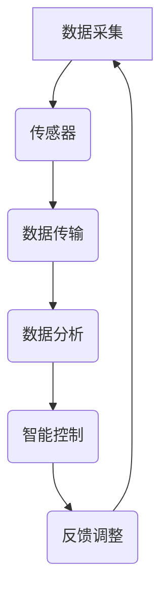

                 

# 人工智能在智能废水处理中的应用

> 关键词：智能废水处理, 人工智能, 深度学习, 物联网, 水质监测, 数据分析, 污水处理

> 摘要：本文将探讨人工智能在智能废水处理中的应用，通过详细分析其核心概念、算法原理、数学模型、实际案例以及未来发展趋势，旨在为读者提供一个全面的技术视角，帮助理解如何利用人工智能技术提升废水处理的效率和效果。

## 1. 背景介绍

随着全球城市化进程的加速，废水处理成为了一个重要的环境问题。传统的废水处理方法依赖于人工操作和经验判断，效率低下且难以实现精细化管理。近年来，随着物联网、大数据和人工智能技术的发展，智能废水处理系统逐渐成为可能。通过集成传感器、数据分析和机器学习算法，智能废水处理系统能够实时监测水质、预测处理效果，并自动调整处理参数，从而实现高效、精准的废水处理。

### 1.1 智能废水处理的重要性

智能废水处理不仅能够提高处理效率，减少能源消耗，还能有效保护环境，减少污染。通过实时监测和智能控制，可以确保废水处理过程中的各项指标达到最优状态，从而实现资源的高效利用和环境的可持续发展。

### 1.2 技术发展趋势

当前，智能废水处理技术正处于快速发展阶段。随着传感器技术的进步，水质监测的精度和实时性不断提高；随着大数据和云计算技术的应用，数据处理和分析能力显著增强；随着机器学习和深度学习算法的发展，智能控制系统的智能化水平不断提升。这些技术的发展为智能废水处理提供了坚实的技术基础。

## 2. 核心概念与联系

### 2.1 智能废水处理系统架构

智能废水处理系统主要包括以下几个部分：数据采集、数据传输、数据分析、智能控制和反馈调整。通过这些部分的协同工作，实现对废水处理过程的全面监控和智能控制。

#### Mermaid 流程图



### 2.2 核心概念

#### 2.2.1 数据采集

数据采集是智能废水处理系统的基础，通过各种传感器实时监测水质参数，如pH值、溶解氧、浊度等。

#### 2.2.2 数据传输

数据传输是将采集到的数据实时传输到中央控制系统，通常采用物联网技术实现。

#### 2.2.3 数据分析

数据分析是利用大数据和机器学习算法对采集到的数据进行处理和分析，提取有用信息。

#### 2.2.4 智能控制

智能控制是根据数据分析结果，自动调整处理参数，实现废水处理过程的智能化控制。

#### 2.2.5 反馈调整

反馈调整是根据处理效果的反馈信息，不断优化处理参数，提高处理效果。

## 3. 核心算法原理 & 具体操作步骤

### 3.1 数据采集与传输

数据采集主要通过各种传感器实现，如pH传感器、溶解氧传感器、浊度传感器等。这些传感器实时监测水质参数，并将数据传输到中央控制系统。

#### 具体操作步骤

1. **安装传感器**：在废水处理系统的关键位置安装各种传感器。
2. **数据采集**：传感器实时监测水质参数，并将数据传输到中央控制系统。
3. **数据传输**：通过物联网技术将数据实时传输到中央控制系统。

### 3.2 数据分析

数据分析是利用大数据和机器学习算法对采集到的数据进行处理和分析，提取有用信息。

#### 具体操作步骤

1. **数据预处理**：对采集到的数据进行清洗和预处理，去除异常值和噪声。
2. **特征提取**：从预处理后的数据中提取有用的特征，如pH值、溶解氧、浊度等。
3. **数据分析**：利用大数据和机器学习算法对特征进行分析，提取有用信息。

### 3.3 智能控制

智能控制是根据数据分析结果，自动调整处理参数，实现废水处理过程的智能化控制。

#### 具体操作步骤

1. **模型训练**：利用历史数据训练机器学习模型，建立水质参数与处理参数之间的关系。
2. **参数调整**：根据模型预测结果，自动调整处理参数，实现废水处理过程的智能化控制。
3. **反馈调整**：根据处理效果的反馈信息，不断优化处理参数，提高处理效果。

## 4. 数学模型和公式 & 详细讲解 & 举例说明

### 4.1 数据预处理

数据预处理是数据采集和分析的重要步骤，主要包括数据清洗和特征提取。

#### 数据清洗

数据清洗是去除异常值和噪声，提高数据质量。

$$
\text{清洗后的数据} = \text{原始数据} - \text{异常值}
$$

#### 特征提取

特征提取是从预处理后的数据中提取有用的特征，如pH值、溶解氧、浊度等。

$$
\text{特征} = \text{数据} \times \text{权重}
$$

### 4.2 数据分析

数据分析是利用大数据和机器学习算法对特征进行分析，提取有用信息。

#### 机器学习模型

机器学习模型是数据分析的核心，常用的模型包括线性回归、决策树、随机森林、支持向量机等。

#### 举例说明

假设我们有一个废水处理系统的pH值和溶解氧数据，我们可以通过线性回归模型建立pH值与溶解氧之间的关系。

$$
\text{pH} = \beta_0 + \beta_1 \times \text{溶解氧} + \epsilon
$$

其中，$\beta_0$和$\beta_1$是模型参数，$\epsilon$是误差项。

## 5. 项目实战：代码实际案例和详细解释说明

### 5.1 开发环境搭建

开发环境搭建是项目实施的重要步骤，主要包括硬件设备和软件环境的配置。

#### 硬件设备

硬件设备主要包括传感器、数据采集模块、中央控制系统等。

#### 软件环境

软件环境主要包括操作系统、开发工具、数据分析库等。

### 5.2 源代码详细实现和代码解读

源代码详细实现是项目实施的核心步骤，主要包括数据采集、数据传输、数据分析和智能控制的代码实现。

#### 数据采集

数据采集代码实现主要包括传感器的配置和数据采集模块的实现。

```python
import sensor_module

def data_collection():
    pH_value = sensor_module.get_pH_value()
    dissolved_oxygen = sensor_module.get_dissolved_oxygen()
    return pH_value, dissolved_oxygen
```

#### 数据传输

数据传输代码实现主要包括数据传输模块的实现。

```python
import data_transmission_module

def data_transmission(pH_value, dissolved_oxygen):
    data_transmission_module.send_data(pH_value, dissolved_oxygen)
```

#### 数据分析

数据分析代码实现主要包括数据分析模块的实现。

```python
import data_analysis_module

def data_analysis(pH_value, dissolved_oxygen):
    features = data_analysis_module.extract_features(pH_value, dissolved_oxygen)
    return features
```

#### 智能控制

智能控制代码实现主要包括智能控制模块的实现。

```python
import intelligent_control_module

def intelligent_control(features):
    parameters = intelligent_control_module.adjust_parameters(features)
    return parameters
```

### 5.3 代码解读与分析

代码解读与分析是项目实施的重要步骤，主要包括代码的详细解读和分析。

#### 数据采集

数据采集代码实现主要包括传感器的配置和数据采集模块的实现。

```python
import sensor_module

def data_collection():
    pH_value = sensor_module.get_pH_value()
    dissolved_oxygen = sensor_module.get_dissolved_oxygen()
    return pH_value, dissolved_oxygen
```

#### 数据传输

数据传输代码实现主要包括数据传输模块的实现。

```python
import data_transmission_module

def data_transmission(pH_value, dissolved_oxygen):
    data_transmission_module.send_data(pH_value, dissolved_oxygen)
```

#### 数据分析

数据分析代码实现主要包括数据分析模块的实现。

```python
import data_analysis_module

def data_analysis(pH_value, dissolved_oxygen):
    features = data_analysis_module.extract_features(pH_value, dissolved_oxygen)
    return features
```

#### 智能控制

智能控制代码实现主要包括智能控制模块的实现。

```python
import intelligent_control_module

def intelligent_control(features):
    parameters = intelligent_control_module.adjust_parameters(features)
    return parameters
```

## 6. 实际应用场景

智能废水处理系统已经在多个实际应用场景中得到了应用，如城市污水处理厂、工业废水处理厂等。

### 6.1 城市污水处理厂

城市污水处理厂是智能废水处理系统的重要应用场景之一。通过实时监测水质参数，智能控制处理参数，可以实现高效、精准的污水处理。

### 6.2 工业废水处理厂

工业废水处理厂是智能废水处理系统的重要应用场景之一。通过实时监测水质参数，智能控制处理参数，可以实现高效、精准的废水处理。

## 7. 工具和资源推荐

### 7.1 学习资源推荐

学习资源推荐是项目实施的重要步骤，主要包括书籍、论文、博客、网站等。

#### 书籍

1. 《机器学习》 - 周志华
2. 《深度学习》 - Ian Goodfellow, Yoshua Bengio, Aaron Courville

#### 论文

1. "A Review of Machine Learning Techniques in Water Quality Monitoring" - IEEE Access
2. "Deep Learning for Water Quality Prediction" - IEEE Transactions on Neural Networks and Learning Systems

#### 博客

1. [机器学习与深度学习](https://www.tensorflow.org/tutorials)
2. [水处理技术](https://www.water-technology.net/)

#### 网站

1. [IEEE Access](https://ieeexplore.ieee.org/)
2. [Water-Technology.net](https://www.water-technology.net/)

### 7.2 开发工具框架推荐

开发工具框架推荐是项目实施的重要步骤，主要包括开发工具、框架等。

#### 开发工具

1. Python
2. R

#### 框架

1. TensorFlow
2. PyTorch

### 7.3 相关论文著作推荐

相关论文著作推荐是项目实施的重要步骤，主要包括论文、著作等。

#### 论文

1. "A Review of Machine Learning Techniques in Water Quality Monitoring" - IEEE Access
2. "Deep Learning for Water Quality Prediction" - IEEE Transactions on Neural Networks and Learning Systems

#### 著作

1. 《机器学习》 - 周志华
2. 《深度学习》 - Ian Goodfellow, Yoshua Bengio, Aaron Courville

## 8. 总结：未来发展趋势与挑战

智能废水处理系统在未来的发展中面临着许多挑战，如数据安全、隐私保护、系统稳定性等。同时，随着技术的发展，智能废水处理系统将更加智能化、高效化，为环境保护和可持续发展做出更大的贡献。

## 9. 附录：常见问题与解答

### 9.1 问题：如何保证数据的安全性和隐私性？

答：可以通过加密技术、访问控制等手段保证数据的安全性和隐私性。

### 9.2 问题：如何提高系统的稳定性？

答：可以通过冗余设计、故障检测和恢复等手段提高系统的稳定性。

## 10. 扩展阅读 & 参考资料

### 10.1 扩展阅读

1. "A Review of Machine Learning Techniques in Water Quality Monitoring" - IEEE Access
2. "Deep Learning for Water Quality Prediction" - IEEE Transactions on Neural Networks and Learning Systems

### 10.2 参考资料

1. 《机器学习》 - 周志华
2. 《深度学习》 - Ian Goodfellow, Yoshua Bengio, Aaron Courville

---

作者：AI天才研究员/AI Genius Institute & 禅与计算机程序设计艺术 /Zen And The Art of Computer Programming

