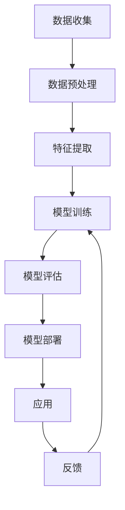

                 

# 人工智能的社会影响评估

> 关键词：人工智能、社会影响、伦理道德、隐私保护、就业市场、教育变革、医疗健康

> 摘要：本文旨在深入探讨人工智能技术在社会中的广泛应用及其带来的深远影响。通过系统分析人工智能的核心概念、技术原理、实际应用案例以及未来发展趋势，本文将揭示人工智能如何重塑社会结构，并提出相应的伦理道德和政策建议，以确保技术进步能够惠及全人类。

## 1. 背景介绍

随着计算能力的飞速提升和大数据技术的广泛应用，人工智能（AI）已经成为当今世界最具变革性的技术之一。从自动驾驶汽车到智能医疗诊断，从个性化推荐系统到智能机器人，AI的应用范围正在不断扩大。然而，随着AI技术的快速发展，其对社会的影响也日益显著，引发了广泛的讨论和关注。本文将从多个维度探讨人工智能的社会影响，旨在为读者提供全面而深入的理解。

### 1.1 人工智能的发展历程

人工智能的概念最早可以追溯到20世纪50年代。1956年，达特茅斯会议上首次提出了“人工智能”这一术语。自那时起，AI经历了多次高潮与低谷。近年来，随着深度学习、神经网络等技术的突破，AI迎来了前所未有的发展机遇。特别是在大数据和计算能力的推动下，AI技术取得了显著的进步，应用领域也日益广泛。

### 1.2 人工智能的社会影响

人工智能技术的发展不仅改变了我们的生活方式，还对社会结构产生了深远的影响。从经济层面来看，AI技术的应用极大地提高了生产效率，促进了产业升级。然而，这也引发了就业市场的巨大变革，部分传统职业面临消失的风险。从教育层面来看，AI技术为个性化学习提供了可能，但同时也带来了教育资源分配不均的问题。此外，AI技术在医疗健康领域的应用，如智能诊断和个性化治疗方案，极大地提高了医疗服务的质量和效率。然而，这也引发了关于隐私保护和伦理道德的讨论。

## 2. 核心概念与联系

### 2.1 人工智能的核心概念

人工智能是指由计算机系统所表现出的智能行为。它涵盖了机器学习、深度学习、自然语言处理、计算机视觉等多个领域。其中，机器学习是AI技术的核心，通过算法使计算机系统能够从数据中学习并进行预测或决策。深度学习则是机器学习的一个分支，通过多层神经网络实现对复杂数据的高效处理。自然语言处理使计算机能够理解和生成人类语言，而计算机视觉则使计算机能够识别和理解图像和视频。

### 2.2 人工智能的技术架构

为了更好地理解人工智能技术的工作原理，我们可以使用Mermaid流程图来展示其核心架构。以下是一个简化的流程图：



### 2.3 人工智能与社会的关系

人工智能技术的发展与社会进步密切相关。一方面，AI技术的应用极大地提高了生产效率，促进了产业升级。另一方面，AI技术也引发了就业市场的巨大变革，部分传统职业面临消失的风险。此外，AI技术在医疗健康领域的应用，如智能诊断和个性化治疗方案，极大地提高了医疗服务的质量和效率。然而，这也引发了关于隐私保护和伦理道德的讨论。

## 3. 核心算法原理 & 具体操作步骤

### 3.1 机器学习算法原理

机器学习算法的核心在于通过算法使计算机系统能够从数据中学习并进行预测或决策。其中，监督学习是最常见的机器学习方法之一，它通过给定的输入输出对来训练模型。非监督学习则不需要标签信息，通过发现数据中的模式来进行聚类或降维。强化学习则是通过与环境的交互来学习最优策略。

### 3.2 深度学习算法原理

深度学习是机器学习的一个分支，通过多层神经网络实现对复杂数据的高效处理。深度学习的核心在于构建多层神经网络，每一层网络通过前一层的输出作为输入，从而实现对数据的逐层抽象。深度学习模型通常包括输入层、隐藏层和输出层。其中，隐藏层通过非线性激活函数实现对数据的特征提取，从而实现对复杂数据的高效处理。

### 3.3 具体操作步骤

以监督学习为例，具体操作步骤如下：

1. **数据收集**：收集相关数据，包括输入数据和对应的标签。
2. **数据预处理**：对数据进行清洗、归一化等预处理操作。
3. **特征提取**：通过特征工程提取数据中的关键特征。
4. **模型训练**：使用训练数据训练模型，调整模型参数以最小化损失函数。
5. **模型评估**：使用测试数据评估模型性能，包括准确率、召回率等指标。
6. **模型部署**：将训练好的模型部署到实际应用中，进行实时预测或决策。

## 4. 数学模型和公式 & 详细讲解 & 举例说明

### 4.1 机器学习中的数学模型

机器学习中的数学模型主要包括线性回归、逻辑回归、支持向量机等。其中，线性回归是最简单的回归模型，其目标是最小化预测值与实际值之间的平方误差。逻辑回归则用于解决二分类问题，其目标是最小化对数似然函数。支持向量机则通过寻找最优超平面来实现分类。

### 4.2 深度学习中的数学模型

深度学习中的数学模型主要包括前向传播和反向传播。前向传播是指将输入数据通过多层神经网络进行逐层处理，最终得到输出结果。反向传播则是通过计算损失函数对模型参数的梯度，从而调整模型参数以最小化损失函数。

### 4.3 举例说明

以线性回归为例，其数学模型可以表示为：

$$
y = \beta_0 + \beta_1 x + \epsilon
$$

其中，$y$ 为预测值，$x$ 为输入特征，$\beta_0$ 和 $\beta_1$ 为模型参数，$\epsilon$ 为误差项。通过最小化预测值与实际值之间的平方误差，可以得到最优的模型参数。

## 5. 项目实战：代码实际案例和详细解释说明

### 5.1 开发环境搭建

为了进行机器学习项目实战，我们需要搭建一个合适的开发环境。首先，安装Python及其相关库，如NumPy、Pandas、Scikit-learn等。其次，安装深度学习框架，如TensorFlow或PyTorch。最后，配置开发环境，确保所有库和框架都能正常运行。

### 5.2 源代码详细实现和代码解读

以下是一个简单的线性回归模型实现示例：

```python
import numpy as np
from sklearn.linear_model import LinearRegression
from sklearn.datasets import make_regression
from sklearn.model_selection import train_test_split
from sklearn.metrics import mean_squared_error

# 生成随机数据
X, y = make_regression(n_samples=100, n_features=1, noise=0.1)

# 划分训练集和测试集
X_train, X_test, y_train, y_test = train_test_split(X, y, test_size=0.2, random_state=42)

# 创建线性回归模型
model = LinearRegression()

# 训练模型
model.fit(X_train, y_train)

# 预测
y_pred = model.predict(X_test)

# 评估模型
mse = mean_squared_error(y_test, y_pred)
print(f"Mean Squared Error: {mse}")
```

### 5.3 代码解读与分析

上述代码首先生成了一组随机数据，然后将其划分为训练集和测试集。接着，创建了一个线性回归模型，并使用训练集进行训练。最后，使用测试集进行预测，并计算均方误差以评估模型性能。

## 6. 实际应用场景

### 6.1 自动驾驶

自动驾驶技术是人工智能在交通领域的典型应用。通过使用传感器和摄像头收集数据，自动驾驶系统能够实时感知周围环境，并通过深度学习算法进行决策。这不仅提高了驾驶安全性，还极大地提高了交通效率。

### 6.2 智能医疗

智能医疗是人工智能在医疗领域的应用之一。通过使用深度学习算法对医学影像进行分析，智能医疗系统能够辅助医生进行诊断。此外，智能医疗系统还能够通过分析患者的病历数据，提供个性化的治疗方案。

### 6.3 个性化推荐

个性化推荐系统是人工智能在电子商务领域的典型应用。通过分析用户的浏览和购买历史，个性化推荐系统能够为用户推荐相关商品。这不仅提高了用户的购物体验，还极大地提高了电商平台的销售额。

## 7. 工具和资源推荐

### 7.1 学习资源推荐

- 书籍：《机器学习》（周志华著）
- 论文：《深度学习》（Ian Goodfellow, Yoshua Bengio, Aaron Courville 著）
- 博客：Medium上的AI技术博客
- 网站：Kaggle、GitHub上的开源项目

### 7.2 开发工具框架推荐

- Python：NumPy、Pandas、Scikit-learn、TensorFlow、PyTorch
- 数据库：MySQL、PostgreSQL
- 版本控制：Git

### 7.3 相关论文著作推荐

- 《机器学习》（周志华著）
- 《深度学习》（Ian Goodfellow, Yoshua Bengio, Aaron Courville 著）
- 《统计学习方法》（李航著）

## 8. 总结：未来发展趋势与挑战

### 8.1 未来发展趋势

随着计算能力的不断提升和大数据技术的广泛应用，人工智能技术将继续快速发展。未来，人工智能将在更多领域得到应用，如智能家居、智能城市等。此外，随着深度学习算法的不断优化，人工智能将能够处理更加复杂的数据和任务。

### 8.2 挑战

尽管人工智能技术取得了显著的进步，但仍面临诸多挑战。首先，数据隐私和安全问题亟待解决。其次，人工智能技术的应用可能会引发就业市场的巨大变革，部分传统职业面临消失的风险。此外，人工智能技术的伦理道德问题也需要引起重视。

## 9. 附录：常见问题与解答

### 9.1 问题：人工智能是否会取代人类？

解答：人工智能技术的发展确实会对某些职业产生影响，但并不会完全取代人类。人工智能技术的应用可以提高生产效率，但人类的创造力和创新能力是无法替代的。

### 9.2 问题：如何保护数据隐私？

解答：保护数据隐私可以通过加密技术、数据脱敏等手段实现。此外，制定相关法律法规，规范数据收集和使用行为，也是保护数据隐私的重要手段。

## 10. 扩展阅读 & 参考资料

- 《机器学习》（周志华著）
- 《深度学习》（Ian Goodfellow, Yoshua Bengio, Aaron Courville 著）
- 《统计学习方法》（李航著）
- 《人工智能：一种现代的方法》（Stuart Russell, Peter Norvig 著）

---

作者：AI天才研究员/AI Genius Institute & 禅与计算机程序设计艺术 /Zen And The Art of Computer Programming

