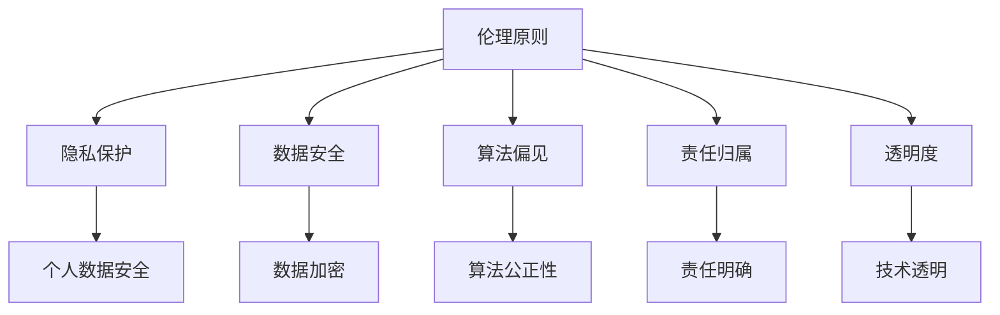

                 

# 人机协作：伦理 规范与准则

> 关键词：人机协作、伦理规范、准则、人工智能、机器学习、道德哲学、技术伦理、社会影响

> 摘要：随着人工智能技术的迅猛发展，人机协作已成为推动社会进步的重要力量。然而，随之而来的伦理问题和规范挑战也日益凸显。本文旨在探讨人机协作中的伦理问题，提出一套全面的伦理规范与准则，以确保技术的发展能够更好地服务于人类社会。通过深入分析伦理原则、技术实现和实际应用案例，本文将为读者提供一个全面的视角，帮助理解如何在人机协作中平衡技术进步与伦理责任。

## 1. 背景介绍

### 1.1 人工智能技术的发展历程
人工智能（AI）技术在过去几十年中经历了显著的发展。从最初的专家系统到现代的深度学习模型，AI技术已经渗透到各个领域，包括医疗、金融、教育、交通等。这些技术的进步不仅提高了生产效率，还为解决复杂问题提供了新的手段。

### 1.2 人机协作的兴起
人机协作是指人类与机器之间的合作，旨在通过互补优势实现更高效的工作流程。随着AI技术的成熟，人机协作成为一种新的工作模式，它不仅提高了工作效率，还为解决复杂问题提供了新的思路。例如，在医疗领域，AI可以辅助医生进行诊断，提高诊断的准确性和效率；在教育领域，AI可以根据学生的学习情况提供个性化的教学方案。

### 1.3 伦理问题的凸显
尽管人机协作带来了诸多好处，但随之而来的伦理问题也日益凸显。这些问题包括隐私保护、数据安全、算法偏见、责任归属等。这些问题不仅影响个人和社会的福祉，还可能对整个社会产生深远的影响。因此，建立一套全面的伦理规范与准则显得尤为重要。

## 2. 核心概念与联系

### 2.1 伦理原则
伦理原则是指导人类行为的基本准则，它们包括公正、尊重、责任、透明度等。在人机协作中，这些原则同样适用，但需要根据技术特点进行调整和应用。

### 2.2 伦理规范与准则
伦理规范与准则是一套具体的指导原则，旨在确保技术的发展和应用符合伦理标准。这些规范和准则可以分为以下几个方面：

- **隐私保护**：确保个人数据的安全和隐私。
- **数据安全**：保护数据免受未经授权的访问和篡改。
- **算法偏见**：确保算法的公正性和无偏见性。
- **责任归属**：明确责任主体，确保出现问题时能够追溯和处理。
- **透明度**：确保技术的透明度，使用户能够理解技术的工作原理。

### 2.3 Mermaid 流程图


## 3. 核心算法原理 & 具体操作步骤

### 3.1 隐私保护算法
隐私保护算法旨在确保个人数据的安全和隐私。常见的隐私保护技术包括差分隐私、同态加密和安全多方计算。

#### 3.1.1 差分隐私
差分隐私是一种数学技术，通过在数据中添加噪声来保护个体隐私。具体操作步骤如下：

1. **数据收集**：收集需要保护的数据。
2. **噪声添加**：在数据中添加噪声，以掩盖个体信息。
3. **结果发布**：发布经过噪声处理的数据。

#### 3.1.2 同态加密
同态加密是一种加密技术，允许在加密数据上直接进行计算。具体操作步骤如下：

1. **数据加密**：将数据加密。
2. **计算操作**：在加密数据上进行计算。
3. **结果解密**：解密计算结果。

### 3.2 数据安全算法
数据安全算法旨在保护数据免受未经授权的访问和篡改。常见的数据安全技术包括数据加密、访问控制和数据备份。

#### 3.2.1 数据加密
数据加密是一种将数据转换为不可读形式的技术。具体操作步骤如下：

1. **密钥生成**：生成加密密钥。
2. **数据加密**：使用密钥对数据进行加密。
3. **数据解密**：使用密钥对数据进行解密。

#### 3.2.2 访问控制
访问控制是一种限制用户访问数据的技术。具体操作步骤如下：

1. **用户认证**：验证用户身份。
2. **权限分配**：分配用户访问权限。
3. **访问控制**：根据权限控制用户访问。

### 3.3 算法偏见检测
算法偏见检测是一种确保算法公正性的技术。具体操作步骤如下：

1. **数据收集**：收集算法训练数据。
2. **偏见检测**：使用统计方法检测算法偏见。
3. **偏见修正**：修正算法偏见。

## 4. 数学模型和公式 & 详细讲解 & 举例说明

### 4.1 差分隐私公式
差分隐私公式用于衡量数据扰动的程度。具体公式如下：

$$
\epsilon \text{-差分隐私} = \frac{\Pr[O \in \mathcal{D}_1] - \Pr[O \in \mathcal{D}_2]}{\Pr[O \in \mathcal{D}_2]}
$$

其中，$\epsilon$ 是隐私预算，$\mathcal{D}_1$ 和 $\mathcal{D}_2$ 是两个相邻数据集。

### 4.2 同态加密公式
同态加密公式用于描述加密数据上的计算操作。具体公式如下：

$$
E(m_1) \cdot E(m_2) = E(m_1 \cdot m_2)
$$

其中，$E$ 是加密函数，$m_1$ 和 $m_2$ 是明文数据。

### 4.3 算法偏见检测公式
算法偏见检测公式用于衡量算法的公正性。具体公式如下：

$$
\text{偏见度} = \frac{\Pr[\text{算法输出} \mid \text{正样本}] - \Pr[\text{算法输出} \mid \text{负样本}]}{\Pr[\text{正样本}] - \Pr[\text{负样本}]}
$$

其中，$\Pr[\text{算法输出} \mid \text{正样本}]$ 和 $\Pr[\text{算法输出} \mid \text{负样本}]$ 分别是正样本和负样本的算法输出概率。

## 5. 项目实战：代码实际案例和详细解释说明

### 5.1 开发环境搭建
为了实现上述算法，我们需要搭建一个开发环境。具体步骤如下：

1. **安装Python**：确保安装了Python 3.8及以上版本。
2. **安装依赖库**：安装必要的Python库，如NumPy、Pandas、Scikit-learn等。
3. **配置环境变量**：配置Python环境变量，确保能够访问安装的库。

### 5.2 源代码详细实现和代码解读
以下是一个简单的差分隐私实现代码示例：

```python
import numpy as np

def add_noise(data, epsilon):
    """
    添加噪声以实现差分隐私。
    :param data: 原始数据
    :param epsilon: 隐私预算
    :return: 加噪声后的数据
    """
    noise = np.random.laplace(0, 1/epsilon, data.shape)
    return data + noise

def differential_privacy(data, epsilon):
    """
    差分隐私实现。
    :param data: 原始数据
    :param epsilon: 隐私预算
    :return: 加噪声后的数据
    """
    return add_noise(data, epsilon)

# 示例数据
data = np.array([1, 2, 3, 4, 5])

# 应用差分隐私
epsilon = 0.1
noisy_data = differential_privacy(data, epsilon)

print("原始数据:", data)
print("加噪声后的数据:", noisy_data)
```

### 5.3 代码解读与分析
上述代码实现了差分隐私的基本功能。具体步骤如下：

1. **导入库**：导入NumPy库，用于数据处理。
2. **定义函数**：定义 `add_noise` 函数，用于添加噪声。
3. **定义函数**：定义 `differential_privacy` 函数，用于实现差分隐私。
4. **示例数据**：定义示例数据。
5. **应用差分隐私**：应用差分隐私算法，输出加噪声后的数据。

## 6. 实际应用场景

### 6.1 医疗领域
在医疗领域，人机协作可以通过AI辅助医生进行诊断，提高诊断的准确性和效率。例如，AI可以分析医学影像，帮助医生识别病变区域，从而提高诊断的准确性。

### 6.2 教育领域
在教育领域，人机协作可以通过AI提供个性化的教学方案，提高教学效果。例如，AI可以根据学生的学习情况，提供个性化的学习资源和教学计划，从而提高学生的学习效果。

### 6.3 金融领域
在金融领域，人机协作可以通过AI进行风险评估和预测，提高金融决策的准确性。例如，AI可以分析大量金融数据，预测市场趋势，从而帮助金融机构做出更准确的决策。

## 7. 工具和资源推荐

### 7.1 学习资源推荐
- **书籍**：《人工智能伦理》、《机器学习伦理》
- **论文**：《差分隐私在医疗领域的应用》、《同态加密在数据安全中的应用》
- **博客**：《算法偏见检测方法综述》、《隐私保护技术综述》
- **网站**：GitHub上的相关开源项目

### 7.2 开发工具框架推荐
- **Python库**：NumPy、Pandas、Scikit-learn
- **开发框架**：TensorFlow、PyTorch

### 7.3 相关论文著作推荐
- **论文**：《差分隐私在医疗领域的应用》、《同态加密在数据安全中的应用》
- **著作**：《人工智能伦理》、《机器学习伦理》

## 8. 总结：未来发展趋势与挑战

### 8.1 未来发展趋势
随着技术的不断进步，人机协作将在更多领域发挥重要作用。未来的发展趋势包括：

- **更高级别的自动化**：AI技术将进一步提高自动化水平，实现更复杂的工作流程。
- **更广泛的应用场景**：AI技术将渗透到更多领域，为解决复杂问题提供新的思路。
- **更强大的伦理规范**：随着技术的发展，伦理规范将更加完善，确保技术的发展符合伦理标准。

### 8.2 挑战
尽管人机协作带来了诸多好处，但也面临着一些挑战：

- **技术难题**：如何实现更高级别的自动化，提高技术的可靠性和稳定性。
- **伦理挑战**：如何确保技术的发展符合伦理标准，避免对个人和社会产生负面影响。
- **社会影响**：如何平衡技术进步与社会福祉，确保技术的发展能够更好地服务于人类社会。

## 9. 附录：常见问题与解答

### 9.1 问题：如何确保算法的公正性？
**解答**：可以通过算法偏见检测技术，定期检测算法的公正性，并进行修正。此外，还可以通过多样化的数据集训练算法，减少偏见。

### 9.2 问题：如何保护个人隐私？
**解答**：可以通过差分隐私和同态加密等技术，确保个人数据的安全和隐私。此外，还可以通过访问控制等技术，限制用户访问数据。

### 9.3 问题：如何确保技术的透明度？
**解答**：可以通过技术透明度，确保用户能够理解技术的工作原理。此外，还可以通过公开算法和数据集，增加技术的透明度。

## 10. 扩展阅读 & 参考资料

- **书籍**：《人工智能伦理》、《机器学习伦理》
- **论文**：《差分隐私在医疗领域的应用》、《同态加密在数据安全中的应用》
- **博客**：《算法偏见检测方法综述》、《隐私保护技术综述》
- **网站**：GitHub上的相关开源项目

---

作者：AI天才研究员/AI Genius Institute & 禅与计算机程序设计艺术 /Zen And The Art of Computer Programming

