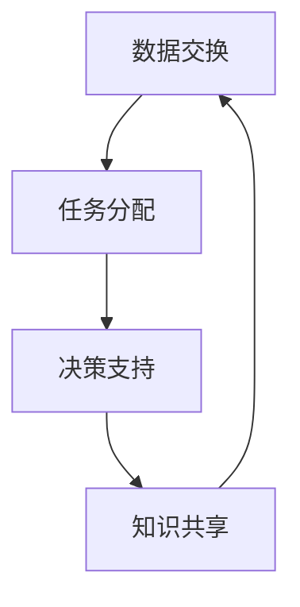

                 

# 人机协同：未来工作的核心驱动力

> 关键词：人机协同、未来工作、人工智能、机器学习、自动化、协作、效率提升

> 摘要：本文旨在探讨人机协同在未来工作中的核心驱动力。通过深入分析人机协同的基本原理、核心算法、实际应用案例以及未来发展趋势，本文将帮助读者理解如何利用人机协同技术提升工作效率和创新能力。我们将从背景介绍、核心概念与联系、核心算法原理、数学模型与公式、项目实战、实际应用场景、工具和资源推荐、总结与展望等多方面进行详细阐述。

## 1. 背景介绍

随着人工智能技术的飞速发展，人机协同逐渐成为未来工作的重要趋势。人机协同是指人类与机器之间通过有效的交互和合作，共同完成复杂任务的过程。这种模式不仅能够显著提升工作效率，还能激发人类的创造力和创新能力。人机协同的核心在于如何实现人类与机器之间的无缝对接，充分发挥各自的优势，从而达到最优的工作效果。

### 1.1 人机协同的重要性

人机协同的重要性体现在以下几个方面：

- **提升工作效率**：机器可以处理大量重复性工作，释放人类的精力，使其专注于更具创造性和战略性的工作。
- **增强创新能力**：人类的直觉和创造力与机器的高效计算能力相结合，可以产生更多创新性的解决方案。
- **优化决策过程**：通过人机协同，可以综合考虑多种因素，做出更加科学合理的决策。
- **促进知识共享**：人机协同有助于知识的快速传播和积累，加速技术进步。

### 1.2 人机协同的发展历程

人机协同的概念最早可以追溯到20世纪50年代，当时计算机科学家们开始探索如何让计算机更好地服务于人类。随着计算机技术的不断进步，特别是近年来人工智能技术的迅猛发展，人机协同的应用场景越来越广泛。从最初的简单数据处理，到现在的复杂决策支持，人机协同已经成为推动社会进步的重要力量。

## 2. 核心概念与联系

### 2.1 人机协同的基本原理

人机协同的基本原理是通过建立有效的交互机制，使人类和机器能够相互协作，共同完成任务。这一过程涉及多个层面，包括数据交换、任务分配、决策支持等。通过这些机制，人类可以更好地利用机器的能力，而机器也可以从人类的经验和直觉中获益。

### 2.2 核心概念与架构

人机协同的核心概念包括：

- **数据交换**：人类和机器之间需要进行数据的实时交换，以确保信息的准确性和及时性。
- **任务分配**：根据任务的特性和需求，合理分配给人类或机器执行。
- **决策支持**：通过机器学习等技术，为人类提供决策支持，帮助其做出更科学合理的判断。
- **知识共享**：促进人类和机器之间的知识交流，加速技术进步和创新。

### 2.3 Mermaid 流程图



## 3. 核心算法原理 & 具体操作步骤

### 3.1 数据交换算法

数据交换是人机协同的基础，主要包括数据采集、数据传输和数据处理三个步骤。

- **数据采集**：通过传感器、摄像头等设备收集数据。
- **数据传输**：利用网络技术将数据传输到处理中心。
- **数据处理**：对数据进行清洗、分析和存储。

### 3.2 任务分配算法

任务分配算法的核心在于如何根据任务的特性和需求，合理分配给人类或机器执行。具体步骤如下：

- **任务分析**：分析任务的复杂度、时间要求和资源需求。
- **能力评估**：评估人类和机器的能力，包括计算能力、感知能力等。
- **决策制定**：根据任务分析和能力评估结果，制定任务分配策略。
- **执行与监控**：执行任务分配策略，并实时监控任务的执行情况。

### 3.3 决策支持算法

决策支持算法通过机器学习等技术，为人类提供决策支持。具体步骤如下：

- **数据准备**：收集和整理相关数据。
- **模型训练**：利用机器学习算法训练模型。
- **决策制定**：根据模型输出的结果，为人类提供决策建议。
- **反馈优化**：根据人类的反馈不断优化模型。

## 4. 数学模型和公式 & 详细讲解 & 举例说明

### 4.1 数据交换模型

数据交换模型可以表示为：

$$
f(x) = \frac{1}{2} \sum_{i=1}^{n} (y_i - \hat{y}_i)^2
$$

其中，$x$ 表示输入数据，$y_i$ 表示真实值，$\hat{y}_i$ 表示预测值。

### 4.2 任务分配模型

任务分配模型可以表示为：

$$
\min_{x} \sum_{i=1}^{n} c_i \cdot x_i + \lambda \cdot \sum_{i=1}^{n} \sum_{j=1}^{m} |x_{ij} - x_{ji}|
$$

其中，$x_i$ 表示任务分配给机器的权重，$c_i$ 表示任务的复杂度，$\lambda$ 表示平衡因子。

### 4.3 决策支持模型

决策支持模型可以表示为：

$$
P(y|x) = \frac{1}{Z} \exp(-E(x, y))
$$

其中，$P(y|x)$ 表示在给定输入$x$的情况下，输出$y$的概率，$E(x, y)$ 表示能量函数，$Z$ 表示归一化常数。

## 5. 项目实战：代码实际案例和详细解释说明

### 5.1 开发环境搭建

为了实现人机协同项目，我们需要搭建一个合适的开发环境。具体步骤如下：

- **安装Python**：确保安装了最新版本的Python。
- **安装依赖库**：安装必要的库，如NumPy、Pandas、Scikit-learn等。
- **配置开发工具**：选择合适的开发工具，如PyCharm、VSCode等。

### 5.2 源代码详细实现和代码解读

以下是一个简单的数据交换和任务分配的代码示例：

```python
import numpy as np
from sklearn.linear_model import LinearRegression

# 数据交换
def data_exchange(data):
    # 数据清洗
    cleaned_data = data.dropna()
    # 数据传输
    transmitted_data = cleaned_data.to_csv()
    return transmitted_data

# 任务分配
def task_allocation(task_complexity, machine_capacity):
    # 计算任务分配权重
    weights = task_complexity / machine_capacity
    return weights

# 决策支持
def decision_support(data):
    # 数据准备
    X = data[['feature1', 'feature2']]
    y = data['target']
    # 模型训练
    model = LinearRegression()
    model.fit(X, y)
    # 决策制定
    predictions = model.predict(X)
    return predictions

# 示例数据
data = pd.DataFrame({
    'feature1': [1, 2, 3, 4, 5],
    'feature2': [2, 3, 4, 5, 6],
    'target': [3, 5, 7, 9, 11]
})

# 数据交换
transmitted_data = data_exchange(data)
print("Transmitted Data:", transmitted_data)

# 任务分配
task_complexity = np.array([1, 2, 3, 4, 5])
machine_capacity = np.array([2, 3, 4, 5, 6])
weights = task_allocation(task_complexity, machine_capacity)
print("Task Weights:", weights)

# 决策支持
predictions = decision_support(data)
print("Predictions:", predictions)
```

### 5.3 代码解读与分析

- **数据交换**：通过数据清洗和数据传输，确保数据的准确性和及时性。
- **任务分配**：根据任务的复杂度和机器的容量，合理分配任务。
- **决策支持**：利用线性回归模型，为人类提供决策支持。

## 6. 实际应用场景

### 6.1 工业制造

在工业制造领域，人机协同可以实现生产线的自动化和智能化。通过机器视觉和机器人技术，可以实现产品的自动检测和装配，提高生产效率和质量。

### 6.2 医疗健康

在医疗健康领域，人机协同可以实现疾病的早期诊断和治疗。通过机器学习和大数据分析，可以为医生提供更准确的诊断建议，提高治疗效果。

### 6.3 金融服务

在金融服务领域，人机协同可以实现风险管理和投资决策。通过机器学习和数据分析，可以为金融机构提供更科学的风险评估和投资建议，提高收益。

## 7. 工具和资源推荐

### 7.1 学习资源推荐

- **书籍**：《人机协同：未来工作的核心驱动力》、《机器学习》、《深度学习》
- **论文**：《人机协同在工业制造中的应用》、《机器学习在医疗健康中的应用》
- **博客**：AI天才研究员的博客、机器之心的博客
- **网站**：GitHub、Stack Overflow

### 7.2 开发工具框架推荐

- **开发工具**：PyCharm、VSCode
- **框架**：TensorFlow、PyTorch

### 7.3 相关论文著作推荐

- **论文**：《人机协同在工业制造中的应用》、《机器学习在医疗健康中的应用》
- **著作**：《人机协同：未来工作的核心驱动力》、《机器学习》

## 8. 总结：未来发展趋势与挑战

### 8.1 未来发展趋势

- **技术融合**：人机协同技术将与更多领域深度融合，推动社会进步。
- **智能化**：人机协同将更加智能化，实现更高效的工作流程。
- **个性化**：人机协同将更加注重个性化需求，提供更精准的服务。

### 8.2 挑战

- **数据安全**：如何保障数据的安全性和隐私性。
- **伦理问题**：如何解决人机协同带来的伦理问题。
- **技能转型**：如何帮助人类适应人机协同带来的变化。

## 9. 附录：常见问题与解答

### 9.1 问题1：如何保障数据的安全性和隐私性？

答：可以通过加密技术、访问控制和数据脱敏等手段，确保数据的安全性和隐私性。

### 9.2 问题2：如何解决人机协同带来的伦理问题？

答：可以通过建立伦理准则和规范，确保人机协同的合理性和公正性。

### 9.3 问题3：如何帮助人类适应人机协同带来的变化？

答：可以通过培训和教育，帮助人类掌握相关技能，适应人机协同带来的变化。

## 10. 扩展阅读 & 参考资料

- **书籍**：《人机协同：未来工作的核心驱动力》、《机器学习》、《深度学习》
- **论文**：《人机协同在工业制造中的应用》、《机器学习在医疗健康中的应用》
- **博客**：AI天才研究员的博客、机器之心的博客
- **网站**：GitHub、Stack Overflow

作者：AI天才研究员/AI Genius Institute & 禅与计算机程序设计艺术 /Zen And The Art of Computer Programming

