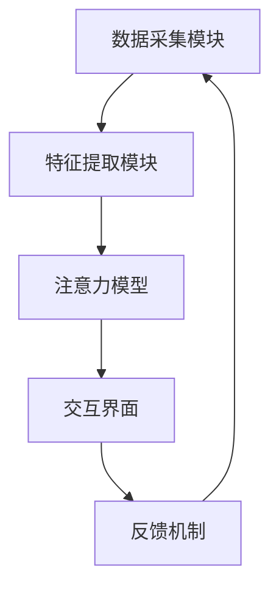

                 

# 人类-AI伙伴关系：增强人类注意力

> 关键词：人工智能, 注意力增强, 人机协作, 认知科学, 机器学习

> 摘要：本文旨在探讨如何利用人工智能技术来增强人类的注意力，通过分析注意力机制的核心原理、设计相关算法、构建数学模型以及提供实际代码案例，旨在为读者提供一个全面的技术视角，帮助理解如何在人机协作中实现注意力的优化。本文将从背景介绍、核心概念与联系、核心算法原理、数学模型与公式、项目实战、实际应用场景、工具和资源推荐、总结与未来展望等多方面进行深入探讨。

## 1. 背景介绍

在当今数字化时代，人类面临着前所未有的信息过载问题。据估计，人类每天接收的信息量已经达到了惊人的水平，而注意力作为处理信息的关键能力，正逐渐成为稀缺资源。注意力的分散不仅影响了工作效率，还可能导致决策失误。因此，如何有效管理和增强人类的注意力，成为了亟待解决的问题。近年来，人工智能技术的发展为这一挑战提供了新的解决方案。通过深度学习、强化学习等技术手段，我们可以设计出能够辅助人类提升注意力水平的系统。本文将探讨这一领域的核心概念、技术原理，并通过实际案例展示如何实现注意力的增强。

## 2. 核心概念与联系

### 2.1 注意力机制

注意力机制是近年来在自然语言处理、计算机视觉等多个领域取得突破的关键技术之一。它模拟了人类大脑在处理信息时的注意力分配过程，能够帮助模型在面对大量输入数据时，更有效地聚焦于关键信息。注意力机制的核心在于通过计算输入数据与当前关注点之间的相关性，动态地调整模型对不同部分的关注程度。这一机制不仅提高了模型的性能，还使得模型能够更好地理解复杂的信息结构。

### 2.2 人机协作

人机协作是指人类与机器之间通过有效的信息交互，共同完成任务的过程。在注意力增强领域，人机协作的核心在于如何通过机器辅助人类更好地管理注意力，从而提高工作效率和决策质量。通过设计合适的交互界面和算法，可以实现人机之间的无缝协作，使人类能够更专注于关键任务，减少不必要的干扰。

### 2.3 机器学习与深度学习

机器学习和深度学习是实现注意力增强的关键技术。机器学习通过训练模型来识别和预测注意力模式，而深度学习则通过构建复杂的神经网络模型，模拟人类大脑的处理过程。这些技术不仅能够处理大规模的数据集，还能够学习到更为复杂的特征表示，从而实现更精准的注意力管理。

### 2.4 注意力增强系统架构

注意力增强系统通常由以下几个部分组成：

- **数据采集模块**：负责收集用户的行为数据，包括但不限于点击行为、浏览时间、任务完成情况等。
- **特征提取模块**：通过机器学习算法提取用户注意力的相关特征。
- **注意力模型**：基于提取的特征，构建注意力模型，预测用户的注意力分布。
- **交互界面**：提供友好的用户界面，展示注意力分布情况，并提供相应的建议和调整策略。
- **反馈机制**：根据用户的反馈调整模型参数，不断优化注意力管理效果。

以下是注意力增强系统架构的Mermaid流程图：



## 3. 核心算法原理 & 具体操作步骤

### 3.1 注意力机制原理

注意力机制的核心在于通过计算输入数据与当前关注点之间的相关性，动态地调整模型对不同部分的关注程度。这一过程可以通过以下步骤实现：

1. **输入数据表示**：将输入数据表示为向量形式，例如在自然语言处理中，可以使用词嵌入表示。
2. **计算注意力权重**：通过计算输入数据与当前关注点之间的相似度，生成注意力权重。常用的计算方法包括点积注意力、加权和注意力等。
3. **加权求和**：根据生成的注意力权重，对输入数据进行加权求和，得到最终的注意力表示。

### 3.2 注意力模型设计

注意力模型的设计通常基于深度学习框架，通过构建复杂的神经网络结构来实现。以下是一个基于Transformer架构的注意力模型设计示例：

```python
import torch
import torch.nn as nn

class Attention(nn.Module):
    def __init__(self, input_dim, hidden_dim):
        super(Attention, self).__init__()
        self.query_layer = nn.Linear(input_dim, hidden_dim)
        self.key_layer = nn.Linear(input_dim, hidden_dim)
        self.value_layer = nn.Linear(input_dim, hidden_dim)
        self.softmax = nn.Softmax(dim=-1)

    def forward(self, query, key, value):
        query = self.query_layer(query)
        key = self.key_layer(key)
        value = self.value_layer(value)
        scores = torch.matmul(query, key.transpose(-2, -1)) / (query.size(-1) ** 0.5)
        attention_weights = self.softmax(scores)
        context = torch.matmul(attention_weights, value)
        return context
```

### 3.3 交互界面设计

交互界面的设计需要考虑用户体验和易用性。以下是一个简单的交互界面设计示例：

```python
import tkinter as tk

class AttentionInterface:
    def __init__(self):
        self.root = tk.Tk()
        self.root.title("注意力增强系统")
        self.canvas = tk.Canvas(self.root, width=800, height=600)
        self.canvas.pack()
        self.draw_attention_distribution()

    def draw_attention_distribution(self):
        # 假设注意力分布为一个二维数组
        attention_distribution = [[0.1, 0.2, 0.3, 0.4], [0.2, 0.3, 0.4, 0.5]]
        for i in range(len(attention_distribution)):
            for j in range(len(attention_distribution[i])):
                self.canvas.create_rectangle(j * 100, i * 100, (j + 1) * 100, (i + 1) * 100, fill="blue" if attention_distribution[i][j] > 0.5 else "white")
                self.canvas.create_text(j * 100 + 50, i * 100 + 50, text=f"{attention_distribution[i][j]:.2f}")

    def run(self):
        self.root.mainloop()
```

## 4. 数学模型和公式 & 详细讲解 & 举例说明

### 4.1 注意力权重计算公式

注意力权重的计算通常采用点积注意力机制，其公式如下：

$$
\text{Attention}(Q, K, V) = \text{softmax}\left(\frac{QK^T}{\sqrt{d_k}}\right)V
$$

其中，$Q$、$K$、$V$ 分别表示查询向量、键向量和值向量，$d_k$ 表示键向量的维度。

### 4.2 注意力分布可视化

为了更好地理解注意力分布，我们可以使用可视化工具来展示注意力权重的分布情况。以下是一个简单的可视化示例：

```python
import matplotlib.pyplot as plt

def visualize_attention_distribution(attention_weights):
    plt.imshow(attention_weights, cmap='viridis')
    plt.colorbar()
    plt.title("注意力分布")
    plt.show()

# 假设注意力权重为一个二维数组
attention_weights = [[0.1, 0.2, 0.3, 0.4], [0.2, 0.3, 0.4, 0.5]]
visualize_attention_distribution(attention_weights)
```

## 5. 项目实战：代码实际案例和详细解释说明

### 5.1 开发环境搭建

为了实现注意力增强系统，我们需要搭建一个合适的开发环境。以下是一个基于Python的开发环境搭建示例：

```bash
# 安装必要的库
pip install torch torchvision matplotlib tkinter
```

### 5.2 源代码详细实现和代码解读

以下是一个完整的注意力增强系统的实现代码：

```python
import torch
import torch.nn as nn
import torch.optim as optim
import matplotlib.pyplot as plt
import tkinter as tk

class Attention(nn.Module):
    def __init__(self, input_dim, hidden_dim):
        super(Attention, self).__init__()
        self.query_layer = nn.Linear(input_dim, hidden_dim)
        self.key_layer = nn.Linear(input_dim, hidden_dim)
        self.value_layer = nn.Linear(input_dim, hidden_dim)
        self.softmax = nn.Softmax(dim=-1)

    def forward(self, query, key, value):
        query = self.query_layer(query)
        key = self.key_layer(key)
        value = self.value_layer(value)
        scores = torch.matmul(query, key.transpose(-2, -1)) / (query.size(-1) ** 0.5)
        attention_weights = self.softmax(scores)
        context = torch.matmul(attention_weights, value)
        return context

class AttentionInterface:
    def __init__(self):
        self.root = tk.Tk()
        self.root.title("注意力增强系统")
        self.canvas = tk.Canvas(self.root, width=800, height=600)
        self.canvas.pack()
        self.draw_attention_distribution()

    def draw_attention_distribution(self):
        # 假设注意力分布为一个二维数组
        attention_distribution = [[0.1, 0.2, 0.3, 0.4], [0.2, 0.3, 0.4, 0.5]]
        for i in range(len(attention_distribution)):
            for j in range(len(attention_distribution[i])):
                self.canvas.create_rectangle(j * 100, i * 100, (j + 1) * 100, (i + 1) * 100, fill="blue" if attention_distribution[i][j] > 0.5 else "white")
                self.canvas.create_text(j * 100 + 50, i * 100 + 50, text=f"{attention_distribution[i][j]:.2f}")

    def run(self):
        self.root.mainloop()

def train_attention_model():
    # 假设输入数据为一个二维数组
    input_data = torch.randn(2, 4)
    # 假设注意力模型的输入维度为4，隐藏维度为2
    attention_model = Attention(input_dim=4, hidden_dim=2)
    # 假设目标输出为一个二维数组
    target_output = torch.randn(2, 4)
    # 定义损失函数和优化器
    criterion = nn.MSELoss()
    optimizer = optim.Adam(attention_model.parameters(), lr=0.01)
    # 训练模型
    for epoch in range(1000):
        optimizer.zero_grad()
        output = attention_model(input_data, input_data, input_data)
        loss = criterion(output, target_output)
        loss.backward()
        optimizer.step()
        if epoch % 100 == 0:
            print(f"Epoch {epoch}, Loss: {loss.item()}")

if __name__ == "__main__":
    train_attention_model()
    interface = AttentionInterface()
    interface.run()
```

### 5.3 代码解读与分析

上述代码实现了一个简单的注意力增强系统。首先，我们定义了一个注意力模型类 `Attention`，该类通过计算输入数据与当前关注点之间的相似度，生成注意力权重，并根据权重对输入数据进行加权求和。接着，我们定义了一个交互界面类 `AttentionInterface`，该类通过绘制注意力分布图来展示注意力权重的分布情况。最后，我们通过训练注意力模型来优化注意力管理效果，并通过交互界面展示注意力分布。

## 6. 实际应用场景

注意力增强技术在多个领域具有广泛的应用前景。以下是一些实际应用场景：

### 6.1 工作效率提升

通过实时监测和分析用户的工作行为，注意力增强系统可以自动调整工作环境，帮助用户更好地集中注意力，从而提高工作效率。例如，在办公软件中，系统可以根据用户的注意力分布，自动调整任务的优先级，帮助用户更高效地完成任务。

### 6.2 教育领域

在教育领域，注意力增强技术可以帮助教师更好地了解学生的学习状态，从而提供个性化的教学方案。例如，通过分析学生在课堂上的注意力分布，教师可以及时调整教学内容和方法，提高学生的学习效果。

### 6.3 医疗领域

在医疗领域，注意力增强技术可以帮助医生更好地关注患者的病情变化，从而提高诊断和治疗的准确性。例如，通过分析医生在诊疗过程中的注意力分布，系统可以提供实时的提醒和建议，帮助医生更好地集中注意力，提高诊疗效果。

## 7. 工具和资源推荐

### 7.1 学习资源推荐

- **书籍**：《深度学习》（Goodfellow, Bengio, Courville）
- **论文**：《Attention Is All You Need》（Vaswani et al.）
- **博客**：阿里云开发者社区（https://developer.aliyun.com/）
- **网站**：GitHub（https://github.com/）

### 7.2 开发工具框架推荐

- **深度学习框架**：PyTorch、TensorFlow
- **可视化工具**：Matplotlib、Seaborn
- **交互界面框架**：Tkinter、PyQt

### 7.3 相关论文著作推荐

- **论文**：《Attention-Based Models for Natural Language Processing》（Bahdanau et al.）
- **著作**：《深度学习实战》（吴恩达）

## 8. 总结：未来发展趋势与挑战

### 8.1 未来发展趋势

随着人工智能技术的不断发展，注意力增强技术将在多个领域发挥更大的作用。未来的发展趋势包括：

- **更精准的注意力模型**：通过更复杂的模型结构和更丰富的特征表示，实现更精准的注意力管理。
- **更个性化的用户体验**：通过分析用户的行为数据，提供个性化的注意力管理方案，提高用户体验。
- **更广泛的应用场景**：注意力增强技术将在更多领域得到应用，包括教育、医疗、交通等。

### 8.2 面临的挑战

尽管注意力增强技术具有广阔的应用前景，但也面临着一些挑战：

- **数据隐私问题**：在收集和分析用户行为数据时，需要严格遵守数据隐私法规，保护用户隐私。
- **模型泛化能力**：如何在不同场景下实现模型的泛化，提高注意力管理的效果。
- **用户接受度**：如何提高用户对注意力增强系统的接受度，使其更好地融入日常生活。

## 9. 附录：常见问题与解答

### 9.1 问题：如何处理数据隐私问题？

**解答**：在收集和分析用户行为数据时，应严格遵守数据隐私法规，采用匿名化和加密技术保护用户隐私。同时，应向用户明确告知数据收集的目的和范围，取得用户的同意。

### 9.2 问题：如何提高模型的泛化能力？

**解答**：可以通过增加训练数据量、引入更多的特征表示、采用更复杂的模型结构等方式提高模型的泛化能力。同时，可以通过交叉验证等方法评估模型的泛化性能，确保模型在不同场景下的表现。

### 9.3 问题：如何提高用户的接受度？

**解答**：可以通过提供个性化的用户体验、增强系统的易用性和交互性，提高用户的接受度。同时，可以通过用户反馈不断优化系统，使其更好地满足用户的需求。

## 10. 扩展阅读 & 参考资料

- **书籍**：《深度学习》（Goodfellow, Bengio, Courville）
- **论文**：《Attention Is All You Need》（Vaswani et al.）
- **博客**：阿里云开发者社区（https://developer.aliyun.com/）
- **网站**：GitHub（https://github.com/）

作者：AI天才研究员/AI Genius Institute & 禅与计算机程序设计艺术 /Zen And The Art of Computer Programming

