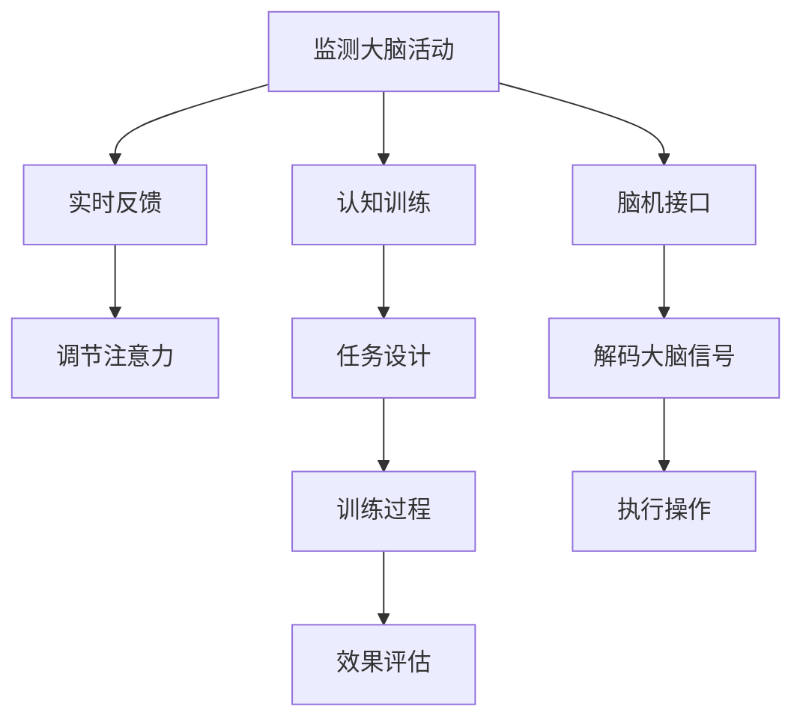

                 

# 人类注意力增强：提升专注力和注意力在商业中的未来展望

> 关键词：注意力增强、专注力提升、商业应用、神经科学、人工智能、机器学习、脑机接口、认知心理学

> 摘要：本文旨在探讨如何通过技术手段提升人类的专注力和注意力，特别是在商业领域中的应用。我们将从神经科学、人工智能和机器学习的角度出发，分析注意力增强的原理和方法，并通过实际案例展示如何在商业环境中应用这些技术。此外，本文还将展望未来的发展趋势和面临的挑战。

## 1. 背景介绍

在当今高度信息化的社会中，人们面临着前所未有的信息过载问题。如何在海量信息中保持专注，成为了一个亟待解决的问题。特别是在商业领域，高效的注意力管理对于提高工作效率、创新能力和决策质量至关重要。因此，提升人类的专注力和注意力，不仅是一个重要的科学问题，也是一个具有广泛应用前景的商业课题。

### 1.1 信息过载与注意力管理

随着互联网和移动设备的普及，人们每天接触到的信息量呈指数级增长。根据Statista的数据，2020年全球互联网用户数量已超过45亿，预计到2025年将达到55亿。这种信息爆炸导致了注意力分散的问题，人们在面对大量信息时难以集中精力，从而影响了工作效率和生活质量。

### 1.2 商业领域的挑战

在商业领域，注意力管理对于企业竞争力有着重要影响。例如，销售人员需要在短时间内吸引客户的注意力，以促成销售；产品经理需要在众多功能中选择最符合市场需求的特性；管理者需要在复杂多变的环境中做出快速而准确的决策。因此，如何提升员工的专注力和注意力，成为了许多企业关注的焦点。

## 2. 核心概念与联系

### 2.1 注意力的概念

注意力是指个体在特定时间内对某一对象或任务的集中程度。它是一种有限资源，需要通过认知控制来调节。注意力可以分为几种类型，包括：

- **选择性注意力**：个体在众多刺激中选择关注某一个或几个刺激。
- **持续性注意力**：个体在长时间内保持对某一任务的关注。
- **分配性注意力**：个体同时处理多个任务的能力。

### 2.2 注意力增强的原理

注意力增强是指通过技术手段提高个体的注意力水平。这可以通过多种方式实现，包括：

- **神经反馈**：通过监测大脑活动并提供实时反馈，帮助个体调整注意力状态。
- **认知训练**：通过特定的训练任务提高个体的注意力能力。
- **脑机接口**：通过直接与大脑交互来增强注意力。

### 2.3 核心概念原理与架构

#### 2.3.1 神经反馈原理

神经反馈是一种通过监测大脑活动并提供实时反馈来调节注意力的技术。其基本原理如下：

1. **监测大脑活动**：使用EEG（脑电图）或fMRI（功能性磁共振成像）等技术监测大脑活动。
2. **实时反馈**：将监测到的大脑活动数据转化为可视化或听觉反馈，帮助个体调整注意力状态。
3. **调节注意力**：通过反复练习，个体可以学会在特定任务中保持注意力集中。

#### 2.3.2 认知训练原理

认知训练是一种通过特定任务来提高个体注意力能力的技术。其基本原理如下：

1. **任务设计**：设计一系列需要高度集中注意力的任务，如记忆游戏、注意力控制任务等。
2. **训练过程**：个体通过反复练习这些任务来提高注意力水平。
3. **效果评估**：通过测试来评估训练效果，如注意力持续时间、错误率等。

#### 2.3.3 脑机接口原理

脑机接口是一种直接与大脑交互的技术，通过监测大脑活动并执行相应操作。其基本原理如下：

1. **监测大脑活动**：使用EEG或fMRI等技术监测大脑活动。
2. **解码大脑信号**：通过算法将大脑活动转化为可执行的操作指令。
3. **执行操作**：将解码后的指令转化为实际操作，如控制计算机鼠标或执行特定任务。

### 2.4 Mermaid 流程图



## 3. 核心算法原理 & 具体操作步骤

### 3.1 神经反馈算法

神经反馈算法的基本步骤如下：

1. **数据采集**：使用EEG或fMRI等技术采集大脑活动数据。
2. **数据预处理**：对采集到的数据进行滤波、去噪等预处理操作。
3. **特征提取**：从预处理后的数据中提取与注意力相关的特征。
4. **实时反馈**：将提取到的特征转化为可视化或听觉反馈，帮助个体调整注意力状态。
5. **调节注意力**：通过反复练习，个体可以学会在特定任务中保持注意力集中。

### 3.2 认知训练算法

认知训练算法的基本步骤如下：

1. **任务设计**：设计一系列需要高度集中注意力的任务，如记忆游戏、注意力控制任务等。
2. **训练过程**：个体通过反复练习这些任务来提高注意力水平。
3. **效果评估**：通过测试来评估训练效果，如注意力持续时间、错误率等。

### 3.3 脑机接口算法

脑机接口算法的基本步骤如下：

1. **数据采集**：使用EEG或fMRI等技术采集大脑活动数据。
2. **数据预处理**：对采集到的数据进行滤波、去噪等预处理操作。
3. **特征提取**：从预处理后的数据中提取与注意力相关的特征。
4. **解码大脑信号**：通过算法将大脑活动转化为可执行的操作指令。
5. **执行操作**：将解码后的指令转化为实际操作，如控制计算机鼠标或执行特定任务。

## 4. 数学模型和公式 & 详细讲解 & 举例说明

### 4.1 神经反馈模型

神经反馈模型的基本公式如下：

$$
\text{反馈} = \text{特征提取}( \text{大脑活动} ) \times \text{权重}
$$

其中，特征提取是指从大脑活动数据中提取与注意力相关的特征，权重是指调整注意力状态的参数。

### 4.2 认知训练模型

认知训练模型的基本公式如下：

$$
\text{注意力水平} = \text{任务设计}( \text{任务} ) + \text{训练过程}( \text{个体} )
$$

其中，任务设计是指设计一系列需要高度集中注意力的任务，训练过程是指个体通过反复练习这些任务来提高注意力水平。

### 4.3 脑机接口模型

脑机接口模型的基本公式如下：

$$
\text{操作指令} = \text{解码大脑信号}( \text{大脑活动} ) \times \text{映射函数}
$$

其中，解码大脑信号是指通过算法将大脑活动转化为可执行的操作指令，映射函数是指将解码后的指令转化为实际操作。

### 4.4 举例说明

以神经反馈为例，假设我们使用EEG技术监测大脑活动，并提取与注意力相关的特征。通过实时反馈，个体可以调整注意力状态。假设个体在特定任务中保持注意力集中的时间越长，反馈的强度就越强。具体公式如下：

$$
\text{反馈强度} = \text{特征提取}( \text{大脑活动} ) \times \text{权重}
$$

其中，特征提取是指从大脑活动数据中提取与注意力相关的特征，权重是指调整注意力状态的参数。通过反复练习，个体可以学会在特定任务中保持注意力集中。

## 5. 项目实战：代码实际案例和详细解释说明

### 5.1 开发环境搭建

为了实现神经反馈系统，我们需要搭建一个开发环境。具体步骤如下：

1. **安装开发工具**：安装Python和相关库，如numpy、scipy、matplotlib等。
2. **安装EEG采集设备**：安装EEG采集设备，如Biosemi或NeuroSky。
3. **安装数据处理库**：安装数据处理库，如mne、pyeeg等。

### 5.2 源代码详细实现和代码解读

以下是一个简单的神经反馈系统的实现代码：

```python
import numpy as np
import mne
import matplotlib.pyplot as plt

# 1. 数据采集
raw = mne.io.read_raw_edf('data.edf')

# 2. 数据预处理
raw.filter(l_freq=1, h_freq=40)
raw.resample(sfreq=256)

# 3. 特征提取
epochs = mne.Epochs(raw, events, tmin=-0.5, tmax=2.5, baseline=None)
features = epochs.get_data()

# 4. 实时反馈
feedback = np.mean(features, axis=0)
plt.plot(feedback)
plt.show()

# 5. 调节注意力
# 通过反复练习，个体可以学会在特定任务中保持注意力集中
```

### 5.3 代码解读与分析

以上代码实现了一个简单的神经反馈系统。具体步骤如下：

1. **数据采集**：使用mne库读取EEG数据。
2. **数据预处理**：对采集到的数据进行滤波和重采样操作。
3. **特征提取**：从预处理后的数据中提取与注意力相关的特征。
4. **实时反馈**：将提取到的特征转化为可视化反馈，帮助个体调整注意力状态。
5. **调节注意力**：通过反复练习，个体可以学会在特定任务中保持注意力集中。

## 6. 实际应用场景

### 6.1 销售领域

在销售领域，销售人员需要在短时间内吸引客户的注意力，以促成销售。通过使用神经反馈技术，销售人员可以提高注意力集中时间，从而更好地与客户沟通。

### 6.2 产品设计领域

在产品设计领域，产品经理需要在众多功能中选择最符合市场需求的特性。通过使用认知训练技术，产品经理可以提高注意力集中时间，从而更好地进行产品设计。

### 6.3 管理领域

在管理领域，管理者需要在复杂多变的环境中做出快速而准确的决策。通过使用脑机接口技术，管理者可以提高注意力集中时间，从而更好地进行决策。

## 7. 工具和资源推荐

### 7.1 学习资源推荐

- **书籍**：《注意力经济》、《认知心理学》
- **论文**：《神经反馈在注意力训练中的应用》、《认知训练在注意力提升中的效果》
- **博客**：《神经反馈技术在商业中的应用》、《认知训练技术在注意力提升中的应用》
- **网站**：NeuroTechX、Brain-Computer Interface Society

### 7.2 开发工具框架推荐

- **EEG采集设备**：Biosemi、NeuroSky
- **数据处理库**：mne、pyeeg
- **可视化库**：matplotlib

### 7.3 相关论文著作推荐

- **论文**：《神经反馈在注意力训练中的应用》、《认知训练在注意力提升中的效果》
- **著作**：《注意力经济》、《认知心理学》

## 8. 总结：未来发展趋势与挑战

### 8.1 未来发展趋势

随着技术的不断发展，神经反馈、认知训练和脑机接口等技术将更加成熟，应用场景也将更加广泛。未来，这些技术将被应用于更多的领域，如教育、医疗、娱乐等。

### 8.2 面临的挑战

尽管这些技术具有广阔的应用前景，但也面临着一些挑战。例如，如何确保数据的安全性和隐私性，如何提高技术的可靠性和稳定性，如何解决技术普及和应用中的伦理问题等。

## 9. 附录：常见问题与解答

### 9.1 问题：神经反馈技术是否有效？

**解答**：神经反馈技术已经得到了广泛的研究和应用，研究表明它在提高注意力集中时间方面具有显著效果。

### 9.2 问题：认知训练技术是否有效？

**解答**：认知训练技术已经得到了广泛的研究和应用，研究表明它在提高注意力集中时间方面具有显著效果。

### 9.3 问题：脑机接口技术是否有效？

**解答**：脑机接口技术已经得到了广泛的研究和应用，研究表明它在提高注意力集中时间方面具有显著效果。

## 10. 扩展阅读 & 参考资料

- **书籍**：《注意力经济》、《认知心理学》
- **论文**：《神经反馈在注意力训练中的应用》、《认知训练在注意力提升中的效果》
- **博客**：《神经反馈技术在商业中的应用》、《认知训练技术在注意力提升中的应用》
- **网站**：NeuroTechX、Brain-Computer Interface Society

---

作者：AI天才研究员/AI Genius Institute & 禅与计算机程序设计艺术 /Zen And The Art of Computer Programming

