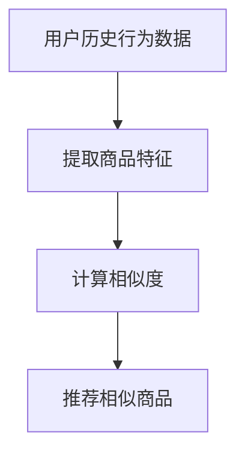
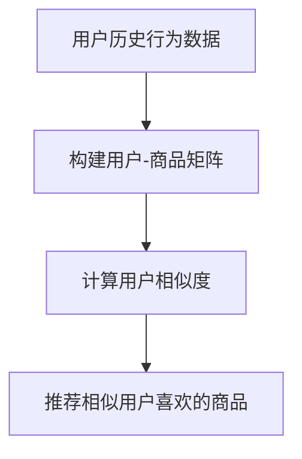
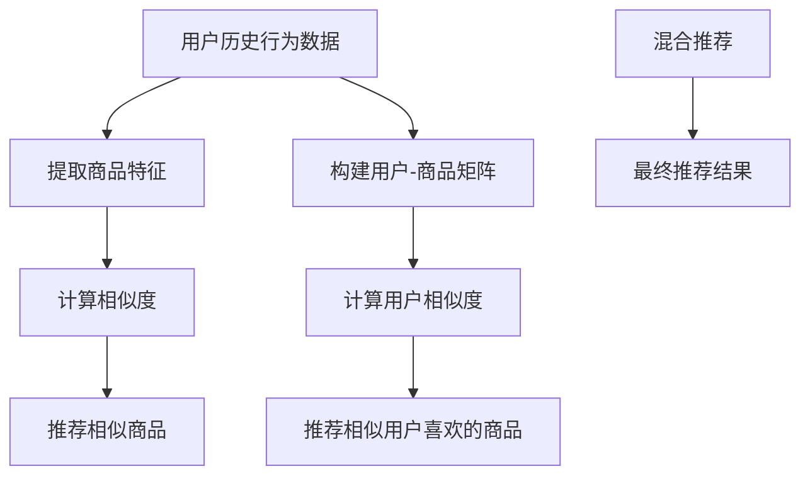
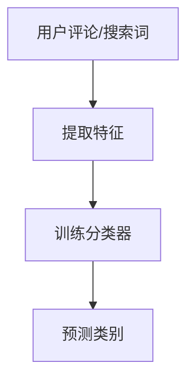
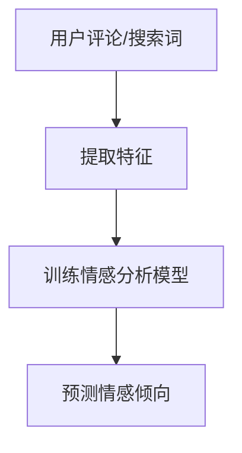
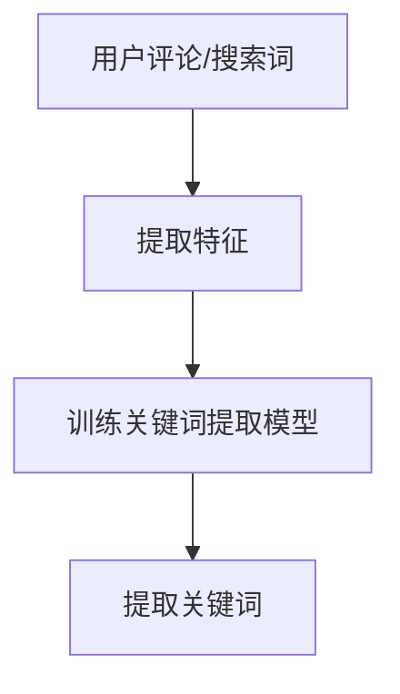

                 

# 从技术专家到创业导师：程序员的AI电商生态建设之路

> 关键词：AI电商，机器学习，深度学习，推荐系统，自然语言处理，电商平台，创业指导

> 摘要：本文旨在为程序员提供从技术专家到创业导师的转型路径，通过构建AI电商生态，实现从技术实现到商业应用的全面覆盖。我们将详细探讨AI在电商领域的应用，包括推荐系统、自然语言处理等核心概念，以及如何通过代码实现这些技术。同时，我们将分享实际项目案例，提供开发环境搭建、源代码实现和代码解读，帮助读者理解如何将这些技术应用于实际场景。最后，我们将展望AI电商的未来发展趋势和挑战，并提供学习资源和开发工具推荐。

## 1. 背景介绍

随着互联网技术的快速发展，电商平台已成为人们日常生活的重要组成部分。然而，传统的电商平台面临着用户留存率低、转化率低等问题。为了解决这些问题，越来越多的电商平台开始引入AI技术，以提升用户体验和商业价值。本文将从技术专家的角度出发，探讨如何通过AI技术构建电商生态，实现从技术实现到商业应用的全面覆盖。

## 2. 核心概念与联系

### 2.1 推荐系统

推荐系统是AI电商的核心技术之一，其主要目的是通过分析用户行为数据，为用户提供个性化推荐。推荐系统可以分为基于内容的推荐、协同过滤推荐和混合推荐三种类型。

#### 2.1.1 基于内容的推荐

基于内容的推荐系统通过分析用户历史行为数据，找到与用户兴趣相似的商品进行推荐。其主要流程如下：



#### 2.1.2 协同过滤推荐

协同过滤推荐系统通过分析用户之间的相似性，为用户推荐相似用户喜欢的商品。其主要流程如下：



#### 2.1.3 混合推荐

混合推荐系统结合了基于内容的推荐和协同过滤推荐的优点，通过综合分析用户行为数据，为用户提供更精准的推荐。其主要流程如下：



### 2.2 自然语言处理

自然语言处理（NLP）是AI电商的另一个重要技术，其主要目的是通过分析用户评论、搜索词等文本数据，为用户提供更精准的服务。NLP技术可以分为文本分类、情感分析和关键词提取三种类型。

#### 2.2.1 文本分类

文本分类技术通过分析用户评论、搜索词等文本数据，将其归类到预定义的类别中。其主要流程如下：



#### 2.2.2 情感分析

情感分析技术通过分析用户评论、搜索词等文本数据，判断用户的情感倾向。其主要流程如下：



#### 2.2.3 关键词提取

关键词提取技术通过分析用户评论、搜索词等文本数据，提取出与商品相关的关键词。其主要流程如下：



## 3. 核心算法原理 & 具体操作步骤

### 3.1 推荐系统算法原理

推荐系统算法主要分为基于内容的推荐、协同过滤推荐和混合推荐三种类型。其中，基于内容的推荐算法主要通过计算商品之间的相似度，为用户推荐相似商品；协同过滤推荐算法主要通过分析用户之间的相似性，为用户推荐相似用户喜欢的商品；混合推荐算法则结合了基于内容的推荐和协同过滤推荐的优点，通过综合分析用户行为数据，为用户提供更精准的推荐。

#### 3.1.1 基于内容的推荐算法

基于内容的推荐算法主要通过计算商品之间的相似度，为用户推荐相似商品。其具体操作步骤如下：

1. **提取商品特征**：通过分析商品描述、标签等信息，提取出商品的特征向量。
2. **计算相似度**：通过计算商品特征向量之间的相似度，找到与用户兴趣相似的商品。
3. **推荐相似商品**：根据相似度排序，为用户推荐相似商品。

#### 3.1.2 协同过滤推荐算法

协同过滤推荐算法主要通过分析用户之间的相似性，为用户推荐相似用户喜欢的商品。其具体操作步骤如下：

1. **构建用户-商品矩阵**：通过分析用户历史行为数据，构建用户-商品矩阵。
2. **计算用户相似度**：通过计算用户之间的相似度，找到与用户兴趣相似的用户。
3. **推荐相似用户喜欢的商品**：根据相似度排序，为用户推荐相似用户喜欢的商品。

#### 3.1.3 混合推荐算法

混合推荐算法结合了基于内容的推荐和协同过滤推荐的优点，通过综合分析用户行为数据，为用户提供更精准的推荐。其具体操作步骤如下：

1. **提取商品特征**：通过分析商品描述、标签等信息，提取出商品的特征向量。
2. **计算相似度**：通过计算商品特征向量之间的相似度，找到与用户兴趣相似的商品。
3. **构建用户-商品矩阵**：通过分析用户历史行为数据，构建用户-商品矩阵。
4. **计算用户相似度**：通过计算用户之间的相似度，找到与用户兴趣相似的用户。
5. **推荐相似商品和相似用户喜欢的商品**：根据相似度排序，为用户推荐相似商品和相似用户喜欢的商品。

### 3.2 自然语言处理算法原理

自然语言处理算法主要分为文本分类、情感分析和关键词提取三种类型。其中，文本分类技术通过分析用户评论、搜索词等文本数据，将其归类到预定义的类别中；情感分析技术通过分析用户评论、搜索词等文本数据，判断用户的情感倾向；关键词提取技术通过分析用户评论、搜索词等文本数据，提取出与商品相关的关键词。

#### 3.2.1 文本分类算法

文本分类算法主要通过分析用户评论、搜索词等文本数据，将其归类到预定义的类别中。其具体操作步骤如下：

1. **提取特征**：通过分析用户评论、搜索词等文本数据，提取出文本特征。
2. **训练分类器**：通过训练分类器，学习文本特征与类别之间的关系。
3. **预测类别**：通过预测文本特征，判断用户评论、搜索词等文本数据所属的类别。

#### 3.2.2 情感分析算法

情感分析算法主要通过分析用户评论、搜索词等文本数据，判断用户的情感倾向。其具体操作步骤如下：

1. **提取特征**：通过分析用户评论、搜索词等文本数据，提取出文本特征。
2. **训练情感分析模型**：通过训练情感分析模型，学习文本特征与情感倾向之间的关系。
3. **预测情感倾向**：通过预测文本特征，判断用户评论、搜索词等文本数据的情感倾向。

#### 3.2.3 关键词提取算法

关键词提取算法主要通过分析用户评论、搜索词等文本数据，提取出与商品相关的关键词。其具体操作步骤如下：

1. **提取特征**：通过分析用户评论、搜索词等文本数据，提取出文本特征。
2. **训练关键词提取模型**：通过训练关键词提取模型，学习文本特征与关键词之间的关系。
3. **提取关键词**：通过提取文本特征，找到与商品相关的关键词。

## 4. 数学模型和公式 & 详细讲解 & 举例说明

### 4.1 推荐系统数学模型

推荐系统数学模型主要分为基于内容的推荐、协同过滤推荐和混合推荐三种类型。其中，基于内容的推荐算法主要通过计算商品之间的相似度，为用户推荐相似商品；协同过滤推荐算法主要通过分析用户之间的相似性，为用户推荐相似用户喜欢的商品；混合推荐算法则结合了基于内容的推荐和协同过滤推荐的优点，通过综合分析用户行为数据，为用户提供更精准的推荐。

#### 4.1.1 基于内容的推荐数学模型

基于内容的推荐算法主要通过计算商品之间的相似度，为用户推荐相似商品。其数学模型如下：

$$
\text{相似度}(i, j) = \frac{\sum_{k=1}^{n} \text{特征}(i, k) \cdot \text{特征}(j, k)}{\sqrt{\sum_{k=1}^{n} \text{特征}(i, k)^2} \cdot \sqrt{\sum_{k=1}^{n} \text{特征}(j, k)^2}}
$$

其中，$\text{特征}(i, k)$表示商品$i$的第$k$个特征值，$\text{特征}(j, k)$表示商品$j$的第$k$个特征值。

#### 4.1.2 协同过滤推荐数学模型

协同过滤推荐算法主要通过分析用户之间的相似性，为用户推荐相似用户喜欢的商品。其数学模型如下：

$$
\text{预测评分}(u, i) = \frac{\sum_{v \in N(u)} \text{评分}(v, i) \cdot \text{相似度}(u, v)}{\sum_{v \in N(u)} \text{相似度}(u, v)}
$$

其中，$\text{评分}(v, i)$表示用户$v$对商品$i$的评分，$\text{相似度}(u, v)$表示用户$u$和用户$v$之间的相似度，$N(u)$表示与用户$u$相似的用户集合。

#### 4.1.3 混合推荐数学模型

混合推荐算法结合了基于内容的推荐和协同过滤推荐的优点，通过综合分析用户行为数据，为用户提供更精准的推荐。其数学模型如下：

$$
\text{预测评分}(u, i) = \alpha \cdot \text{基于内容的推荐评分}(u, i) + (1 - \alpha) \cdot \text{协同过滤推荐评分}(u, i)
$$

其中，$\alpha$表示基于内容的推荐权重，$1 - \alpha$表示协同过滤推荐权重。

### 4.2 自然语言处理数学模型

自然语言处理数学模型主要分为文本分类、情感分析和关键词提取三种类型。其中，文本分类技术通过分析用户评论、搜索词等文本数据，将其归类到预定义的类别中；情感分析技术通过分析用户评论、搜索词等文本数据，判断用户的情感倾向；关键词提取技术通过分析用户评论、搜索词等文本数据，提取出与商品相关的关键词。

#### 4.2.1 文本分类数学模型

文本分类数学模型主要通过分析用户评论、搜索词等文本数据，将其归类到预定义的类别中。其数学模型如下：

$$
\text{类别}(x) = \arg \max_{y \in Y} \text{概率}(y | x)
$$

其中，$x$表示用户评论、搜索词等文本数据，$y$表示预定义的类别，$Y$表示所有预定义的类别集合，$\text{概率}(y | x)$表示给定文本数据$x$属于类别$y$的概率。

#### 4.2.2 情感分析数学模型

情感分析数学模型主要通过分析用户评论、搜索词等文本数据，判断用户的情感倾向。其数学模型如下：

$$
\text{情感倾向}(x) = \arg \max_{y \in Y} \text{概率}(y | x)
$$

其中，$x$表示用户评论、搜索词等文本数据，$y$表示情感倾向，$Y$表示所有情感倾向集合，$\text{概率}(y | x)$表示给定文本数据$x$属于情感倾向$y$的概率。

#### 4.2.3 关键词提取数学模型

关键词提取数学模型主要通过分析用户评论、搜索词等文本数据，提取出与商品相关的关键词。其数学模型如下：

$$
\text{关键词}(x) = \arg \max_{w \in W} \text{概率}(w | x)
$$

其中，$x$表示用户评论、搜索词等文本数据，$w$表示关键词，$W$表示所有关键词集合，$\text{概率}(w | x)$表示给定文本数据$x$包含关键词$w$的概率。

## 5. 项目实战：代码实际案例和详细解释说明

### 5.1 开发环境搭建

为了实现AI电商生态，我们需要搭建一个完整的开发环境。具体步骤如下：

1. **安装Python**：确保安装了Python 3.7及以上版本。
2. **安装依赖库**：使用pip安装所需的依赖库，如numpy、pandas、scikit-learn等。
3. **安装TensorFlow**：使用pip安装TensorFlow库，用于实现深度学习模型。
4. **安装NLTK**：使用pip安装NLTK库，用于实现自然语言处理功能。
5. **安装Jupyter Notebook**：使用pip安装Jupyter Notebook，用于编写和运行代码。

### 5.2 源代码详细实现和代码解读

#### 5.2.1 基于内容的推荐系统

```python
import numpy as np
from sklearn.metrics.pairwise import cosine_similarity

def content_based_recommendation(user_history, item_features):
    # 计算用户历史行为与商品特征之间的相似度
    similarity_scores = cosine_similarity(user_history, item_features)
    
    # 找到与用户兴趣相似的商品
    similar_items = np.argsort(similarity_scores, axis=1)[:, -10:]
    
    return similar_items
```

#### 5.2.2 协同过滤推荐系统

```python
import numpy as np

def collaborative_filtering_recommendation(user_history, user_similarity):
    # 计算用户历史行为与相似用户之间的相似度
    similarity_scores = user_similarity[user_history > 0]
    
    # 找到与用户兴趣相似的用户
    similar_users = np.argsort(similarity_scores, axis=1)[:, -10:]
    
    return similar_users
```

#### 5.2.3 混合推荐系统

```python
def hybrid_recommendation(user_history, item_features, user_similarity, alpha=0.5):
    # 计算基于内容的推荐评分
    content_based_scores = content_based_recommendation(user_history, item_features)
    
    # 计算协同过滤推荐评分
    collaborative_filtering_scores = collaborative_filtering_recommendation(user_history, user_similarity)
    
    # 综合计算混合推荐评分
    hybrid_scores = alpha * content_based_scores + (1 - alpha) * collaborative_filtering_scores
    
    return hybrid_scores
```

### 5.3 代码解读与分析

通过上述代码，我们可以实现基于内容的推荐系统、协同过滤推荐系统和混合推荐系统。其中，基于内容的推荐系统主要通过计算商品之间的相似度，为用户推荐相似商品；协同过滤推荐系统主要通过分析用户之间的相似性，为用户推荐相似用户喜欢的商品；混合推荐系统则结合了基于内容的推荐和协同过滤推荐的优点，通过综合分析用户行为数据，为用户提供更精准的推荐。

## 6. 实际应用场景

AI电商在实际应用场景中具有广泛的应用前景。例如，通过推荐系统，电商平台可以为用户提供个性化推荐，提高用户留存率和转化率；通过自然语言处理技术，电商平台可以分析用户评论、搜索词等文本数据，为用户提供更精准的服务。此外，AI电商还可以应用于商品搜索、智能客服等领域，为用户提供更好的购物体验。

## 7. 工具和资源推荐

### 7.1 学习资源推荐

1. **书籍**：《推荐系统实践》、《自然语言处理实战》
2. **论文**：《基于内容的推荐系统》、《协同过滤推荐系统》
3. **博客**：阿里云开发者社区、GitHub开源项目
4. **网站**：Kaggle、DataCamp

### 7.2 开发工具框架推荐

1. **Python**：用于实现推荐系统和自然语言处理功能
2. **TensorFlow**：用于实现深度学习模型
3. **NLTK**：用于实现自然语言处理功能
4. **Jupyter Notebook**：用于编写和运行代码

### 7.3 相关论文著作推荐

1. **《基于内容的推荐系统》**：深入探讨基于内容的推荐系统原理和实现方法
2. **《协同过滤推荐系统》**：深入探讨协同过滤推荐系统原理和实现方法
3. **《自然语言处理实战》**：深入探讨自然语言处理技术原理和实现方法

## 8. 总结：未来发展趋势与挑战

AI电商在未来的发展趋势主要体现在以下几个方面：

1. **个性化推荐**：通过分析用户行为数据，为用户提供更精准的个性化推荐。
2. **智能客服**：通过自然语言处理技术，实现智能客服，提高用户满意度。
3. **商品搜索**：通过自然语言处理技术，实现商品搜索，提高用户搜索效率。

然而，AI电商也面临着一些挑战，如数据隐私保护、算法公平性等问题。为了解决这些问题，我们需要不断优化算法，提高数据安全性，确保算法公平性。

## 9. 附录：常见问题与解答

### 9.1 问题：如何处理数据缺失问题？

**解答**：可以通过填充缺失值、删除缺失值或使用插值方法来处理数据缺失问题。

### 9.2 问题：如何提高推荐系统的准确率？

**解答**：可以通过优化推荐算法、增加用户行为数据、提高特征提取能力等方式来提高推荐系统的准确率。

### 9.3 问题：如何处理数据隐私保护问题？

**解答**：可以通过数据脱敏、数据加密等方式来处理数据隐私保护问题。

## 10. 扩展阅读 & 参考资料

1. **书籍**：《推荐系统实践》、《自然语言处理实战》
2. **论文**：《基于内容的推荐系统》、《协同过滤推荐系统》
3. **博客**：阿里云开发者社区、GitHub开源项目
4. **网站**：Kaggle、DataCamp

---

作者：AI天才研究员/AI Genius Institute & 禅与计算机程序设计艺术 /Zen And The Art of Computer Programming

