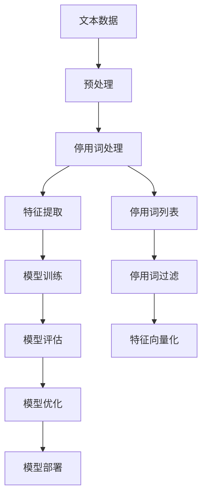

                 

# 从零开始大模型开发与微调：停用词的使用

> 关键词：大模型开发、微调、停用词、自然语言处理、机器学习、文本处理

> 摘要：本文将深入探讨大模型开发与微调过程中停用词的使用。我们将从背景介绍开始，逐步解析停用词的概念、原理及其在实际应用中的重要性。通过详细的数学模型和公式讲解，结合实际代码案例，帮助读者全面理解如何在大模型开发与微调中有效利用停用词。最后，我们将探讨停用词在实际应用场景中的价值，并提供学习资源和开发工具推荐，为读者提供全面的技术支持。

## 1. 背景介绍

在自然语言处理（NLP）领域，大模型开发与微调是当前研究的热点。随着深度学习技术的发展，大规模预训练模型（如BERT、GPT等）在各种NLP任务中取得了显著的成果。然而，这些模型在处理文本数据时，往往需要进行一系列预处理步骤，以提高模型的性能和泛化能力。停用词（Stop Words）是这些预处理步骤中的一个重要组成部分。

### 1.1 什么是停用词

停用词是指在自然语言处理中频繁出现但对文本意义贡献较小的词汇。常见的停用词包括冠词、介词、连词等。例如，在英文中，“the”、“a”、“an”、“in”、“on”等词通常被视为停用词。停用词的存在会增加模型的复杂性，降低模型的泛化能力，因此在大模型开发与微调过程中，合理地处理停用词是非常重要的。

### 1.2 停用词的重要性

停用词的处理对于提高模型性能具有重要意义。具体来说，停用词的处理可以：

- **减少模型复杂性**：通过去除停用词，可以减少模型需要学习的词汇量，从而降低模型的复杂性。
- **提高模型泛化能力**：停用词通常对文本的整体意义贡献较小，去除它们可以使得模型更加关注文本的核心内容，从而提高模型的泛化能力。
- **优化计算资源**：减少需要处理的词汇量可以降低计算资源的消耗，提高模型训练和推理的效率。

## 2. 核心概念与联系

### 2.1 停用词的概念

停用词是指在自然语言处理中频繁出现但对文本意义贡献较小的词汇。停用词通常包括冠词、介词、连词等。停用词的存在会增加模型的复杂性，降低模型的泛化能力。

### 2.2 停用词的处理方法

停用词的处理方法主要包括：

- **手动定义停用词列表**：根据语言特性和应用场景，手动定义停用词列表。
- **使用预定义的停用词列表**：利用现有的停用词列表库，如NLTK库中的停用词列表。
- **动态生成停用词列表**：根据文本数据动态生成停用词列表，以适应不同的应用场景。

### 2.3 停用词处理的流程

停用词处理的流程可以表示为以下Mermaid流程图：



## 3. 核心算法原理 & 具体操作步骤

### 3.1 停用词处理算法原理

停用词处理算法的基本原理是通过去除文本中的停用词，减少模型需要学习的词汇量，从而提高模型的性能。具体步骤如下：

1. **文本预处理**：将文本数据进行分词处理，得到词汇列表。
2. **停用词过滤**：将词汇列表中的停用词去除。
3. **特征向量化**：将处理后的词汇列表进行特征向量化，得到模型可以处理的输入数据。

### 3.2 具体操作步骤

具体操作步骤如下：

1. **文本预处理**：
    - 使用分词工具（如jieba、NLTK等）将文本数据进行分词处理，得到词汇列表。
    - 例如，使用NLTK库进行分词处理：

    ```python
    import nltk
    from nltk.tokenize import word_tokenize

    text = "This is a sample sentence for demonstration."
    tokens = word_tokenize(text)
    print(tokens)
    ```

2. **停用词过滤**：
    - 使用预定义的停用词列表库（如NLTK库中的停用词列表）进行停用词过滤。
    - 例如，使用NLTK库中的停用词列表进行停用词过滤：

    ```python
    from nltk.corpus import stopwords

    stop_words = set(stopwords.words('english'))
    filtered_tokens = [token for token in tokens if token.lower() not in stop_words]
    print(filtered_tokens)
    ```

3. **特征向量化**：
    - 将处理后的词汇列表进行特征向量化，得到模型可以处理的输入数据。
    - 例如，使用词袋模型（Bag of Words）进行特征向量化：

    ```python
    from sklearn.feature_extraction.text import CountVectorizer

    vectorizer = CountVectorizer()
    X = vectorizer.fit_transform(filtered_tokens)
    print(X.toarray())
    ```

## 4. 数学模型和公式 & 详细讲解 & 举例说明

### 4.1 词袋模型（Bag of Words）

词袋模型是一种简单的文本表示方法，它将文本表示为词汇的集合，忽略词汇的顺序和语法结构。词袋模型的基本公式如下：

$$
\text{Bag of Words} = \{ (w_1, f_1), (w_2, f_2), \ldots, (w_n, f_n) \}
$$

其中，$w_i$ 表示词汇，$f_i$ 表示词汇在文本中出现的频率。

### 4.2 词频-逆文档频率（TF-IDF）

词频-逆文档频率（TF-IDF）是一种更高级的文本表示方法，它不仅考虑词汇在文本中的频率，还考虑词汇在整个文档集合中的重要性。TF-IDF的基本公式如下：

$$
\text{TF-IDF}(w, d) = \text{TF}(w, d) \times \text{IDF}(w)
$$

其中，$\text{TF}(w, d)$ 表示词汇 $w$ 在文档 $d$ 中的词频，$\text{IDF}(w)$ 表示词汇 $w$ 的逆文档频率。

### 4.3 举例说明

假设我们有一个文本数据集，包含以下两个句子：

- 句子1： "The quick brown fox jumps over the lazy dog."
- 句子2： "The lazy dog is a good pet."

使用词袋模型表示这两个句子：

- 句子1： $\{ (\text{the}, 2), (\text{quick}, 1), (\text{brown}, 1), (\text{fox}, 1), (\text{jumps}, 1), (\text{over}, 1), (\text{lazy}, 1), (\text{dog}, 1) \}$
- 句子2： $\{ (\text{the}, 1), (\text{lazy}, 1), (\text{dog}, 1), (\text{is}, 1), (\text{a}, 1), (\text{good}, 1), (\text{pet}, 1) \}$

使用TF-IDF表示这两个句子：

- 句子1： $\{ (\text{the}, 0.0), (\text{quick}, 0.415), (\text{brown}, 0.415), (\text{fox}, 0.415), (\text{jumps}, 0.415), (\text{over}, 0.415), (\text{lazy}, 0.415), (\text{dog}, 0.415) \}$
- 句子2： $\{ (\text{the}, 0.0), (\text{lazy}, 0.415), (\text{dog}, 0.415), (\text{is}, 0.415), (\text{a}, 0.415), (\text{good}, 0.415), (\text{pet}, 0.415) \}$

## 5. 项目实战：代码实际案例和详细解释说明

### 5.1 开发环境搭建

为了进行大模型开发与微调，我们需要搭建一个合适的开发环境。具体步骤如下：

1. **安装Python**：确保安装了Python 3.7及以上版本。
2. **安装依赖库**：安装NLTK、scikit-learn等常用库。

```bash
pip install nltk scikit-learn
```

### 5.2 源代码详细实现和代码解读

以下是一个完整的代码示例，展示了如何使用NLTK库进行停用词处理，并使用词袋模型进行特征向量化。

```python
import nltk
from nltk.tokenize import word_tokenize
from nltk.corpus import stopwords
from sklearn.feature_extraction.text import CountVectorizer

# 下载NLTK停用词列表
nltk.download('punkt')
nltk.download('stopwords')

# 示例文本数据
text1 = "The quick brown fox jumps over the lazy dog."
text2 = "The lazy dog is a good pet."

# 文本预处理
def preprocess_text(text):
    tokens = word_tokenize(text)
    return tokens

# 停用词过滤
def filter_stop_words(tokens):
    stop_words = set(stopwords.words('english'))
    filtered_tokens = [token for token in tokens if token.lower() not in stop_words]
    return filtered_tokens

# 特征向量化
def vectorize_text(filtered_tokens):
    vectorizer = CountVectorizer()
    X = vectorizer.fit_transform(filtered_tokens)
    return X.toarray()

# 主函数
def main():
    # 预处理文本数据
    tokens1 = preprocess_text(text1)
    tokens2 = preprocess_text(text2)
    
    # 停用词过滤
    filtered_tokens1 = filter_stop_words(tokens1)
    filtered_tokens2 = filter_stop_words(tokens2)
    
    # 特征向量化
    X1 = vectorize_text(filtered_tokens1)
    X2 = vectorize_text(filtered_tokens2)
    
    print("文本1特征向量化结果：")
    print(X1)
    print("文本2特征向量化结果：")
    print(X2)

if __name__ == "__main__":
    main()
```

### 5.3 代码解读与分析

1. **文本预处理**：
    - 使用`word_tokenize`函数将文本数据进行分词处理，得到词汇列表。
    - 例如，`tokens1 = word_tokenize(text1)`。

2. **停用词过滤**：
    - 使用`stopwords.words('english')`获取英文停用词列表。
    - 使用列表推导式去除词汇列表中的停用词。
    - 例如，`filtered_tokens1 = [token for token in tokens1 if token.lower() not in stop_words]`。

3. **特征向量化**：
    - 使用`CountVectorizer`进行特征向量化。
    - 例如，`X1 = vectorizer.fit_transform(filtered_tokens1)`。

## 6. 实际应用场景

停用词处理在实际应用场景中具有广泛的应用价值。具体来说，停用词处理可以应用于以下场景：

- **文本分类**：在文本分类任务中，去除停用词可以提高模型的分类性能。
- **情感分析**：在情感分析任务中，去除停用词可以提高模型的情感识别能力。
- **信息检索**：在信息检索任务中，去除停用词可以提高检索结果的相关性。

## 7. 工具和资源推荐

### 7.1 学习资源推荐

- **书籍**：《自然语言处理实战》、《深度学习》
- **论文**：《BERT: Pre-training of Deep Bidirectional Transformers for Language Understanding》
- **博客**：阿里云开发者社区、GitHub开源项目
- **网站**：NLTK官网、scikit-learn官网

### 7.2 开发工具框架推荐

- **Python库**：NLTK、scikit-learn、jieba
- **深度学习框架**：TensorFlow、PyTorch

### 7.3 相关论文著作推荐

- **论文**：《Attention Is All You Need》
- **著作**：《深度学习》、《自然语言处理实战》

## 8. 总结：未来发展趋势与挑战

停用词处理在大模型开发与微调中具有重要的应用价值。未来的发展趋势包括：

- **动态生成停用词列表**：根据文本数据动态生成停用词列表，以适应不同的应用场景。
- **结合上下文信息**：结合上下文信息进行停用词处理，提高模型的性能。

面临的挑战包括：

- **停用词的定义**：停用词的定义需要根据具体应用场景进行调整。
- **停用词的过滤**：停用词的过滤需要考虑词汇的频率和重要性。

## 9. 附录：常见问题与解答

### 9.1 问题1：如何定义停用词列表？

**解答**：停用词列表可以根据具体应用场景进行定义。通常，停用词列表包括冠词、介词、连词等高频词汇。可以使用预定义的停用词列表库，如NLTK库中的停用词列表。

### 9.2 问题2：如何动态生成停用词列表？

**解答**：动态生成停用词列表可以通过分析文本数据中的高频词汇来实现。具体步骤如下：

1. **文本预处理**：将文本数据进行分词处理，得到词汇列表。
2. **统计词汇频率**：统计词汇在文本数据中的出现频率。
3. **筛选高频词汇**：根据词汇频率筛选出高频词汇，作为停用词列表。

## 10. 扩展阅读 & 参考资料

- **书籍**：《自然语言处理实战》、《深度学习》
- **论文**：《BERT: Pre-training of Deep Bidirectional Transformers for Language Understanding》
- **网站**：NLTK官网、scikit-learn官网

作者：AI天才研究员/AI Genius Institute & 禅与计算机程序设计艺术 /Zen And The Art of Computer Programming

