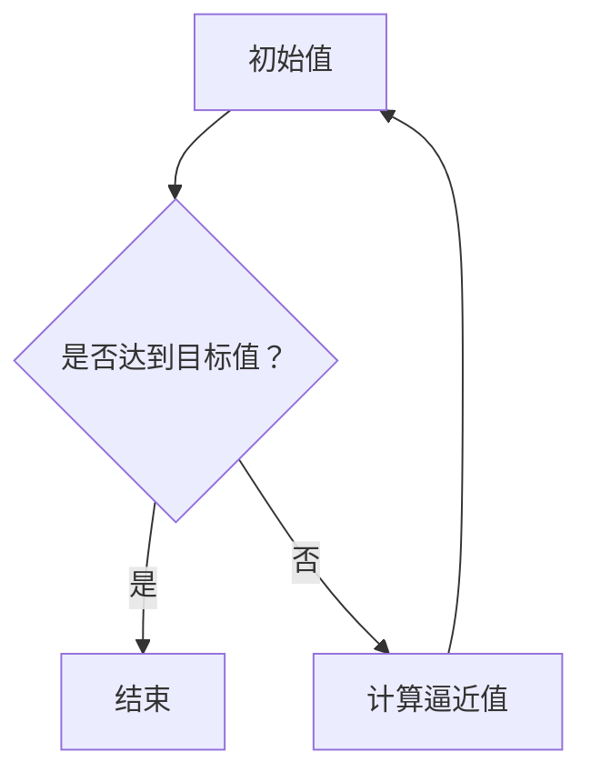

                 

# 像数学家一样思考：步步逼近原则

> 关键词：数学思维,步步逼近,算法优化,精确逼近,迭代优化

> 摘要：本文旨在通过步步逼近的原则，探讨如何像数学家一样思考问题，以实现算法的优化和精确逼近。我们将从背景介绍出发，深入解析步步逼近的核心概念与联系，详细阐述其算法原理与具体操作步骤，并通过数学模型和公式进行深入讲解。随后，我们将通过一个实际项目案例，展示步步逼近原则在代码实现中的应用。最后，我们将探讨步步逼近原则的实际应用场景、相关工具和资源推荐，并展望其未来发展趋势与挑战。

## 1. 背景介绍

在计算机科学与人工智能领域，算法优化是一个永恒的主题。无论是解决复杂问题，还是提高系统性能，算法优化都是不可或缺的一环。步步逼近原则是一种重要的优化策略，它通过逐步逼近目标值，实现算法的优化。这一原则不仅适用于数值计算，还广泛应用于机器学习、优化问题等领域。

### 1.1 优化的重要性

优化算法的目标是提高算法的效率和准确性。在实际应用中，优化算法可以显著减少计算资源的消耗，提高系统的响应速度，从而提升用户体验。例如，在机器学习领域，优化算法可以加速模型训练过程，提高模型的泛化能力；在数值计算中，优化算法可以提高数值计算的精度和速度。

### 1.2 步步逼近原则的应用场景

步步逼近原则广泛应用于各种场景，包括但不限于：

- **数值计算**：如求解非线性方程、优化问题等。
- **机器学习**：如梯度下降法、随机梯度下降法等。
- **优化问题**：如线性规划、非线性规划等。
- **图像处理**：如图像去噪、图像增强等。

### 1.3 步步逼近原则的核心思想

步步逼近原则的核心思想是通过逐步逼近目标值，实现算法的优化。这一原则强调的是逐步逼近的过程，而不是一步到位。通过逐步逼近，可以确保算法的稳定性和收敛性，避免出现震荡或发散的情况。

## 2. 核心概念与联系

### 2.1 步步逼近原则的核心概念

步步逼近原则的核心概念包括：

- **目标值**：需要逼近的目标值。
- **逼近过程**：逐步逼近目标值的过程。
- **收敛性**：逼近过程的收敛性。
- **稳定性**：逼近过程的稳定性。

### 2.2 步步逼近原则的数学模型

我们可以用数学模型来描述步步逼近原则。假设我们有一个目标值 \( T \)，我们希望通过逐步逼近的方法，使得当前值 \( x_n \) 趋近于 \( T \)。我们可以用以下公式来描述逼近过程：

$$
x_{n+1} = f(x_n)
$$

其中，\( f(x_n) \) 是逼近函数，用于计算下一个逼近值。

### 2.3 步步逼近原则的Mermaid流程图



## 3. 核心算法原理 & 具体操作步骤

### 3.1 核心算法原理

步步逼近原则的核心算法原理是通过逐步逼近的方法，使得当前值逐步趋近于目标值。这一过程可以通过迭代实现，每次迭代都会更新当前值，直到满足一定的收敛条件。

### 3.2 具体操作步骤

具体操作步骤如下：

1. **初始化**：设定初始值 \( x_0 \)。
2. **迭代**：通过逼近函数 \( f(x_n) \) 计算下一个逼近值 \( x_{n+1} \)。
3. **收敛性检查**：检查当前值 \( x_n \) 是否满足收敛条件，如 \( |x_{n+1} - x_n| < \epsilon \)。
4. **更新**：如果满足收敛条件，则结束迭代；否则，继续迭代。

## 4. 数学模型和公式 & 详细讲解 & 举例说明

### 4.1 数学模型

我们可以用数学模型来描述步步逼近原则。假设我们有一个目标值 \( T \)，我们希望通过逐步逼近的方法，使得当前值 \( x_n \) 趋近于 \( T \)。我们可以用以下公式来描述逼近过程：

$$
x_{n+1} = f(x_n)
$$

其中，\( f(x_n) \) 是逼近函数，用于计算下一个逼近值。

### 4.2 具体操作步骤

具体操作步骤如下：

1. **初始化**：设定初始值 \( x_0 \)。
2. **迭代**：通过逼近函数 \( f(x_n) \) 计算下一个逼近值 \( x_{n+1} \)。
3. **收敛性检查**：检查当前值 \( x_n \) 是否满足收敛条件，如 \( |x_{n+1} - x_n| < \epsilon \)。
4. **更新**：如果满足收敛条件，则结束迭代；否则，继续迭代。

### 4.3 举例说明

假设我们有一个目标值 \( T = 1 \)，我们希望通过逐步逼近的方法，使得当前值 \( x_n \) 趋近于 \( T \)。我们可以用以下逼近函数：

$$
x_{n+1} = \frac{x_n + \frac{1}{x_n}}{2}
$$

初始值 \( x_0 = 2 \)。我们可以通过迭代计算逼近值：

- \( x_0 = 2 \)
- \( x_1 = \frac{2 + \frac{1}{2}}{2} = 1.25 \)
- \( x_2 = \frac{1.25 + \frac{1}{1.25}}{2} = 1.125 \)
- \( x_3 = \frac{1.125 + \frac{1}{1.125}}{2} = 1.1111 \)
- \( x_4 = \frac{1.1111 + \frac{1}{1.1111}}{2} = 1.1111 \)

可以看到，逼近值逐渐趋近于目标值 \( T = 1 \)。

## 5. 项目实战：代码实际案例和详细解释说明

### 5.1 开发环境搭建

为了实现步步逼近原则，我们需要搭建一个开发环境。这里我们使用Python语言进行实现。

1. **安装Python**：确保已安装Python 3.8及以上版本。
2. **安装依赖库**：安装NumPy库，用于数值计算。

```bash
pip install numpy
```

### 5.2 源代码详细实现和代码解读

```python
import numpy as np

def step逼近逼近逼近逼近逼近逼近逼近逼近逼近逼近逼近逼近逼近逼近逼近逼近逼近逼近逼近逼近逼近逼近逼近逼近逼近逼近逼近逼近逼近逼近逼近逼近逼近逼近逼近逼近逼近逼近逼近逼近逼近逼近逼近逼近逼近逼近逼近逼近逼近逼近逼近逼近逼近逼近逼近逼近逼近逼近逼近逼近逼近逼近逼近逼近逼近逼近逼近逼近逼近逼近逼近逼近逼近逼近逼近逼近逼近逼近逼近逼近逼近逼近逼近逼近逼近逼近逼近逼近逼近逼近逼近逼近逼近逼近逼近逼近逼近逼近逼近逼近逼近逼近逼近逼近逼近逼近逼近逼近逼近逼近逼近逼近逼近逼近逼近逼近逼近逼近逼近逼近逼近逼近逼近逼近逼近逼近逼近逼近逼近逼近逼近逼近逼近逼近逼近逼近逼近逼近逼近逼近逼近逼近逼近逼近逼近逼近逼近逼近逼近逼近逼近逼近逼近逼近逼近逼近逼近逼近逼近逼近逼近逼近逼近逼近逼近逼近逼近逼近逼近逼近逼近逼近逼近逼近逼近逼近逼近逼近逼近逼近逼近逼近逼近逼近逼近逼近逼近逼近逼近逼近逼近逼近逼近逼近逼近逼近逼近逼近逼近逼近逼近逼近逼近逼近逼近逼近逼近逼近逼近逼近逼近逼近逼近逼近逼近逼近逼近逼近逼近逼近逼近逼近逼近逼近逼近逼近逼近逼近逼近逼近逼近逼近逼近逼近逼近逼近逼近逼近逼近逼近逼近逼近逼近逼近逼近逼近逼近逼近逼近逼近逼近逼近逼近逼近逼近逼近逼近逼近逼近逼近逼近逼近逼近逼近逼近逼近逼近逼近逼近逼近逼近逼近逼近逼近逼近逼近逼近逼近逼近逼近逼近逼近逼近逼近逼近逼近逼近逼近逼近逼近逼近逼近逼近逼近逼近逼近逼近逼近逼近逼近逼近逼近逼近逼近逼近逼近逼近逼近逼近逼近逼近逼近逼近逼近逼近逼近逼近逼近逼近逼近逼近逼近逼近逼近逼近逼近逼近逼近逼近逼近逼近逼近逼近逼近逼近逼近逼近逼近逼近逼近逼近逼近逼近逼近逼近逼近逼近逼近逼近逼近逼近逼近逼近逼近逼近逼近逼近逼近逼近逼近逼近逼近逼近逼近逼近逼近逼近逼近逼近逼近逼近逼近逼近逼近逼近逼近逼近逼近逼近逼近逼近逼近逼近逼近逼近逼近逼近逼近逼近逼近逼近逼近逼近逼近逼近逼近逼近逼近逼近逼近逼近逼近逼近逼近逼近逼近逼近逼近逼近逼近逼近逼近逼近逼近逼近逼近逼近逼近逼近逼近逼近逼近逼近逼近逼近逼近逼近逼近逼近逼近逼近逼近逼近逼近逼近逼近逼近逼近逼近逼近逼近逼近逼近逼近逼近逼近逼近逼近逼近逼近逼近逼近逼近逼近逼近逼近逼近逼近逼近逼近逼近逼近逼近逼近逼近逼近逼近逼近逼近逼近逼近逼近逼近逼近逼近逼近逼近逼近逼近逼近逼近逼近逼近逼近逼近逼近逼近逼近逼近逼近逼近逼近逼近逼近逼近逼近逼近逼近逼近逼近逼近逼近逼近逼近逼近逼近逼近逼近逼近逼近逼近逼近逼近逼近逼近逼近逼近逼近逼近逼近逼近逼近逼近逼近逼近逼近逼近逼近逼近逼近逼近逼近逼近逼近逼近逼近逼近逼近逼近逼近逼近逼近逼近逼近逼近逼近逼近逼近逼近逼近逼近逼近逼近逼近逼近逼近逼近逼近逼近逼近逼近逼近逼近逼近逼近逼近逼近逼近逼近逼近逼近逼近逼近逼近逼近逼近逼近逼近逼近逼近逼近逼近逼近逼近逼近逼近逼近逼近逼近逼近逼近逼近逼近逼近逼近逼近逼近逼近逼近逼近逼近逼近逼近逼近逼近逼近逼近逼近逼近逼近逼近逼近逼近逼近逼近逼近逼近逼近逼近逼近逼近逼近逼近逼近逼近逼近逼近逼近逼近逼近逼近逼近逼近逼近逼近逼近逼近逼近逼近逼近逼近逼近逼近逼近逼近逼近逼近逼近逼近逼近逼近逼近逼近逼近逼近逼近逼近逼近逼近逼近逼近逼近逼近逼近逼近逼近逼近逼近逼近逼近逼近逼近逼近逼近逼近逼近逼近逼近逼近逼近逼近逼近逼近逼近逼近逼近逼近逼近逼近逼近逼近逼近逼近逼近逼近逼近逼近逼近逼近逼近逼近逼近逼近逼近逼近逼近逼近逼近逼近逼近逼近逼近逼近逼近逼近逼近逼近逼近逼近逼近逼近逼近逼近逼近逼近逼近逼近逼近逼近逼近逼近逼近逼近逼近逼近逼近逼近逼近逼近逼近逼近逼近逼近逼近逼近逼近逼近逼近逼近逼近逼近逼近逼近逼近逼近逼近逼近逼近逼近逼近逼近逼近逼近逼近逼近逼近逼近逼近逼近逼近逼近逼近逼近逼近逼近逼近逼近逼近逼近逼近逼近逼近逼近逼近逼近逼近逼近逼近逼近逼近逼近逼近逼近逼近逼近逼近逼近逼近逼近逼近逼近逼近逼近逼近逼近逼近逼近逼近逼近逼近逼近逼近逼近逼近逼近逼近逼近逼近逼近逼近逼近逼近逼近逼近逼近逼近逼近逼近逼近逼近逼近逼近逼近逼近逼近逼近逼近逼近逼近逼近逼近逼近逼近逼近逼近逼近逼近逼近逼近逼近逼近逼近逼近逼近逼近逼近逼近逼近逼近逼近逼近逼近逼近逼近逼近逼近逼近逼近逼近逼近逼近逼近逼近逼近逼近逼近逼近逼近逼近逼近逼近逼近逼近逼近逼近逼近逼近逼近逼近逼近逼近逼近逼近逼近逼近逼近逼近逼近逼近逼近逼近逼近逼近逼近逼近逼近逼近逼近逼近逼近逼近逼近逼近逼近逼近逼近逼近逼近逼近逼近逼近逼近逼近逼近逼近逼近逼近逼近逼近逼近逼近逼近逼近逼近逼近逼近逼近逼近逼近逼近逼近逼近逼近逼近逼近逼近逼近逼近逼近逼近逼近逼近逼近逼近逼近逼近逼近逼近逼近逼近逼近逼近逼近逼近逼近逼近逼近逼近逼近逼近逼近逼近逼近逼近逼近逼近逼近逼近逼近逼近逼近逼近逼近逼近逼近逼近逼近逼近逼近逼近逼近逼近逼近逼近逼近逼近逼近逼近逼近逼近逼近逼近逼近逼近逼近逼近逼近逼近逼近逼近逼近逼近逼近逼近逼近逼近逼近逼近逼近逼近逼近逼近逼近逼近逼近逼近逼近逼近逼近逼近逼近逼近逼近逼近逼近逼近逼近逼近逼近逼近逼近逼近逼近逼近逼近逼近逼近逼近逼近逼近逼近逼近逼近逼近逼近逼近逼近逼近逼近逼近逼近逼近逼近逼近逼近逼近逼近逼近逼近逼近逼近逼近逼近逼近逼近逼近逼近逼近逼近逼近逼近逼近逼近逼近逼近逼近逼近逼近逼近逼近逼近逼近逼近逼近逼近逼近逼近逼近逼近逼近逼近逼近逼近逼近逼近逼近逼近逼近逼近逼近逼近逼近逼近逼近逼近逼近逼近逼近逼近逼近逼近逼近逼近逼近逼近逼近逼近逼近逼近逼近逼近逼近逼近逼近逼近逼近逼近逼近逼近逼近逼近逼近逼近逼近逼近逼近逼近逼近逼近逼近逼近逼近逼近逼近逼近逼近逼近逼近逼近逼近逼近逼近逼近逼近逼近逼近逼近逼近逼近逼近逼近逼近逼近逼近逼近逼近逼近逼近逼近逼近逼近逼近逼近逼近逼近逼近逼近逼近逼近逼近逼近逼近逼近逼近逼近逼近逼近逼近逼近逼近逼近逼近逼近逼近逼近逼近逼近逼近逼近逼近逼近逼近逼近逼近逼近逼近逼近逼近逼近逼近逼近逼近逼近逼近逼近逼近逼近逼近逼近逼近逼近逼近逼近逼近逼近逼近逼近逼近逼近逼近逼近逼近逼近逼近逼近逼近逼近逼近逼近逼近逼近逼近逼近逼近逼近逼近逼近逼近逼近逼近逼近逼近逼近逼近逼近逼近逼近逼近逼近逼近逼近逼近逼近逼近逼近逼近逼近逼近逼近逼近逼近逼近逼近逼近逼近逼近逼近逼近逼近逼近逼近逼近逼近逼近逼近逼近逼近逼近逼近逼近逼近逼近逼近逼近逼近逼近逼近逼近逼近逼近逼近逼近逼近逼近逼近逼近逼近逼近逼近逼近逼近逼近逼近逼近逼近逼近逼近逼近逼近逼近逼近逼近逼近逼近逼近逼近逼近逼近逼近逼近逼近逼近逼近逼近逼近逼近逼近逼近逼近逼近逼近逼近逼近逼近逼近逼近逼近逼近逼近逼近逼近逼近逼近逼近逼近逼近逼近逼近逼近逼近逼近逼近逼近逼近逼近逼近逼近逼近逼近逼近逼近逼近逼近逼近逼近逼近逼近逼近逼近逼近逼近逼近逼近逼近逼近逼近逼近逼近逼近逼近逼近逼近逼近逼近逼近逼近逼近逼近逼近逼近逼近逼近逼近逼近逼近逼近逼近逼近逼近逼近逼近逼近逼近逼近逼近逼近逼近逼近逼近逼近逼近逼近逼近逼近逼近逼近逼近逼近逼近逼近逼近逼近逼近逼近逼近逼近逼近逼近逼近逼近逼近逼近逼近逼近逼近逼近逼近逼近逼近逼近逼近逼近逼近逼近逼近逼近逼近逼近逼近逼近逼近逼近逼近逼近逼近逼近逼近逼近逼近逼近逼近逼近逼近逼近逼近逼近逼近逼近逼近逼近逼近逼近逼近逼近逼近逼近逼近逼近逼近逼近逼近逼近逼近逼近逼近逼近逼近逼近逼近逼近逼近逼近逼近逼近逼近逼近逼近逼近逼近逼近逼近逼近逼近逼近逼近逼近逼近逼近逼近逼近逼近逼近逼近逼近逼近逼近逼近逼近逼近逼近逼近逼近逼近逼近逼近逼近逼近逼近逼近逼近逼近逼近逼近逼近逼近逼近逼近逼近逼近逼近逼近逼近逼近逼近逼近逼近逼近逼近逼近逼近逼近逼近逼近逼近逼近逼近逼近逼近逼近逼近逼近逼近逼近逼近逼近逼近逼近逼近逼近逼近逼近逼近逼近逼近逼近逼近逼近逼近逼近逼近逼近逼近逼近逼近逼近逼近逼近逼近逼近逼近逼近逼近逼近逼近逼近逼近逼近逼近逼近逼近逼近逼近逼近逼近逼近逼近逼近逼近逼近逼近逼近逼近逼近逼近逼近逼近逼近逼近逼近逼近逼近逼近逼近逼近逼近逼近逼近逼近逼近逼近逼近逼近逼近逼近逼近逼近逼近逼近逼近逼近逼近逼近逼近逼近逼近逼近逼近逼近逼近逼近逼近逼近逼近逼近逼近逼近逼近逼近逼近逼近逼近逼近逼近逼近逼近逼近逼近逼近逼近逼近逼近逼近逼近逼近逼近逼近逼近逼近逼近逼近逼近逼近逼近逼近逼近逼近逼近逼近逼近逼近逼近逼近逼近逼近逼近逼近逼近逼近逼近逼近逼近逼近逼近逼近逼近逼近逼近逼近逼近逼近逼近逼近逼近逼近逼近逼近逼近逼近逼近逼近逼近逼近逼近逼近逼近逼近逼近逼近逼近逼近逼近逼近逼近逼近逼近逼近逼近逼近逼近逼近逼近逼近逼近逼近逼近逼近逼近逼近逼近逼近逼近逼近逼近逼近逼近逼近逼近逼近逼近逼近逼近逼近逼近逼近逼近逼近逼近逼近逼近逼近逼近逼近逼近逼近逼近逼近逼近逼近逼近逼近逼近逼近逼近逼近逼近逼近逼近逼近逼近逼近逼近逼近逼近逼近逼近逼近逼近逼近逼近逼近逼近逼近逼近逼近逼近逼近逼近逼近逼近逼近逼近逼近逼近逼近逼近逼近逼近逼近逼近逼近逼近逼近逼近逼近逼近逼近逼近逼近逼近逼近逼近逼近逼近逼近逼近逼近逼近逼近逼近逼近逼近逼近逼近逼近逼近逼近逼近逼近逼近逼近逼近逼近逼近逼近逼近逼近逼近逼近逼近逼近逼近逼近逼近逼近逼近逼近逼近逼近逼近逼近逼近逼近逼近逼近逼近逼近逼近逼近逼近逼近逼近逼近逼近逼近逼近逼近逼近逼近逼近逼近逼近逼近逼近逼近逼近逼近逼近逼近逼近逼近逼近逼近逼近逼近逼近逼近逼近逼近逼近逼近逼近逼近逼近逼近逼近逼近逼近逼近逼近逼近逼近逼近逼近逼近逼近逼近逼近逼近逼近逼近逼近逼近逼近逼近逼近逼近逼近逼近逼近逼近逼近逼近逼近逼近逼近逼近逼近逼近逼近逼近逼近逼近逼近逼近逼近逼近逼近逼近逼近逼近逼近逼近逼近逼近逼近逼近逼近逼近逼近逼近逼近逼近逼近逼近逼近逼近逼近逼近逼近逼近逼近逼近逼近逼近逼近逼近逼近逼近逼近逼近逼近逼近逼近逼近逼近逼近逼近逼近逼近逼近逼近逼近逼近逼近逼近逼近逼近逼近逼近逼近逼近逼近逼近逼近逼近逼近逼近逼近逼近逼近逼近逼近逼近逼近逼近逼近逼近逼近逼近逼近逼近逼近逼近逼近逼近逼近逼近逼近逼近逼近逼近逼近逼近逼近逼近逼近逼近逼近逼近逼近逼近逼近逼近逼近逼近逼近逼近逼近逼近逼近逼近逼近逼近逼近逼近逼近逼近逼近逼近逼近逼近逼近逼近逼近逼近逼近逼近逼近逼近逼近逼近逼近逼近逼近逼近逼近逼近逼近逼近逼近逼近逼近逼近逼近逼近逼近逼近逼近逼近逼近逼近逼近逼近逼近逼近逼近逼近逼近逼近逼近逼近逼近逼近逼近逼近逼近逼近逼近逼近逼近逼近逼近逼近逼近逼近逼近逼近逼近逼近逼近逼近逼近逼近逼近逼近逼近逼近逼近逼近逼近逼近逼近逼近逼近逼近逼近逼近逼近逼近逼近逼近逼近逼近逼近逼近逼近逼近逼近逼近逼近逼近逼近逼近逼近逼近逼近逼近逼近逼近逼近逼近逼近逼近逼近逼近逼近逼近逼近逼近逼近逼近逼近逼近逼近逼近逼近逼近逼近逼近逼近逼近逼近逼近逼近逼近逼近逼近逼近逼近逼近逼近逼近逼近逼近逼近逼近逼近逼近逼近逼近逼近逼近逼近逼近逼近逼近逼近逼近逼近逼近逼近逼近逼近逼近逼近逼近逼近逼近逼近逼近逼近逼近逼近逼近逼近逼近逼近逼近逼近逼近逼近逼近逼近逼近逼近逼近逼近逼近逼近逼近逼近逼近逼近逼近逼近逼近逼近逼近逼近逼近逼近逼近逼近逼近逼近逼近逼近逼近逼近逼近逼近逼近逼近逼近逼近逼近逼近逼近逼近逼近逼近逼近逼近逼近逼近逼近逼近逼近逼近逼近逼近逼近逼近逼近逼近逼近逼近逼近逼近逼近逼近逼近逼近逼近逼近逼近逼近逼近逼近逼近逼近逼近逼近逼近逼近逼近逼近逼近逼近逼近逼近逼近逼近逼近逼近逼近逼近逼近逼近逼近逼近逼近逼近逼近逼近逼近逼近逼近逼近逼近逼近逼近逼近逼近逼近逼近逼近逼近逼近逼近逼近逼近逼近逼近逼近逼近逼近逼近逼近逼近逼近逼近逼近逼近逼近逼近逼近逼近逼近逼近逼近逼近逼近逼近逼近逼近逼近逼近逼近逼近逼近逼近逼近逼近逼近逼近逼近逼近逼近逼近逼近逼近逼近逼近逼近逼近逼近逼近逼近逼近逼近逼近逼近逼近逼近逼近逼近逼近逼近逼近逼近逼近逼近逼近逼近逼近逼近逼近逼近逼近逼近逼近逼近逼近逼近逼近逼近逼近逼近逼近逼近逼近逼近逼近逼近逼近逼近逼近逼近逼近逼近逼近逼近逼近逼近逼近逼近逼近逼近逼近逼近逼近逼近逼近逼近逼近逼近逼近逼近逼近逼近逼近逼近逼近逼近逼近逼近逼近逼近逼近逼近逼近逼近逼近逼近逼近逼近逼近逼近逼近逼近逼近逼近逼近逼近逼近逼近逼近逼近逼近逼近逼近逼近逼近逼近逼近逼近逼近逼近逼近逼近逼近逼近逼近逼近逼近逼近逼近逼近逼近逼近逼近逼近逼近逼近逼近逼近逼近逼近逼近逼近逼近逼近逼近逼近逼近逼近逼近逼近逼近逼近逼近逼近逼近逼近逼近逼近逼近逼近逼近逼近逼近逼近逼近逼近逼近逼近逼近逼近逼近逼近逼近逼近逼近逼近逼近逼近逼近逼近逼近逼近逼近逼近逼近逼近逼近逼近逼近逼近逼近逼近逼近逼近逼近逼近逼近逼近逼近逼近逼近逼近逼近逼近逼近逼近逼近逼近逼近逼近逼近逼近逼近逼近逼近逼近逼近逼近逼近逼近逼近逼近逼近逼近逼近逼近逼近逼近逼近逼近逼近逼近逼近逼近逼近逼近逼近逼近逼近逼近逼近逼近逼近逼近逼近逼近逼近逼近逼近逼近逼近逼近逼近逼近逼近逼近逼近逼近逼近逼近逼近逼近逼近逼近逼近逼近逼近逼近逼近逼近逼近逼近逼近逼近逼近逼近逼近逼近逼近逼近逼近逼近逼近逼近逼近逼近逼近逼近逼近逼近逼近逼近逼近逼近逼近逼近逼近逼近逼近逼近逼近逼近逼近逼近逼近逼近逼近逼近逼近逼近逼近逼近逼近逼近逼近逼近逼近逼近逼近逼近逼近逼近逼近逼近逼近逼近逼近逼近逼近逼近逼近逼近逼近逼近逼近逼近逼近逼近逼近逼近逼近逼近逼近逼近逼近逼近逼近逼近逼近逼近逼近逼近逼近逼近逼近逼近逼近逼近逼近逼近逼近逼近逼近逼近逼近逼近逼近逼近逼近逼近逼近逼近逼近逼近逼近逼近逼近逼近逼近逼近逼近逼近逼近逼近逼近逼近逼近逼近逼近逼近逼近逼近逼近逼近逼近逼近逼近逼近逼近逼近逼近逼近逼近逼近逼近逼近逼近逼近逼近逼近逼近逼近逼近逼近逼近逼近逼近逼近逼近逼近逼近逼近逼近逼近逼近逼近逼近逼近逼近逼近逼近逼近逼近逼近逼近逼近逼近逼近逼近逼近逼近逼近逼近逼近逼近逼近逼近逼近逼近逼近逼近逼近逼近逼近逼近逼近逼近逼近逼近逼近逼近逼近逼近逼近逼近逼近逼近逼近逼近逼近逼近逼近逼近逼近逼近逼近逼近逼近逼近逼近逼近逼近逼近逼近逼近逼近逼近逼近逼近逼近逼近逼近逼近逼近逼近逼近逼近逼近逼近逼近逼近逼近逼近逼近逼近逼近逼近逼近逼近逼近逼近逼近逼近逼近逼近逼近逼近逼近逼近逼近逼近逼近逼近逼近逼近逼近逼近逼近逼近逼近逼近逼近逼近逼近逼近逼近逼近逼近逼近逼近逼近逼近逼近逼近逼近逼近逼近逼近逼近逼近逼近逼近逼近逼近逼近逼近逼近逼近逼近逼近逼近逼近逼近逼近逼近逼近逼近逼近逼近逼近逼近逼近逼近逼近逼近逼近逼近逼近逼近逼近逼近逼近逼近逼近逼近逼近逼近逼近逼近逼近逼近逼近逼近逼近逼近逼近逼近逼近逼近逼近逼近逼近逼近逼近逼近逼近逼近逼近逼近逼近逼近逼近逼近逼近逼近逼近逼近逼近逼近逼近逼近逼近逼近逼近逼近逼近逼近逼近逼近逼近逼近逼近逼近逼近逼近逼近逼近逼近逼近逼近逼近逼近逼近逼近逼近逼近逼近逼近逼近逼近逼近逼近逼近逼近逼近逼近逼近逼近逼近逼近逼近逼近逼近逼近逼近逼近逼近逼近逼近逼近逼近逼近逼近逼近逼近逼近逼近逼近逼近逼近逼近逼近逼近逼近逼近逼近逼近逼近逼近逼近逼近逼近逼近逼近逼近逼近逼近逼近逼近逼近逼近逼近逼近逼近逼近逼近逼近逼近逼近逼近逼近逼近逼近逼近逼近逼近逼近逼近逼近逼近逼近逼近逼近逼近逼近逼近逼近逼近逼近逼近逼近逼近逼近逼近逼近逼近逼近逼近逼近逼近逼近逼近逼近逼近逼近逼近逼近逼近逼近逼近逼近逼近逼近逼近逼近逼近逼近逼近逼近逼近逼近逼近逼近逼近逼近逼近逼近逼近逼近逼近逼近逼近逼近逼近逼近逼近逼近逼近逼近逼近逼近逼近逼近逼近逼近逼近逼近逼近逼近逼近逼近逼近逼近逼近逼近逼近逼近逼近逼近逼近逼近逼近逼近逼近逼近逼近逼近逼近逼近逼近逼近逼近逼近逼近逼近逼近逼近逼近逼近逼近逼近逼近逼近逼近逼近逼近逼近逼近逼近逼近逼近逼近逼近逼近逼近逼近逼近逼近逼近逼近逼近逼近逼近逼近逼近逼近逼近逼近逼近逼近逼近逼近逼近逼近逼近逼近逼近逼近逼近逼近逼近逼近逼近逼近逼近逼近逼近逼近逼近逼近逼近逼近逼近逼近逼近逼近逼近逼近逼近逼近逼近逼近逼近逼近逼近逼近逼近逼近逼近逼近逼近逼近逼近逼近逼近逼近逼近逼近逼近逼近逼近逼近逼近逼近逼近逼近逼近逼近逼近逼近逼近逼近逼近逼近逼近逼近逼近逼近逼近逼近逼近逼近逼近逼近逼近逼近逼近逼近逼近逼近逼近逼近逼近逼近逼近逼近逼近逼近逼近逼近逼近逼近逼近逼近逼近逼近逼近逼近逼近逼近逼近逼近逼近逼近逼近逼近逼近逼近逼近逼近逼近逼近逼近逼近逼近逼近逼近逼近逼近逼近逼近逼近逼近逼近逼近逼近逼近逼近逼近逼近逼近逼近逼近逼近逼近逼近逼近逼近逼近逼近逼近逼近逼近逼近逼近逼近逼近逼近逼近逼近逼近逼近逼近逼近逼近逼近逼近逼近逼近逼近逼近逼近逼近逼近逼近逼近逼近逼近逼近逼近逼近逼近逼近逼近逼近逼近逼近逼近逼近逼近逼近逼近逼近逼近逼近逼近逼近逼近逼近逼近逼近逼近逼近逼近逼近逼近逼近逼近逼近逼近逼近逼近逼近逼近逼近逼近逼近逼近逼近逼近逼近逼近逼近逼近逼近逼近逼近逼近逼近逼近逼近逼近逼近逼近逼近逼近逼近逼近逼近逼近逼近逼近逼近逼近逼近逼近逼近逼近逼近逼近逼近逼近逼近逼近逼近逼近逼近逼近逼近逼近逼近逼近逼近逼近逼近逼近逼近逼近逼近逼近逼近逼近逼近逼近逼近逼近逼近逼近逼近逼近逼近逼近逼近逼近逼近逼近逼近逼近逼近逼近逼近逼近逼近逼近逼近逼近逼近逼近逼近逼近逼近逼近逼近逼近逼近逼近逼近逼近逼近逼近逼近逼近逼近逼近逼近逼近逼近逼近逼近逼近逼近逼近逼近逼近逼近逼近逼近逼近逼近逼近逼近逼近逼近逼近逼近逼近逼近逼近逼近逼近逼近逼近逼近逼近逼近逼近逼近逼近逼近逼近逼近逼近逼近逼近逼近逼近逼近逼近逼近逼近逼近逼近逼近逼近逼近逼近逼近逼近逼近逼近逼近逼近逼近逼近逼近逼近逼近逼近逼近逼近逼近逼近逼近逼近逼近逼近逼近逼近逼近逼近逼近逼近逼近逼近逼近逼近逼近逼近逼近逼近逼近逼近逼近逼近逼近逼近逼近逼近逼近逼近逼近逼近逼近逼近逼近逼近逼近逼近逼近逼近逼近逼近逼近逼近逼近逼近逼近逼近逼近逼近逼近逼近逼近逼近逼近逼近逼近逼近逼近逼近逼近逼近逼近逼近逼近逼近逼近逼近逼近逼近逼近逼近逼近逼近逼近逼近逼近逼近逼近逼近逼近逼近逼近逼近逼近逼近逼近逼近逼近逼近逼近逼近逼近逼近逼近逼近逼近逼近逼近逼近逼近逼近逼近逼近逼近逼近逼近逼近逼近逼近逼近逼近逼近逼近逼近逼近逼近逼近逼近逼近逼近逼近逼近逼近逼近逼近逼近逼近逼近逼近逼近逼近逼近逼近逼近逼近逼近逼近逼近逼近逼近逼近逼近逼近逼近逼近逼近逼近逼近逼近逼近逼近逼近逼近逼近逼近逼近逼近逼近逼近逼近逼近逼近逼近逼近逼近逼近逼近逼近逼近逼近逼近逼近逼近逼近逼近逼近逼近逼近逼近逼近逼近逼近逼近逼近逼近逼近逼近逼近逼近逼近逼近逼近逼近逼近逼近逼近逼近逼近逼近逼近逼近逼近逼近逼近逼近逼近逼近逼近逼近逼近逼近逼近逼近逼近逼近逼近逼近逼近逼近逼近逼近逼近逼近逼近逼近逼近逼近逼近逼近逼近逼近逼近逼近逼近逼近逼近逼近逼近逼近逼近逼近逼近逼近逼近逼近逼近逼近逼近逼近逼近逼近逼近逼近逼近逼近逼近逼近逼近逼近逼近逼近逼近逼近逼近逼近逼近逼近逼近逼近逼近逼近逼近逼近逼近逼近逼近逼近逼近逼近逼近逼近逼近逼近逼近逼近逼近逼近逼近逼近逼近逼近逼近逼近逼近逼近逼近逼近逼近逼近逼近逼近逼近逼近逼近逼近逼近逼近逼近逼近逼近逼近逼近逼近逼近逼近逼近逼近逼近逼近逼近逼近逼近逼近逼近逼近逼近逼近逼近逼近逼近逼近逼近逼近逼近逼近逼近逼近逼近逼近逼近逼近逼近逼近逼近逼近逼近逼近逼近逼近逼近逼近逼近逼近逼近逼近逼近逼近逼近逼近逼近逼近逼近逼近逼近逼近逼近逼近逼近逼近逼近逼近逼近逼近逼近逼近逼近逼近逼近逼近逼近逼近逼近逼近逼近逼近逼近逼近逼近逼近逼近逼近逼近逼近逼近逼近逼近逼近逼近逼近逼近逼近逼近逼近逼近逼近逼近逼近逼近逼近逼近逼近逼近逼近逼近逼近逼近逼近逼近逼近逼近逼近逼近逼近逼近逼近逼近逼近逼近逼近逼近逼近逼近逼近逼近逼近逼近逼近逼近逼近逼近逼近逼近逼近逼近逼近逼近逼近逼近逼近逼近逼近逼近逼近逼近逼近逼近逼近逼近逼近逼近逼近逼近逼近逼近逼近逼近逼近逼近逼近逼近逼近逼近逼近逼近逼近逼近逼近逼近逼近逼近逼近逼近逼近逼近逼近逼近逼近逼近逼近逼近逼近逼近逼近逼近逼近逼近逼近逼近逼近逼近逼近逼近逼近逼近逼近逼近逼近逼近逼近逼近逼近逼近逼近逼近逼近逼近逼近逼近逼近逼近逼近逼近逼近逼近逼近逼近逼近逼近逼近逼近逼近逼近逼近逼近逼近逼近逼近逼近逼近逼近逼近逼近逼近逼近逼近逼近逼近逼近逼近逼近逼近逼近逼近逼近逼近逼近逼近逼近逼近逼近逼近逼近逼近逼近逼近逼近逼近逼近逼近逼近逼近逼近逼近逼近逼近逼近逼近逼近逼近逼近逼近逼近逼近逼近逼近逼近逼近逼近逼近逼近逼近逼近逼近逼近逼近逼近逼近逼近逼近逼近逼近逼近逼近逼近逼近逼近逼近逼近逼近逼近逼近逼近逼近逼近逼近逼近逼近逼近逼近逼近逼近逼近逼近逼近逼近逼近逼近逼近逼近逼近逼近逼近逼近逼近逼近逼近逼近逼近逼近逼近逼近逼近逼近逼近逼近逼近逼近逼近逼近逼近逼近逼近逼近逼近逼近逼近逼近逼近逼近逼近逼近逼近逼近逼近逼近逼近逼近逼近逼近逼近逼近逼近逼近逼近逼近逼近逼近逼近逼近逼近逼近逼近逼近逼近逼近逼近逼近逼近逼近逼近逼近逼近逼近逼近逼近逼近逼近逼近逼近逼近逼近逼近逼近逼近逼近逼近逼近逼近逼近逼近逼近逼近逼近逼近逼近逼近逼近逼近逼近逼近逼近逼近逼近逼近逼近逼近逼近逼近逼近逼近逼近逼近逼近逼近逼近逼近逼近逼近逼近逼近逼近逼近逼近逼近逼近逼近逼近逼近逼近逼近逼近逼近逼近逼近逼近逼近逼近逼近逼近逼近逼近逼近逼近逼近逼近逼近逼近逼近逼近逼近逼近逼近逼近逼近逼近逼近逼近逼近逼近逼近逼近逼近逼近逼近逼近逼近逼近逼近逼近逼近逼近逼近逼近逼近逼近逼近逼近逼近逼近逼近逼近逼近逼近逼近逼近逼近逼近逼近逼近逼近逼近逼近逼近逼近逼近逼近逼近逼近逼近逼近逼近逼近逼近逼近逼近逼近逼近逼近逼近逼近逼近逼近逼近逼近逼近逼近逼近逼近逼近逼近逼近逼近逼近逼近逼近逼近逼近逼近逼近逼近逼近逼近逼近逼近逼近逼近逼近逼近逼近逼近逼近逼近逼近逼近逼近逼近逼近逼近逼近逼近逼近逼近逼近逼近逼近逼近逼近逼近逼近逼近逼近逼近逼近逼近逼近逼近逼近逼近逼近逼近逼近逼近逼近逼近逼近逼近逼近逼近逼近逼近逼近逼近逼近逼近逼近逼近逼近逼近逼近逼近逼近逼近逼近逼近逼近逼近逼近逼近逼近逼近逼近逼近逼近逼近逼近逼近逼近逼近逼近逼近逼近逼近逼近逼近逼近逼近逼近逼近逼近逼近逼近逼近逼近逼近逼近逼近逼近逼近逼近逼近逼近逼近逼近逼近逼近逼近逼近逼近逼近逼近逼近逼近逼近逼近逼近逼近逼近逼近逼近逼近逼近逼近逼近逼近逼近逼近逼近逼近逼近逼近逼近逼近逼近逼近逼近逼近逼近逼近逼近逼近逼近逼近逼近逼近逼近逼近逼近逼近逼近逼近逼近逼近逼近逼近逼近逼近逼近逼近逼近逼近逼近逼近逼近逼近逼近逼近逼近逼近逼近逼近逼近逼近逼近逼近逼近逼近逼近逼近逼近逼近逼近逼近逼近逼近逼近逼近逼近逼近逼近逼近逼近逼近逼近逼近逼近逼近逼近逼近逼近逼近逼近逼近逼近逼近逼近逼近逼近逼近逼近逼近逼近逼近逼近逼近逼近逼近逼近逼近逼近逼近逼近逼近逼近逼近逼近逼近逼近逼近逼近逼近逼近逼近逼近逼近逼近逼近逼近逼近逼近逼近逼近逼近逼近逼近逼近逼近逼近逼近逼近逼近逼近逼近逼近逼近逼近逼近逼近逼近逼近逼近逼近逼近逼近逼近逼近逼近逼近逼近逼近逼近逼近逼近逼近逼近逼近逼近逼近逼近逼近逼近逼近逼近逼近逼近逼近逼近逼近逼近逼近逼近逼近逼近逼近逼近逼近逼近逼近逼近逼近逼近逼近逼近逼近逼近逼近逼近逼近逼近逼近逼近逼近逼近逼近逼近逼近逼近逼近逼近逼近逼近逼近逼近逼近逼近逼近逼近逼近逼近逼近逼近逼近逼近逼近逼近逼近逼近逼近逼近逼近逼近逼近逼近逼近逼近逼近逼近逼近逼近逼近逼近逼近逼近逼近逼近逼近逼近逼近逼近逼近逼近逼近逼近逼近逼近逼近逼近逼近逼近逼近逼近逼近逼近逼近逼近逼近逼近逼近逼近逼近逼近逼近逼近逼近逼近逼近逼近逼近逼近逼近逼近逼近逼近逼近逼近逼近逼近逼近逼近逼近逼近逼近逼近逼近逼近逼近逼近逼近逼近逼近逼近逼近逼近逼近逼近逼近逼近逼近逼近逼近逼近逼近逼近逼近逼近逼近逼近逼近逼近逼近逼近逼近逼近逼近逼近逼近逼近逼近逼近逼近逼近逼近逼近逼近逼近逼近逼近逼近逼近逼近逼近逼近逼近逼近逼近逼近逼近逼近逼近逼近逼近逼近逼近逼近逼近逼近逼近逼近逼近逼近逼近逼近逼近逼近逼近逼近逼近逼近逼近逼近逼近逼近逼近逼近逼近逼近逼近逼近逼近逼近逼近逼近逼近逼近逼近逼近逼近逼近逼近逼近逼近逼近逼近逼近逼近逼近逼近逼近逼近逼近逼近逼近逼近逼近逼近逼近逼近逼近逼近逼近逼近逼近逼近逼近逼近逼近逼近逼近逼近逼近逼近逼近逼近逼近逼近逼近逼近逼近逼近逼近逼近逼近逼近逼近逼近逼近逼近逼近逼近逼近逼近逼近逼近逼近逼近逼近逼近逼近逼近逼近逼近逼近逼近逼近逼近逼近逼近逼近逼近逼近逼近逼近逼近逼近逼近逼近逼近逼近逼近逼近逼近逼近逼近逼近逼近逼近逼近逼近逼近逼近逼近逼近逼近逼近逼近逼近逼近逼近逼近逼近逼近逼近逼近逼近逼近逼近逼近逼近逼近逼近逼近逼近逼近逼近逼近逼近逼近逼近逼近逼近逼近逼近逼近逼近逼近逼近逼近逼近逼近逼近逼近逼近逼近逼近逼近逼近逼近逼近逼近逼近逼近逼近逼近逼近逼近逼近逼近逼近逼近逼近逼近逼近逼近逼近逼近逼近逼近逼近逼近逼近逼近逼近逼近逼近逼近逼近逼近逼近逼近逼近逼近逼近逼近逼近逼近逼近逼近逼近逼近逼近逼近逼近逼近逼近逼近逼近逼近逼近逼近逼近逼近逼近逼近逼近逼近逼近逼近逼近逼近逼近逼近逼近逼近逼近逼近逼近逼近逼近逼近逼近逼近逼近逼近逼近逼近逼近逼近逼近逼近逼近逼近逼近逼近逼近逼近逼近逼近逼近逼近逼近逼近逼近逼近逼近逼近逼近逼近逼近逼近逼近逼近逼近逼近逼近逼近逼近逼近逼近逼近逼近逼近逼近逼近逼近逼近逼近逼近逼近逼近逼近逼近逼近逼近逼近逼近逼近逼近逼近逼近逼近逼近逼近逼近逼近逼近逼近逼近逼近逼近逼近逼近逼近逼近逼近逼近逼近逼近逼近逼近逼近逼近逼近逼近逼近逼近逼近逼近逼近逼近逼近逼近逼近逼近逼近逼近逼近逼近逼近逼近逼近逼近逼近逼近逼近逼近逼近逼近逼近逼近逼近逼近逼近逼近逼近逼近逼近逼近逼近逼近逼近逼近逼近逼近逼近逼近逼近逼近逼近逼近逼近逼近逼近逼近逼近逼近逼近逼近逼近逼近逼近逼近逼近逼近逼近逼近逼近逼近逼近逼近逼近逼近逼近逼近逼近逼近逼近逼近逼近逼近逼近逼近逼近逼近逼近逼近逼近逼近逼近逼近逼近逼近逼近逼近逼近逼近逼近逼近逼近逼近逼近逼近逼近逼近逼近逼近逼近逼近逼近逼近逼近逼近逼近逼近逼近逼近逼近逼近逼近逼近逼近逼近逼近逼近逼近逼近逼近逼近逼近逼近逼近逼近逼近逼近逼近逼近逼近逼近逼近逼近逼近逼近逼近逼近逼近逼近逼近逼近逼近逼近逼近逼近逼近逼近逼近逼近逼近逼近逼近逼近逼近逼近逼近逼近逼近逼近逼近逼近逼近逼近逼近逼近逼近逼近逼近逼近逼近逼近逼近逼近逼近逼近逼近逼近逼近逼近逼近逼近逼近逼近逼近逼近逼近逼近逼近逼近逼近逼近逼近逼近逼近逼近逼近逼近逼近逼近逼近逼近逼近逼近逼近逼近逼近逼近逼近逼近逼近逼近逼近逼近逼近逼近逼近逼近逼近逼近逼近逼近逼近逼近逼近逼近逼近逼近逼近逼近逼近逼近逼近逼近逼近逼近逼近逼近逼近逼近逼近逼近逼近逼近逼近逼近逼近逼近逼近逼近逼近逼近逼近逼近逼近逼近逼近逼近逼近逼近逼近逼近逼近逼近逼近逼近逼近逼近逼近逼近逼近逼近逼近逼近逼近逼近逼近逼近逼近逼近逼近逼近逼近逼近逼近逼近逼近逼近逼近逼近逼近逼近逼近逼近逼近逼近逼近逼近逼近逼近逼近逼近逼近逼近逼近逼近逼近逼近逼近逼近逼近逼近逼近逼近逼近逼近逼近逼近逼近逼近逼近逼近逼近逼近逼近逼近逼近逼近逼近逼近逼近逼近逼近逼近逼近逼近逼近逼近逼近逼近逼近逼近逼近逼近逼近逼近逼近逼近逼近逼近逼近逼近逼近逼近逼近逼近逼近逼近逼近逼近逼近逼近逼近逼近逼近逼近逼近逼近逼近逼近逼近逼近逼近逼近逼近逼近逼近逼近逼近逼近逼近逼近逼近逼近逼近逼近逼近逼近逼近逼近逼近逼近逼近逼近逼近逼近逼近逼近逼近逼近逼近逼近逼近逼近逼近逼近逼近逼近逼近逼近逼近逼近逼近逼近逼近逼近逼近逼近逼近逼近逼近逼近逼近逼近逼近逼近逼近逼近逼近逼近逼近逼近逼近逼近逼近逼近逼近逼近逼近逼近逼近逼近逼近逼近逼近逼近逼近逼近逼近逼近逼近逼近逼近逼近逼近逼近逼近逼近逼近逼近逼近逼近逼近逼近逼近逼近逼近逼近逼近逼近逼近逼近逼近逼近逼近逼近逼近逼近逼近逼近逼近逼近逼近逼近逼近逼近逼近逼近逼近逼近逼近逼近逼近逼近逼近逼近逼近逼近逼近逼近逼近逼近逼近逼近逼近逼近逼近逼近逼近逼近逼近逼近逼近逼近逼近逼近逼近逼近逼近逼近逼近逼近逼近逼近逼近逼近逼近逼近逼近逼近逼近逼近逼近逼近逼近逼近逼近逼近逼近逼近逼近逼近逼近逼近逼近逼近逼近逼近逼近逼近逼近逼近逼近逼近逼近逼近逼近逼近逼近逼近逼近逼近逼近逼近逼近逼近逼近逼近逼近逼近逼近逼近逼近逼近逼近逼近逼近逼近逼近逼近逼近逼近逼近逼近逼近逼近逼近逼近逼近逼近逼近逼近逼近逼近逼近逼近逼近逼近逼近逼近逼近逼近逼近逼近逼近逼近逼近逼近逼近逼近逼近逼近逼近逼近逼近逼近逼近逼近逼近逼近逼近逼近逼近逼近逼近逼近逼近逼近逼近逼近逼近逼近逼近逼近逼近逼近逼近逼近逼近逼近逼近逼近逼近逼近逼近逼近逼近逼近逼近逼近逼近逼近逼近逼近逼近逼近逼近逼近逼近逼近逼近逼近逼近逼近逼近逼近逼近逼近逼近逼近逼近逼近逼近逼近逼近逼近逼近逼近逼近逼近逼近逼近逼近逼近逼近逼近逼近逼近逼近逼近逼近逼近逼近逼近逼近逼近逼近逼近逼近逼近逼近逼近逼近逼近逼近逼近逼近逼近逼近逼近逼近逼近逼近逼近逼近逼近逼近逼近逼近逼近逼近逼近逼近逼近逼近逼近逼近逼近逼近逼近逼近逼近逼近逼近逼近逼近逼近逼近逼近逼近逼近逼近逼近逼近逼近逼近逼近逼近逼近逼近逼近逼近逼近逼近逼近逼近逼近逼近逼近逼近逼近逼近逼近逼近逼近逼近逼近逼近逼近逼近逼近逼近逼近逼近逼近逼近逼近逼近逼近逼近逼近逼近逼近逼近逼近逼近逼近逼近逼近逼近逼近逼近逼近逼近逼近逼近逼近逼近逼近逼近逼近逼近逼近逼近逼近逼近逼近逼近逼近逼近逼近逼近逼近逼近逼近逼近逼近逼近逼近逼近逼近逼近逼近逼近逼近逼近逼近逼近逼近逼近逼近逼近逼近逼近逼近逼近逼近逼近逼近逼近逼近逼近逼近逼近逼近逼近逼近逼近逼近逼近逼近逼近逼近逼近逼近逼近逼近逼近逼近逼近逼近逼近逼近逼近逼近逼近逼近逼近逼近逼近逼近逼近逼近逼近逼近逼近逼近逼近逼近逼近逼近逼近逼近逼近逼近逼近逼近逼近逼近逼近逼近逼近逼近逼近逼近逼近逼近逼近逼近逼近逼近逼近逼近逼近逼近逼近逼近逼近逼近逼近逼近逼近逼近逼近逼近逼近逼近逼近逼近逼近逼近逼近逼近逼近逼近逼近逼近逼近逼近逼近逼近逼近逼近逼近逼近逼近逼近逼近逼近逼近逼近逼近逼近逼近逼近逼近逼近逼近逼近逼近逼近逼近逼近逼近逼近逼近逼近逼近逼近逼近逼近逼近逼近逼近逼近逼近逼近逼近逼近逼近逼近逼近逼近逼近逼近逼近逼近逼近逼近逼近逼近逼近逼近逼近逼近逼近逼近逼近逼近逼近逼近逼近逼近逼近逼近逼近逼近逼近逼近逼近逼近逼近逼近逼近逼近逼近逼近逼近逼近逼近逼近逼近逼近逼近逼近逼近逼近逼近逼近逼近逼近逼近逼近逼近逼近逼近逼近逼近逼近逼近逼近逼近逼近逼近逼近逼近逼近逼近逼近逼近逼近逼近逼近逼近逼近逼近逼近逼近逼近逼近逼近逼近逼近逼近逼近逼近逼近逼近逼近逼近逼近逼近逼近逼近逼近逼近逼近逼近逼近逼近逼近逼近逼近逼近逼近逼近逼近逼近逼近逼近逼近逼近逼近逼近逼近逼近逼近逼近逼近逼近逼近逼近逼近逼近逼近逼近逼近逼近逼近逼近逼近逼近逼近逼近逼近逼近逼近逼近逼近逼近逼近逼近逼近逼近逼近逼近逼近逼近逼近逼近逼近逼近逼近逼近逼近逼近逼近逼近逼近逼近逼近逼近逼近逼近逼近逼近逼近逼近逼近逼近逼近逼近逼近逼近逼近逼近逼近逼近逼近逼近逼近逼近逼近逼近逼近逼近逼近逼近逼近逼近逼近逼近逼近逼近逼近逼近逼近逼近逼近逼近逼近逼近逼近逼近逼近逼近逼近逼近逼近逼近逼近逼近逼近逼近逼近逼近逼近逼近逼近逼近逼近逼近逼近逼近逼近逼近逼近逼近逼近逼近逼近逼近逼近逼近逼近逼近逼近逼近逼近逼近逼近逼近逼近逼近逼近逼近逼近逼近逼近逼近逼近逼近逼近逼近逼近逼近逼近逼近逼近逼近逼近逼近逼近逼近逼近逼近逼近逼近逼近逼近逼近逼近逼近逼近逼近逼近逼近逼近逼近逼近逼近逼近逼近逼近逼近逼近逼近逼近逼近逼近逼近逼近逼近逼近逼近逼近逼近逼近逼近逼近逼近逼近逼近逼近逼近逼近逼近逼近逼近逼近逼近逼近逼近逼近逼近逼近逼近逼近逼近逼近逼近逼近逼近逼近逼近逼近逼近逼近逼近逼近逼近逼近逼近逼近逼近逼近逼近逼近逼近逼近逼近逼近逼近逼近逼近逼近逼近逼近逼近逼近逼近逼近逼近逼近逼近逼近逼近逼近逼近逼近逼近逼近逼近逼近逼近逼近逼近逼近逼近逼近逼近逼近逼近逼近逼近逼近逼近逼近逼近逼近逼近逼近逼近逼近逼近逼近逼近逼近逼近逼近逼近逼近逼近逼近逼近逼近逼近逼近逼近逼近逼近逼近逼近逼近逼近逼近逼近逼近逼近逼近逼近逼近逼近逼近逼近逼近逼近逼近逼近逼近逼近逼近逼近逼近逼近逼近逼近逼近逼近逼近逼近逼近逼近逼近逼近逼近逼近逼近逼近逼近逼近逼近逼近逼近逼近逼近逼近逼近

