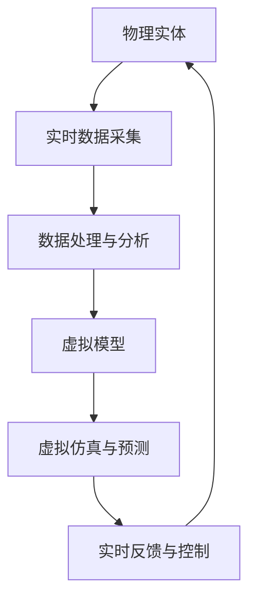

                 

# 元宇宙中的数字孪生：现实世界的完美映射

> 关键词：数字孪生、元宇宙、现实映射、人工智能、物联网、虚拟现实、增强现实

> 摘要：本文旨在深入探讨数字孪生技术在元宇宙中的应用，通过逐步分析其核心概念、原理、算法、数学模型、实际案例以及应用场景，揭示数字孪生如何成为现实世界与虚拟世界的桥梁。我们将从技术层面解析数字孪生的构建过程，探讨其在工业、医疗、城市规划等领域的实际应用，并展望其未来的发展趋势与挑战。

## 1. 背景介绍

### 1.1 元宇宙的定义与特点
元宇宙（Metaverse）是一个虚拟与现实交织的数字世界，它通过互联网、物联网、虚拟现实（VR）、增强现实（AR）等技术手段，将物理世界与数字世界无缝连接。元宇宙的核心特点是高度沉浸感、实时交互性和持续性，用户可以在其中进行工作、娱乐、社交等活动。

### 1.2 数字孪生的定义与起源
数字孪生（Digital Twin）是指通过数字化手段，将物理实体的全生命周期状态映射到虚拟空间中的一个虚拟模型。这一概念最早由美国通用电气公司提出，旨在通过实时数据采集与分析，优化设备性能和维护策略。数字孪生技术的核心在于利用物联网（IoT）、大数据、人工智能（AI）等技术，实现物理实体与虚拟模型之间的实时同步与互动。

### 1.3 数字孪生与元宇宙的关系
数字孪生技术是构建元宇宙的重要基石之一。通过数字孪生，我们可以将物理世界的复杂系统映射到虚拟空间，实现对现实世界的全面感知与控制。数字孪生不仅能够提供实时的数据反馈，还能通过虚拟环境进行模拟与预测，为元宇宙中的各种应用提供强大的技术支持。

## 2. 核心概念与联系

### 2.1 数字孪生的核心概念
- **物理实体**：指现实世界中的物理对象或系统，如机械设备、建筑物、城市基础设施等。
- **虚拟模型**：指在数字空间中对物理实体进行精确建模的虚拟对象，包括几何形状、物理属性、行为模型等。
- **实时数据采集**：通过传感器、物联网设备等手段，实时获取物理实体的状态数据。
- **数据处理与分析**：利用大数据、机器学习等技术对采集到的数据进行处理与分析，提取有价值的信息。
- **虚拟仿真与预测**：基于虚拟模型和数据处理结果，进行仿真与预测，优化物理实体的性能。

### 2.2 数字孪生的架构


### 2.3 数字孪生与元宇宙的关系
- **数据层**：数字孪生通过实时数据采集与处理，为元宇宙提供丰富的数据支持。
- **模型层**：数字孪生的虚拟模型为元宇宙中的虚拟对象提供精确的物理属性和行为模型。
- **交互层**：数字孪生通过实时反馈与控制，实现物理实体与虚拟环境之间的互动。

## 3. 核心算法原理 & 具体操作步骤

### 3.1 数据采集算法
- **传感器网络**：通过部署传感器网络，实时采集物理实体的各种状态数据，如温度、湿度、压力等。
- **数据预处理**：对采集到的数据进行清洗、去噪、归一化等预处理操作，提高数据质量。

### 3.2 数据处理与分析算法
- **特征提取**：利用特征提取算法，从原始数据中提取关键特征，如振动频率、温度变化趋势等。
- **异常检测**：通过异常检测算法，识别数据中的异常值，及时发现潜在问题。
- **预测模型**：利用机器学习算法，建立预测模型，预测物理实体的未来状态。

### 3.3 虚拟模型构建算法
- **几何建模**：利用三维建模技术，构建物理实体的几何模型。
- **物理建模**：基于物理原理，构建物理模型，包括力学、热力学等。
- **行为建模**：通过行为建模技术，模拟物理实体的行为模式，如设备运行状态、环境响应等。

### 3.4 虚拟仿真与预测算法
- **仿真引擎**：利用仿真引擎，模拟物理实体在不同条件下的行为，进行虚拟仿真。
- **预测算法**：通过预测算法，基于历史数据和当前状态，预测物理实体的未来状态。

## 4. 数学模型和公式 & 详细讲解 & 举例说明

### 4.1 数据预处理
- **数据清洗**：通过数据清洗算法，去除无效数据和噪声数据。
  $$ \text{清洗后的数据} = \text{原始数据} - \text{无效数据} - \text{噪声数据} $$

- **数据归一化**：通过归一化算法，将数据缩放到指定范围。
  $$ \text{归一化后的数据} = \frac{\text{原始数据} - \text{最小值}}{\text{最大值} - \text{最小值}} $$

### 4.2 异常检测
- **统计异常检测**：通过统计方法，检测数据中的异常值。
  $$ \text{异常值} = \text{数据} \pm 3 \times \text{标准差} $$

- **机器学习异常检测**：通过机器学习算法，识别数据中的异常模式。
  $$ \text{异常概率} = \text{模型}(\text{数据}) $$

### 4.3 物理建模
- **热力学模型**：基于热力学原理，构建物理模型。
  $$ \text{温度变化} = \text{初始温度} + \text{热源强度} \times \text{时间} $$

- **力学模型**：基于力学原理，构建物理模型。
  $$ \text{位移} = \text{初始位移} + \text{加速度} \times \text{时间} $$

### 4.4 预测模型
- **线性回归模型**：通过线性回归算法，预测物理实体的未来状态。
  $$ \text{预测值} = \text{斜率} \times \text{时间} + \text{截距} $$

- **时间序列预测模型**：通过时间序列预测算法，预测物理实体的未来状态。
  $$ \text{预测值} = \text{模型}(\text{历史数据}) $$

## 5. 项目实战：代码实际案例和详细解释说明

### 5.1 开发环境搭建
- **操作系统**：Windows 10/Ubuntu 20.04
- **编程语言**：Python 3.8
- **开发工具**：Visual Studio Code
- **依赖库**：numpy, pandas, scikit-learn, matplotlib

### 5.2 源代码详细实现和代码解读
```python
# 导入所需库
import numpy as np
import pandas as pd
from sklearn.preprocessing import StandardScaler
from sklearn.linear_model import LinearRegression
import matplotlib.pyplot as plt

# 读取数据
data = pd.read_csv('sensor_data.csv')

# 数据预处理
scaler = StandardScaler()
data_scaled = scaler.fit_transform(data)

# 特征提取
X = data_scaled[:, :-1]
y = data_scaled[:, -1]

# 数据划分
from sklearn.model_selection import train_test_split
X_train, X_test, y_train, y_test = train_test_split(X, y, test_size=0.2, random_state=42)

# 训练模型
model = LinearRegression()
model.fit(X_train, y_train)

# 预测
y_pred = model.predict(X_test)

# 评估模型
from sklearn.metrics import mean_squared_error
mse = mean_squared_error(y_test, y_pred)
print(f'Mean Squared Error: {mse}')

# 可视化结果
plt.scatter(y_test, y_pred)
plt.xlabel('真实值')
plt.ylabel('预测值')
plt.title('真实值与预测值对比')
plt.show()
```

### 5.3 代码解读与分析
- **数据预处理**：使用 `StandardScaler` 对数据进行标准化处理，确保数据在相同的尺度上。
- **特征提取**：将数据分为特征 `X` 和目标变量 `y`。
- **数据划分**：使用 `train_test_split` 将数据划分为训练集和测试集。
- **模型训练**：使用 `LinearRegression` 训练线性回归模型。
- **模型预测**：使用训练好的模型对测试集进行预测。
- **模型评估**：使用 `mean_squared_error` 计算预测值与真实值之间的均方误差。
- **结果可视化**：通过散点图展示真实值与预测值的对比。

## 6. 实际应用场景

### 6.1 工业制造
- **设备维护**：通过数字孪生技术，实时监测设备状态，预测设备故障，提前进行维护。
- **生产优化**：通过虚拟仿真，优化生产流程，提高生产效率。

### 6.2 医疗健康
- **患者监测**：通过数字孪生技术，实时监测患者的生命体征，预测病情变化。
- **手术模拟**：通过虚拟仿真，进行手术模拟，提高手术成功率。

### 6.3 城市规划
- **交通管理**：通过数字孪生技术，实时监测交通流量，优化交通信号控制。
- **环境监测**：通过数字孪生技术，实时监测空气质量、水质等环境参数，进行环境管理。

## 7. 工具和资源推荐

### 7.1 学习资源推荐
- **书籍**：《数字孪生技术及其应用》、《物联网与大数据》
- **论文**：《数字孪生在工业制造中的应用》、《基于数字孪生的医疗健康监测系统》
- **博客**：《数字孪生技术详解》、《数字孪生在城市规划中的应用》
- **网站**：IEEE Xplore、Google Scholar

### 7.2 开发工具框架推荐
- **开发工具**：Visual Studio Code、PyCharm
- **框架**：TensorFlow、PyTorch

### 7.3 相关论文著作推荐
- **论文**：《数字孪生技术在智能制造中的应用研究》、《基于数字孪生的智能医疗系统设计与实现》
- **著作**：《数字孪生技术及其应用》、《物联网与大数据》

## 8. 总结：未来发展趋势与挑战

### 8.1 未来发展趋势
- **技术融合**：数字孪生技术将与5G、边缘计算、区块链等技术深度融合，实现更高效的数据处理与传输。
- **应用场景拓展**：数字孪生技术将在更多领域得到应用，如农业、能源、教育等。
- **智能化程度提升**：通过人工智能技术，数字孪生将实现更高级的智能化，提供更精准的预测与决策支持。

### 8.2 面临的挑战
- **数据安全**：如何确保数据的安全与隐私，防止数据泄露。
- **技术复杂性**：数字孪生技术涉及多个领域的知识，技术复杂性较高。
- **标准化问题**：缺乏统一的标准，导致不同系统之间的兼容性问题。

## 9. 附录：常见问题与解答

### 9.1 问题：数字孪生与虚拟现实的区别是什么？
- **解答**：数字孪生侧重于物理实体的实时数据采集与分析，而虚拟现实侧重于创建沉浸式的虚拟环境。数字孪生可以为虚拟现实提供数据支持，但两者在应用场景和目标上有所不同。

### 9.2 问题：数字孪生技术在医疗健康领域的应用有哪些？
- **解答**：数字孪生技术可以用于患者监测、手术模拟、药物研发等方面，通过实时数据采集与分析，提高医疗服务的质量与效率。

### 9.3 问题：数字孪生技术在工业制造中的应用有哪些？
- **解答**：数字孪生技术可以用于设备维护、生产优化、质量控制等方面，通过实时数据采集与分析，提高生产效率与产品质量。

## 10. 扩展阅读 & 参考资料

- **书籍**：《数字孪生技术及其应用》、《物联网与大数据》
- **论文**：《数字孪生在工业制造中的应用》、《基于数字孪生的医疗健康监测系统》
- **博客**：《数字孪生技术详解》、《数字孪生在城市规划中的应用》
- **网站**：IEEE Xplore、Google Scholar

---

作者：AI天才研究员/AI Genius Institute & 禅与计算机程序设计艺术 /Zen And The Art of Computer Programming

