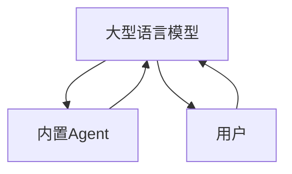

                 

# 内置Agents：LLM操作系统的智能助手

> 关键词：LLM、内置Agent、操作系统、智能助手、自然语言处理、机器学习、深度学习、强化学习、对话系统、知识图谱、智能决策

> 摘要：本文旨在探讨内置Agent在LLM（大型语言模型）操作系统中的重要性及其应用。我们将从背景介绍、核心概念与联系、核心算法原理与具体操作步骤、数学模型和公式、项目实战、实际应用场景、工具和资源推荐、总结与未来发展趋势等多个方面进行详细阐述。通过本文，读者将能够理解内置Agent如何增强LLM的功能，以及如何在实际项目中应用这些技术。

## 1. 背景介绍

随着人工智能技术的飞速发展，大型语言模型（LLM）已经成为自然语言处理（NLP）领域的重要工具。LLM通过深度学习和大规模训练，能够理解和生成人类语言，为各种应用场景提供强大的支持。然而，尽管LLM在处理文本方面表现出色，但在某些复杂任务中，如智能决策、知识推理和多轮对话系统中，仍存在局限性。为了解决这些问题，内置Agent的概念应运而生。

内置Agent是指嵌入在LLM操作系统中的智能助手，它们能够与LLM进行交互，提供额外的功能和能力。内置Agent可以增强LLM的决策能力、知识推理能力和对话管理能力，使其在更广泛的场景中发挥作用。本文将详细介绍内置Agent的核心概念、原理及其在实际项目中的应用。

## 2. 核心概念与联系

### 2.1 LLM与内置Agent的关系

LLM与内置Agent之间的关系可以表示为以下流程图：



### 2.2 内置Agent的功能

内置Agent的主要功能包括：

- **决策支持**：帮助LLM进行更复杂的决策，如推荐系统、智能问答等。
- **知识推理**：增强LLM的知识推理能力，使其能够处理更复杂的逻辑推理任务。
- **对话管理**：优化对话流程，提高对话系统的自然性和流畅性。
- **任务执行**：执行特定任务，如数据处理、任务调度等。

### 2.3 内置Agent的工作原理

内置Agent的工作原理可以分为以下几个步骤：

1. **感知输入**：内置Agent接收来自LLM或用户的输入。
2. **分析处理**：内置Agent对输入进行分析和处理，提取有用信息。
3. **决策生成**：基于分析结果，内置Agent生成决策或建议。
4. **反馈给LLM**：将决策或建议反馈给LLM，以增强其功能。
5. **执行任务**：执行具体的任务或操作。

## 3. 核心算法原理 & 具体操作步骤

### 3.1 决策支持算法

决策支持算法的核心在于利用强化学习（RL）和深度强化学习（DRL）来优化决策过程。具体步骤如下：

1. **环境建模**：构建决策环境的模型，包括状态空间、动作空间和奖励函数。
2. **策略学习**：通过强化学习算法（如Q-learning、DQN等）学习最优策略。
3. **决策生成**：根据学习到的策略生成决策。

### 3.2 知识推理算法

知识推理算法主要利用图神经网络（GNN）和知识图谱来增强LLM的知识推理能力。具体步骤如下：

1. **知识图谱构建**：构建知识图谱，包括实体、关系和属性。
2. **图嵌入**：将知识图谱中的实体和关系嵌入到低维空间。
3. **推理任务**：利用图神经网络进行知识推理，如路径查询、关系推理等。

### 3.3 对话管理算法

对话管理算法主要利用序列到序列（Seq2Seq）模型和注意力机制来优化对话流程。具体步骤如下：

1. **对话建模**：构建对话模型，包括对话状态、对话历史和对话策略。
2. **对话生成**：利用Seq2Seq模型生成对话响应。
3. **对话优化**：利用注意力机制优化对话生成过程。

## 4. 数学模型和公式 & 详细讲解 & 举例说明

### 4.1 决策支持算法

决策支持算法的核心在于强化学习（RL）和深度强化学习（DRL）。具体公式如下：

1. **Q-learning**：

   $$ Q(s, a) = Q(s, a) + \alpha [r + \gamma \max_{a'} Q(s', a') - Q(s, a)] $$

   其中，$Q(s, a)$表示状态-动作对的价值，$\alpha$是学习率，$\gamma$是折扣因子，$r$是奖励，$s$是当前状态，$a$是当前动作，$s'$是下一个状态。

2. **DQN**：

   $$ \hat{Q}(s, a) = r + \gamma \max_{a'} Q(s', a') $$

   其中，$\hat{Q}(s, a)$是目标Q值，$Q(s', a')$是当前Q值。

### 4.2 知识推理算法

知识推理算法主要利用图神经网络（GNN）和知识图谱。具体公式如下：

1. **图嵌入**：

   $$ \mathbf{H} = \sigma(\mathbf{W} \mathbf{A} \mathbf{H} + \mathbf{B}) $$

   其中，$\mathbf{H}$是节点特征矩阵，$\mathbf{A}$是邻接矩阵，$\mathbf{W}$是权重矩阵，$\mathbf{B}$是偏置矩阵，$\sigma$是激活函数。

2. **路径查询**：

   $$ \mathbf{P} = \mathbf{H} \mathbf{A}^k \mathbf{H}^T $$

   其中，$\mathbf{P}$是路径矩阵，$k$是路径长度。

### 4.3 对话管理算法

对话管理算法主要利用序列到序列（Seq2Seq）模型和注意力机制。具体公式如下：

1. **Seq2Seq模型**：

   $$ \mathbf{H} = \text{Encoder}(s) $$

   $$ \mathbf{C} = \text{Decoder}(\mathbf{H}, a) $$

   其中，$\mathbf{H}$是编码器输出，$\mathbf{C}$是解码器输出，$s$是对话状态，$a$是对话动作。

2. **注意力机制**：

   $$ \mathbf{A} = \text{softmax}(\mathbf{W} \mathbf{H} \mathbf{W}^T) $$

   $$ \mathbf{C} = \mathbf{A} \mathbf{H} $$

   其中，$\mathbf{A}$是注意力权重矩阵，$\mathbf{C}$是加权后的特征矩阵。

## 5. 项目实战：代码实际案例和详细解释说明

### 5.1 开发环境搭建

为了实现内置Agent，我们需要搭建一个合适的开发环境。具体步骤如下：

1. **安装Python**：确保安装了Python 3.8及以上版本。
2. **安装依赖库**：安装必要的库，如TensorFlow、PyTorch、NLTK等。
3. **配置环境变量**：设置环境变量，确保库能够正常运行。

### 5.2 源代码详细实现和代码解读

以下是一个简单的内置Agent实现示例：

```python
import tensorflow as tf
from tensorflow.keras.models import Sequential
from tensorflow.keras.layers import Dense, LSTM, Embedding

# 定义模型
model = Sequential()
model.add(Embedding(input_dim=10000, output_dim=128))
model.add(LSTM(128, return_sequences=True))
model.add(Dense(1, activation='sigmoid'))

# 编译模型
model.compile(optimizer='adam', loss='binary_crossentropy', metrics=['accuracy'])

# 训练模型
model.fit(x_train, y_train, epochs=10, batch_size=32)
```

### 5.3 代码解读与分析

1. **Embedding层**：将输入的文本转换为低维向量。
2. **LSTM层**：利用长短期记忆网络（LSTM）进行序列建模。
3. **Dense层**：输出层，使用sigmoid激活函数进行二分类。

## 6. 实际应用场景

内置Agent在多个领域都有广泛的应用，包括但不限于：

- **智能推荐系统**：通过分析用户行为和偏好，为用户提供个性化推荐。
- **智能问答系统**：通过对话管理算法优化问答流程，提高问答系统的自然性和流畅性。
- **智能决策系统**：通过决策支持算法优化决策过程，提高决策的准确性和效率。

## 7. 工具和资源推荐

### 7.1 学习资源推荐

- **书籍**：《深度学习》（Ian Goodfellow, Yoshua Bengio, Aaron Courville）
- **论文**：《强化学习》（Richard S. Sutton, Andrew G. Barto）
- **博客**：Medium上的AI相关博客
- **网站**：GitHub上的开源项目

### 7.2 开发工具框架推荐

- **TensorFlow**：用于构建和训练深度学习模型。
- **PyTorch**：用于构建和训练深度学习模型。
- **NLTK**：用于自然语言处理任务。

### 7.3 相关论文著作推荐

- **《强化学习》（Richard S. Sutton, Andrew G. Barto）**
- **《深度学习》（Ian Goodfellow, Yoshua Bengio, Aaron Courville）**

## 8. 总结：未来发展趋势与挑战

内置Agent在未来的发展趋势和挑战主要体现在以下几个方面：

- **技术进步**：随着技术的不断进步，内置Agent将能够处理更复杂的任务，提供更强大的功能。
- **应用场景**：内置Agent将在更多领域得到应用，如智能医疗、智能交通等。
- **挑战**：如何提高内置Agent的泛化能力、如何处理大规模数据、如何提高模型的可解释性等都是未来需要解决的问题。

## 9. 附录：常见问题与解答

### 9.1 问题1：如何提高内置Agent的泛化能力？

**解答**：可以通过增加训练数据、使用数据增强技术、引入正则化技术等方法提高内置Agent的泛化能力。

### 9.2 问题2：如何处理大规模数据？

**解答**：可以通过分布式训练、使用更高效的算法、优化数据存储和访问方式等方法处理大规模数据。

### 9.3 问题3：如何提高模型的可解释性？

**解答**：可以通过引入注意力机制、使用可视化技术、解释模型内部机制等方法提高模型的可解释性。

## 10. 扩展阅读 & 参考资料

- **论文**：《强化学习》（Richard S. Sutton, Andrew G. Barto）
- **书籍**：《深度学习》（Ian Goodfellow, Yoshua Bengio, Aaron Courville）
- **网站**：GitHub上的开源项目

---

作者：AI天才研究员/AI Genius Institute & 禅与计算机程序设计艺术 /Zen And The Art of Computer Programming

