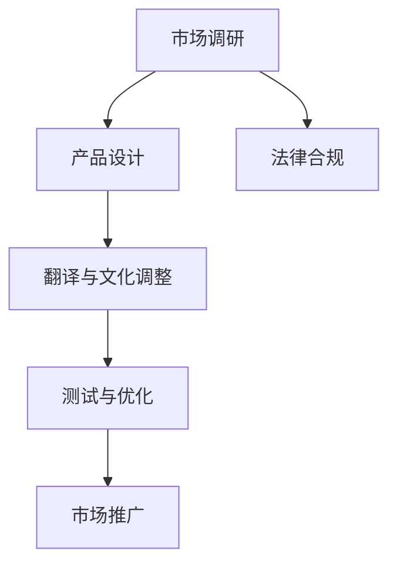

                 

# 出海创业指南：如何本地化产品和营销策略

> 关键词：出海创业、本地化、产品策略、营销策略、文化差异、市场调研、用户需求、技术实现

> 摘要：在全球化的今天，出海创业已成为许多企业的战略选择。然而，如何在不同文化背景下本地化产品和营销策略，以满足当地用户的需求，是成功的关键。本文将通过逐步分析和推理，探讨如何进行有效的本地化策略，包括产品设计、市场调研、用户需求分析、技术实现等方面，帮助创业者在全球市场中取得成功。

## 1. 背景介绍

在全球化的背景下，越来越多的企业选择出海创业，以扩大市场范围和提升品牌影响力。然而，不同国家和地区有着不同的文化背景、消费习惯和法律法规，这给产品和营销策略的本地化带来了挑战。本地化不仅仅是语言和文化上的调整，更涉及到产品功能、用户体验、市场推广等多个方面。因此，如何有效地进行本地化，是出海创业成功的关键。

## 2. 核心概念与联系

### 2.1 本地化定义

本地化是指将产品或服务适应特定地区的文化、语言、法律和市场环境的过程。它包括但不限于翻译、文化调整、功能优化和市场推广策略的调整。

### 2.2 本地化的重要性

- **文化适应**：了解并适应当地的文化习惯，有助于提高产品的接受度和用户满意度。
- **法律合规**：遵守当地的法律法规，避免法律风险。
- **市场适应**：根据当地市场的特点和需求，调整产品功能和营销策略，提高市场竞争力。

### 2.3 本地化流程

本地化流程通常包括以下几个步骤：

1. **市场调研**：了解目标市场的文化、语言、法律法规和用户需求。
2. **产品设计**：根据调研结果调整产品功能和界面设计。
3. **翻译与文化调整**：将产品内容翻译成目标语言，并进行文化调整。
4. **测试与优化**：进行本地化测试，确保产品在目标市场的功能和用户体验。
5. **市场推广**：制定符合当地市场的营销策略。

### 2.4 Mermaid 流程图



## 3. 核心算法原理 & 具体操作步骤

### 3.1 市场调研

市场调研是本地化过程中的关键步骤，主要包括以下几个方面：

1. **文化调研**：了解目标市场的文化背景、习俗和价值观。
2. **语言调研**：了解目标市场的语言习惯和常用词汇。
3. **法律法规调研**：了解目标市场的法律法规，确保产品合规。
4. **用户需求调研**：通过问卷调查、访谈等方式了解目标市场的用户需求。

### 3.2 产品设计

根据市场调研结果，调整产品功能和界面设计，确保产品能够满足当地用户的需求。

1. **功能调整**：根据用户需求调整产品功能，例如增加本地化的支付方式、支持当地语言等。
2. **界面设计**：调整界面设计，使其符合当地用户的审美习惯和使用习惯。
3. **用户体验优化**：优化用户体验，例如调整操作流程、增加本地化提示等。

### 3.3 翻译与文化调整

将产品内容翻译成目标语言，并进行文化调整，确保内容的准确性和文化适应性。

1. **翻译**：选择专业的翻译团队，确保翻译的准确性和流畅性。
2. **文化调整**：根据目标市场的文化习惯，调整翻译内容，使其更加符合当地用户的习惯。
3. **多语言支持**：确保产品支持多种语言，提供良好的用户体验。

### 3.4 测试与优化

进行本地化测试，确保产品在目标市场的功能和用户体验。

1. **功能测试**：确保产品功能在目标市场的正常运行。
2. **用户体验测试**：通过用户测试，收集反馈，优化用户体验。
3. **性能测试**：确保产品在目标市场的性能表现良好。

### 3.5 市场推广

制定符合当地市场的营销策略，提高产品的市场竞争力。

1. **营销渠道选择**：选择适合目标市场的营销渠道，例如社交媒体、本地广告等。
2. **营销内容调整**：根据目标市场的文化习惯，调整营销内容，使其更加吸引当地用户。
3. **市场活动策划**：策划符合当地市场的市场活动，提高品牌知名度和用户参与度。

## 4. 数学模型和公式 & 详细讲解 & 举例说明

### 4.1 市场调研模型

市场调研模型可以使用以下公式来表示：

$$
\text{市场调研} = \text{文化调研} + \text{语言调研} + \text{法律法规调研} + \text{用户需求调研}
$$

### 4.2 产品设计模型

产品设计模型可以使用以下公式来表示：

$$
\text{产品设计} = \text{功能调整} + \text{界面设计} + \text{用户体验优化}
$$

### 4.3 翻译与文化调整模型

翻译与文化调整模型可以使用以下公式来表示：

$$
\text{翻译与文化调整} = \text{翻译} + \text{文化调整} + \text{多语言支持}
$$

### 4.4 测试与优化模型

测试与优化模型可以使用以下公式来表示：

$$
\text{测试与优化} = \text{功能测试} + \text{用户体验测试} + \text{性能测试}
$$

### 4.5 市场推广模型

市场推广模型可以使用以下公式来表示：

$$
\text{市场推广} = \text{营销渠道选择} + \text{营销内容调整} + \text{市场活动策划}
$$

## 5. 项目实战：代码实际案例和详细解释说明

### 5.1 开发环境搭建

#### 5.1.1 环境准备

1. **操作系统**：选择适合目标市场的操作系统，例如Windows、Linux等。
2. **开发工具**：选择适合目标市场的开发工具，例如Visual Studio、Eclipse等。
3. **编程语言**：选择适合目标市场的编程语言，例如Java、Python等。

#### 5.1.2 代码示例

```python
# 示例代码：本地化翻译
import gettext

# 设置语言环境
language = 'zh_CN'
gettext.bindtextdomain('messages', '/path/to/locale')
gettext.textdomain('messages')
_ = gettext.gettext

# 翻译文本
print(_('Hello, World!'))
```

### 5.2 源代码详细实现和代码解读

#### 5.2.1 代码实现

```python
# 示例代码：本地化翻译
import gettext

# 设置语言环境
language = 'zh_CN'
gettext.bindtextdomain('messages', '/path/to/locale')
gettext.textdomain('messages')
_ = gettext.gettext

# 翻译文本
print(_('Hello, World!'))
```

#### 5.2.2 代码解读

1. **导入 gettext 模块**：`import gettext`
2. **设置语言环境**：`language = 'zh_CN'`，设置目标语言为中文。
3. **绑定文本域**：`gettext.bindtextdomain('messages', '/path/to/locale')`，绑定文本域到指定的目录。
4. **设置文本域**：`gettext.textdomain('messages')`，设置文本域。
5. **获取翻译文本**：`_ = gettext.gettext`，获取翻译文本。
6. **打印翻译文本**：`print(_('Hello, World!'))`，打印翻译后的文本。

### 5.3 代码解读与分析

通过上述代码示例，我们可以看到如何使用 Python 的 `gettext` 模块进行本地化翻译。`gettext` 模块提供了丰富的功能，可以方便地进行多语言支持和文化调整。通过设置语言环境、绑定文本域和获取翻译文本，我们可以实现产品的本地化翻译。

## 6. 实际应用场景

### 6.1 产品本地化案例

#### 6.1.1 产品案例：TikTok

TikTok 是一款全球流行的短视频应用，其成功离不开有效的本地化策略。TikTok 在进入不同市场时，会根据当地的文化习惯和用户需求进行产品调整，例如增加本地化的支付方式、支持当地语言等。此外，TikTok 还会根据当地市场的特点进行市场推广，例如策划符合当地市场的市场活动，提高品牌知名度和用户参与度。

#### 6.1.2 产品案例：Netflix

Netflix 是一家全球领先的流媒体服务提供商，其成功也离不开有效的本地化策略。Netflix 在进入不同市场时，会根据当地的文化习惯和用户需求进行产品调整，例如提供本地化的节目内容、支持当地语言等。此外，Netflix 还会根据当地市场的特点进行市场推广，例如策划符合当地市场的市场活动，提高品牌知名度和用户参与度。

## 7. 工具和资源推荐

### 7.1 学习资源推荐

- **书籍**：《全球化与本地化》、《本地化策略与实践》
- **论文**：《全球化与本地化：理论与实践》、《本地化策略与市场推广》
- **博客**：《全球化与本地化》、《本地化策略与实践》
- **网站**：本地化论坛、本地化社区

### 7.2 开发工具框架推荐

- **翻译工具**：Transifex、Crowdin
- **本地化工具**：Poedit、Lokalize
- **开发工具**：Visual Studio、Eclipse

### 7.3 相关论文著作推荐

- **论文**：《全球化与本地化：理论与实践》、《本地化策略与市场推广》
- **著作**：《全球化与本地化》、《本地化策略与实践》

## 8. 总结：未来发展趋势与挑战

### 8.1 未来发展趋势

- **技术进步**：随着技术的进步，本地化将更加智能化和自动化，例如使用机器翻译和自然语言处理技术进行翻译。
- **市场变化**：随着市场的变化，本地化将更加注重用户体验和市场适应性，例如提供更加个性化的服务和更加符合当地市场的营销策略。
- **法律法规**：随着法律法规的变化，本地化将更加注重合规性，例如遵守当地的法律法规和标准。

### 8.2 挑战

- **文化差异**：文化差异是本地化过程中最大的挑战之一，需要深入了解和适应当地的文化习惯和价值观。
- **法律法规**：法律法规的变化是本地化过程中的一大挑战，需要不断更新和调整产品功能和营销策略。
- **市场变化**：市场变化是本地化过程中的一大挑战，需要不断调整产品功能和营销策略，以适应市场的变化。

## 9. 附录：常见问题与解答

### 9.1 问题：如何进行有效的市场调研？

**解答**：进行有效的市场调研，需要了解目标市场的文化、语言、法律法规和用户需求。可以通过问卷调查、访谈等方式收集数据，进行深入分析。

### 9.2 问题：如何进行有效的产品设计？

**解答**：进行有效的产品设计，需要根据市场调研结果调整产品功能和界面设计，确保产品能够满足当地用户的需求。可以通过用户测试，收集反馈，优化用户体验。

### 9.3 问题：如何进行有效的翻译与文化调整？

**解答**：进行有效的翻译与文化调整，需要选择专业的翻译团队，确保翻译的准确性和流畅性。根据目标市场的文化习惯，调整翻译内容，使其更加符合当地用户的习惯。

### 9.4 问题：如何进行有效的测试与优化？

**解答**：进行有效的测试与优化，需要进行功能测试、用户体验测试和性能测试，确保产品在目标市场的功能和用户体验。

### 9.5 问题：如何进行有效的市场推广？

**解答**：进行有效的市场推广，需要选择适合目标市场的营销渠道，例如社交媒体、本地广告等。根据目标市场的文化习惯，调整营销内容，使其更加吸引当地用户。策划符合当地市场的市场活动，提高品牌知名度和用户参与度。

## 10. 扩展阅读 & 参考资料

- **书籍**：《全球化与本地化》、《本地化策略与实践》
- **论文**：《全球化与本地化：理论与实践》、《本地化策略与市场推广》
- **博客**：《全球化与本地化》、《本地化策略与实践》
- **网站**：本地化论坛、本地化社区

---

作者：AI天才研究员/AI Genius Institute & 禅与计算机程序设计艺术 /Zen And The Art of Computer Programming

