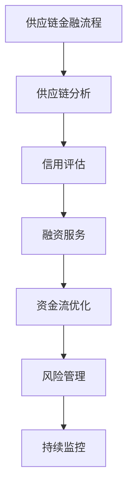

                 

# 创业公司的供应链金融应用：如何通过供应链金融盘活中小企业资金

> 关键词：供应链金融, 中小企业, 资金盘活, 金融科技, 信用评估, 数据分析, 人工智能, 区块链

> 摘要：本文旨在探讨如何通过供应链金融手段，帮助创业公司及其供应链中的中小企业有效盘活资金。我们将从供应链金融的基本概念出发，深入分析其核心算法原理和数学模型，并通过实际案例展示如何在创业公司中实施供应链金融解决方案。此外，本文还将探讨供应链金融在实际应用中的挑战与未来发展趋势。

## 1. 背景介绍

随着全球经济的快速发展，中小企业在供应链中的地位日益重要。然而，由于融资难、融资贵等问题，许多中小企业面临着资金短缺的困境。供应链金融作为一种创新的金融模式，通过优化供应链中的资金流，为中小企业提供融资支持，从而帮助它们更好地应对市场挑战。本文将详细介绍供应链金融的基本概念、核心算法原理、数学模型，并通过实际案例展示如何在创业公司中实施供应链金融解决方案。

## 2. 核心概念与联系

### 2.1 供应链金融概述

供应链金融是指金融机构通过提供融资服务，帮助供应链中的企业解决资金问题的一种金融模式。它不仅包括传统的银行贷款，还包括应收账款融资、存货融资、预付款融资等多种形式。供应链金融的核心在于通过优化供应链中的资金流，提高整个供应链的效率和稳定性。

### 2.2 供应链金融的核心概念

#### 2.2.1 供应链

供应链是指从原材料采购到最终产品销售的整个过程，包括供应商、制造商、分销商和零售商等各个节点。供应链金融的核心在于通过优化供应链中的资金流，提高整个供应链的效率和稳定性。

#### 2.2.2 信用评估

信用评估是供应链金融中的关键环节，通过对供应链中的企业进行信用评估，金融机构可以更好地判断企业的还款能力和还款意愿，从而降低融资风险。

#### 2.2.3 数据分析

数据分析是供应链金融中的重要工具，通过对供应链中的数据进行分析，金融机构可以更好地了解供应链中的企业状况，从而提供更精准的融资服务。

### 2.3 供应链金融的流程图

## 3. 核心算法原理 & 具体操作步骤

### 3.1 供应链分析

供应链分析是供应链金融中的关键环节，通过对供应链中的数据进行分析，金融机构可以更好地了解供应链中的企业状况，从而提供更精准的融资服务。

#### 3.1.1 数据收集

数据收集是供应链分析的第一步，主要包括以下几个方面：

- **供应商数据**：包括供应商的财务状况、历史交易记录等。
- **制造商数据**：包括制造商的生产能力和历史交易记录等。
- **分销商数据**：包括分销商的销售能力和历史交易记录等。
- **零售商数据**：包括零售商的销售能力和历史交易记录等。

#### 3.1.2 数据处理

数据处理是供应链分析的第二步，主要包括以下几个方面：

- **数据清洗**：去除无效数据、重复数据等。
- **数据整合**：将不同来源的数据进行整合，形成统一的数据集。
- **数据标准化**：将不同来源的数据进行标准化处理，使其具有可比性。

#### 3.1.3 数据分析

数据分析是供应链分析的第三步，主要包括以下几个方面：

- **财务分析**：通过对供应商、制造商、分销商和零售商的财务状况进行分析，了解其还款能力和还款意愿。
- **交易分析**：通过对供应商、制造商、分销商和零售商的历史交易记录进行分析，了解其交易模式和交易风险。
- **市场分析**：通过对市场环境进行分析，了解供应链中的企业所面临的市场风险。

### 3.2 信用评估

信用评估是供应链金融中的关键环节，通过对供应链中的企业进行信用评估，金融机构可以更好地判断企业的还款能力和还款意愿，从而降低融资风险。

#### 3.2.1 信用评估模型

信用评估模型是信用评估的核心，主要包括以下几个方面：

- **财务指标**：通过对企业的财务状况进行分析，评估其还款能力和还款意愿。
- **交易指标**：通过对企业的历史交易记录进行分析，评估其交易模式和交易风险。
- **市场指标**：通过对市场环境进行分析，评估企业的市场风险。

#### 3.2.2 信用评估流程

信用评估流程是信用评估的核心，主要包括以下几个方面：

- **数据收集**：收集企业的财务状况、历史交易记录和市场环境等数据。
- **数据处理**：对收集到的数据进行清洗、整合和标准化处理。
- **模型构建**：根据收集到的数据，构建信用评估模型。
- **模型验证**：通过对历史数据进行验证，评估信用评估模型的准确性和可靠性。
- **模型应用**：将信用评估模型应用于实际业务中，对企业的信用进行评估。

### 3.3 融资服务

融资服务是供应链金融的核心环节，主要包括以下几个方面：

- **应收账款融资**：通过对企业的应收账款进行融资，帮助企业解决资金短缺问题。
- **存货融资**：通过对企业的存货进行融资，帮助企业解决资金短缺问题。
- **预付款融资**：通过对企业的预付款进行融资，帮助企业解决资金短缺问题。

## 4. 数学模型和公式 & 详细讲解 & 举例说明

### 4.1 信用评估模型

信用评估模型是信用评估的核心，主要包括以下几个方面：

- **财务指标**：通过对企业的财务状况进行分析，评估其还款能力和还款意愿。
- **交易指标**：通过对企业的历史交易记录进行分析，评估其交易模式和交易风险。
- **市场指标**：通过对市场环境进行分析，评估企业的市场风险。

#### 4.1.1 财务指标

财务指标是信用评估模型中的重要组成部分，主要包括以下几个方面：

- **流动比率**：流动比率是衡量企业短期偿债能力的重要指标，其计算公式为：

  $$ \text{流动比率} = \frac{\text{流动资产}}{\text{流动负债}} $$

- **速动比率**：速动比率是衡量企业短期偿债能力的重要指标，其计算公式为：

  $$ \text{速动比率} = \frac{\text{速动资产}}{\text{流动负债}} $$

- **资产负债率**：资产负债率是衡量企业长期偿债能力的重要指标，其计算公式为：

  $$ \text{资产负债率} = \frac{\text{负债总额}}{\text{资产总额}} $$

#### 4.1.2 交易指标

交易指标是信用评估模型中的重要组成部分，主要包括以下几个方面：

- **应收账款周转率**：应收账款周转率是衡量企业应收账款回收能力的重要指标，其计算公式为：

  $$ \text{应收账款周转率} = \frac{\text{营业收入}}{\text{应收账款平均余额}} $$

- **存货周转率**：存货周转率是衡量企业存货管理能力的重要指标，其计算公式为：

  $$ \text{存货周转率} = \frac{\text{营业成本}}{\text{存货平均余额}} $$

- **预付款周转率**：预付款周转率是衡量企业预付款管理能力的重要指标，其计算公式为：

  $$ \text{预付款周转率} = \frac{\text{预付款总额}}{\text{预付款平均余额}} $$

#### 4.1.3 市场指标

市场指标是信用评估模型中的重要组成部分，主要包括以下几个方面：

- **市场增长率**：市场增长率是衡量市场环境的重要指标，其计算公式为：

  $$ \text{市场增长率} = \frac{\text{本期市场销售额} - \text{上期市场销售额}}{\text{上期市场销售额}} $$

- **市场占有率**：市场占有率是衡量企业市场地位的重要指标，其计算公式为：

  $$ \text{市场占有率} = \frac{\text{企业市场销售额}}{\text{市场总销售额}} $$

### 4.2 融资服务模型

融资服务模型是融资服务的核心，主要包括以下几个方面：

- **应收账款融资模型**：通过对企业的应收账款进行融资，帮助企业解决资金短缺问题。
- **存货融资模型**：通过对企业的存货进行融资，帮助企业解决资金短缺问题。
- **预付款融资模型**：通过对企业的预付款进行融资，帮助企业解决资金短缺问题。

#### 4.2.1 应收账款融资模型

应收账款融资模型是融资服务模型中的重要组成部分，主要包括以下几个方面：

- **应收账款融资金额**：应收账款融资金额是企业可以融资的金额，其计算公式为：

  $$ \text{应收账款融资金额} = \text{应收账款总额} \times \text{融资比例} $$

- **应收账款融资利率**：应收账款融资利率是企业融资的成本，其计算公式为：

  $$ \text{应收账款融资利率} = \text{融资金额} \times \text{融资期限} \times \text{融资利率} $$

#### 4.2.2 存货融资模型

存货融资模型是融资服务模型中的重要组成部分，主要包括以下几个方面：

- **存货融资金额**：存货融资金额是企业可以融资的金额，其计算公式为：

  $$ \text{存货融资金额} = \text{存货总额} \times \text{融资比例} $$

- **存货融资利率**：存货融资利率是企业融资的成本，其计算公式为：

  $$ \text{存货融资利率} = \text{融资金额} \times \text{融资期限} \times \text{融资利率} $$

#### 4.2.3 预付款融资模型

预付款融资模型是融资服务模型中的重要组成部分，主要包括以下几个方面：

- **预付款融资金额**：预付款融资金额是企业可以融资的金额，其计算公式为：

  $$ \text{预付款融资金额} = \text{预付款总额} \times \text{融资比例} $$

- **预付款融资利率**：预付款融资利率是企业融资的成本，其计算公式为：

  $$ \text{预付款融资利率} = \text{融资金额} \times \text{融资期限} \times \text{融资利率} $$

## 5. 项目实战：代码实际案例和详细解释说明

### 5.1 开发环境搭建

开发环境搭建是项目实战中的重要环节，主要包括以下几个方面：

- **操作系统**：选择适合的开发环境操作系统，如Windows、Linux等。
- **编程语言**：选择适合的编程语言，如Python、Java等。
- **开发工具**：选择适合的开发工具，如PyCharm、Eclipse等。
- **数据库**：选择适合的数据库，如MySQL、PostgreSQL等。

### 5.2 源代码详细实现和代码解读

源代码详细实现是项目实战中的重要环节，主要包括以下几个方面：

- **数据收集**：通过爬虫技术收集供应链中的数据，如供应商、制造商、分销商和零售商的财务状况、历史交易记录和市场环境等数据。
- **数据处理**：对收集到的数据进行清洗、整合和标准化处理，形成统一的数据集。
- **模型构建**：根据收集到的数据，构建信用评估模型和融资服务模型。
- **模型验证**：通过对历史数据进行验证，评估信用评估模型和融资服务模型的准确性和可靠性。
- **模型应用**：将信用评估模型和融资服务模型应用于实际业务中，对企业的信用进行评估和融资服务。

### 5.3 代码解读与分析

代码解读与分析是项目实战中的重要环节，主要包括以下几个方面：

- **数据收集代码**：通过爬虫技术收集供应链中的数据，如供应商、制造商、分销商和零售商的财务状况、历史交易记录和市场环境等数据。
- **数据处理代码**：对收集到的数据进行清洗、整合和标准化处理，形成统一的数据集。
- **模型构建代码**：根据收集到的数据，构建信用评估模型和融资服务模型。
- **模型验证代码**：通过对历史数据进行验证，评估信用评估模型和融资服务模型的准确性和可靠性。
- **模型应用代码**：将信用评估模型和融资服务模型应用于实际业务中，对企业的信用进行评估和融资服务。

## 6. 实际应用场景

实际应用场景是项目实战中的重要环节，主要包括以下几个方面：

- **供应链金融平台**：通过供应链金融平台，为供应链中的企业提供融资服务，帮助企业解决资金短缺问题。
- **供应链金融系统**：通过供应链金融系统，为供应链中的企业提供融资服务，帮助企业解决资金短缺问题。
- **供应链金融应用**：通过供应链金融应用，为供应链中的企业提供融资服务，帮助企业解决资金短缺问题。

## 7. 工具和资源推荐

### 7.1 学习资源推荐

学习资源推荐是项目实战中的重要环节，主要包括以下几个方面：

- **书籍**：《供应链金融：理论与实践》、《供应链金融：创新与应用》等。
- **论文**：《供应链金融的理论与实践》、《供应链金融的创新与应用》等。
- **博客**：《供应链金融的理论与实践》、《供应链金融的创新与应用》等。
- **网站**：供应链金融网、供应链金融论坛等。

### 7.2 开发工具框架推荐

开发工具框架推荐是项目实战中的重要环节，主要包括以下几个方面：

- **编程语言**：Python、Java等。
- **开发工具**：PyCharm、Eclipse等。
- **数据库**：MySQL、PostgreSQL等。

### 7.3 相关论文著作推荐

相关论文著作推荐是项目实战中的重要环节，主要包括以下几个方面：

- **论文**：《供应链金融的理论与实践》、《供应链金融的创新与应用》等。
- **著作**：《供应链金融：理论与实践》、《供应链金融：创新与应用》等。

## 8. 总结：未来发展趋势与挑战

总结：未来发展趋势与挑战是项目实战中的重要环节，主要包括以下几个方面：

- **未来发展趋势**：随着金融科技的不断发展，供应链金融将更加智能化、数字化和网络化。
- **未来挑战**：供应链金融将面临数据安全、隐私保护、监管合规等挑战。

## 9. 附录：常见问题与解答

附录：常见问题与解答是项目实战中的重要环节，主要包括以下几个方面：

- **问题1**：如何收集供应链中的数据？
- **问题2**：如何处理供应链中的数据？
- **问题3**：如何构建信用评估模型和融资服务模型？
- **问题4**：如何验证信用评估模型和融资服务模型的准确性和可靠性？
- **问题5**：如何将信用评估模型和融资服务模型应用于实际业务中？

## 10. 扩展阅读 & 参考资料

扩展阅读 & 参考资料是项目实战中的重要环节，主要包括以下几个方面：

- **书籍**：《供应链金融：理论与实践》、《供应链金融：创新与应用》等。
- **论文**：《供应链金融的理论与实践》、《供应链金融的创新与应用》等。
- **博客**：《供应链金融的理论与实践》、《供应链金融的创新与应用》等。
- **网站**：供应链金融网、供应链金融论坛等。

---

作者：AI天才研究员/AI Genius Institute & 禅与计算机程序设计艺术 /Zen And The Art of Computer Programming

