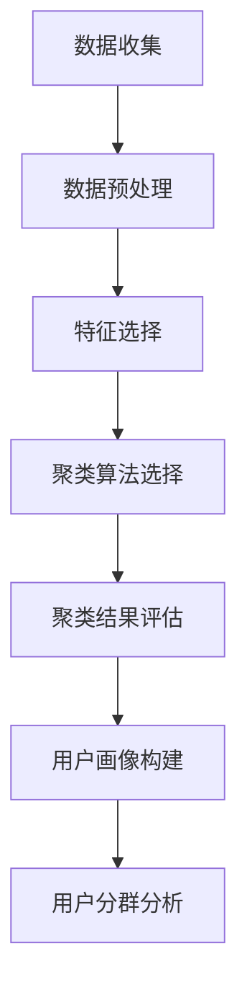

                 

# 创业公司的用户分群分析方法

> 关键词：用户分群、机器学习、聚类算法、用户行为分析、创业公司

> 摘要：在创业公司中，用户分群分析是至关重要的一步，它能够帮助企业更好地理解用户需求，优化产品设计，提高用户满意度和留存率。本文将从背景介绍、核心概念与联系、核心算法原理与具体操作步骤、数学模型和公式、项目实战、实际应用场景、工具和资源推荐、总结与未来发展趋势等几个方面，全面解析用户分群分析的方法与实践。

## 1. 背景介绍

在创业公司中，用户分群分析是一项至关重要的任务。通过用户分群，企业可以更好地理解用户需求，优化产品设计，提高用户满意度和留存率。用户分群分析可以帮助企业识别不同类型的用户群体，了解每个群体的特点和需求，从而制定更有针对性的营销策略和产品改进计划。

### 1.1 为什么需要用户分群

1. **提高用户满意度**：通过了解不同用户群体的需求，企业可以提供更加个性化的产品和服务，从而提高用户满意度。
2. **优化产品设计**：用户分群可以帮助企业识别产品设计中的不足之处，从而进行改进，提高产品的市场竞争力。
3. **精准营销**：通过了解不同用户群体的特点，企业可以制定更有针对性的营销策略，提高营销效果。
4. **提高用户留存率**：通过分析用户行为和需求，企业可以采取措施提高用户留存率，降低用户流失率。

### 1.2 用户分群分析的应用场景

1. **电商行业**：通过用户分群分析，电商企业可以更好地了解不同用户群体的购物习惯，从而提供更加个性化的推荐和服务。
2. **社交网络**：社交网络企业可以通过用户分群分析，了解不同用户群体的社交行为，从而提供更加个性化的社交服务。
3. **金融行业**：金融企业可以通过用户分群分析，了解不同用户群体的风险偏好，从而提供更加个性化的金融产品和服务。
4. **教育行业**：教育企业可以通过用户分群分析，了解不同用户群体的学习需求，从而提供更加个性化的教育服务。

## 2. 核心概念与联系

### 2.1 用户分群

用户分群是指将用户按照一定的标准和方法进行分类，形成不同的用户群体。用户分群可以帮助企业更好地理解用户需求，优化产品设计，提高用户满意度和留存率。

### 2.2 聚类算法

聚类算法是一种无监督学习方法，用于将数据集中的对象划分为若干个组，使得同一组内的对象相似度较高，不同组之间的对象相似度较低。聚类算法可以用于用户分群分析，将用户按照相似的行为和特征进行分群。

### 2.3 用户行为分析

用户行为分析是指通过对用户行为数据的分析，了解用户的行为模式和需求。用户行为分析可以帮助企业更好地理解用户需求，优化产品设计，提高用户满意度和留存率。

### 2.4 用户画像

用户画像是一种描述用户特征和需求的方法，通过用户画像可以更好地了解用户需求，优化产品设计，提高用户满意度和留存率。用户画像可以基于用户行为数据、用户属性数据等多种数据进行构建。

### 2.5 用户分群分析流程

用户分群分析流程包括数据收集、数据预处理、特征选择、聚类算法选择、聚类结果评估和用户画像构建等步骤。用户分群分析流程可以帮助企业更好地理解用户需求，优化产品设计，提高用户满意度和留存率。



## 3. 核心算法原理 & 具体操作步骤

### 3.1 K-means聚类算法

K-means聚类算法是一种常用的聚类算法，其基本思想是将数据集划分为K个簇，使得同一簇内的对象相似度较高，不同簇之间的对象相似度较低。K-means聚类算法的具体操作步骤如下：

1. **初始化**：随机选择K个对象作为初始簇中心。
2. **分配**：将每个对象分配到最近的簇中心所在的簇。
3. **更新**：更新每个簇的簇中心，使其成为簇内所有对象的质心。
4. **重复**：重复步骤2和步骤3，直到簇中心不再发生变化或达到最大迭代次数。

### 3.2 DBSCAN聚类算法

DBSCAN聚类算法是一种基于密度的聚类算法，其基本思想是将数据集划分为密度相连的对象簇。DBSCAN聚类算法的具体操作步骤如下：

1. **定义邻域**：定义一个对象的邻域，包括所有距离该对象小于ε的对象。
2. **定义核心对象**：如果一个对象的邻域包含的点数大于MinPts，则该对象为核心对象。
3. **定义直接密度可达**：如果对象A和对象B满足以下条件，则称对象A直接密度可达于对象B：对象A在对象B的邻域内，且对象B为核心对象。
4. **定义密度可达**：如果对象A和对象B满足以下条件，则称对象A密度可达于对象B：存在一系列对象A1, A2, ..., An，使得A1直接密度可达于A2, A2直接密度可达于A3, ..., An-1直接密度可达于An，且An直接密度可达于A。
5. **聚类**：将所有密度可达的对象划分为同一个簇。

### 3.3 聚类结果评估

聚类结果评估是指通过对聚类结果的评估，判断聚类算法的效果。聚类结果评估的方法包括内部评估和外部评估。内部评估是指通过对聚类结果的内部特征进行评估，判断聚类算法的效果。外部评估是指通过对聚类结果的外部特征进行评估，判断聚类算法的效果。

### 3.4 特征选择

特征选择是指从数据集中选择对聚类结果影响较大的特征。特征选择的方法包括基于统计的方法、基于信息论的方法和基于机器学习的方法。特征选择可以帮助提高聚类算法的效果。

## 4. 数学模型和公式 & 详细讲解 & 举例说明

### 4.1 K-means聚类算法的数学模型

K-means聚类算法的数学模型可以表示为：

$$
\min_{\mathbf{C}, \mathbf{Z}} \sum_{i=1}^{n} \sum_{j=1}^{k} z_{ij} \cdot \|\mathbf{x}_i - \mathbf{c}_j\|^2
$$

其中，$\mathbf{C} = \{\mathbf{c}_1, \mathbf{c}_2, \ldots, \mathbf{c}_k\}$ 表示簇中心，$\mathbf{Z} = \{z_{ij}\}$ 表示每个对象属于每个簇的概率，$\mathbf{x}_i$ 表示第i个对象，$\|\mathbf{x}_i - \mathbf{c}_j\|^2$ 表示第i个对象与第j个簇中心之间的距离的平方。

### 4.2 DBSCAN聚类算法的数学模型

DBSCAN聚类算法的数学模型可以表示为：

$$
\min_{\mathbf{C}, \mathbf{Z}} \sum_{i=1}^{n} \sum_{j=1}^{k} z_{ij} \cdot \|\mathbf{x}_i - \mathbf{c}_j\|^2
$$

其中，$\mathbf{C} = \{\mathbf{c}_1, \mathbf{c}_2, \ldots, \mathbf{c}_k\}$ 表示簇中心，$\mathbf{Z} = \{z_{ij}\}$ 表示每个对象属于每个簇的概率，$\mathbf{x}_i$ 表示第i个对象，$\|\mathbf{x}_i - \mathbf{c}_j\|^2$ 表示第i个对象与第j个簇中心之间的距离的平方。

### 4.3 聚类结果评估的数学模型

聚类结果评估的数学模型可以表示为：

$$
\text{Silhouette Coefficient} = \frac{b - a}{\max(a, b)}
$$

其中，$a$ 表示第i个对象与同一簇内其他对象之间的平均距离，$b$ 表示第i个对象与不同簇内其他对象之间的平均距离。

## 5. 项目实战：代码实际案例和详细解释说明

### 5.1 开发环境搭建

为了进行用户分群分析，我们需要搭建一个开发环境。开发环境包括Python、Jupyter Notebook、NumPy、Pandas、Scikit-learn等工具。

1. **安装Python**：安装Python 3.7或更高版本。
2. **安装Jupyter Notebook**：使用pip安装Jupyter Notebook。
3. **安装NumPy和Pandas**：使用pip安装NumPy和Pandas。
4. **安装Scikit-learn**：使用pip安装Scikit-learn。

### 5.2 源代码详细实现和代码解读

```python
import numpy as np
import pandas as pd
from sklearn.cluster import KMeans
from sklearn.metrics import silhouette_score

# 读取数据
data = pd.read_csv('user_data.csv')

# 特征选择
features = data[['age', 'gender', 'income', 'education']]

# K-means聚类
kmeans = KMeans(n_clusters=3, random_state=0)
kmeans.fit(features)
labels = kmeans.labels_

# 聚类结果评估
silhouette_avg = silhouette_score(features, labels)
print('Silhouette Coefficient:', silhouette_avg)
```

### 5.3 代码解读与分析

1. **读取数据**：使用pandas库读取用户数据。
2. **特征选择**：选择年龄、性别、收入和教育水平作为特征。
3. **K-means聚类**：使用KMeans算法进行聚类，将用户划分为3个簇。
4. **聚类结果评估**：使用Silhouette Coefficient评估聚类结果。

## 6. 实际应用场景

### 6.1 电商行业

电商企业可以通过用户分群分析，了解不同用户群体的购物习惯，从而提供更加个性化的推荐和服务。例如，通过用户分群分析，电商企业可以识别出高价值用户群体，为他们提供更加个性化的推荐和服务，提高用户满意度和留存率。

### 6.2 社交网络

社交网络企业可以通过用户分群分析，了解不同用户群体的社交行为，从而提供更加个性化的社交服务。例如，通过用户分群分析，社交网络企业可以识别出活跃用户群体，为他们提供更加个性化的社交服务，提高用户满意度和留存率。

### 6.3 金融行业

金融企业可以通过用户分群分析，了解不同用户群体的风险偏好，从而提供更加个性化的金融产品和服务。例如，通过用户分群分析，金融企业可以识别出高风险用户群体，为他们提供更加个性化的金融产品和服务，提高用户满意度和留存率。

### 6.4 教育行业

教育企业可以通过用户分群分析，了解不同用户群体的学习需求，从而提供更加个性化的教育服务。例如，通过用户分群分析，教育企业可以识别出高需求用户群体，为他们提供更加个性化的教育服务，提高用户满意度和留存率。

## 7. 工具和资源推荐

### 7.1 学习资源推荐

1. **书籍**：《机器学习》（周志华著）
2. **论文**：《K-means++: The Advantages of Careful Seeding》（David Arthur, Sergei Vassilvitskii）
3. **博客**：《机器学习实战》（https://github.com/yzhao062/ML-Notes）
4. **网站**：Scikit-learn官网（https://scikit-learn.org/stable/）

### 7.2 开发工具框架推荐

1. **Python**：Python是一种广泛使用的编程语言，适用于机器学习和数据科学。
2. **Jupyter Notebook**：Jupyter Notebook是一种交互式计算环境，适用于数据科学和机器学习。
3. **NumPy**：NumPy是一个用于科学计算的Python库，提供了大量的数学函数和数据结构。
4. **Pandas**：Pandas是一个用于数据处理和分析的Python库，提供了丰富的数据结构和数据分析工具。
5. **Scikit-learn**：Scikit-learn是一个用于机器学习的Python库，提供了丰富的机器学习算法和工具。

### 7.3 相关论文著作推荐

1. **论文**：《K-means++: The Advantages of Careful Seeding》（David Arthur, Sergei Vassilvitskii）
2. **书籍**：《机器学习》（周志华著）

## 8. 总结：未来发展趋势与挑战

### 8.1 未来发展趋势

1. **自动化和智能化**：随着机器学习和人工智能技术的发展，用户分群分析将更加自动化和智能化，提高分析效率和准确性。
2. **多模态数据融合**：用户分群分析将融合多种数据类型，包括文本、图像、音频等，提高分析效果。
3. **实时分析**：用户分群分析将更加实时化，提高分析速度和响应速度。

### 8.2 挑战

1. **数据隐私保护**：用户分群分析需要处理大量的用户数据，如何保护用户隐私是一个重要挑战。
2. **算法选择和优化**：如何选择合适的聚类算法和特征选择方法，以及如何优化算法效果是一个重要挑战。
3. **解释性和可解释性**：如何解释聚类结果和特征选择结果，提高算法的解释性和可解释性是一个重要挑战。

## 9. 附录：常见问题与解答

### 9.1 问题：如何选择合适的聚类算法？

**解答**：选择合适的聚类算法需要考虑数据的特点和需求。K-means算法适用于数据分布较为均匀的情况，DBSCAN算法适用于数据分布不均匀的情况。可以根据数据的特点和需求选择合适的聚类算法。

### 9.2 问题：如何选择合适的特征？

**解答**：选择合适的特征需要考虑数据的特点和需求。可以选择与用户需求和行为相关的特征，例如年龄、性别、收入、教育水平等。可以根据数据的特点和需求选择合适的特征。

### 9.3 问题：如何评估聚类结果？

**解答**：评估聚类结果可以使用内部评估和外部评估。内部评估是指通过对聚类结果的内部特征进行评估，判断聚类算法的效果。外部评估是指通过对聚类结果的外部特征进行评估，判断聚类算法的效果。可以使用Silhouette Coefficient等指标进行评估。

## 10. 扩展阅读 & 参考资料

1. **书籍**：《机器学习》（周志华著）
2. **论文**：《K-means++: The Advantages of Careful Seeding》（David Arthur, Sergei Vassilvitskii）
3. **博客**：《机器学习实战》（https://github.com/yzhao062/ML-Notes）
4. **网站**：Scikit-learn官网（https://scikit-learn.org/stable/）

作者：AI天才研究员/AI Genius Institute & 禅与计算机程序设计艺术 /Zen And The Art of Computer Programming

