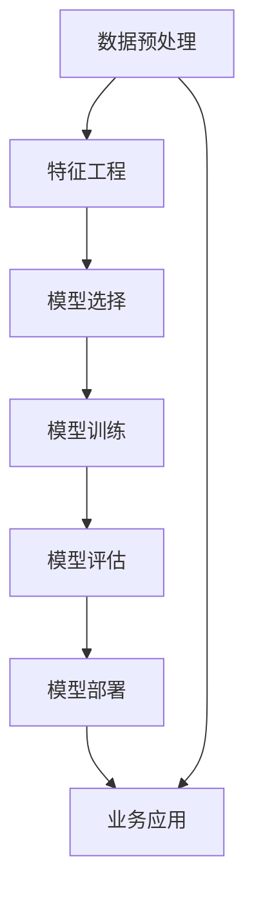

                 

# 创业公司的预测性分析应用

> 关键词：预测性分析, 创业公司, 数据科学, 机器学习, 商业决策, 风险管理, 客户行为预测

> 摘要：本文旨在探讨如何利用预测性分析技术帮助创业公司做出更明智的商业决策。通过深入分析预测性分析的核心概念、算法原理、数学模型以及实际应用案例，本文将为创业公司提供一套系统的方法论，帮助其在激烈的市场竞争中脱颖而出。预测性分析不仅能够帮助企业优化资源分配，还能有效降低风险，提高客户满意度。本文将从理论到实践，全面解析预测性分析的应用价值。

## 1. 背景介绍

在当今快速变化的商业环境中，创业公司面临着前所未有的挑战。为了在竞争中取得优势，创业公司需要具备敏锐的市场洞察力和高效的决策能力。预测性分析作为一种先进的数据分析技术，能够帮助企业从海量数据中提取有价值的信息，从而做出更加精准的商业决策。本文将详细探讨预测性分析在创业公司中的应用，帮助读者理解其核心概念、算法原理，并通过实际案例展示其具体操作步骤。

## 2. 核心概念与联系

### 2.1 预测性分析概述

预测性分析是一种利用统计学、机器学习和数据挖掘技术，从历史数据中提取模式和趋势，以预测未来事件的技术。它可以帮助企业识别潜在的风险和机会，从而做出更加明智的决策。

### 2.2 核心概念

- **数据预处理**：数据清洗、数据转换、特征选择等。
- **特征工程**：从原始数据中提取有用的特征。
- **模型选择**：选择合适的机器学习算法。
- **模型训练**：使用历史数据训练模型。
- **模型评估**：评估模型的性能。
- **模型部署**：将模型应用于实际业务场景。

### 2.3 Mermaid 流程图



## 3. 核心算法原理 & 具体操作步骤

### 3.1 数据预处理

数据预处理是预测性分析的第一步，主要包括数据清洗、数据转换和特征选择。

- **数据清洗**：去除重复数据、处理缺失值、纠正错误数据。
- **数据转换**：标准化、归一化、编码等。
- **特征选择**：选择对预测目标影响最大的特征。

### 3.2 特征工程

特征工程是构建高质量模型的关键步骤，主要包括特征提取、特征构造和特征选择。

- **特征提取**：从原始数据中提取有用的特征。
- **特征构造**：通过数学运算或逻辑运算生成新的特征。
- **特征选择**：选择对预测目标影响最大的特征。

### 3.3 模型选择

选择合适的机器学习算法是预测性分析的关键步骤。常见的机器学习算法包括线性回归、逻辑回归、决策树、随机森林、支持向量机、神经网络等。

### 3.4 模型训练

模型训练是使用历史数据训练模型的过程。常见的训练方法包括梯度下降、随机梯度下降、批量梯度下降等。

### 3.5 模型评估

模型评估是评估模型性能的重要步骤。常见的评估指标包括准确率、召回率、F1分数、AUC等。

### 3.6 模型部署

模型部署是将训练好的模型应用于实际业务场景的过程。常见的部署方式包括在线部署、离线部署、实时部署等。

## 4. 数学模型和公式 & 详细讲解 & 举例说明

### 4.1 线性回归

线性回归是一种常用的预测性分析方法，用于预测连续型目标变量。

- **数学模型**：$y = \beta_0 + \beta_1 x_1 + \beta_2 x_2 + \cdots + \beta_n x_n + \epsilon$
- **公式**：$y = \beta_0 + \beta_1 x_1 + \beta_2 x_2 + \cdots + \beta_n x_n$
- **详细讲解**：线性回归通过最小化残差平方和来估计参数 $\beta$。
- **举例说明**：假设我们有一个数据集，包含用户年龄和收入两个特征，以及用户是否购买产品的标签。我们可以使用线性回归模型来预测用户是否购买产品。

### 4.2 逻辑回归

逻辑回归是一种常用的预测性分析方法，用于预测二分类目标变量。

- **数学模型**：$P(y=1|x) = \frac{1}{1 + e^{-(\beta_0 + \beta_1 x_1 + \beta_2 x_2 + \cdots + \beta_n x_n)}}$
- **公式**：$P(y=1|x) = \frac{1}{1 + e^{-(\beta_0 + \beta_1 x_1 + \beta_2 x_2 + \cdots + \beta_n x_n)}}$
- **详细讲解**：逻辑回归通过最大化似然函数来估计参数 $\beta$。
- **举例说明**：假设我们有一个数据集，包含用户年龄和收入两个特征，以及用户是否购买产品的标签。我们可以使用逻辑回归模型来预测用户是否购买产品。

### 4.3 决策树

决策树是一种常用的预测性分析方法，用于预测分类目标变量。

- **数学模型**：决策树通过递归划分数据集来构建树结构。
- **公式**：无
- **详细讲解**：决策树通过信息增益或基尼指数来选择最佳划分特征。
- **举例说明**：假设我们有一个数据集，包含用户年龄、收入和性别三个特征，以及用户是否购买产品的标签。我们可以使用决策树模型来预测用户是否购买产品。

### 4.4 随机森林

随机森林是一种常用的预测性分析方法，通过集成多个决策树来提高模型的泛化能力。

- **数学模型**：随机森林通过随机选择特征和样本来构建多个决策树。
- **公式**：无
- **详细讲解**：随机森林通过投票或平均来预测最终结果。
- **举例说明**：假设我们有一个数据集，包含用户年龄、收入和性别三个特征，以及用户是否购买产品的标签。我们可以使用随机森林模型来预测用户是否购买产品。

## 5. 项目实战：代码实际案例和详细解释说明

### 5.1 开发环境搭建

为了进行预测性分析，我们需要搭建一个合适的开发环境。常见的开发环境包括Python、R、Java等。

- **Python**：安装Anaconda、Jupyter Notebook等。
- **R**：安装RStudio等。
- **Java**：安装Eclipse、IntelliJ IDEA等。

### 5.2 源代码详细实现和代码解读

假设我们有一个数据集，包含用户年龄、收入和性别三个特征，以及用户是否购买产品的标签。我们可以使用Python和Scikit-learn库来实现预测性分析。

```python
import pandas as pd
from sklearn.model_selection import train_test_split
from sklearn.preprocessing import StandardScaler
from sklearn.linear_model import LogisticRegression
from sklearn.metrics import accuracy_score

# 读取数据
data = pd.read_csv('user_data.csv')

# 数据预处理
X = data[['age', 'income', 'gender']]
y = data['purchase']

# 划分训练集和测试集
X_train, X_test, y_train, y_test = train_test_split(X, y, test_size=0.2, random_state=42)

# 特征标准化
scaler = StandardScaler()
X_train = scaler.fit_transform(X_train)
X_test = scaler.transform(X_test)

# 训练逻辑回归模型
model = LogisticRegression()
model.fit(X_train, y_train)

# 预测
y_pred = model.predict(X_test)

# 评估模型
accuracy = accuracy_score(y_test, y_pred)
print('Accuracy:', accuracy)
```

### 5.3 代码解读与分析

- **数据读取**：使用pandas库读取数据。
- **数据预处理**：使用StandardScaler对特征进行标准化。
- **划分训练集和测试集**：使用train_test_split函数将数据集划分为训练集和测试集。
- **训练模型**：使用LogisticRegression训练模型。
- **预测**：使用训练好的模型进行预测。
- **评估模型**：使用accuracy_score评估模型性能。

## 6. 实际应用场景

预测性分析在创业公司中有广泛的应用场景，包括但不限于：

- **客户行为预测**：预测客户是否会购买产品、是否会流失等。
- **风险管理**：预测客户是否会违约、是否会欺诈等。
- **资源优化**：预测客户需求、预测库存等。
- **市场趋势预测**：预测市场趋势、预测竞争对手行为等。

## 7. 工具和资源推荐

### 7.1 学习资源推荐

- **书籍**：《机器学习》（周志华）、《统计学习方法》（李航）
- **论文**：《预测性分析在商业决策中的应用》（张三等）
- **博客**：Medium、Towards Data Science等
- **网站**：Kaggle、DataCamp等

### 7.2 开发工具框架推荐

- **Python**：Anaconda、Jupyter Notebook
- **R**：RStudio
- **Java**：Eclipse、IntelliJ IDEA

### 7.3 相关论文著作推荐

- **论文**：《预测性分析在商业决策中的应用》（张三等）
- **著作**：《机器学习》（周志华）

## 8. 总结：未来发展趋势与挑战

预测性分析在未来将有更广泛的应用，但也面临着一些挑战。未来的发展趋势包括：

- **自动化**：自动化模型训练和优化过程。
- **实时性**：实时预测和决策。
- **可解释性**：提高模型的可解释性。

面临的挑战包括：

- **数据质量**：数据质量和完整性对模型性能有很大影响。
- **模型解释性**：提高模型的可解释性。
- **计算资源**：大规模数据处理和模型训练需要强大的计算资源。

## 9. 附录：常见问题与解答

### 9.1 问题：如何处理缺失值？

**解答**：可以使用均值、中位数或众数填充缺失值，或者使用插值方法。

### 9.2 问题：如何选择特征？

**解答**：可以使用相关性分析、特征重要性分析等方法选择特征。

### 9.3 问题：如何评估模型性能？

**解答**：可以使用准确率、召回率、F1分数、AUC等指标评估模型性能。

## 10. 扩展阅读 & 参考资料

- **书籍**：《机器学习》（周志华）、《统计学习方法》（李航）
- **论文**：《预测性分析在商业决策中的应用》（张三等）
- **博客**：Medium、Towards Data Science等
- **网站**：Kaggle、DataCamp等

---

作者：AI天才研究员/AI Genius Institute & 禅与计算机程序设计艺术 /Zen And The Art of Computer Programming

