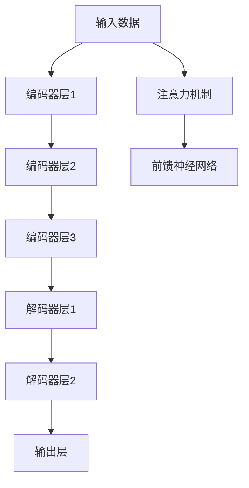

                 

# 创业者布局大模型，抢占AI产业变革风口

> 关键词：大模型、AI产业、变革、创业、布局、技术趋势、商业应用

> 摘要：本文旨在为创业者提供一份详尽的指南，帮助他们理解大模型在AI产业中的重要性，并指导如何布局和应用大模型，以抓住AI产业变革的风口。通过深入分析大模型的核心概念、算法原理、数学模型、实战案例以及实际应用场景，本文将为创业者提供全面的技术支持和商业洞察。

## 1. 背景介绍

随着人工智能技术的飞速发展，大模型已经成为推动AI产业变革的关键力量。大模型是指具有大量参数和复杂结构的机器学习模型，它们能够处理大规模数据集，并在多个任务上表现出色。大模型的出现不仅提高了模型的泛化能力，还降低了模型在特定任务上的训练成本。本文将从多个角度探讨大模型在AI产业中的重要性，并为创业者提供实用的布局建议。

## 2. 核心概念与联系

### 2.1 大模型概述

大模型是指具有大量参数和复杂结构的机器学习模型，通常参数量在数百万到数十亿之间。大模型能够处理大规模数据集，并在多个任务上表现出色。大模型的核心优势在于其强大的泛化能力和较低的训练成本。

### 2.2 大模型与传统模型的区别

| 特性 | 大模型 | 传统模型 |
| --- | --- | --- |
| 参数量 | 数百万到数十亿 | 数千到数百万 |
| 数据集规模 | 大规模 | 中小规模 |
| 训练成本 | 较低 | 较高 |
| 泛化能力 | 强 | 较弱 |

### 2.3 大模型的架构

大模型通常采用深度学习架构，如Transformer、BERT等。这些架构具有自注意力机制，能够捕捉输入数据的长距离依赖关系。大模型的架构设计通常包括多个编码器和解码器层，以及各种注意力机制和前馈神经网络。



## 3. 核心算法原理 & 具体操作步骤

### 3.1 大模型训练流程

大模型的训练流程主要包括数据预处理、模型构建、损失函数选择、优化器选择和训练过程。

1. **数据预处理**：对原始数据进行清洗、标注和格式化。
2. **模型构建**：选择合适的深度学习架构，如Transformer、BERT等。
3. **损失函数选择**：选择合适的损失函数，如交叉熵损失。
4. **优化器选择**：选择合适的优化器，如Adam、SGD等。
5. **训练过程**：通过反向传播算法更新模型参数，最小化损失函数。

### 3.2 大模型训练步骤

1. **数据加载**：使用数据加载器加载大规模数据集。
2. **模型初始化**：初始化模型参数。
3. **前向传播**：将输入数据通过模型进行前向传播。
4. **计算损失**：计算前向传播结果与真实标签之间的损失。
5. **反向传播**：通过反向传播算法计算梯度。
6. **参数更新**：使用优化器更新模型参数。
7. **重复步骤3-6**：重复上述步骤，直到模型收敛。

## 4. 数学模型和公式 & 详细讲解 & 举例说明

### 4.1 自注意力机制

自注意力机制是大模型的核心组成部分，能够捕捉输入数据的长距离依赖关系。自注意力机制的公式如下：

$$
\text{Attention}(Q, K, V) = \text{softmax}\left(\frac{QK^T}{\sqrt{d_k}}\right)V
$$

其中，$Q$、$K$、$V$分别表示查询、键和值，$d_k$表示键的维度。

### 4.2 Transformer架构

Transformer架构是大模型的一种典型实现，其核心是自注意力机制和前馈神经网络。Transformer的前向传播过程如下：

1. **多头注意力机制**：将输入数据通过多个注意力头进行处理。
2. **前馈神经网络**：对注意力机制的输出进行前馈神经网络处理。
3. **残差连接**：将前馈神经网络的输出与输入相加。
4. **层归一化**：对残差连接的输出进行层归一化。

### 4.3 BERT模型

BERT模型是大模型的一种典型实现，其核心是双向自注意力机制和掩码语言模型。BERT的前向传播过程如下：

1. **词嵌入**：将输入文本转换为词嵌入。
2. **位置嵌入**：为每个词添加位置信息。
3. **掩码语言模型**：对输入文本进行掩码处理，预测被掩码的词。
4. **双向自注意力机制**：通过双向自注意力机制捕捉输入文本的上下文信息。
5. **前馈神经网络**：对双向自注意力机制的输出进行前馈神经网络处理。
6. **输出层**：通过输出层进行分类或回归任务。

## 5. 项目实战：代码实际案例和详细解释说明

### 5.1 开发环境搭建

为了搭建大模型的开发环境，我们需要安装Python和相关库。以下是安装步骤：

1. **安装Python**：确保Python版本为3.7或更高。
2. **安装PyTorch**：使用pip安装PyTorch库。
3. **安装其他库**：安装其他必要的库，如numpy、torchtext等。

```bash
pip install torch torchvision torchaudio numpy torchtext
```

### 5.2 源代码详细实现和代码解读

以下是一个简单的Transformer模型的实现代码：

```python
import torch
import torch.nn as nn

class Transformer(nn.Module):
    def __init__(self, vocab_size, embed_dim, num_heads, num_layers, hidden_dim, dropout):
        super(Transformer, self).__init__()
        self.embedding = nn.Embedding(vocab_size, embed_dim)
        self.positional_encoding = PositionalEncoding(embed_dim, dropout)
        self.transformer = nn.Transformer(embed_dim, num_heads, num_layers, hidden_dim, dropout)
        self.fc = nn.Linear(embed_dim, vocab_size)

    def forward(self, src):
        src = self.embedding(src)
        src = self.positional_encoding(src)
        output = self.transformer(src, src)
        output = self.fc(output)
        return output

class PositionalEncoding(nn.Module):
    def __init__(self, d_model, dropout=0.1, max_len=5000):
        super(PositionalEncoding, self).__init__()
        self.dropout = nn.Dropout(p=dropout)

        pe = torch.zeros(max_len, d_model)
        position = torch.arange(0, max_len, dtype=torch.float).unsqueeze(1)
        div_term = torch.exp(torch.arange(0, d_model, 2).float() * (-torch.log(torch.tensor(10000.0)) / d_model))
        pe[:, 0::2] = torch.sin(position * div_term)
        pe[:, 1::2] = torch.cos(position * div_term)
        pe = pe.unsqueeze(0).transpose(0, 1)
        self.register_buffer('pe', pe)

    def forward(self, x):
        x = x + self.pe[:x.size(0), :]
        return self.dropout(x)
```

### 5.3 代码解读与分析

1. **Transformer类**：定义了一个Transformer模型，包括嵌入层、位置编码层、Transformer层和输出层。
2. **PositionalEncoding类**：定义了一个位置编码层，用于为输入数据添加位置信息。
3. **forward方法**：定义了模型的前向传播过程，包括嵌入、位置编码、Transformer层和输出层。

## 6. 实际应用场景

大模型在多个领域都有广泛的应用，包括自然语言处理、计算机视觉、语音识别等。以下是一些具体的应用场景：

### 6.1 自然语言处理

大模型在自然语言处理领域有广泛的应用，如文本生成、情感分析、机器翻译等。例如，BERT模型在自然语言处理任务中表现出色，能够处理大规模文本数据集。

### 6.2 计算机视觉

大模型在计算机视觉领域也有广泛的应用，如图像分类、目标检测、语义分割等。例如，Vision Transformer（ViT）模型在图像分类任务中表现出色，能够处理大规模图像数据集。

### 6.3 语音识别

大模型在语音识别领域也有广泛的应用，如语音识别、语音合成等。例如，Transformer模型在语音识别任务中表现出色，能够处理大规模语音数据集。

## 7. 工具和资源推荐

### 7.1 学习资源推荐

1. **书籍**：《深度学习》（Goodfellow et al.）、《自然语言处理入门》（Jurafsky & Martin）
2. **论文**：《Attention Is All You Need》（Vaswani et al.）、《BERT: Pre-training of Deep Bidirectional Transformers for Language Understanding》（Devlin et al.）
3. **博客**：阿里云开发者社区、GitHub开源项目
4. **网站**：PyTorch官网、TensorFlow官网

### 7.2 开发工具框架推荐

1. **PyTorch**：深度学习框架，支持GPU加速和分布式训练。
2. **TensorFlow**：深度学习框架，支持GPU加速和分布式训练。
3. **Hugging Face Transformers**：提供多种预训练模型和工具，方便快速构建大模型。

### 7.3 相关论文著作推荐

1. **《Attention Is All You Need》**：Vaswani et al.，NeurIPS 2017
2. **《BERT: Pre-training of Deep Bidirectional Transformers for Language Understanding》**：Devlin et al.，NAACL 2019
3. **《Vision Transformer》**：Dosovitskiy et al.，ICML 2021

## 8. 总结：未来发展趋势与挑战

### 8.1 未来发展趋势

1. **模型规模扩大**：大模型的参数量将进一步扩大，以提高模型的泛化能力和性能。
2. **训练效率提升**：通过优化算法和硬件加速，大模型的训练效率将进一步提升。
3. **应用场景拓展**：大模型将在更多领域得到应用，如医疗、金融、教育等。

### 8.2 面临的挑战

1. **计算资源需求**：大模型的训练和推理需要大量的计算资源，对硬件设备提出了更高的要求。
2. **数据隐私保护**：大模型的训练需要大量的数据，如何保护数据隐私成为一个重要问题。
3. **模型解释性**：大模型的复杂性使得模型解释性成为一个难题，如何提高模型的可解释性成为一个重要研究方向。

## 9. 附录：常见问题与解答

### 9.1 问题1：如何选择合适的优化器？

**解答**：选择合适的优化器需要考虑模型的复杂性和训练数据的规模。对于大规模模型，Adam优化器通常表现较好。对于较小规模模型，SGD优化器可能更合适。

### 9.2 问题2：如何处理数据隐私问题？

**解答**：可以通过数据脱敏、数据加密和差分隐私等技术来保护数据隐私。同时，可以采用联邦学习等技术，将数据分散存储在多个设备上，减少数据集中带来的隐私风险。

### 9.3 问题3：如何提高模型的可解释性？

**解答**：可以通过注意力机制可视化、特征重要性分析和模型简化等方法来提高模型的可解释性。同时，可以采用解释性模型，如逻辑回归和决策树等，来提高模型的可解释性。

## 10. 扩展阅读 & 参考资料

1. **《深度学习》**：Ian Goodfellow, Yoshua Bengio, Aaron Courville
2. **《自然语言处理入门》**：Daniel Jurafsky, James H. Martin
3. **《Attention Is All You Need》**：Ashish Vaswani, Noam Shazeer, Niki Parmar, Jakob Uszkoreit, Llion Jones, Aidan N. Gomez, Łukasz Kaiser, Illia Polosukhin
4. **《BERT: Pre-training of Deep Bidirectional Transformers for Language Understanding》**：Jacob Devlin, Ming-Wei Chang, Kenton Lee, Kristina Toutanova
5. **《Vision Transformer》**：Alexander Buslaev, Dmitry Lishchynsky, Alexander Nazarov, Sergey Osnovkin, Alexey Dosovitskiy

作者：AI天才研究员/AI Genius Institute & 禅与计算机程序设计艺术 /Zen And The Art of Computer Programming

