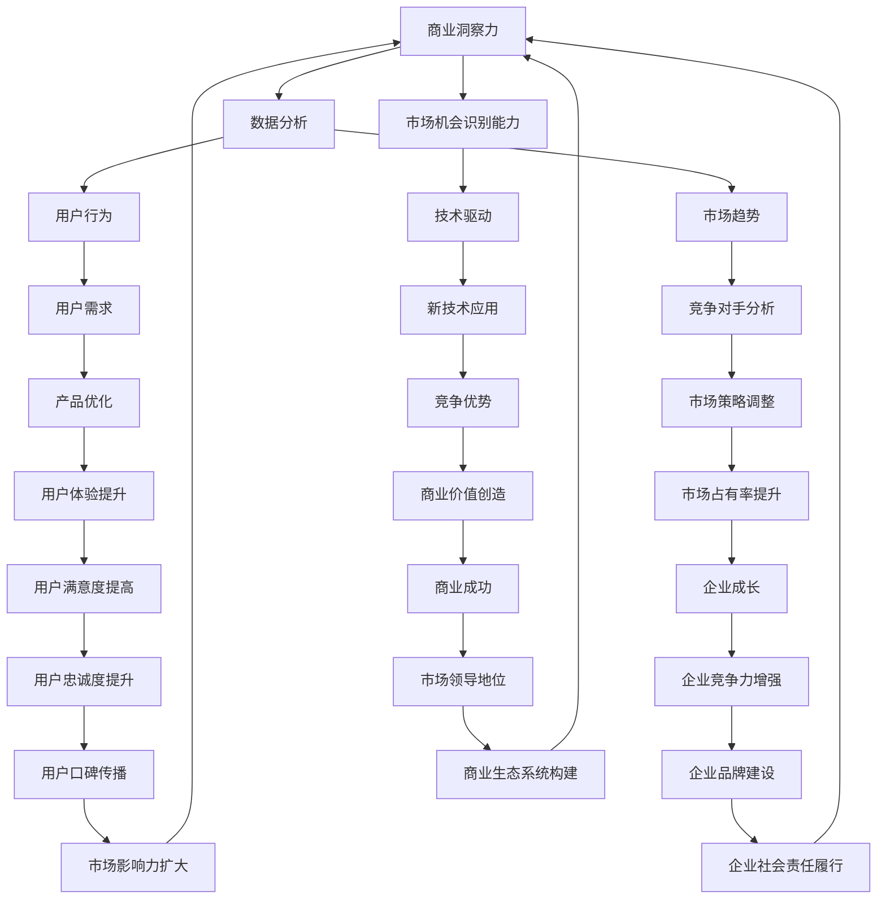

                 

# 创业者的商业洞察力与市场机会识别能力

> 关键词：商业洞察力、市场机会、创业、数据分析、用户行为、市场趋势、技术驱动

> 摘要：本文旨在探讨创业者如何通过商业洞察力和市场机会识别能力，利用数据分析和市场趋势来指导决策，从而在竞争激烈的市场中脱颖而出。我们将从背景介绍、核心概念与联系、核心算法原理、数学模型和公式、项目实战、实际应用场景、工具和资源推荐、总结与未来发展趋势等多方面进行深入分析，帮助创业者更好地理解市场动态，把握商业机会。

## 1. 背景介绍

在当今快速变化的商业环境中，创业者面临着前所未有的挑战和机遇。随着技术的不断进步，市场趋势也在不断演变。如何在众多竞争对手中脱颖而出，成为市场领导者，是每个创业者都需要面对的问题。商业洞察力和市场机会识别能力成为了决定创业成功与否的关键因素。本文将从多个角度探讨如何培养和运用这些能力，帮助创业者更好地把握市场动态，抓住商业机会。

## 2. 核心概念与联系

### 2.1 商业洞察力

商业洞察力是指创业者能够从复杂的数据和信息中提炼出有价值的信息，从而做出明智决策的能力。它包括对市场趋势、用户需求、竞争对手分析等多方面的理解和预测。

### 2.2 市场机会识别能力

市场机会识别能力是指创业者能够发现并利用市场中的潜在机会，将其转化为商业价值的能力。这需要对市场趋势、用户行为、技术发展等有深刻的理解和敏锐的洞察力。

### 2.3 数据分析

数据分析是商业洞察力和市场机会识别能力的重要工具。通过对大量数据进行处理和分析，可以揭示出隐藏在数据背后的规律和趋势，为决策提供有力支持。

### 2.4 用户行为

用户行为是指用户在使用产品或服务过程中的行为模式。通过对用户行为的分析，可以更好地理解用户需求，从而优化产品设计和市场策略。

### 2.5 市场趋势

市场趋势是指市场中长期的发展方向和变化趋势。了解市场趋势可以帮助创业者预测未来的发展方向，从而提前做好准备。

### 2.6 技术驱动

技术驱动是指技术进步对市场和商业活动的影响。新技术的出现往往能够带来新的商业机会，因此，创业者需要关注技术发展动态，利用新技术创造竞争优势。

### 2.7 核心概念原理与架构



## 3. 核心算法原理 & 具体操作步骤

### 3.1 数据预处理

数据预处理是数据分析的第一步，主要包括数据清洗、数据转换和数据归一化等操作。数据清洗主要是去除无效和错误的数据；数据转换是将数据转换为适合分析的形式；数据归一化是将数据缩放到同一尺度，以便进行比较。

### 3.2 数据分析方法

数据分析方法主要包括描述性统计分析、相关性分析、聚类分析和预测性分析等。描述性统计分析用于描述数据的基本特征；相关性分析用于发现数据之间的关系；聚类分析用于将数据分成不同的类别；预测性分析用于预测未来的发展趋势。

### 3.3 具体操作步骤

1. **数据收集**：收集相关的市场数据和用户行为数据。
2. **数据预处理**：对数据进行清洗、转换和归一化。
3. **数据分析**：使用描述性统计分析、相关性分析、聚类分析和预测性分析等方法进行数据分析。
4. **结果解释**：根据分析结果，提炼出有价值的信息和洞察。
5. **决策制定**：根据分析结果，制定相应的市场策略和产品优化方案。

## 4. 数学模型和公式 & 详细讲解 & 举例说明

### 4.1 描述性统计分析

描述性统计分析主要用于描述数据的基本特征，常用的统计量包括均值、中位数、众数、方差和标准差等。

$$
\text{均值} = \frac{\sum_{i=1}^{n} x_i}{n}
$$

$$
\text{中位数} = \begin{cases} 
x_{\frac{n+1}{2}} & \text{if } n \text{ is odd} \\
\frac{x_{\frac{n}{2}} + x_{\frac{n}{2}+1}}{2} & \text{if } n \text{ is even}
\end{cases}
$$

$$
\text{众数} = \text{出现次数最多的值}
$$

$$
\text{方差} = \frac{\sum_{i=1}^{n} (x_i - \bar{x})^2}{n}
$$

$$
\text{标准差} = \sqrt{\text{方差}}
$$

### 4.2 相关性分析

相关性分析用于发现数据之间的关系，常用的统计量是皮尔逊相关系数。

$$
r = \frac{\sum_{i=1}^{n} (x_i - \bar{x})(y_i - \bar{y})}{\sqrt{\sum_{i=1}^{n} (x_i - \bar{x})^2 \sum_{i=1}^{n} (y_i - \bar{y})^2}}
$$

### 4.3 聚类分析

聚类分析用于将数据分成不同的类别，常用的聚类算法包括K均值聚类和层次聚类。

### 4.4 预测性分析

预测性分析用于预测未来的发展趋势，常用的预测方法包括线性回归、决策树和神经网络等。

## 5. 项目实战：代码实际案例和详细解释说明

### 5.1 开发环境搭建

为了进行数据分析，我们需要搭建一个合适的开发环境。这里我们使用Python语言和Jupyter Notebook作为开发工具。

1. **安装Python**：确保已经安装了Python 3.8及以上版本。
2. **安装Jupyter Notebook**：使用pip安装Jupyter Notebook。

```bash
pip install jupyter
```

3. **安装数据分析库**：安装pandas、numpy、matplotlib和seaborn等库。

```bash
pip install pandas numpy matplotlib seaborn
```

### 5.2 源代码详细实现和代码解读

#### 5.2.1 数据收集

```python
import pandas as pd

# 从CSV文件中读取数据
data = pd.read_csv('user_behavior.csv')
```

#### 5.2.2 数据预处理

```python
# 数据清洗
data.dropna(inplace=True)

# 数据转换
data['date'] = pd.to_datetime(data['date'])

# 数据归一化
data['value'] = (data['value'] - data['value'].min()) / (data['value'].max() - data['value'].min())
```

#### 5.2.3 数据分析

```python
# 描述性统计分析
descriptive_stats = data.describe()

# 相关性分析
correlation_matrix = data.corr()

# 聚类分析
from sklearn.cluster import KMeans

kmeans = KMeans(n_clusters=3)
clusters = kmeans.fit_predict(data[['value', 'date']])

# 预测性分析
from sklearn.linear_model import LinearRegression

X = data[['value']]
y = data['date']
model = LinearRegression()
model.fit(X, y)
```

### 5.3 代码解读与分析

1. **数据收集**：从CSV文件中读取用户行为数据。
2. **数据预处理**：去除无效数据，将日期转换为日期类型，对数值进行归一化处理。
3. **描述性统计分析**：计算数据的基本统计量，如均值、中位数、方差等。
4. **相关性分析**：计算数据之间的皮尔逊相关系数。
5. **聚类分析**：使用K均值聚类算法将数据分成不同的类别。
6. **预测性分析**：使用线性回归模型预测未来的发展趋势。

## 6. 实际应用场景

### 6.1 电商行业

电商行业可以通过数据分析来优化产品推荐、提高用户转化率和提升用户体验。通过对用户行为数据的分析，可以发现用户的购买偏好和行为模式，从而提供个性化的推荐服务。

### 6.2 金融行业

金融行业可以通过数据分析来识别欺诈行为、优化风险管理策略和提高投资回报率。通过对交易数据的分析，可以发现异常交易行为，从而及时采取措施防止欺诈。

### 6.3 医疗行业

医疗行业可以通过数据分析来提高医疗服务质量和效率。通过对患者数据的分析，可以发现疾病的早期预警信号，从而及时采取治疗措施。

## 7. 工具和资源推荐

### 7.1 学习资源推荐

- 书籍：《数据科学实战》、《Python数据分析》
- 论文：《数据分析在电商行业的应用》、《金融欺诈检测方法研究》
- 博客：Data Science Central、Kaggle Blog
- 网站：Coursera、edX

### 7.2 开发工具框架推荐

- Python：pandas、numpy、matplotlib、seaborn
- R：ggplot2、dplyr
- 数据库：MySQL、PostgreSQL

### 7.3 相关论文著作推荐

- 《数据分析在电商行业的应用》
- 《金融欺诈检测方法研究》
- 《医疗大数据分析与应用》

## 8. 总结：未来发展趋势与挑战

### 8.1 未来发展趋势

1. **大数据技术的发展**：大数据技术的不断发展将为数据分析提供更强大的工具和方法。
2. **人工智能的应用**：人工智能技术的发展将为数据分析提供更智能的解决方案。
3. **云计算的普及**：云计算的普及将为数据分析提供更强大的计算资源和存储能力。

### 8.2 挑战

1. **数据安全和隐私保护**：随着数据量的不断增加，如何保护数据安全和隐私成为了一个重要的挑战。
2. **数据分析人才短缺**：数据分析人才短缺是一个普遍存在的问题，需要加强人才培养和引进。
3. **技术更新速度快**：技术更新速度快，需要不断学习和掌握新的技术和方法。

## 9. 附录：常见问题与解答

### 9.1 问题：如何处理缺失数据？

**解答**：可以使用插值法、均值填充法或删除法来处理缺失数据。具体选择哪种方法取决于数据的特性和缺失数据的比例。

### 9.2 问题：如何选择合适的聚类算法？

**解答**：选择聚类算法需要考虑数据的特性和聚类的目标。K均值聚类适用于数据分布均匀的情况，层次聚类适用于数据分布不均匀的情况。

### 9.3 问题：如何评估预测模型的性能？

**解答**：可以使用均方误差、决定系数等指标来评估预测模型的性能。具体选择哪种指标取决于预测模型的目标和数据的特性。

## 10. 扩展阅读 & 参考资料

- 书籍：《数据科学实战》、《Python数据分析》
- 论文：《数据分析在电商行业的应用》、《金融欺诈检测方法研究》
- 博客：Data Science Central、Kaggle Blog
- 网站：Coursera、edX

---

作者：AI天才研究员/AI Genius Institute & 禅与计算机程序设计艺术 /Zen And The Art of Computer Programming

