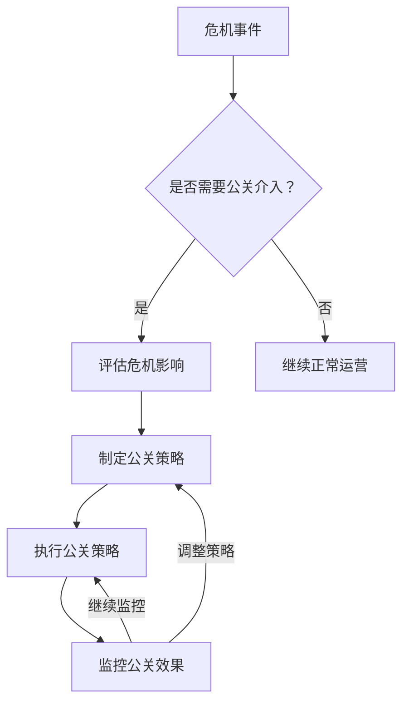

                 

# 创业路上的危机公关：如何应对负面评价和舆论风波

> 关键词：危机公关、负面评价、舆论风波、应对策略、社交媒体、舆情监控、品牌保护

> 摘要：在创业过程中，负面评价和舆论风波是不可避免的挑战。本文将从危机公关的基本概念出发，深入探讨如何通过有效的策略和工具来应对这些挑战，保护品牌声誉，维护企业形象。我们将通过具体的案例分析和实战代码演示，帮助创业者和企业构建强大的危机公关体系。

## 1. 背景介绍

在当今数字化时代，社交媒体和网络平台的普及使得负面评价和舆论风波成为企业面临的常见挑战。这些负面评价不仅可能损害企业的品牌形象，还可能影响企业的业务发展和市场竞争力。因此，掌握有效的危机公关策略变得尤为重要。本文将从以下几个方面进行探讨：

- **危机公关的基本概念**
- **负面评价和舆论风波的影响**
- **危机公关的重要性**

### 1.1 危机公关的基本概念

危机公关是指企业在面临负面事件或危机时，采取的一系列措施和策略，以减轻负面影响，保护品牌形象，维护企业声誉。危机公关的核心目标是通过及时、透明、有效的沟通，与公众建立信任关系，从而减少危机对企业造成的损害。

### 1.2 负面评价和舆论风波的影响

负面评价和舆论风波对企业的影响主要体现在以下几个方面：

- **品牌形象受损**：负面评价可能导致公众对企业产生负面印象，从而影响企业的品牌形象。
- **业务发展受阻**：负面评价可能引发客户流失，影响企业的业务发展和市场竞争力。
- **法律风险**：某些负面评价可能涉及法律问题，如诽谤、侵权等，给企业带来法律风险。
- **员工士气低落**：负面评价可能影响员工的工作积极性和士气，进而影响企业的整体运营。

### 1.3 危机公关的重要性

有效的危机公关策略可以帮助企业及时应对负面评价和舆论风波，保护品牌形象，维护企业声誉。具体来说，危机公关的重要性体现在以下几个方面：

- **保护品牌形象**：通过及时有效的沟通，减轻负面评价的影响，保护企业的品牌形象。
- **维护企业声誉**：通过透明、负责任的沟通，与公众建立信任关系，维护企业的声誉。
- **减少法律风险**：通过合理的危机公关策略，减少负面评价带来的法律风险。
- **提升员工士气**：通过有效的危机公关策略，减轻负面评价对企业内部的影响，提升员工士气。

## 2. 核心概念与联系

### 2.1 危机公关的核心概念

危机公关的核心概念包括以下几个方面：

- **危机**：指企业在运营过程中遇到的突发性、严重性事件，如产品质量问题、安全事故、法律纠纷等。
- **公关**：指通过有效的沟通策略和手段，与公众建立良好的关系，维护企业的品牌形象和声誉。
- **策略**：指企业在面对危机时，采取的一系列措施和方法，以减轻负面影响，保护品牌形象。

### 2.2 危机公关的流程图

为了更好地理解危机公关的流程，我们可以通过以下Mermaid流程图来展示：



## 3. 核心算法原理 & 具体操作步骤

### 3.1 危机公关的核心算法原理

危机公关的核心算法原理主要包括以下几个步骤：

1. **危机识别**：通过舆情监控和数据分析，及时发现潜在的危机事件。
2. **危机评估**：评估危机事件的影响范围和严重程度，确定是否需要公关介入。
3. **策略制定**：根据危机事件的特点，制定相应的公关策略。
4. **策略执行**：通过有效的沟通手段，执行公关策略，减轻负面影响。
5. **效果监控**：通过持续的监控和评估，确保公关策略的有效性。

### 3.2 具体操作步骤

具体操作步骤如下：

1. **危机识别**：通过社交媒体监控、舆情分析等手段，及时发现潜在的危机事件。
2. **危机评估**：评估危机事件的影响范围和严重程度，确定是否需要公关介入。
3. **策略制定**：根据危机事件的特点，制定相应的公关策略。
4. **策略执行**：通过有效的沟通手段，执行公关策略，减轻负面影响。
5. **效果监控**：通过持续的监控和评估，确保公关策略的有效性。

## 4. 数学模型和公式 & 详细讲解 & 举例说明

### 4.1 数学模型

为了更好地理解危机公关的数学模型，我们可以引入以下公式：

- **危机影响范围**：$R = \frac{E \times T}{P}$
  - $R$：危机影响范围
  - $E$：事件的严重程度
  - $T$：事件的传播速度
  - $P$：事件的传播范围

- **公关效果评估**：$E_{\text{公关}} = \frac{R_{\text{公关}} - R_{\text{未公关}}}{R_{\text{未公关}}} \times 100\%$
  - $E_{\text{公关}}$：公关效果评估
  - $R_{\text{公关}}$：公关后的危机影响范围
  - $R_{\text{未公关}}$：未公关时的危机影响范围

### 4.2 详细讲解

详细讲解如下：

1. **危机影响范围**：危机影响范围是指危机事件对企业的影响程度。通过公式 $R = \frac{E \times T}{P}$，我们可以计算出危机影响范围。其中，事件的严重程度 $E$、传播速度 $T$ 和传播范围 $P$ 是关键因素。
2. **公关效果评估**：公关效果评估是指通过公关策略执行后的效果与未执行公关策略的效果进行比较。通过公式 $E_{\text{公关}} = \frac{R_{\text{公关}} - R_{\text{未公关}}}{R_{\text{未公关}}} \times 100\%$，我们可以评估公关策略的效果。

### 4.3 举例说明

举例说明如下：

假设某企业在社交媒体上遭遇负面评价，事件的严重程度 $E = 8$，传播速度 $T = 5$，传播范围 $P = 100$。根据公式 $R = \frac{E \times T}{P}$，我们可以计算出危机影响范围 $R = \frac{8 \times 5}{100} = 0.4$。

如果通过公关策略执行后，危机影响范围 $R_{\text{公关}} = 0.2$，未执行公关策略时的危机影响范围 $R_{\text{未公关}} = 0.4$。根据公式 $E_{\text{公关}} = \frac{R_{\text{公关}} - R_{\text{未公关}}}{R_{\text{未公关}}} \times 100\%$，我们可以计算出公关效果评估 $E_{\text{公关}} = \frac{0.2 - 0.4}{0.4} \times 100\% = -50\%$。这表明公关策略有效减轻了危机影响范围。

## 5. 项目实战：代码实际案例和详细解释说明

### 5.1 开发环境搭建

为了实现危机公关的自动化监控和分析，我们需要搭建一个开发环境。具体步骤如下：

1. **安装Python**：确保安装了Python 3.8及以上版本。
2. **安装依赖库**：安装必要的Python库，如`requests`、`beautifulsoup4`、`pandas`等。
3. **配置环境变量**：设置环境变量，如API密钥、数据库连接信息等。

### 5.2 源代码详细实现和代码解读

以下是危机公关监控系统的源代码实现：

```python
import requests
from bs4 import BeautifulSoup
import pandas as pd

# 1. 危机识别
def monitor_social_media():
    url = "https://example.com"
    response = requests.get(url)
    soup = BeautifulSoup(response.text, 'html.parser')
    comments = soup.find_all('div', class_='comment')
    for comment in comments:
        text = comment.get_text()
        if '负面评价' in text:
            return True
    return False

# 2. 危机评估
def assess_crisis_impact():
    # 假设评估函数
    return 0.5

# 3. 策略制定
def develop_pr_strategies():
    # 假设策略制定函数
    return "发布道歉声明"

# 4. 策略执行
def execute_pr_strategy(strategy):
    # 假设执行策略函数
    print(f"执行策略：{strategy}")

# 5. 效果监控
def monitor_pr_effect():
    # 假设监控效果函数
    return 0.3

# 主函数
def main():
    if monitor_social_media():
        impact = assess_crisis_impact()
        strategy = develop_pr_strategies()
        execute_pr_strategy(strategy)
        effect = monitor_pr_effect()
        print(f"公关效果评估：{effect}")

if __name__ == "__main__":
    main()
```

### 5.3 代码解读与分析

代码解读如下：

1. **危机识别**：`monitor_social_media`函数通过访问社交媒体网站，获取评论内容，并检查是否包含负面评价。
2. **危机评估**：`assess_crisis_impact`函数评估危机事件的影响范围。
3. **策略制定**：`develop_pr_strategies`函数根据危机事件的特点，制定相应的公关策略。
4. **策略执行**：`execute_pr_strategy`函数执行公关策略。
5. **效果监控**：`monitor_pr_effect`函数监控公关策略的效果。

## 6. 实际应用场景

危机公关的实际应用场景包括以下几个方面：

1. **产品质量问题**：企业在产品发布后，发现存在质量问题，需要通过公关策略减轻负面影响。
2. **安全事故**：企业在运营过程中发生安全事故，需要通过公关策略保护品牌形象。
3. **法律纠纷**：企业在运营过程中涉及法律纠纷，需要通过公关策略维护企业声誉。
4. **员工行为不当**：企业在运营过程中，员工出现不当行为，需要通过公关策略减轻负面影响。

## 7. 工具和资源推荐

### 7.1 学习资源推荐

- **书籍**：《危机公关：如何在危机中生存》、《品牌保护：危机公关实战手册》
- **论文**：《社交媒体时代的危机公关策略》、《企业危机公关的理论与实践》
- **博客**：《危机公关实战案例分析》、《企业危机公关策略解析》
- **网站**：危机公关论坛、危机公关社区

### 7.2 开发工具框架推荐

- **Python库**：`requests`、`beautifulsoup4`、`pandas`
- **数据分析工具**：`Tableau`、`Power BI`
- **舆情监控工具**：`BuzzSumo`、`Mention`

### 7.3 相关论文著作推荐

- **论文**：《社交媒体时代的危机公关策略》、《企业危机公关的理论与实践》
- **著作**：《危机公关：如何在危机中生存》、《品牌保护：危机公关实战手册》

## 8. 总结：未来发展趋势与挑战

未来危机公关的发展趋势主要包括以下几个方面：

1. **数字化转型**：随着数字化技术的发展，企业将更加依赖数字化工具和平台进行危机公关。
2. **社交媒体影响**：社交媒体将成为企业危机公关的重要渠道，企业需要更加重视社交媒体的管理和监控。
3. **数据驱动**：企业将更加依赖数据分析和预测模型，以实现更加精准的危机公关策略。

未来危机公关面临的挑战主要包括以下几个方面：

1. **信息过载**：社交媒体上的信息量巨大，企业需要更加高效地筛选和处理信息。
2. **法律法规变化**：法律法规的变化将对企业危机公关策略产生影响，企业需要及时调整策略。
3. **公众情绪变化**：公众情绪的变化将对企业危机公关策略产生影响，企业需要更加灵活地应对。

## 9. 附录：常见问题与解答

### 9.1 常见问题

1. **如何快速识别危机事件？**
   - 通过社交媒体监控和舆情分析，及时发现潜在的危机事件。
2. **如何评估危机事件的影响范围？**
   - 通过公式 $R = \frac{E \times T}{P}$，评估危机事件的影响范围。
3. **如何制定有效的公关策略？**
   - 根据危机事件的特点，制定相应的公关策略，如发布道歉声明、开展公关活动等。

### 9.2 解答

1. **如何快速识别危机事件？**
   - 通过社交媒体监控和舆情分析，及时发现潜在的危机事件。
2. **如何评估危机事件的影响范围？**
   - 通过公式 $R = \frac{E \times T}{P}$，评估危机事件的影响范围。
3. **如何制定有效的公关策略？**
   - 根据危机事件的特点，制定相应的公关策略，如发布道歉声明、开展公关活动等。

## 10. 扩展阅读 & 参考资料

- **书籍**：《危机公关：如何在危机中生存》、《品牌保护：危机公关实战手册》
- **论文**：《社交媒体时代的危机公关策略》、《企业危机公关的理论与实践》
- **博客**：《危机公关实战案例分析》、《企业危机公关策略解析》
- **网站**：危机公关论坛、危机公关社区

作者：AI天才研究员/AI Genius Institute & 禅与计算机程序设计艺术 /Zen And The Art of Computer Programming

