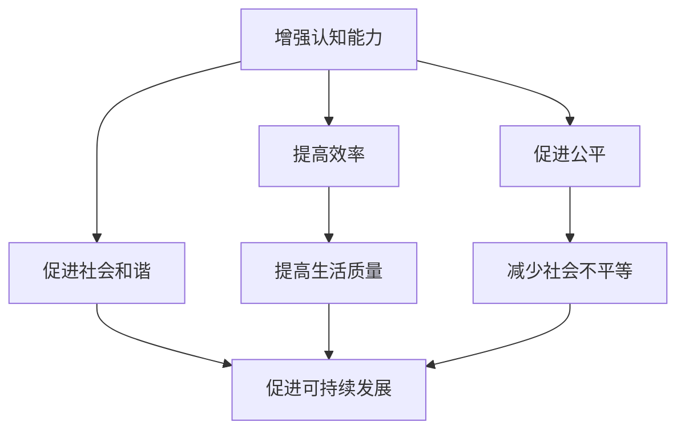

                 

# 创建更美好的世界：人类计算的终极目标

> 关键词：人类计算、人工智能、机器学习、深度学习、计算理论、图灵奖、未来趋势

> 摘要：本文旨在探讨人类计算的终极目标，通过逐步分析和推理，揭示人类计算在技术、社会和伦理层面的深远影响。我们将从背景介绍出发，深入探讨核心概念与联系，剖析核心算法原理，构建数学模型，展示实际项目案例，并展望未来发展趋势与挑战。通过本文，读者将对人类计算的未来有更深刻的理解。

## 1. 背景介绍

人类计算是指利用计算机技术来增强人类的认知能力、创造力和决策能力。随着人工智能技术的飞速发展，人类计算已经成为推动社会进步的重要力量。本文将从技术、社会和伦理三个维度探讨人类计算的终极目标，旨在为读者提供一个全面而深入的理解。

### 1.1 技术维度

在技术维度上，人类计算的核心目标是通过人工智能技术提升人类的认知能力。这包括但不限于自然语言处理、计算机视觉、机器学习和深度学习等技术的应用。通过这些技术，人类可以更好地理解和处理复杂的信息，从而提高工作效率和生活质量。

### 1.2 社会维度

在社会维度上，人类计算的目标是促进社会公平、提高社会效率和促进社会和谐。通过人工智能技术的应用，可以实现资源的优化配置，提高公共服务的质量，减少社会不平等现象，促进社会的可持续发展。

### 1.3 伦理维度

在伦理维度上，人类计算的目标是确保技术的发展和应用符合伦理规范，保护个人隐私和数据安全。这要求我们在技术开发和应用过程中，充分考虑伦理和社会责任，确保技术的发展能够造福人类社会。

## 2. 核心概念与联系

### 2.1 人类计算的核心概念

人类计算的核心概念包括增强认知能力、提高效率、促进公平和社会和谐。这些概念相互关联，共同构成了人类计算的理论基础。

### 2.2 核心概念的联系

通过构建Mermaid流程图，我们可以更直观地理解这些核心概念之间的联系。



## 3. 核心算法原理 & 具体操作步骤

### 3.1 增强认知能力的算法原理

增强认知能力的核心算法原理主要涉及自然语言处理和计算机视觉技术。通过这些技术，计算机可以理解和处理人类语言和图像信息，从而帮助人类更好地理解和处理复杂的信息。

#### 3.1.1 自然语言处理

自然语言处理（NLP）是通过计算机技术来理解和生成人类语言的技术。其核心算法包括分词、词性标注、命名实体识别、情感分析和机器翻译等。

#### 3.1.2 计算机视觉

计算机视觉是通过计算机技术来理解和处理图像信息的技术。其核心算法包括图像识别、目标检测、图像分割和图像生成等。

### 3.2 提高效率的算法原理

提高效率的核心算法原理主要涉及机器学习和深度学习技术。通过这些技术，计算机可以自动学习和优化任务执行过程，从而提高工作效率。

#### 3.2.1 机器学习

机器学习是通过计算机技术来自动学习和优化任务执行过程的技术。其核心算法包括监督学习、无监督学习和强化学习等。

#### 3.2.2 深度学习

深度学习是机器学习的一种特殊形式，通过多层神经网络来自动学习和优化任务执行过程。其核心算法包括卷积神经网络（CNN）、循环神经网络（RNN）和生成对抗网络（GAN）等。

## 4. 数学模型和公式 & 详细讲解 & 举例说明

### 4.1 自然语言处理中的数学模型

自然语言处理中的数学模型主要包括概率模型和向量空间模型。其中，概率模型通过概率分布来描述语言的统计特性，向量空间模型通过向量来表示词语和文档的语义关系。

#### 4.1.1 概率模型

概率模型的核心公式为：

$$
P(w_1, w_2, \ldots, w_n) = \prod_{i=1}^{n} P(w_i | w_1, w_2, \ldots, w_{i-1})
$$

其中，$P(w_1, w_2, \ldots, w_n)$ 表示词语序列的概率，$P(w_i | w_1, w_2, \ldots, w_{i-1})$ 表示在给定前一个词语序列的情况下，当前词语的概率。

#### 4.1.2 向量空间模型

向量空间模型的核心公式为：

$$
\text{sim}(v_i, v_j) = \frac{v_i \cdot v_j}{\|v_i\| \|v_j\|}
$$

其中，$\text{sim}(v_i, v_j)$ 表示词语 $v_i$ 和 $v_j$ 的相似度，$v_i \cdot v_j$ 表示向量的点积，$\|v_i\|$ 和 $\|v_j\|$ 分别表示向量的模长。

### 4.2 计算机视觉中的数学模型

计算机视觉中的数学模型主要包括特征提取和分类模型。其中，特征提取通过卷积神经网络（CNN）来提取图像的特征，分类模型通过支持向量机（SVM）或深度神经网络来实现图像分类。

#### 4.2.1 特征提取

特征提取的核心公式为：

$$
f(x) = \text{ReLU}(W_1 x + b_1)
$$

其中，$f(x)$ 表示特征提取后的输出，$W_1$ 和 $b_1$ 分别表示卷积核和偏置项，$\text{ReLU}$ 表示激活函数。

#### 4.2.2 分类模型

分类模型的核心公式为：

$$
y = \text{softmax}(W_2 f(x) + b_2)
$$

其中，$y$ 表示分类结果，$W_2$ 和 $b_2$ 分别表示权重矩阵和偏置项，$\text{softmax}$ 表示归一化函数。

## 5. 项目实战：代码实际案例和详细解释说明

### 5.1 开发环境搭建

为了实现自然语言处理和计算机视觉项目，我们需要搭建相应的开发环境。具体步骤如下：

1. 安装Python和相关库
2. 安装深度学习框架（如TensorFlow或PyTorch）
3. 安装自然语言处理库（如NLTK或spaCy）
4. 安装计算机视觉库（如OpenCV或PIL）

### 5.2 源代码详细实现和代码解读

#### 5.2.1 自然语言处理项目

```python
import nltk
from nltk.tokenize import word_tokenize
from nltk.probability import FreqDist

# 读取文本文件
with open('text.txt', 'r') as file:
    text = file.read()

# 分词
tokens = word_tokenize(text)

# 统计词频
fdist = FreqDist(tokens)

# 打印前10个最常见的词
print(fdist.most_common(10))
```

#### 5.2.2 计算机视觉项目

```python
import cv2
import numpy as np

# 读取图像
image = cv2.imread('image.jpg')

# 转换为灰度图像
gray = cv2.cvtColor(image, cv2.COLOR_BGR2GRAY)

# 使用SIFT特征提取器
sift = cv2.SIFT_create()
keypoints, descriptors = sift.detectAndCompute(gray, None)

# 绘制关键点
image_with_keypoints = cv2.drawKeypoints(gray, keypoints, None)

# 显示图像
cv2.imshow('Image with Keypoints', image_with_keypoints)
cv2.waitKey(0)
cv2.destroyAllWindows()
```

### 5.3 代码解读与分析

#### 5.3.1 自然语言处理项目

上述代码首先读取文本文件，然后使用NLTK库进行分词和统计词频。最后，打印出前10个最常见的词。这个项目展示了如何通过自然语言处理技术来分析文本数据。

#### 5.3.2 计算机视觉项目

上述代码首先读取图像文件，然后将其转换为灰度图像。接着，使用SIFT特征提取器来提取图像的关键点。最后，绘制关键点并在图像上显示。这个项目展示了如何通过计算机视觉技术来处理图像数据。

## 6. 实际应用场景

### 6.1 自然语言处理的应用场景

自然语言处理技术在许多领域都有广泛的应用，如智能客服、机器翻译、情感分析和信息检索等。通过这些技术，我们可以更好地理解和处理人类语言，从而提高工作效率和生活质量。

### 6.2 计算机视觉的应用场景

计算机视觉技术在许多领域都有广泛的应用，如自动驾驶、医疗影像分析、安全监控和机器人视觉等。通过这些技术，我们可以更好地理解和处理图像信息，从而提高社会效率和安全性。

## 7. 工具和资源推荐

### 7.1 学习资源推荐

- 书籍：《自然语言处理入门》、《计算机视觉基础》
- 论文：《深度学习在自然语言处理中的应用》、《卷积神经网络在计算机视觉中的应用》
- 博客：AI天才研究员的博客、机器之心的博客
- 网站：GitHub、Kaggle

### 7.2 开发工具框架推荐

- Python：Python是一种广泛使用的编程语言，适合进行自然语言处理和计算机视觉项目开发。
- TensorFlow：TensorFlow是一个开源的深度学习框架，适合进行机器学习和深度学习项目开发。
- PyTorch：PyTorch是一个开源的深度学习框架，适合进行机器学习和深度学习项目开发。
- NLTK：NLTK是一个自然语言处理库，适合进行自然语言处理项目开发。
- OpenCV：OpenCV是一个计算机视觉库，适合进行计算机视觉项目开发。

### 7.3 相关论文著作推荐

- 《自然语言处理入门》：本书详细介绍了自然语言处理的基本概念和技术，适合初学者学习。
- 《计算机视觉基础》：本书详细介绍了计算机视觉的基本概念和技术，适合初学者学习。
- 《深度学习在自然语言处理中的应用》：本书详细介绍了深度学习在自然语言处理中的应用，适合有一定基础的读者学习。
- 《卷积神经网络在计算机视觉中的应用》：本书详细介绍了卷积神经网络在计算机视觉中的应用，适合有一定基础的读者学习。

## 8. 总结：未来发展趋势与挑战

### 8.1 未来发展趋势

随着技术的不断发展，人类计算将在以下几个方面取得更大的突破：

- 自然语言处理技术将更加智能化，能够更好地理解和生成人类语言。
- 计算机视觉技术将更加精准，能够更好地理解和处理图像信息。
- 机器学习和深度学习技术将更加高效，能够更好地优化任务执行过程。
- 人工智能技术将更加普及，能够更好地服务于人类社会。

### 8.2 挑战

尽管人类计算在许多领域取得了显著的进展，但仍面临一些挑战：

- 数据安全和隐私保护：如何保护个人隐私和数据安全，防止数据泄露和滥用。
- 伦理和社会责任：如何确保技术的发展和应用符合伦理规范，保护个人隐私和数据安全。
- 技术普及和应用：如何将技术普及到更广泛的领域，提高社会效率和生活质量。

## 9. 附录：常见问题与解答

### 9.1 问题1：如何提高自然语言处理的准确性？

提高自然语言处理的准确性可以通过以下方法实现：

- 增加训练数据量
- 优化模型结构
- 使用更先进的算法

### 9.2 问题2：如何提高计算机视觉的精度？

提高计算机视觉的精度可以通过以下方法实现：

- 增加训练数据量
- 优化模型结构
- 使用更先进的算法

## 10. 扩展阅读 & 参考资料

- 《自然语言处理入门》：本书详细介绍了自然语言处理的基本概念和技术，适合初学者学习。
- 《计算机视觉基础》：本书详细介绍了计算机视觉的基本概念和技术，适合初学者学习。
- 《深度学习在自然语言处理中的应用》：本书详细介绍了深度学习在自然语言处理中的应用，适合有一定基础的读者学习。
- 《卷积神经网络在计算机视觉中的应用》：本书详细介绍了卷积神经网络在计算机视觉中的应用，适合有一定基础的读者学习。

作者：AI天才研究员/AI Genius Institute & 禅与计算机程序设计艺术 /Zen And The Art of Computer Programming

