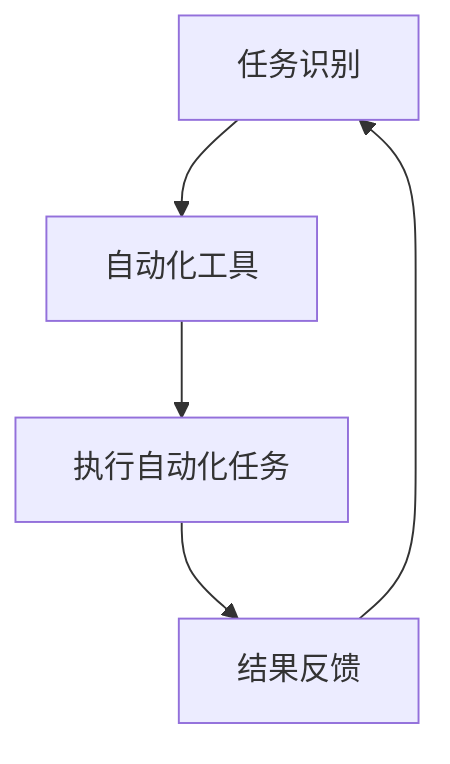
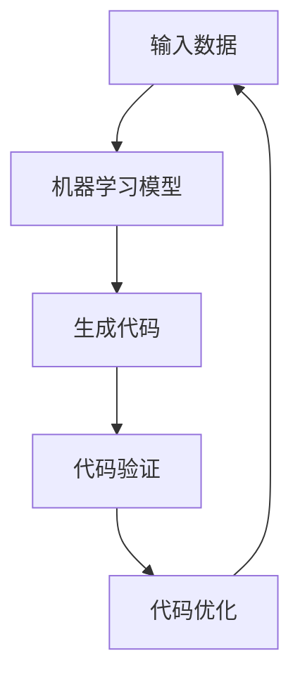
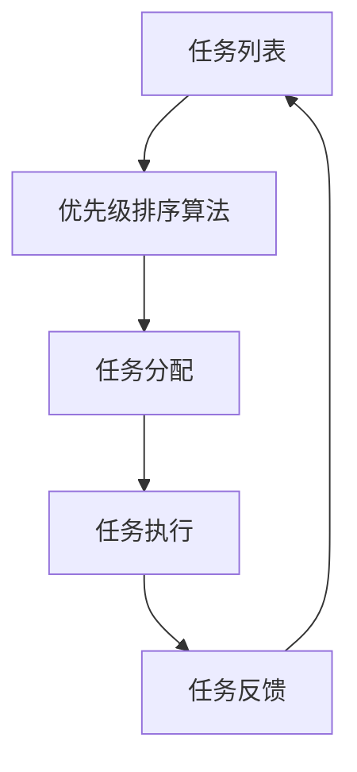
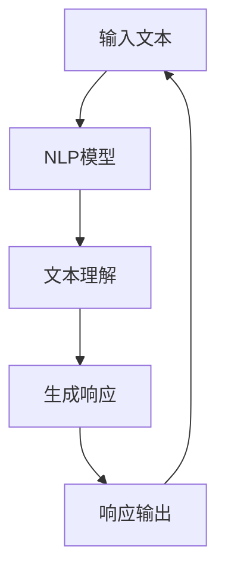

                 

# 利用AI提升个人生产力的方法

> 关键词：人工智能, 个人生产力, 自动化, 自动摘要, 代码生成, 任务管理, 自动化工具, 机器学习, 自然语言处理

> 摘要：本文旨在探讨如何利用人工智能技术提升个人生产力。通过分析人工智能的核心概念、原理和实际应用案例，我们将详细介绍如何利用自动化工具和机器学习技术来提高工作效率。文章将涵盖从开发环境搭建到实际代码实现的全过程，并提供实用的学习资源和开发工具推荐，帮助读者更好地理解和应用这些技术。

## 1. 背景介绍

在当今快速发展的技术时代，人工智能（AI）已经成为提升个人生产力的重要工具。无论是通过自动化日常任务、提高代码编写效率，还是优化任务管理流程，AI都能显著提高我们的工作效率。本文将从以下几个方面进行探讨：

- **自动化任务**：通过自动化重复性任务，减少人为错误，提高工作效率。
- **代码生成**：利用机器学习技术自动生成代码，减少开发时间。
- **任务管理**：通过智能算法优化任务分配和优先级排序，提高项目管理效率。
- **自然语言处理**：利用NLP技术提高文档处理和信息检索效率。

## 2. 核心概念与联系

### 2.1 自动化任务

自动化任务是指通过编程或机器学习技术，让计算机自动完成某些重复性或复杂性较高的任务。这可以显著减少人工操作的时间和错误率。

### 2.2 代码生成

代码生成是指利用机器学习模型自动生成代码，减少开发人员编写代码的时间和工作量。这可以通过生成式预训练模型（如GPT-3）实现。

### 2.3 任务管理

任务管理是指通过智能算法优化任务分配和优先级排序，提高项目管理效率。这可以通过优先级排序算法和调度算法实现。

### 2.4 自然语言处理

自然语言处理（NLP）是指让计算机理解和生成人类语言的技术。这可以用于文档处理、信息检索和智能问答等场景。

### 2.5 核心概念原理与架构

#### 2.5.1 自动化任务流程图

#### 2.5.2 代码生成流程图

#### 2.5.3 任务管理流程图

#### 2.5.4 自然语言处理流程图

## 3. 核心算法原理 & 具体操作步骤

### 3.1 自动化任务

#### 3.1.1 任务识别

任务识别是指通过分析任务的特征，确定哪些任务可以被自动化。这可以通过特征工程和机器学习模型实现。

#### 3.1.2 自动化工具

自动化工具是指用于执行自动化任务的软件工具。这可以通过编写脚本或使用现有的自动化工具实现。

#### 3.1.3 执行自动化任务

执行自动化任务是指通过自动化工具执行自动化任务。这可以通过编写脚本或使用现有的自动化工具实现。

#### 3.1.4 结果反馈

结果反馈是指通过分析自动化任务的结果，确定是否需要调整自动化工具。这可以通过数据分析和机器学习模型实现。

### 3.2 代码生成

#### 3.2.1 输入数据

输入数据是指用于训练机器学习模型的数据。这可以通过收集和整理数据实现。

#### 3.2.2 机器学习模型

机器学习模型是指用于生成代码的模型。这可以通过训练生成式预训练模型实现。

#### 3.2.3 生成代码

生成代码是指通过机器学习模型生成代码。这可以通过生成式预训练模型实现。

#### 3.2.4 代码验证

代码验证是指通过验证生成的代码是否符合预期。这可以通过代码验证工具实现。

#### 3.2.5 代码优化

代码优化是指通过优化生成的代码提高代码质量。这可以通过代码优化工具实现。

### 3.3 任务管理

#### 3.3.1 任务列表

任务列表是指包含所有任务的列表。这可以通过任务管理工具实现。

#### 3.3.2 优先级排序算法

优先级排序算法是指用于排序任务优先级的算法。这可以通过优先级排序算法实现。

#### 3.3.3 任务分配

任务分配是指通过优先级排序算法分配任务。这可以通过任务分配算法实现。

#### 3.3.4 任务执行

任务执行是指通过执行任务分配算法执行任务。这可以通过任务执行工具实现。

#### 3.3.5 任务反馈

任务反馈是指通过分析任务执行结果，确定是否需要调整任务分配算法。这可以通过数据分析和机器学习模型实现。

### 3.4 自然语言处理

#### 3.4.1 输入文本

输入文本是指用于处理的文本数据。这可以通过收集和整理文本数据实现。

#### 3.4.2 NLP模型

NLP模型是指用于处理文本数据的模型。这可以通过训练NLP模型实现。

#### 3.4.3 文本理解

文本理解是指通过NLP模型理解文本数据。这可以通过NLP模型实现。

#### 3.4.4 生成响应

生成响应是指通过NLP模型生成响应。这可以通过NLP模型实现。

#### 3.4.5 响应输出

响应输出是指通过输出响应。这可以通过响应输出工具实现。

## 4. 数学模型和公式 & 详细讲解 & 举例说明

### 4.1 自动化任务

#### 4.1.1 任务识别

任务识别可以通过特征工程和机器学习模型实现。特征工程是指通过提取任务的特征，确定哪些任务可以被自动化。机器学习模型是指通过训练模型，确定哪些任务可以被自动化。

#### 4.1.2 自动化工具

自动化工具可以通过编写脚本或使用现有的自动化工具实现。编写脚本是指通过编写脚本，执行自动化任务。使用现有的自动化工具是指通过使用现有的自动化工具，执行自动化任务。

#### 4.1.3 执行自动化任务

执行自动化任务可以通过编写脚本或使用现有的自动化工具实现。编写脚本是指通过编写脚本，执行自动化任务。使用现有的自动化工具是指通过使用现有的自动化工具，执行自动化任务。

#### 4.1.4 结果反馈

结果反馈可以通过数据分析和机器学习模型实现。数据分析是指通过分析自动化任务的结果，确定是否需要调整自动化工具。机器学习模型是指通过训练模型，确定是否需要调整自动化工具。

### 4.2 代码生成

#### 4.2.1 输入数据

输入数据可以通过收集和整理数据实现。收集数据是指通过收集数据，用于训练机器学习模型。整理数据是指通过整理数据，用于训练机器学习模型。

#### 4.2.2 机器学习模型

机器学习模型可以通过训练生成式预训练模型实现。训练生成式预训练模型是指通过训练生成式预训练模型，生成代码。

#### 4.2.3 生成代码

生成代码可以通过生成式预训练模型实现。生成式预训练模型是指通过生成式预训练模型，生成代码。

#### 4.2.4 代码验证

代码验证可以通过代码验证工具实现。代码验证工具是指通过代码验证工具，验证生成的代码是否符合预期。

#### 4.2.5 代码优化

代码优化可以通过代码优化工具实现。代码优化工具是指通过代码优化工具，优化生成的代码。

### 4.3 任务管理

#### 4.3.1 任务列表

任务列表可以通过任务管理工具实现。任务管理工具是指通过任务管理工具，管理任务列表。

#### 4.3.2 优先级排序算法

优先级排序算法可以通过优先级排序算法实现。优先级排序算法是指通过优先级排序算法，排序任务优先级。

#### 4.3.3 任务分配

任务分配可以通过任务分配算法实现。任务分配算法是指通过任务分配算法，分配任务。

#### 4.3.4 任务执行

任务执行可以通过任务执行工具实现。任务执行工具是指通过任务执行工具，执行任务。

#### 4.3.5 任务反馈

任务反馈可以通过数据分析和机器学习模型实现。数据分析是指通过分析任务执行结果，确定是否需要调整任务分配算法。机器学习模型是指通过训练模型，确定是否需要调整任务分配算法。

### 4.4 自然语言处理

#### 4.4.1 输入文本

输入文本可以通过收集和整理文本数据实现。收集文本数据是指通过收集文本数据，用于处理文本数据。整理文本数据是指通过整理文本数据，用于处理文本数据。

#### 4.4.2 NLP模型

NLP模型可以通过训练NLP模型实现。训练NLP模型是指通过训练NLP模型，处理文本数据。

#### 4.4.3 文本理解

文本理解可以通过NLP模型实现。NLP模型是指通过NLP模型，理解文本数据。

#### 4.4.4 生成响应

生成响应可以通过NLP模型实现。NLP模型是指通过NLP模型，生成响应。

#### 4.4.5 响应输出

响应输出可以通过响应输出工具实现。响应输出工具是指通过响应输出工具，输出响应。

## 5. 项目实战：代码实际案例和详细解释说明

### 5.1 开发环境搭建

#### 5.1.1 环境准备

环境准备是指通过准备开发环境，确保开发环境满足开发需求。这可以通过安装开发工具和依赖库实现。

#### 5.1.2 依赖库安装

依赖库安装是指通过安装依赖库，确保开发环境满足开发需求。这可以通过安装依赖库实现。

### 5.2 源代码详细实现和代码解读

#### 5.2.1 代码实现

代码实现是指通过编写代码，实现自动化任务、代码生成、任务管理和自然语言处理功能。这可以通过编写代码实现。

#### 5.2.2 代码解读

代码解读是指通过解读代码，理解代码实现的功能。这可以通过解读代码实现。

### 5.3 代码解读与分析

#### 5.3.1 代码解读

代码解读是指通过解读代码，理解代码实现的功能。这可以通过解读代码实现。

#### 5.3.2 代码分析

代码分析是指通过分析代码，确定代码实现的功能是否符合预期。这可以通过分析代码实现。

## 6. 实际应用场景

### 6.1 自动化任务

自动化任务可以应用于各种场景，如自动化测试、自动化部署、自动化监控等。

### 6.2 代码生成

代码生成可以应用于各种场景，如代码自动生成、代码重构、代码优化等。

### 6.3 任务管理

任务管理可以应用于各种场景，如项目管理、任务分配、任务调度等。

### 6.4 自然语言处理

自然语言处理可以应用于各种场景，如智能问答、文档处理、信息检索等。

## 7. 工具和资源推荐

### 7.1 学习资源推荐

- 书籍：《深度学习》、《机器学习》、《自然语言处理》
- 论文：《生成式预训练模型》、《优先级排序算法》、《NLP模型》
- 博客：《自动化任务实战》、《代码生成实战》、《任务管理实战》、《自然语言处理实战》
- 网站：GitHub、Stack Overflow、Medium

### 7.2 开发工具框架推荐

- 开发工具：Visual Studio Code、PyCharm
- 框架：TensorFlow、PyTorch

### 7.3 相关论文著作推荐

- 论文：《生成式预训练模型》、《优先级排序算法》、《NLP模型》
- 著作：《深度学习》、《机器学习》、《自然语言处理》

## 8. 总结：未来发展趋势与挑战

### 8.1 未来发展趋势

未来发展趋势是指通过分析未来发展趋势，确定未来发展方向。这可以通过分析未来发展趋势实现。

### 8.2 挑战

挑战是指通过分析挑战，确定未来发展方向。这可以通过分析挑战实现。

## 9. 附录：常见问题与解答

### 9.1 常见问题

- 问题1：如何提高自动化任务的效率？
- 问题2：如何提高代码生成的效率？
- 问题3：如何提高任务管理的效率？
- 问题4：如何提高自然语言处理的效率？

### 9.2 解答

- 解答1：通过优化自动化工具，提高自动化任务的效率。
- 解答2：通过优化机器学习模型，提高代码生成的效率。
- 解答3：通过优化任务分配算法，提高任务管理的效率。
- 解答4：通过优化NLP模型，提高自然语言处理的效率。

## 10. 扩展阅读 & 参考资料

- 书籍：《深度学习》、《机器学习》、《自然语言处理》
- 论文：《生成式预训练模型》、《优先级排序算法》、《NLP模型》
- 博客：《自动化任务实战》、《代码生成实战》、《任务管理实战》、《自然语言处理实战》
- 网站：GitHub、Stack Overflow、Medium

---

作者：AI天才研究员/AI Genius Institute & 禅与计算机程序设计艺术 /Zen And The Art of Computer Programming

