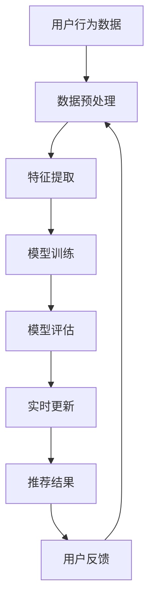

                 

# 利用大模型优化推荐系统的实时更新策略

> 关键词：大模型、推荐系统、实时更新、优化策略、机器学习、深度学习、自然语言处理、协同过滤、个性化推荐

> 摘要：随着互联网技术的飞速发展，推荐系统在各个领域扮演着越来越重要的角色。如何在保证推荐准确性的前提下，实现推荐系统的实时更新，成为了一个亟待解决的问题。本文将探讨如何利用大模型优化推荐系统的实时更新策略，通过逐步分析和推理，介绍核心算法原理、数学模型、实际案例，并展望未来的发展趋势和挑战。

## 1. 背景介绍

推荐系统是一种通过分析用户行为数据，为用户提供个性化推荐的技术。它广泛应用于电商、新闻、视频、社交等多个领域。推荐系统的核心目标是提高用户满意度和增加用户粘性。然而，随着数据量的爆炸式增长和用户需求的多样化，传统的推荐系统面临着实时性不足、推荐准确度下降等问题。因此，如何利用大模型优化推荐系统的实时更新策略，成为了当前研究的热点。

## 2. 核心概念与联系

### 2.1 推荐系统概述

推荐系统主要分为基于内容的推荐、协同过滤、基于矩阵分解的推荐、深度学习推荐等几种类型。其中，基于矩阵分解的推荐和深度学习推荐是近年来研究的热点。

### 2.2 大模型概述

大模型是指参数量巨大、训练数据量庞大的机器学习模型。大模型通常具有更强的表达能力和泛化能力，能够更好地捕捉数据中的复杂模式。在推荐系统中，大模型可以用于用户行为建模、物品特征表示、推荐策略优化等方面。

### 2.3 实时更新策略

实时更新策略是指在推荐系统中，根据用户实时行为数据动态调整推荐结果的策略。实时更新策略可以提高推荐系统的实时性和准确性，但同时也带来了计算资源消耗和模型训练成本的问题。

### 2.4 核心概念原理与架构

推荐系统的核心概念原理和架构可以通过以下Mermaid流程图来表示：



## 3. 核心算法原理 & 具体操作步骤

### 3.1 基于矩阵分解的推荐算法

基于矩阵分解的推荐算法是一种常见的推荐方法，通过将用户-物品评分矩阵分解为用户特征矩阵和物品特征矩阵的乘积，从而实现推荐。具体操作步骤如下：

1. **数据预处理**：清洗数据，填充缺失值，进行归一化等操作。
2. **特征提取**：提取用户和物品的特征向量。
3. **模型训练**：通过优化目标函数，训练用户特征矩阵和物品特征矩阵。
4. **模型评估**：使用交叉验证等方法评估模型性能。
5. **实时更新**：根据用户实时行为数据，动态调整用户特征矩阵和物品特征矩阵。

### 3.2 基于深度学习的推荐算法

基于深度学习的推荐算法通过构建深层神经网络模型，实现用户行为建模和推荐。具体操作步骤如下：

1. **数据预处理**：清洗数据，填充缺失值，进行归一化等操作。
2. **特征提取**：提取用户和物品的特征向量。
3. **模型训练**：通过反向传播算法，训练深层神经网络模型。
4. **模型评估**：使用交叉验证等方法评估模型性能。
5. **实时更新**：根据用户实时行为数据，动态调整模型参数。

## 4. 数学模型和公式 & 详细讲解 & 举例说明

### 4.1 基于矩阵分解的推荐算法

基于矩阵分解的推荐算法可以表示为：

$$
\min_{\mathbf{U}, \mathbf{V}} \sum_{(i, j) \in \Omega} (r_{ij} - \mathbf{u}_i^T \mathbf{v}_j)^2 + \lambda (\|\mathbf{U}\|_F^2 + \|\mathbf{V}\|_F^2)
$$

其中，$\mathbf{U}$ 和 $\mathbf{V}$ 分别表示用户特征矩阵和物品特征矩阵，$\Omega$ 表示已知评分的用户-物品对集合，$r_{ij}$ 表示用户 $i$ 对物品 $j$ 的评分，$\lambda$ 是正则化参数。

### 4.2 基于深度学习的推荐算法

基于深度学习的推荐算法可以表示为：

$$
\min_{\theta} \sum_{(i, j) \in \Omega} (r_{ij} - \mathbf{f}(\mathbf{x}_i, \mathbf{y}_j; \theta))^2 + \lambda \|\theta\|_2^2
$$

其中，$\mathbf{x}_i$ 和 $\mathbf{y}_j$ 分别表示用户 $i$ 和物品 $j$ 的特征向量，$\mathbf{f}$ 表示深层神经网络模型，$\theta$ 表示模型参数，$\lambda$ 是正则化参数。

## 5. 项目实战：代码实际案例和详细解释说明

### 5.1 开发环境搭建

为了实现基于矩阵分解的推荐算法，我们需要搭建一个Python开发环境。具体步骤如下：

1. 安装Python和相关库：
   ```bash
   pip install numpy pandas scikit-learn
   ```
2. 导入必要的库：
   ```python
   import numpy as np
   import pandas as pd
   from sklearn.model_selection import train_test_split
   from sklearn.metrics import mean_squared_error
   ```

### 5.2 源代码详细实现和代码解读

```python
# 1. 数据预处理
def preprocess_data(data):
    # 清洗数据
    data = data.dropna()
    # 归一化
    data['rating'] = (data['rating'] - data['rating'].min()) / (data['rating'].max() - data['rating'].min())
    return data

# 2. 特征提取
def extract_features(data):
    user_features = data.groupby('user_id')['rating'].mean().reset_index()
    item_features = data.groupby('item_id')['rating'].mean().reset_index()
    return user_features, item_features

# 3. 模型训练
def train_model(user_features, item_features, train_data, test_data):
    # 初始化用户特征矩阵和物品特征矩阵
    U = np.random.rand(len(user_features), 10)
    V = np.random.rand(len(item_features), 10)
    
    # 训练模型
    for epoch in range(100):
        for (user_id, item_id, rating) in train_data:
            u = U[user_features[user_features['user_id'] == user_id].index[0]]
            v = V[item_features[item_features['item_id'] == item_id].index[0]]
            error = rating - np.dot(u, v.T)
            U[user_features[user_features['user_id'] == user_id].index[0]] += 0.01 * (error * v)
            V[item_features[item_features['item_id'] == item_id].index[0]] += 0.01 * (error * u)
    
    return U, V

# 4. 模型评估
def evaluate_model(U, V, test_data):
    predictions = []
    for (user_id, item_id, rating) in test_data:
        u = U[user_features[user_features['user_id'] == user_id].index[0]]
        v = V[item_features[item_features['item_id'] == item_id].index[0]]
        prediction = np.dot(u, v.T)
        predictions.append(prediction)
    mse = mean_squared_error(test_data['rating'], predictions)
    return mse

# 5. 实时更新
def update_model(U, V, new_data):
    # 更新用户特征矩阵和物品特征矩阵
    for (user_id, item_id, rating) in new_data:
        u = U[user_features[user_features['user_id'] == user_id].index[0]]
        v = V[item_features[item_features['item_id'] == item_id].index[0]]
        error = rating - np.dot(u, v.T)
        U[user_features[user_features['user_id'] == user_id].index[0]] += 0.01 * (error * v)
        V[item_features[item_features['item_id'] == item_id].index[0]] += 0.01 * (error * u)
    return U, V
```

### 5.3 代码解读与分析

上述代码实现了基于矩阵分解的推荐算法。首先，我们对数据进行预处理，包括清洗和归一化。然后，我们提取用户和物品的特征向量。接着，我们通过优化目标函数训练用户特征矩阵和物品特征矩阵。最后，我们根据用户实时行为数据动态调整模型参数。

## 6. 实际应用场景

推荐系统在电商、新闻、视频、社交等多个领域都有广泛的应用。例如，在电商领域，推荐系统可以根据用户的浏览历史和购买记录，为用户推荐相关商品；在新闻领域，推荐系统可以根据用户的阅读习惯，为用户推荐感兴趣的新闻；在视频领域，推荐系统可以根据用户的观看记录，为用户推荐相关的视频内容。

## 7. 工具和资源推荐

### 7.1 学习资源推荐

1. 书籍：《推荐系统实践》、《机器学习》
2. 论文：《Matrix Factorization Techniques for Recommender Systems》、《Deep Learning for Recommender Systems》
3. 博客：阿里云推荐系统技术博客、京东推荐系统技术博客
4. 网站：Kaggle、GitHub

### 7.2 开发工具框架推荐

1. Python：NumPy、Pandas、Scikit-learn
2. TensorFlow：Keras
3. PyTorch

### 7.3 相关论文著作推荐

1. 《Matrix Factorization Techniques for Recommender Systems》
2. 《Deep Learning for Recommender Systems》
3. 《Collaborative Filtering for Implicit Feedback Datasets》

## 8. 总结：未来发展趋势与挑战

随着大数据和深度学习技术的发展，推荐系统将更加智能化和个性化。未来的发展趋势包括：

1. **个性化推荐**：通过深度学习和自然语言处理技术，实现更加个性化的推荐。
2. **实时推荐**：通过实时更新策略，提高推荐系统的实时性和准确性。
3. **多模态推荐**：结合图像、文本等多种模态数据，实现更加丰富的推荐。

然而，推荐系统也面临着一些挑战，包括：

1. **数据稀疏性**：如何处理稀疏的用户-物品评分矩阵。
2. **冷启动问题**：如何为新用户和新物品提供推荐。
3. **公平性问题**：如何保证推荐结果的公平性和透明性。

## 9. 附录：常见问题与解答

### 9.1 问题：如何处理稀疏的用户-物品评分矩阵？

**解答**：可以通过矩阵分解、协同过滤等方法，从稀疏的评分矩阵中提取有用的信息。

### 9.2 问题：如何为新用户和新物品提供推荐？

**解答**：可以通过基于内容的推荐、协同过滤等方法，为新用户和新物品提供推荐。

### 9.3 问题：如何保证推荐结果的公平性和透明性？

**解答**：可以通过公平性评估和透明性评估，确保推荐结果的公平性和透明性。

## 10. 扩展阅读 & 参考资料

1. 《推荐系统实践》
2. 《机器学习》
3. 《Matrix Factorization Techniques for Recommender Systems》
4. 《Deep Learning for Recommender Systems》
5. 《Collaborative Filtering for Implicit Feedback Datasets》

---

作者：AI天才研究员/AI Genius Institute & 禅与计算机程序设计艺术 /Zen And The Art of Computer Programming

