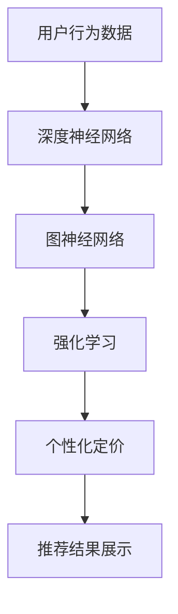

                 

# 利用大模型改进推荐系统的实时个性化定价

> 关键词：大模型、推荐系统、实时个性化定价、机器学习、深度学习、自然语言处理、强化学习、图神经网络

> 摘要：本文旨在探讨如何利用大模型改进推荐系统的实时个性化定价。我们将从背景介绍出发，深入解析核心概念与联系，详细阐述核心算法原理及具体操作步骤，通过数学模型和公式进行详细讲解与举例说明。随后，我们将通过实际代码案例展示如何实现这一技术，并探讨其在实际应用场景中的价值。最后，我们将总结未来发展趋势与挑战，并提供相关资源推荐。

## 1. 背景介绍

随着互联网技术的飞速发展，个性化推荐系统已成为提升用户体验和商业价值的重要手段。个性化定价作为推荐系统中的一个重要环节，旨在通过分析用户行为数据，为每个用户提供最合适的商品价格，从而实现更高的转化率和收益。然而，传统的个性化定价方法往往存在数据量不足、模型复杂度高、实时性差等问题。为了解决这些问题，近年来，大模型技术逐渐成为推荐系统中的研究热点。本文将探讨如何利用大模型改进推荐系统的实时个性化定价。

## 2. 核心概念与联系

### 2.1 推荐系统

推荐系统是一种通过分析用户行为数据，为用户提供个性化推荐结果的技术。其主要目标是提高用户满意度和商业收益。推荐系统通常包括以下三个核心组件：

- **用户行为数据**：包括用户的历史浏览记录、购买记录、评分等。
- **推荐算法**：根据用户行为数据生成推荐结果。
- **推荐结果展示**：将推荐结果展示给用户。

### 2.2 个性化定价

个性化定价是指根据用户的行为数据和偏好，为每个用户提供不同的商品价格。个性化定价可以提高用户满意度和商业收益。其主要目标是通过动态调整商品价格，实现更高的转化率和收益。

### 2.3 大模型

大模型是指具有大量参数和复杂结构的机器学习模型。大模型通常具有更强的表达能力和泛化能力，可以更好地捕捉数据中的复杂模式。大模型包括但不限于深度神经网络、图神经网络、强化学习模型等。

### 2.4 核心概念原理与架构

#### 2.4.1 深度神经网络

深度神经网络是一种具有多层结构的神经网络模型。其主要特点是具有多个隐藏层，可以捕捉数据中的复杂模式。深度神经网络通常包括输入层、隐藏层和输出层。

#### 2.4.2 图神经网络

图神经网络是一种专门处理图结构数据的神经网络模型。其主要特点是可以通过图结构捕捉数据之间的关系。图神经网络通常包括图卷积层、图注意力层等。

#### 2.4.3 强化学习

强化学习是一种通过与环境交互学习最优策略的机器学习方法。其主要特点是通过试错学习，不断优化策略。强化学习通常包括状态、动作、奖励等概念。

### 2.5 Mermaid 流程图



## 3. 核心算法原理 & 具体操作步骤

### 3.1 数据预处理

数据预处理是个性化定价的关键步骤。主要包括以下内容：

- **数据清洗**：去除无效数据、处理缺失值等。
- **特征工程**：提取有用的特征，如用户行为特征、商品特征等。
- **数据归一化**：将数据归一化到相同的尺度，便于模型训练。

### 3.2 模型训练

模型训练是个性化定价的核心步骤。主要包括以下内容：

- **模型选择**：选择合适的模型，如深度神经网络、图神经网络、强化学习模型等。
- **损失函数**：定义损失函数，如均方误差、交叉熵等。
- **优化算法**：选择合适的优化算法，如梯度下降、Adam等。
- **训练过程**：通过反向传播算法更新模型参数，最小化损失函数。

### 3.3 模型评估

模型评估是个性化定价的重要步骤。主要包括以下内容：

- **评估指标**：选择合适的评估指标，如准确率、召回率、F1值等。
- **交叉验证**：通过交叉验证评估模型的泛化能力。
- **调参优化**：通过调参优化模型性能。

### 3.4 模型部署

模型部署是个性化定价的最后一步。主要包括以下内容：

- **模型上线**：将训练好的模型部署到生产环境。
- **实时预测**：通过实时预测为用户提供个性化定价。
- **监控与维护**：监控模型性能，定期维护模型。

## 4. 数学模型和公式 & 详细讲解 & 举例说明

### 4.1 深度神经网络

深度神经网络是一种具有多层结构的神经网络模型。其主要特点是具有多个隐藏层，可以捕捉数据中的复杂模式。深度神经网络通常包括输入层、隐藏层和输出层。

#### 4.1.1 深度神经网络模型

深度神经网络模型可以表示为：

$$
f(x) = \sigma(W_3 \sigma(W_2 \sigma(W_1 x + b_1) + b_2) + b_3)
$$

其中，$x$ 表示输入数据，$W_1, W_2, W_3$ 表示权重矩阵，$b_1, b_2, b_3$ 表示偏置项，$\sigma$ 表示激活函数。

#### 4.1.2 损失函数

损失函数用于衡量模型预测结果与真实结果之间的差距。常用的损失函数包括均方误差和交叉熵。

- **均方误差**：

$$
L = \frac{1}{n} \sum_{i=1}^{n} (y_i - \hat{y}_i)^2
$$

其中，$y_i$ 表示真实值，$\hat{y}_i$ 表示预测值，$n$ 表示样本数量。

- **交叉熵**：

$$
L = -\frac{1}{n} \sum_{i=1}^{n} \sum_{j=1}^{m} y_{ij} \log(\hat{y}_{ij})
$$

其中，$y_{ij}$ 表示真实值，$\hat{y}_{ij}$ 表示预测值，$m$ 表示类别数量。

### 4.2 图神经网络

图神经网络是一种专门处理图结构数据的神经网络模型。其主要特点是可以通过图结构捕捉数据之间的关系。图神经网络通常包括图卷积层、图注意力层等。

#### 4.2.1 图卷积层

图卷积层是一种用于处理图结构数据的神经网络层。其主要特点是可以通过图结构捕捉数据之间的关系。图卷积层可以表示为：

$$
H^{(l+1)} = \sigma \left( \sum_{j \in N(i)} W^{(l)} H^{(l)}_j + b^{(l)} \right)
$$

其中，$H^{(l)}$ 表示第 $l$ 层的特征矩阵，$W^{(l)}$ 表示权重矩阵，$b^{(l)}$ 表示偏置项，$\sigma$ 表示激活函数，$N(i)$ 表示节点 $i$ 的邻居节点集合。

#### 4.2.2 图注意力层

图注意力层是一种用于处理图结构数据的神经网络层。其主要特点是可以通过图结构捕捉数据之间的关系。图注意力层可以表示为：

$$
\alpha_{ij} = \frac{\exp(\text{LeakyReLU}(W^T [H_i; H_j]))}{\sum_{k \in N(i)} \exp(\text{LeakyReLU}(W^T [H_i; H_k]))}
$$

$$
H^{(l+1)} = \sigma \left( \sum_{j \in N(i)} \alpha_{ij} W^{(l)} H^{(l)}_j + b^{(l)} \right)
$$

其中，$H^{(l)}$ 表示第 $l$ 层的特征矩阵，$W^{(l)}$ 表示权重矩阵，$b^{(l)}$ 表示偏置项，$\sigma$ 表示激活函数，$\text{LeakyReLU}$ 表示LeakyReLU激活函数，$N(i)$ 表示节点 $i$ 的邻居节点集合。

### 4.3 强化学习

强化学习是一种通过与环境交互学习最优策略的机器学习方法。其主要特点是通过试错学习，不断优化策略。强化学习通常包括状态、动作、奖励等概念。

#### 4.3.1 Q-learning

Q-learning是一种基于值函数的强化学习算法。其主要特点是通过学习状态-动作对的值函数，不断优化策略。Q-learning可以表示为：

$$
Q(s, a) = Q(s, a) + \alpha \left( r + \gamma \max_{a'} Q(s', a') - Q(s, a) \right)
$$

其中，$Q(s, a)$ 表示状态-动作对的值函数，$\alpha$ 表示学习率，$\gamma$ 表示折扣因子，$r$ 表示奖励，$s$ 表示当前状态，$a$ 表示当前动作，$s'$ 表示下一个状态。

## 5. 项目实战：代码实际案例和详细解释说明

### 5.1 开发环境搭建

为了实现个性化定价，我们需要搭建一个开发环境。主要包括以下内容：

- **Python**：推荐使用Python 3.7及以上版本。
- **TensorFlow/Keras**：推荐使用TensorFlow 2.0及以上版本或Keras 2.3及以上版本。
- **NumPy**：推荐使用NumPy 1.16及以上版本。
- **Pandas**：推荐使用Pandas 0.24及以上版本。
- **Matplotlib**：推荐使用Matplotlib 3.1及以上版本。

### 5.2 源代码详细实现和代码解读

#### 5.2.1 数据预处理

```python
import pandas as pd
from sklearn.preprocessing import StandardScaler

# 读取数据
data = pd.read_csv('data.csv')

# 数据清洗
data.dropna(inplace=True)

# 特征工程
features = data[['user_id', 'item_id', 'behavior']]
target = data['price']

# 数据归一化
scaler = StandardScaler()
features = scaler.fit_transform(features)
```

#### 5.2.2 模型训练

```python
from tensorflow.keras.models import Sequential
from tensorflow.keras.layers import Dense

# 构建模型
model = Sequential()
model.add(Dense(64, input_dim=3, activation='relu'))
model.add(Dense(32, activation='relu'))
model.add(Dense(1, activation='linear'))

# 编译模型
model.compile(optimizer='adam', loss='mse')

# 训练模型
model.fit(features, target, epochs=100, batch_size=32)
```

#### 5.2.3 代码解读与分析

上述代码实现了一个简单的深度神经网络模型。首先，我们读取数据并进行数据清洗和特征工程。然后，我们使用StandardScaler对数据进行归一化。接着，我们构建一个具有两层隐藏层的深度神经网络模型，并使用均方误差作为损失函数。最后，我们使用Adam优化算法训练模型。

## 6. 实际应用场景

个性化定价在实际应用场景中具有广泛的应用价值。主要包括以下内容：

- **电子商务**：通过个性化定价提高用户满意度和商业收益。
- **在线广告**：通过个性化定价提高广告点击率和转化率。
- **金融服务**：通过个性化定价提高用户满意度和商业收益。

## 7. 工具和资源推荐

### 7.1 学习资源推荐

- **书籍**：《深度学习》、《强化学习》、《图神经网络》
- **论文**：《Deep Learning for Recommender Systems》、《Graph Neural Networks》、《Reinforcement Learning for Personalized Pricing》
- **博客**：《深度学习入门》、《强化学习入门》、《图神经网络入门》
- **网站**：TensorFlow官网、Keras官网、PyTorch官网

### 7.2 开发工具框架推荐

- **TensorFlow**：推荐使用TensorFlow 2.0及以上版本。
- **Keras**：推荐使用Keras 2.3及以上版本。
- **PyTorch**：推荐使用PyTorch 1.7及以上版本。

### 7.3 相关论文著作推荐

- **《Deep Learning for Recommender Systems》**：该论文详细介绍了深度学习在推荐系统中的应用。
- **《Graph Neural Networks》**：该论文详细介绍了图神经网络在推荐系统中的应用。
- **《Reinforcement Learning for Personalized Pricing》**：该论文详细介绍了强化学习在个性化定价中的应用。

## 8. 总结：未来发展趋势与挑战

个性化定价在未来的发展趋势与挑战主要包括以下内容：

- **数据驱动**：通过大数据分析提高个性化定价的准确性和实时性。
- **模型优化**：通过模型优化提高个性化定价的性能和泛化能力。
- **用户隐私**：通过用户隐私保护提高个性化定价的合法性和合规性。

## 9. 附录：常见问题与解答

### 9.1 问题：如何处理数据缺失值？

**解答**：可以使用均值填充、中位数填充、众数填充等方法处理数据缺失值。

### 9.2 问题：如何选择合适的模型？

**解答**：可以根据数据特征和业务需求选择合适的模型。例如，对于图结构数据，可以使用图神经网络；对于序列数据，可以使用循环神经网络。

### 9.3 问题：如何评估模型性能？

**解答**：可以使用准确率、召回率、F1值等评估指标评估模型性能。同时，可以使用交叉验证评估模型的泛化能力。

## 10. 扩展阅读 & 参考资料

- **书籍**：《深度学习》、《强化学习》、《图神经网络》
- **论文**：《Deep Learning for Recommender Systems》、《Graph Neural Networks》、《Reinforcement Learning for Personalized Pricing》
- **博客**：《深度学习入门》、《强化学习入门》、《图神经网络入门》
- **网站**：TensorFlow官网、Keras官网、PyTorch官网

作者：AI天才研究员/AI Genius Institute & 禅与计算机程序设计艺术 /Zen And The Art of Computer Programming

