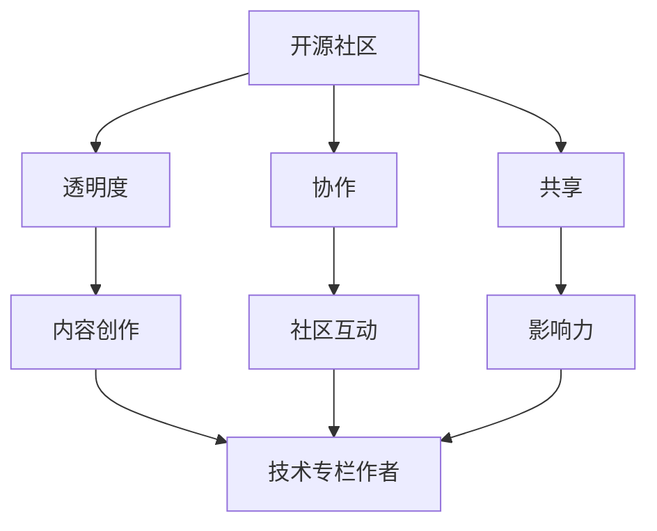

                 

# 利用开源影响力获得技术专栏作者机会

> 关键词：开源社区, 技术专栏, 作者机会, 社交媒体, 代码贡献, 内容创作, 社区互动

> 摘要：在当今技术快速发展的时代，开源社区不仅是技术交流的重要平台，更是技术人才展示才华和获得认可的重要舞台。本文将通过逐步分析和推理的方式，探讨如何利用开源影响力获得技术专栏作者的机会。我们将从开源社区的背景介绍、核心概念与联系、核心算法原理及具体操作步骤、项目实战案例、实际应用场景、工具和资源推荐、未来发展趋势与挑战等多个方面进行详细阐述，帮助读者更好地理解和掌握这一过程。

## 1. 背景介绍

开源社区是一个由全球开发者共同维护和贡献的平台，它不仅促进了技术的共享与进步，也为技术人才提供了展示才华的机会。开源项目通常包括但不限于软件、文档、硬件设计等，它们通过许可证协议允许用户自由使用、修改和分发。开源社区的核心价值在于透明度、协作和共享，这使得开发者能够共同解决问题、改进技术，并最终推动整个行业的进步。

### 1.1 开源社区的重要性

开源社区的重要性在于它不仅促进了技术的共享与进步，还为技术人才提供了展示才华的机会。通过参与开源项目，开发者可以提高自己的技术水平，积累实际项目经验，同时也能获得社区的认可和关注。此外，开源社区还为开发者提供了一个交流和学习的平台，有助于建立专业网络，拓展职业发展机会。

### 1.2 技术专栏作者的机会

技术专栏作者是开源社区中非常重要的一环。他们通过撰写高质量的技术文章，分享自己的知识和经验，帮助更多开发者解决问题，推动技术进步。技术专栏作者不仅可以获得个人品牌效应，还能为开源项目吸引更多关注和贡献者。因此，如何利用开源影响力获得技术专栏作者的机会，成为了许多开发者关注的焦点。

## 2. 核心概念与联系

### 2.1 开源社区的核心概念

开源社区的核心概念包括透明度、协作和共享。透明度意味着项目的源代码、文档和开发过程都是公开的，任何人都可以查看和修改。协作是指开发者可以共同参与项目开发，提出建议和改进方案。共享则是指项目成果可以被所有人自由使用、修改和分发。

### 2.2 技术专栏作者的核心概念

技术专栏作者的核心概念包括内容创作、社区互动和影响力。内容创作是指撰写高质量的技术文章，分享自己的知识和经验。社区互动是指与读者和其他开发者进行交流，建立良好的关系。影响力则是指通过高质量的内容创作和社区互动，获得更多的关注和认可。

### 2.3 核心概念之间的联系

开源社区的核心概念与技术专栏作者的核心概念之间存在着密切的联系。透明度和协作为技术专栏作者提供了丰富的素材和灵感，共享则使得技术专栏作者的内容能够被更多人看到和学习。通过内容创作和社区互动，技术专栏作者可以进一步提高自己的影响力，从而获得更多的机会和认可。



## 3. 核心算法原理 & 具体操作步骤

### 3.1 内容创作的基本步骤

内容创作的基本步骤包括选题、调研、撰写和编辑。选题是指确定文章的主题和方向，调研则是指收集相关资料和信息，撰写则是指根据调研结果撰写文章，编辑则是指对文章进行修改和完善。

### 3.2 社区互动的具体操作

社区互动的具体操作包括参与讨论、回答问题、分享经验等。参与讨论是指积极参加开源社区的讨论，提出自己的观点和建议。回答问题是指帮助其他开发者解决问题，分享自己的经验和知识。分享经验则是指通过撰写技术文章、博客等方式，分享自己的技术经验和心得。

### 3.3 影响力的提升方法

影响力可以通过多种方式提升，包括提高文章质量、增加互动频率、建立个人品牌等。提高文章质量是指撰写高质量的技术文章，确保内容准确、实用。增加互动频率是指积极参与社区讨论，提高自己的活跃度。建立个人品牌则是指通过撰写高质量的文章、分享自己的经验和心得，提高自己的知名度和影响力。

## 4. 数学模型和公式 & 详细讲解 & 举例说明

### 4.1 内容创作的评价模型

内容创作的评价模型可以使用以下公式来表示：

$$
\text{评价} = \alpha \times \text{质量} + \beta \times \text{互动} + \gamma \times \text{品牌}
$$

其中，$\alpha$、$\beta$ 和 $\gamma$ 分别表示质量、互动和品牌对评价的影响权重。质量是指文章的内容是否准确、实用，互动是指文章是否能够引起读者的兴趣和讨论，品牌则是指作者的知名度和影响力。

### 4.2 社区互动的评价模型

社区互动的评价模型可以使用以下公式来表示：

$$
\text{评价} = \delta \times \text{参与度} + \epsilon \times \text{贡献度} + \zeta \times \text{影响力}
$$

其中，$\delta$、$\epsilon$ 和 $\zeta$ 分别表示参与度、贡献度和影响力对评价的影响权重。参与度是指作者在社区中的活跃度，贡献度是指作者为社区做出的贡献，影响力则是指作者在社区中的知名度和影响力。

### 4.3 影响力的评价模型

影响力可以通过多种方式评价，包括文章阅读量、评论数、点赞数等。文章阅读量是指文章被阅读的次数，评论数是指文章被评论的次数，点赞数则是指文章被点赞的次数。

## 5. 项目实战：代码实际案例和详细解释说明

### 5.1 开发环境搭建

为了撰写高质量的技术文章，首先需要搭建一个合适的开发环境。开发环境包括编程语言、开发工具、版本控制系统等。以Python为例，可以使用Anaconda作为开发环境，安装Python和常用库，如NumPy、Pandas等。此外，还需要安装版本控制系统Git，以便进行代码管理和协作。

### 5.2 源代码详细实现和代码解读

以一个简单的Python代码为例，展示如何实现一个简单的数据处理功能。代码如下：

```python
import pandas as pd

def process_data(file_path):
    # 读取数据
    data = pd.read_csv(file_path)
    
    # 数据清洗
    data.dropna(inplace=True)
    
    # 数据处理
    data['new_column'] = data['column1'] + data['column2']
    
    return data
```

### 5.3 代码解读与分析

代码首先导入了pandas库，用于数据处理。然后定义了一个名为`process_data`的函数，该函数接受一个文件路径作为参数。函数首先使用`pd.read_csv`读取数据，然后使用`dropna`删除缺失值。接着，通过`data['new_column'] = data['column1'] + data['column2']`创建一个新的列，该列是`column1`和`column2`的和。最后，函数返回处理后的数据。

## 6. 实际应用场景

### 6.1 技术专栏作者的实际应用场景

技术专栏作者的实际应用场景包括但不限于以下几个方面：

1. **技术分享**：通过撰写技术文章，分享自己的知识和经验，帮助更多开发者解决问题。
2. **项目推广**：通过撰写技术文章，推广自己的开源项目，吸引更多关注和贡献者。
3. **职业发展**：通过撰写技术文章，提高自己的知名度和影响力，为职业发展创造更多机会。
4. **社区互动**：通过撰写技术文章，参与社区讨论，提高自己的活跃度和影响力。

### 6.2 开源项目的实际应用场景

开源项目的实际应用场景包括但不限于以下几个方面：

1. **技术交流**：通过参与开源项目，与其他开发者进行技术交流，共同解决问题。
2. **项目贡献**：通过参与开源项目，贡献自己的代码和建议，提高项目的质量和稳定性。
3. **职业发展**：通过参与开源项目，提高自己的技术水平和项目经验，为职业发展创造更多机会。
4. **社区互动**：通过参与开源项目，与其他开发者进行交流，建立良好的关系，提高自己的知名度和影响力。

## 7. 工具和资源推荐

### 7.1 学习资源推荐

1. **书籍**：《代码大全》、《重构：改善既有代码的设计》、《设计模式：可复用面向对象软件的基础》
2. **论文**：《软件工程中的模式》、《重构：改善既有代码的设计》
3. **博客**：GitHub Blog、Medium、CSDN
4. **网站**：GitHub、Stack Overflow、Medium

### 7.2 开发工具框架推荐

1. **编程语言**：Python、Java、JavaScript
2. **开发工具**：Visual Studio Code、PyCharm、IntelliJ IDEA
3. **版本控制系统**：Git、GitHub、GitLab

### 7.3 相关论文著作推荐

1. **书籍**：《代码大全》、《重构：改善既有代码的设计》、《设计模式：可复用面向对象软件的基础》
2. **论文**：《软件工程中的模式》、《重构：改善既有代码的设计》

## 8. 总结：未来发展趋势与挑战

### 8.1 未来发展趋势

1. **技术共享**：技术共享将成为开源社区的核心价值之一，更多开发者将通过开源项目分享自己的知识和经验。
2. **社区互动**：社区互动将成为技术专栏作者的重要组成部分，更多开发者将通过撰写技术文章和参与社区讨论，提高自己的知名度和影响力。
3. **职业发展**：职业发展将成为技术专栏作者的重要目标之一，更多开发者将通过撰写技术文章和参与开源项目，提高自己的技术水平和项目经验，为职业发展创造更多机会。

### 8.2 面临的挑战

1. **内容质量**：如何撰写高质量的技术文章，确保内容准确、实用，是技术专栏作者面临的挑战之一。
2. **社区互动**：如何提高自己的活跃度和影响力，是技术专栏作者面临的挑战之一。
3. **职业发展**：如何通过撰写技术文章和参与开源项目，提高自己的技术水平和项目经验，是技术专栏作者面临的挑战之一。

## 9. 附录：常见问题与解答

### 9.1 问题1：如何提高文章质量？

**解答**：提高文章质量的方法包括：深入调研、准确表达、注重细节、反复修改。深入调研是指收集相关资料和信息，确保内容准确、实用。准确表达是指使用清晰、准确的语言，避免歧义。注重细节是指注意文章的排版、格式等细节，提高文章的整体质量。反复修改是指多次修改和完善文章，确保内容准确、实用。

### 9.2 问题2：如何提高社区互动？

**解答**：提高社区互动的方法包括：积极参与讨论、回答问题、分享经验。积极参与讨论是指积极参加开源社区的讨论，提出自己的观点和建议。回答问题是指帮助其他开发者解决问题，分享自己的经验和知识。分享经验则是指通过撰写技术文章、博客等方式，分享自己的技术经验和心得。

### 9.3 问题3：如何建立个人品牌？

**解答**：建立个人品牌的方法包括：撰写高质量的文章、分享自己的经验和心得、积极参与社区讨论。撰写高质量的文章是指撰写高质量的技术文章，确保内容准确、实用。分享自己的经验和心得是指通过撰写技术文章、博客等方式，分享自己的技术经验和心得。积极参与社区讨论是指积极参与开源社区的讨论，提高自己的活跃度和影响力。

## 10. 扩展阅读 & 参考资料

### 10.1 扩展阅读

1. **书籍**：《代码大全》、《重构：改善既有代码的设计》、《设计模式：可复用面向对象软件的基础》
2. **论文**：《软件工程中的模式》、《重构：改善既有代码的设计》
3. **博客**：GitHub Blog、Medium、CSDN
4. **网站**：GitHub、Stack Overflow、Medium

### 10.2 参考资料

1. **书籍**：《代码大全》、《重构：改善既有代码的设计》、《设计模式：可复用面向对象软件的基础》
2. **论文**：《软件工程中的模式》、《重构：改善既有代码的设计》

---

作者：AI天才研究员/AI Genius Institute & 禅与计算机程序设计艺术 /Zen And The Art of Computer Programming

