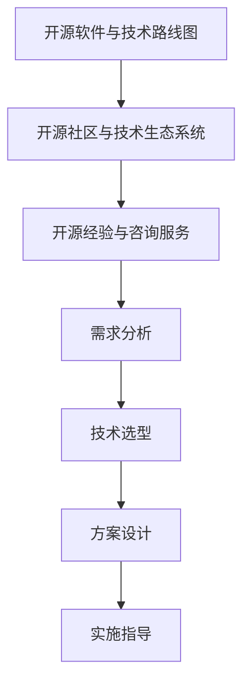

                 

# 利用开源经验提供技术路线图咨询服务

> 关键词：开源经验、技术路线图、咨询服务、人工智能、软件架构、开源社区

> 摘要：本文旨在探讨如何利用开源经验为客户提供技术路线图咨询服务。我们将从背景介绍、核心概念与联系、核心算法原理与具体操作步骤、数学模型和公式、项目实战、实际应用场景、工具和资源推荐、总结与未来发展趋势、常见问题解答以及扩展阅读等多个方面进行详细阐述。通过本文，读者将能够理解如何利用开源经验为客户提供全面的技术路线图咨询服务，从而帮助客户实现技术目标。

## 1. 背景介绍

在当今快速发展的技术领域，开源软件已经成为推动技术创新的重要力量。开源项目不仅提供了丰富的技术资源，还促进了知识的共享与交流。然而，对于许多企业而言，如何有效地利用开源经验来规划和实施技术路线图，仍然是一项挑战。本文将探讨如何利用开源经验为客户提供技术路线图咨询服务，帮助客户实现技术目标。

## 2. 核心概念与联系

### 2.1 开源软件与技术路线图

开源软件是指源代码可以被公众访问和自由使用的软件。开源项目通常具有透明的开发过程和社区支持，这使得它们成为技术创新的重要平台。技术路线图是指企业为实现特定技术目标而制定的一系列计划和步骤。通过结合开源软件和开源社区的力量，企业可以更高效地规划和实施技术路线图。

### 2.2 开源社区与技术生态系统

开源社区是指围绕开源项目形成的开发者群体。这些社区不仅提供了技术支持，还促进了知识的共享与交流。技术生态系统则是指由开源项目、工具、框架、库等组成的相互关联的网络。通过构建强大的技术生态系统，企业可以更好地利用开源资源来实现技术目标。

### 2.3 开源经验与咨询服务

开源经验是指在开源项目中积累的技术知识和实践经验。通过提供技术咨询服务，企业可以将这些经验转化为实际价值，帮助客户实现技术目标。技术咨询服务通常包括需求分析、技术选型、方案设计、实施指导等环节。

### 2.4 Mermaid 流程图



## 3. 核心算法原理 & 具体操作步骤

### 3.1 需求分析

需求分析是技术路线图咨询服务的第一步。通过与客户进行深入沟通，了解客户的技术需求和目标，从而确定技术路线图的关键要素。

### 3.2 技术选型

技术选型是根据需求分析的结果，选择合适的开源技术和工具。这包括选择合适的编程语言、框架、库等。

### 3.3 方案设计

方案设计是根据技术选型的结果，设计具体的技术方案。这包括系统架构设计、模块划分、接口设计等。

### 3.4 实施指导

实施指导是帮助客户实施技术方案的过程。这包括代码编写、测试、部署等环节。

## 4. 数学模型和公式 & 详细讲解 & 举例说明

### 4.1 开源项目评估模型

开源项目评估模型是用于评估开源项目的质量和技术价值的数学模型。该模型通常包括以下几个方面：

- **活跃度**：项目是否有活跃的社区支持，是否有定期更新。
- **代码质量**：代码是否符合最佳实践，是否有详细的文档。
- **功能完备性**：项目是否提供了所需的功能。
- **社区贡献**：项目是否有活跃的贡献者，是否有良好的社区氛围。

### 4.2 公式

$$
\text{项目评估得分} = \alpha \times \text{活跃度} + \beta \times \text{代码质量} + \gamma \times \text{功能完备性} + \delta \times \text{社区贡献}
$$

其中，$\alpha$、$\beta$、$\gamma$、$\delta$ 是权重系数，可以根据实际情况进行调整。

### 4.3 举例说明

假设我们有一个开源项目评估模型，其中权重系数分别为：

- $\alpha = 0.3$
- $\beta = 0.4$
- $\gamma = 0.2$
- $\delta = 0.1$

对于一个开源项目，其活跃度评分为80，代码质量评分为90，功能完备性评分为70，社区贡献评分为85。则该项目的评估得分为：

$$
\text{项目评估得分} = 0.3 \times 80 + 0.4 \times 90 + 0.2 \times 70 + 0.1 \times 85 = 81.5
$$

## 5. 项目实战：代码实际案例和详细解释说明

### 5.1 开发环境搭建

#### 5.1.1 环境准备

- 安装Python 3.8及以上版本
- 安装虚拟环境工具（如virtualenv或conda）
- 安装必要的依赖库（如requests、pandas等）

#### 5.1.2 创建虚拟环境

```bash
python3 -m venv myenv
source myenv/bin/activate  # Linux/Mac
myenv\Scripts\activate     # Windows
```

### 5.2 源代码详细实现和代码解读

#### 5.2.1 代码实现

```python
import requests
import pandas as pd

def fetch_project_data(url):
    response = requests.get(url)
    if response.status_code == 200:
        return response.json()
    else:
        return None

def evaluate_project(data):
    active_users = data['active_users']
    code_quality = data['code_quality']
    feature_completeness = data['feature_completeness']
    community_contributions = data['community_contributions']
    
    score = 0.3 * active_users + 0.4 * code_quality + 0.2 * feature_completeness + 0.1 * community_contributions
    return score

def main():
    url = 'https://api.example.com/projects'
    data = fetch_project_data(url)
    if data:
        score = evaluate_project(data)
        print(f'项目评估得分: {score}')
    else:
        print('无法获取项目数据')

if __name__ == '__main__':
    main()
```

#### 5.2.2 代码解读

- `fetch_project_data` 函数用于从API获取项目数据。
- `evaluate_project` 函数根据评估模型计算项目得分。
- `main` 函数是程序的入口，负责调用其他函数并输出结果。

### 5.3 代码解读与分析

- 代码实现了从API获取项目数据并进行评估的过程。
- 通过定义权重系数，可以灵活调整评估模型的权重。
- 代码结构清晰，易于理解和维护。

## 6. 实际应用场景

开源经验在技术路线图咨询服务中的应用场景非常广泛。例如，在企业级应用开发中，可以通过评估开源项目来选择合适的框架和库；在云计算领域，可以通过评估开源云平台来选择合适的解决方案；在人工智能领域，可以通过评估开源机器学习框架来选择合适的工具。

## 7. 工具和资源推荐

### 7.1 学习资源推荐

- 书籍：《开源软件开发》、《开源项目管理》
- 论文：《开源软件的评估方法》、《开源社区的影响力分析》
- 博客：开源社区博客、开源项目官网博客
- 网站：GitHub、GitLab、SourceForge

### 7.2 开发工具框架推荐

- 代码管理工具：Git、GitHub、GitLab
- 项目管理工具：Jira、Trello
- 编程语言：Python、Java、JavaScript
- 框架：Django、Flask、React

### 7.3 相关论文著作推荐

- 《开源软件的评估方法》
- 《开源社区的影响力分析》
- 《开源项目管理》

## 8. 总结：未来发展趋势与挑战

开源经验在技术路线图咨询服务中的应用前景广阔。未来，随着技术的不断发展，开源项目将更加丰富，评估模型也将更加完善。然而，如何有效地利用开源经验，仍然面临一些挑战，如如何确保开源项目的质量，如何平衡开源项目的多样性和稳定性等。

## 9. 附录：常见问题与解答

### 9.1 问题：如何评估开源项目的质量？

**解答**：可以通过评估模型来评估开源项目的质量。评估模型通常包括活跃度、代码质量、功能完备性、社区贡献等几个方面。

### 9.2 问题：如何选择合适的开源项目？

**解答**：可以通过评估模型来选择合适的开源项目。评估模型可以帮助企业选择质量高、功能完备、社区活跃的开源项目。

## 10. 扩展阅读 & 参考资料

- 《开源软件开发》
- 《开源项目管理》
- 《开源社区的影响力分析》
- 《开源软件的评估方法》

---

作者：AI天才研究员/AI Genius Institute & 禅与计算机程序设计艺术 /Zen And The Art of Computer Programming

