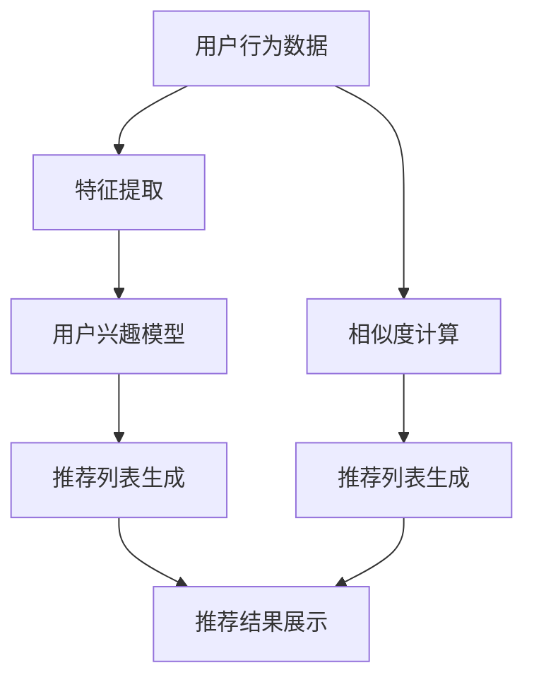

                 

# 利用推荐算法优化用户体验

> 关键词：推荐算法, 用户体验, 个性化推荐, 协同过滤, 深度学习, 机器学习

> 摘要：推荐算法是现代互联网应用中不可或缺的一部分，它能够根据用户的行为和偏好，为用户提供个性化的推荐内容，从而提升用户体验。本文将从推荐算法的基本原理出发，深入探讨其核心概念、算法原理、数学模型、实际应用案例，并展望未来的发展趋势和挑战。

## 1. 背景介绍

随着互联网的快速发展，用户在海量信息中寻找自己感兴趣的内容变得越来越困难。推荐算法通过分析用户的行为数据，为用户提供个性化的推荐内容，从而提升用户体验。推荐算法的应用范围广泛，包括电商、新闻、视频、音乐等多个领域。本文将详细介绍推荐算法的基本原理、核心概念、算法实现、实际应用案例，并探讨未来的发展趋势和挑战。

## 2. 核心概念与联系

### 2.1 推荐算法的基本概念

推荐算法是一种基于用户行为数据的机器学习技术，通过分析用户的历史行为数据，预测用户可能感兴趣的内容，从而为用户提供个性化的推荐。推荐算法的核心目标是提升用户体验，提高用户满意度和留存率。

### 2.2 推荐算法的分类

推荐算法主要分为两大类：基于内容的推荐和协同过滤推荐。

#### 2.2.1 基于内容的推荐

基于内容的推荐算法通过分析用户的历史行为数据，找到与用户兴趣相似的内容进行推荐。其核心思想是“物以类聚”，即相似的内容往往具有相似的用户兴趣。

#### 2.2.2 协同过滤推荐

协同过滤推荐算法通过分析用户之间的相似性或物品之间的相似性，为用户推荐相似的物品或用户相似的物品。协同过滤推荐算法又分为用户协同过滤和物品协同过滤。

### 2.3 推荐算法的流程图



## 3. 核心算法原理 & 具体操作步骤

### 3.1 基于内容的推荐算法

基于内容的推荐算法的核心思想是“物以类聚”，即相似的内容往往具有相似的用户兴趣。其具体操作步骤如下：

1. **特征提取**：从用户的历史行为数据中提取特征，如用户的历史点击记录、评分记录等。
2. **用户兴趣模型构建**：根据提取的特征，构建用户兴趣模型，如使用TF-IDF、词袋模型等方法。
3. **推荐列表生成**：根据用户兴趣模型，生成推荐列表，如使用余弦相似度、Jaccard相似度等方法计算相似度。
4. **推荐结果展示**：将生成的推荐列表展示给用户。

### 3.2 协同过滤推荐算法

协同过滤推荐算法的核心思想是“人以群分”，即相似的用户往往具有相似的兴趣。其具体操作步骤如下：

1. **用户相似度计算**：根据用户的历史行为数据，计算用户之间的相似度，如使用余弦相似度、皮尔逊相关系数等方法。
2. **物品相似度计算**：根据用户的历史行为数据，计算物品之间的相似度，如使用余弦相似度、皮尔逊相关系数等方法。
3. **推荐列表生成**：根据用户之间的相似度或物品之间的相似度，生成推荐列表，如使用加权平均、K近邻等方法。
4. **推荐结果展示**：将生成的推荐列表展示给用户。

## 4. 数学模型和公式 & 详细讲解 & 举例说明

### 4.1 基于内容的推荐算法

#### 4.1.1 特征提取

特征提取是基于内容的推荐算法的关键步骤，其主要目的是从用户的历史行为数据中提取特征。常用的方法有TF-IDF、词袋模型等。

- **TF-IDF**：TF-IDF（Term Frequency-Inverse Document Frequency）是一种统计方法，用于评估一个词在文档中的重要性。其公式如下：

  $$\text{TF-IDF}(t, d) = \text{TF}(t, d) \times \text{IDF}(t)$$

  其中，$\text{TF}(t, d)$ 表示词 $t$ 在文档 $d$ 中的频率，$\text{IDF}(t)$ 表示词 $t$ 的逆文档频率。

- **词袋模型**：词袋模型是一种简单的文本表示方法，将文本表示为词频向量。其公式如下：

  $$\text{Bag-of-Words}(t, d) = \begin{cases} 1 & \text{if } t \in d \\ 0 & \text{otherwise} \end{cases}$$

  其中，$\text{Bag-of-Words}(t, d)$ 表示词 $t$ 在文档 $d$ 中的出现情况。

#### 4.1.2 用户兴趣模型构建

用户兴趣模型构建是基于内容的推荐算法的关键步骤，其主要目的是根据提取的特征，构建用户兴趣模型。常用的方法有余弦相似度、Jaccard相似度等。

- **余弦相似度**：余弦相似度是一种衡量两个向量在多维空间中夹角余弦值的方法，其公式如下：

  $$\text{Cosine Similarity}(u, v) = \frac{\sum_{i=1}^{n} u_i v_i}{\sqrt{\sum_{i=1}^{n} u_i^2} \sqrt{\sum_{i=1}^{n} v_i^2}}$$

  其中，$u$ 和 $v$ 分别表示用户 $u$ 和用户 $v$ 的兴趣向量。

- **Jaccard相似度**：Jaccard相似度是一种衡量两个集合相似度的方法，其公式如下：

  $$\text{Jaccard Similarity}(u, v) = \frac{|u \cap v|}{|u \cup v|}$$

  其中，$u$ 和 $v$ 分别表示用户 $u$ 和用户 $v$ 的兴趣集合。

### 4.2 协同过滤推荐算法

#### 4.2.1 用户相似度计算

用户相似度计算是协同过滤推荐算法的关键步骤，其主要目的是根据用户的历史行为数据，计算用户之间的相似度。常用的方法有余弦相似度、皮尔逊相关系数等。

- **余弦相似度**：余弦相似度是一种衡量两个向量在多维空间中夹角余弦值的方法，其公式如下：

  $$\text{Cosine Similarity}(u, v) = \frac{\sum_{i=1}^{n} u_i v_i}{\sqrt{\sum_{i=1}^{n} u_i^2} \sqrt{\sum_{i=1}^{n} v_i^2}}$$

  其中，$u$ 和 $v$ 分别表示用户 $u$ 和用户 $v$ 的行为向量。

- **皮尔逊相关系数**：皮尔逊相关系数是一种衡量两个变量线性相关程度的方法，其公式如下：

  $$\text{Pearson Correlation}(u, v) = \frac{\sum_{i=1}^{n} (u_i - \bar{u})(v_i - \bar{v})}{\sqrt{\sum_{i=1}^{n} (u_i - \bar{u})^2} \sqrt{\sum_{i=1}^{n} (v_i - \bar{v})^2}}$$

  其中，$\bar{u}$ 和 $\bar{v}$ 分别表示用户 $u$ 和用户 $v$ 的平均行为值。

#### 4.2.2 物品相似度计算

物品相似度计算是协同过滤推荐算法的关键步骤，其主要目的是根据用户的历史行为数据，计算物品之间的相似度。常用的方法有余弦相似度、皮尔逊相关系数等。

- **余弦相似度**：余弦相似度是一种衡量两个向量在多维空间中夹角余弦值的方法，其公式如下：

  $$\text{Cosine Similarity}(i, j) = \frac{\sum_{u=1}^{m} u_i u_j}{\sqrt{\sum_{u=1}^{m} u_i^2} \sqrt{\sum_{u=1}^{m} u_j^2}}$$

  其中，$i$ 和 $j$ 分别表示物品 $i$ 和物品 $j$ 的行为向量。

- **皮尔逊相关系数**：皮尔逊相关系数是一种衡量两个变量线性相关程度的方法，其公式如下：

  $$\text{Pearson Correlation}(i, j) = \frac{\sum_{u=1}^{m} (u_i - \bar{u_i})(u_j - \bar{u_j})}{\sqrt{\sum_{u=1}^{m} (u_i - \bar{u_i})^2} \sqrt{\sum_{u=1}^{m} (u_j - \bar{u_j})^2}}$$

  其中，$\bar{u_i}$ 和 $\bar{u_j}$ 分别表示物品 $i$ 和物品 $j$ 的平均行为值。

#### 4.2.3 推荐列表生成

推荐列表生成是协同过滤推荐算法的关键步骤，其主要目的是根据用户之间的相似度或物品之间的相似度，生成推荐列表。常用的方法有加权平均、K近邻等。

- **加权平均**：加权平均是一种根据相似度计算推荐列表的方法，其公式如下：

  $$\text{Weighted Average}(i) = \frac{\sum_{u=1}^{m} \text{Sim}(u, i) \cdot r_{u, i}}{\sum_{u=1}^{m} \text{Sim}(u, i)}$$

  其中，$\text{Sim}(u, i)$ 表示用户 $u$ 和物品 $i$ 之间的相似度，$r_{u, i}$ 表示用户 $u$ 对物品 $i$ 的评分。

- **K近邻**：K近邻是一种根据K个最相似的用户或物品生成推荐列表的方法，其公式如下：

  $$\text{K-Nearest Neighbors}(i) = \text{Top-K}(i)$$

  其中，$\text{Top-K}(i)$ 表示与物品 $i$ 最相似的K个用户或物品。

## 5. 项目实战：代码实际案例和详细解释说明

### 5.1 开发环境搭建

为了实现推荐算法，我们需要搭建一个开发环境。推荐算法的开发环境主要包括Python、NumPy、Pandas、Scikit-learn等库。

1. **安装Python**：推荐使用Python 3.7及以上版本。
2. **安装NumPy**：NumPy是一个用于科学计算的Python库，可以进行高效的数组操作。安装命令如下：

   ```bash
   pip install numpy
   ```

3. **安装Pandas**：Pandas是一个用于数据处理和分析的Python库，可以进行高效的表格操作。安装命令如下：

   ```bash
   pip install pandas
   ```

4. **安装Scikit-learn**：Scikit-learn是一个用于机器学习的Python库，可以进行高效的机器学习模型训练和预测。安装命令如下：

   ```bash
   pip install scikit-learn
   ```

### 5.2 源代码详细实现和代码解读

以下是一个基于内容的推荐算法的Python代码实现：

```python
import numpy as np
import pandas as pd
from sklearn.feature_extraction.text import TfidfVectorizer
from sklearn.metrics.pairwise import cosine_similarity

# 读取数据
data = pd.read_csv('user_behavior.csv')

# 特征提取
tfidf_vectorizer = TfidfVectorizer()
tfidf_matrix = tfidf_vectorizer.fit_transform(data['content'])

# 用户兴趣模型构建
user_interests = cosine_similarity(tfidf_matrix)

# 推荐列表生成
def recommend(user_id, user_interests, top_n=5):
    user_interests = user_interests[user_id]
    similar_users = np.argsort(user_interests)[::-1]
    similar_users = similar_users[1:]  # 排除自身
    recommended_items = []
    for similar_user in similar_users:
        recommended_items.extend(data[data['user_id'] == similar_user]['item_id'])
    return recommended_items[:top_n]

# 推荐结果展示
recommendations = recommend(0, user_interests)
print(recommendations)
```

### 5.3 代码解读与分析

1. **读取数据**：从CSV文件中读取用户行为数据。
2. **特征提取**：使用TfidfVectorizer将文本数据转换为TF-IDF向量。
3. **用户兴趣模型构建**：使用余弦相似度计算用户之间的相似度。
4. **推荐列表生成**：根据用户之间的相似度生成推荐列表。
5. **推荐结果展示**：输出推荐结果。

## 6. 实际应用场景

推荐算法在实际应用中具有广泛的应用场景，包括电商、新闻、视频、音乐等多个领域。以下是一些实际应用场景：

1. **电商推荐**：根据用户的购买历史和浏览记录，为用户推荐可能感兴趣的商品。
2. **新闻推荐**：根据用户的阅读历史，为用户推荐可能感兴趣的文章。
3. **视频推荐**：根据用户的观看历史，为用户推荐可能感兴趣的视频。
4. **音乐推荐**：根据用户的听歌历史，为用户推荐可能感兴趣的歌曲。

## 7. 工具和资源推荐

### 7.1 学习资源推荐

1. **书籍**：《推荐系统实践》、《推荐系统：原理与实践》
2. **论文**：《Collaborative Filtering Recommendation Systems》、《Content-Based Recommendation Systems》
3. **博客**：阿里云推荐算法博客、腾讯AI实验室博客
4. **网站**：Kaggle、GitHub

### 7.2 开发工具框架推荐

1. **Python库**：Scikit-learn、TensorFlow、PyTorch
2. **开发框架**：Django、Flask
3. **数据处理工具**：Pandas、NumPy

### 7.3 相关论文著作推荐

1. **论文**：《Collaborative Filtering Recommendation Systems》、《Content-Based Recommendation Systems》
2. **著作**：《推荐系统实践》、《推荐系统：原理与实践》

## 8. 总结：未来发展趋势与挑战

推荐算法在未来的发展趋势和挑战主要体现在以下几个方面：

1. **个性化推荐**：随着用户行为数据的不断积累，个性化推荐将成为推荐算法的核心目标。
2. **实时推荐**：随着互联网技术的发展，实时推荐将成为推荐算法的重要方向。
3. **多模态推荐**：随着多模态数据的不断积累，多模态推荐将成为推荐算法的重要方向。
4. **隐私保护**：随着用户隐私保护意识的不断提高，隐私保护将成为推荐算法的重要挑战。

## 9. 附录：常见问题与解答

1. **Q：推荐算法如何处理冷启动问题？**
   **A：** 冷启动问题是指新用户或新物品缺乏历史行为数据，无法进行推荐。解决方法包括使用领域知识、社交网络信息等。

2. **Q：推荐算法如何处理稀疏数据？**
   **A：** 稀疏数据是指用户行为数据中存在大量的零值，解决方法包括使用稀疏矩阵、降维等。

3. **Q：推荐算法如何处理数据噪声？**
   **A：** 数据噪声是指用户行为数据中存在大量的异常值，解决方法包括使用异常检测、数据清洗等。

## 10. 扩展阅读 & 参考资料

1. **书籍**：《推荐系统实践》、《推荐系统：原理与实践》
2. **论文**：《Collaborative Filtering Recommendation Systems》、《Content-Based Recommendation Systems》
3. **博客**：阿里云推荐算法博客、腾讯AI实验室博客
4. **网站**：Kaggle、GitHub

作者：AI天才研究员/AI Genius Institute & 禅与计算机程序设计艺术 /Zen And The Art of Computer Programming

