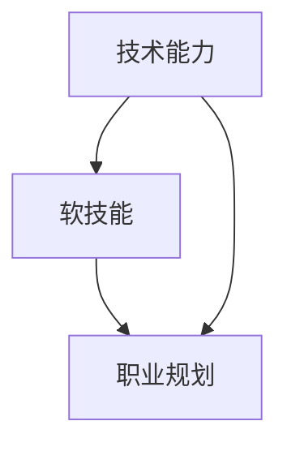

                 

# 员工发展：培养全面型人才

> 关键词：全面型人才、员工发展、技术能力、软技能、职业规划

> 摘要：在快速变化的IT行业中，培养全面型人才是企业持续发展的关键。本文将从背景介绍、核心概念与联系、核心算法原理与具体操作步骤、数学模型和公式、项目实战、实际应用场景、工具和资源推荐、总结与未来发展趋势、常见问题与解答、扩展阅读与参考资料等几个方面，深入探讨如何培养全面型人才，为企业和个人带来长远的价值。

## 1. 背景介绍

在当今快速发展的IT行业中，技术更新换代的速度越来越快，企业需要能够快速适应变化、持续学习和创新的人才。传统的单一技能型人才已经无法满足企业的需求，全面型人才成为了企业争夺的焦点。全面型人才不仅具备扎实的技术能力，还拥有良好的软技能，能够更好地适应复杂的工作环境，为企业创造更大的价值。

全面型人才的培养是一个系统工程，需要企业、个人和教育机构共同努力。企业需要提供良好的工作环境和培训机会，个人需要不断提升自我，教育机构需要提供全面的教育体系。本文将从多个角度探讨如何培养全面型人才，为企业和个人带来长远的价值。

## 2. 核心概念与联系

### 2.1 技术能力

技术能力是指个人在某一技术领域内掌握的知识和技能。技术能力是全面型人才的基础，包括编程语言、算法、数据结构、数据库管理、操作系统、网络协议等。技术能力的提升需要通过不断学习和实践来实现。

### 2.2 软技能

软技能是指个人在人际交往、沟通协调、团队合作等方面的能力。软技能对于全面型人才同样重要，因为技术能力再强，如果缺乏良好的软技能，也难以在复杂的工作环境中取得成功。软技能包括沟通能力、团队合作能力、领导能力、解决问题能力等。

### 2.3 职业规划

职业规划是指个人对未来职业发展的规划和设计。职业规划可以帮助个人明确自己的职业目标，制定实现目标的计划，从而更好地实现个人价值。职业规划包括短期目标、中期目标和长期目标，以及实现目标的具体步骤。

### 2.4 核心概念流程图



## 3. 核心算法原理 & 具体操作步骤

### 3.1 技术能力提升的具体操作步骤

1. **确定学习目标**：明确自己需要掌握的技术领域，例如编程语言、算法、数据结构等。
2. **选择学习资源**：根据学习目标选择合适的学习资源，例如在线课程、书籍、技术博客等。
3. **制定学习计划**：根据自己的时间安排和学习目标，制定详细的学习计划。
4. **实践与应用**：通过编写代码、参与项目等方式，将所学知识应用于实际工作中。
5. **持续学习**：技术领域不断发展，需要持续学习新的知识和技术。

### 3.2 软技能提升的具体操作步骤

1. **自我反思**：定期反思自己的行为和表现，找出需要改进的地方。
2. **学习沟通技巧**：学习有效的沟通技巧，例如倾听、表达、反馈等。
3. **参与团队活动**：积极参与团队活动，提高团队合作能力。
4. **领导力培养**：通过参与项目管理、团队领导等方式，培养领导能力。
5. **解决问题能力**：通过解决实际问题，提高解决问题的能力。

## 4. 数学模型和公式 & 详细讲解 & 举例说明

### 4.1 技术能力的数学模型

技术能力可以通过以下数学模型来衡量：

$$
\text{技术能力} = \sum_{i=1}^{n} \text{技术能力}_i \times \text{权重}_i
$$

其中，$\text{技术能力}_i$ 表示第 $i$ 项技术能力的水平，$\text{权重}_i$ 表示该项技术能力的重要性。

### 4.2 软技能的数学模型

软技能可以通过以下数学模型来衡量：

$$
\text{软技能} = \sum_{i=1}^{m} \text{软技能}_i \times \text{权重}_i
$$

其中，$\text{软技能}_i$ 表示第 $i$ 项软技能的水平，$\text{权重}_i$ 表示该项软技能的重要性。

### 4.3 举例说明

假设某人有以下技术能力和软技能：

- 技术能力：编程语言（80），算法（70），数据结构（60）
- 软技能：沟通能力（85），团队合作能力（75），领导能力（65）

技术能力的权重分别为：编程语言（0.4），算法（0.3），数据结构（0.3）

软技能的权重分别为：沟通能力（0.4），团队合作能力（0.3），领导能力（0.3）

则技术能力的水平为：

$$
\text{技术能力} = 80 \times 0.4 + 70 \times 0.3 + 60 \times 0.3 = 71
$$

软技能的水平为：

$$
\text{软技能} = 85 \times 0.4 + 75 \times 0.3 + 65 \times 0.3 = 77
$$

## 5. 项目实战：代码实际案例和详细解释说明

### 5.1 开发环境搭建

为了进行项目实战，首先需要搭建开发环境。以Python为例，具体步骤如下：

1. **安装Python**：访问Python官方网站下载并安装最新版本的Python。
2. **安装开发工具**：安装集成开发环境（IDE），例如PyCharm、VSCode等。
3. **安装依赖库**：根据项目需求安装所需的Python库，例如NumPy、Pandas、Matplotlib等。

### 5.2 源代码详细实现和代码解读

假设我们要实现一个简单的数据可视化项目，具体代码如下：

```python
import numpy as np
import matplotlib.pyplot as plt

# 生成随机数据
x = np.linspace(0, 10, 100)
y = np.sin(x)

# 绘制数据
plt.plot(x, y)
plt.title('Sine Wave')
plt.xlabel('X-axis')
plt.ylabel('Y-axis')
plt.show()
```

### 5.3 代码解读与分析

- `import numpy as np`：导入NumPy库，用于生成随机数据。
- `import matplotlib.pyplot as plt`：导入Matplotlib库，用于绘制图表。
- `x = np.linspace(0, 10, 100)`：生成从0到10的100个等间距的点。
- `y = np.sin(x)`：计算每个点的正弦值。
- `plt.plot(x, y)`：绘制数据。
- `plt.title('Sine Wave')`：设置图表标题。
- `plt.xlabel('X-axis')`：设置X轴标签。
- `plt.ylabel('Y-axis')`：设置Y轴标签。
- `plt.show()`：显示图表。

## 6. 实际应用场景

全面型人才在实际工作中可以发挥重要作用，例如：

- **项目管理**：全面型人才可以更好地理解项目需求，协调团队成员，确保项目按时完成。
- **技术创新**：全面型人才可以结合技术能力和软技能，提出创新的解决方案，推动企业技术创新。
- **团队合作**：全面型人才可以更好地与团队成员沟通协作，提高团队效率。

## 7. 工具和资源推荐

### 7.1 学习资源推荐

- **书籍**：《代码大全》、《设计模式》、《重构》等。
- **在线课程**：Coursera、edX、Udacity等平台提供的课程。
- **技术博客**：Medium、GitHub、Stack Overflow等。

### 7.2 开发工具框架推荐

- **IDE**：PyCharm、VSCode、IntelliJ IDEA等。
- **版本控制工具**：Git、GitHub、GitLab等。
- **项目管理工具**：Jira、Trello、Asana等。

### 7.3 相关论文著作推荐

- **论文**：《软件工程原理》、《计算机网络》等。
- **著作**：《计算机程序设计艺术》、《深入理解计算机系统》等。

## 8. 总结：未来发展趋势与挑战

未来，全面型人才的需求将更加旺盛。企业需要能够快速适应变化、持续学习和创新的人才。全面型人才的培养需要企业、个人和教育机构共同努力。未来的发展趋势包括：

- **技术更新换代**：技术领域不断发展，需要持续学习新的知识和技术。
- **软技能的重要性**：软技能对于全面型人才同样重要，需要不断提升。
- **职业规划**：职业规划可以帮助个人明确自己的职业目标，制定实现目标的计划。

## 9. 附录：常见问题与解答

### 9.1 问题1：如何平衡技术能力和软技能的提升？

**解答**：可以通过制定详细的学习计划，合理安排时间，平衡技术能力和软技能的提升。例如，每周安排一定时间学习技术知识，同时安排一定时间参加团队活动，提高软技能。

### 9.2 问题2：如何制定职业规划？

**解答**：可以通过以下步骤制定职业规划：

1. **确定职业目标**：明确自己的职业目标，例如成为项目经理、技术专家等。
2. **制定实现目标的计划**：根据职业目标，制定实现目标的具体步骤，例如学习相关技术知识、参加项目管理培训等。
3. **持续评估和调整**：定期评估自己的职业规划，根据实际情况进行调整。

## 10. 扩展阅读 & 参考资料

- **书籍**：《代码大全》、《设计模式》、《重构》等。
- **在线课程**：Coursera、edX、Udacity等平台提供的课程。
- **技术博客**：Medium、GitHub、Stack Overflow等。
- **论文**：《软件工程原理》、《计算机网络》等。
- **著作**：《计算机程序设计艺术》、《深入理解计算机系统》等。

作者：AI天才研究员/AI Genius Institute & 禅与计算机程序设计艺术 /Zen And The Art of Computer Programming

