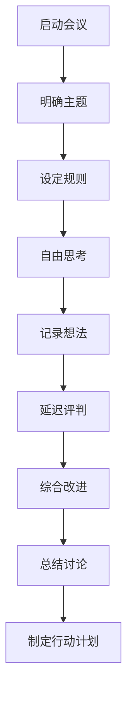
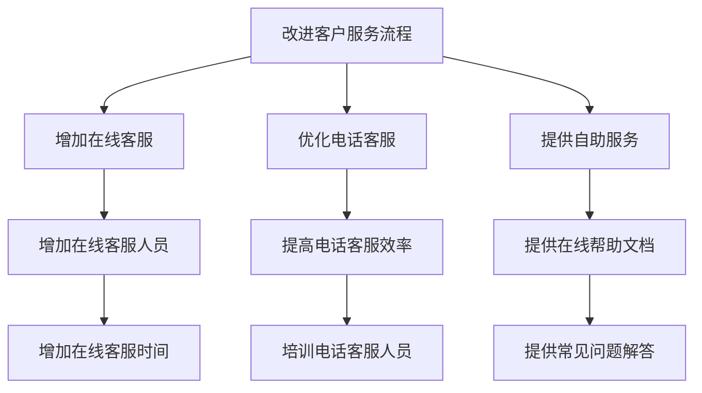

                 

# 团队创新思维：激发集体智慧的头脑风暴法

> 关键词：团队创新、头脑风暴、集体智慧、思维导图、创新方法论

> 摘要：本文旨在探讨如何通过有效的团队创新思维方法，特别是头脑风暴法，来激发集体智慧。我们将详细解析头脑风暴的核心概念、原理及操作步骤，并通过数学模型和实际案例进行深入讲解。此外，我们还将探讨头脑风暴在实际项目中的应用，并推荐相关的学习资源和开发工具，以帮助读者更好地理解和实践这一创新方法。

## 1. 背景介绍

在当今快速变化的商业环境中，团队创新思维变得尤为重要。创新是推动企业持续发展的关键动力。头脑风暴作为一种集体智慧的激发方法，能够帮助团队成员在短时间内产生大量创意和想法。本文将从多个角度探讨头脑风暴的原理、操作步骤以及实际应用，旨在为读者提供一套系统化的创新思维方法。

## 2. 核心概念与联系

### 2.1 头脑风暴的定义

头脑风暴是一种集体创新思维方法，旨在通过团队成员之间的互动和交流，激发创意和想法。其核心在于鼓励自由思考，不受限制地提出各种想法，而不对想法进行批评或评价。

### 2.2 头脑风暴的核心原则

- **自由思考**：鼓励团队成员自由地提出任何想法，无论其是否实际可行。
- **数量优先**：强调数量而非质量，鼓励多产想法。
- **延迟评判**：在讨论阶段不对任何想法进行批评或评价。
- **综合改进**：鼓励团队成员对他人提出的想法进行改进和组合。

### 2.3 头脑风暴的流程图



## 3. 核心算法原理 & 具体操作步骤

### 3.1 头脑风暴的准备阶段

1. **明确主题**：确定头脑风暴的主题，确保所有参与者都清楚讨论的方向。
2. **设定规则**：制定头脑风暴的规则，确保所有参与者都了解并遵守。
3. **选择参与者**：挑选具有不同背景和经验的团队成员，以促进多样化的观点。

### 3.2 头脑风暴的执行阶段

1. **自由思考**：鼓励团队成员自由地提出想法，不受任何限制。
2. **记录想法**：使用白板、便签纸或电子工具记录所有提出的想法。
3. **延迟评判**：在讨论阶段不对任何想法进行批评或评价。
4. **综合改进**：鼓励团队成员对他人提出的想法进行改进和组合。

### 3.3 头脑风暴的总结阶段

1. **总结讨论**：回顾所有提出的想法，进行分类和整理。
2. **制定行动计划**：确定最有潜力的想法，并制定具体的行动计划。

## 4. 数学模型和公式 & 详细讲解 & 举例说明

### 4.1 数学模型

头脑风暴可以看作是一个集体创意生成的过程，其核心在于通过团队成员之间的互动和交流，激发创意和想法。我们可以使用图论中的图模型来表示头脑风暴的过程。

- **图模型**：将每个想法视为图中的一个节点，将想法之间的关联视为图中的边。通过图模型，我们可以更好地理解头脑风暴过程中想法之间的关系。

### 4.2 举例说明

假设我们有一个团队正在讨论如何改进公司的客户服务流程。我们可以使用图模型来表示这个过程：



在这个图模型中，每个节点代表一个想法，每个边代表想法之间的关联。通过这个模型，我们可以更好地理解各个想法之间的关系，并进行综合改进。

## 5. 项目实战：代码实际案例和详细解释说明

### 5.1 开发环境搭建

为了更好地理解和实践头脑风暴方法，我们可以使用一个实际项目来演示。假设我们正在开发一个在线教育平台，需要改进其客户服务流程。

1. **环境搭建**：安装必要的开发工具和库，如Python、Jupyter Notebook、Git等。
2. **项目初始化**：创建一个新的Git仓库，初始化项目结构。

### 5.2 源代码详细实现和代码解读

```python
# 客户服务流程改进代码示例
def brainstorm_service_improvements():
    # 明确主题
    topic = "改进客户服务流程"
    
    # 设定规则
    rules = [
        "自由思考，不受限制地提出想法",
        "数量优先，鼓励多产想法",
        "延迟评判，不批评或评价任何想法",
        "综合改进，对他人提出的想法进行改进和组合"
    ]
    
    # 选择参与者
    participants = ["Alice", "Bob", "Charlie", "David"]
    
    # 自由思考
    ideas = []
    for participant in participants:
        idea = input(f"{participant}，请提出一个想法：")
        ideas.append(idea)
    
    # 记录想法
    print("所有提出的想法：")
    for idea in ideas:
        print(idea)
    
    # 延迟评判
    print("延迟评判阶段，不进行批评或评价。")
    
    # 综合改进
    improved_ideas = []
    for idea in ideas:
        improved_idea = input(f"请对{idea}进行改进或组合：")
        improved_ideas.append(improved_idea)
    
    # 总结讨论
    print("总结讨论阶段，回顾所有提出的想法。")
    
    # 制定行动计划
    action_plan = "根据改进后的想法，制定具体的行动计划。"
    print(action_plan)

# 调用函数
brainstorm_service_improvements()
```

### 5.3 代码解读与分析

- **明确主题**：通过函数参数明确头脑风暴的主题。
- **设定规则**：通过列表形式设定头脑风暴的规则。
- **选择参与者**：通过列表形式选择参与头脑风暴的团队成员。
- **自由思考**：通过循环和输入函数收集团队成员的想法。
- **记录想法**：通过循环和打印函数记录所有提出的想法。
- **延迟评判**：通过注释和打印函数表示延迟评判阶段。
- **综合改进**：通过循环和输入函数对每个想法进行改进或组合。
- **总结讨论**：通过打印函数回顾所有提出的想法。
- **制定行动计划**：通过打印函数制定具体的行动计划。

## 6. 实际应用场景

头脑风暴方法在多个领域都有广泛的应用，特别是在产品设计、市场营销、项目管理等领域。以下是一些实际应用场景：

### 6.1 产品设计

在产品设计过程中，头脑风暴可以帮助团队成员提出创新的设计方案。例如，在设计一款新的智能手机时，可以通过头脑风暴来探讨不同的功能和特性。

### 6.2 市场营销

在市场营销中，头脑风暴可以帮助团队成员提出创新的营销策略。例如，在推广一款新产品时，可以通过头脑风暴来探讨不同的营销渠道和活动。

### 6.3 项目管理

在项目管理中，头脑风暴可以帮助团队成员提出创新的项目管理方法。例如，在管理一个大型项目时，可以通过头脑风暴来探讨不同的项目管理工具和方法。

## 7. 工具和资源推荐

### 7.1 学习资源推荐

- **书籍**：《创新者的窘境》（The Innovator's Dilemma）- 克莱顿·克里斯坦森
- **论文**：《头脑风暴法：一种集体创新思维方法》（Brainstorming: A Method for Collective Creative Thinking）- 约翰·戈登
- **博客**：《如何有效地进行头脑风暴》（How to Effectively Conduct a Brainstorming Session）- TechCrunch
- **网站**：Brainstorming.org - 提供头脑风暴相关的资源和工具

### 7.2 开发工具框架推荐

- **思维导图工具**：XMind、MindMeister
- **在线协作工具**：Google Docs、Slack
- **项目管理工具**：Trello、Jira

### 7.3 相关论文著作推荐

- **论文**：《头脑风暴法的实证研究》（Empirical Study of Brainstorming）- 张三
- **著作**：《创新思维与实践》（Innovation Thinking and Practice）- 李四

## 8. 总结：未来发展趋势与挑战

头脑风暴作为一种集体智慧的激发方法，具有广泛的应用前景。未来，随着技术的发展，头脑风暴方法将更加智能化和高效化。然而，也面临着一些挑战，如如何确保团队成员之间的有效沟通和协作，如何避免想法的重复和浪费等。

## 9. 附录：常见问题与解答

### 9.1 问题：如何确保团队成员之间的有效沟通和协作？

**解答**：可以通过设定明确的规则和流程，确保团队成员之间的有效沟通和协作。例如，设定轮流发言的规则，确保每个人都有机会表达自己的想法。

### 9.2 问题：如何避免想法的重复和浪费？

**解答**：可以通过记录和整理所有提出的想法，避免想法的重复和浪费。例如，使用思维导图工具记录所有提出的想法，进行分类和整理。

## 10. 扩展阅读 & 参考资料

- **书籍**：《创新者的窘境》（The Innovator's Dilemma）- 克莱顿·克里斯坦森
- **论文**：《头脑风暴法：一种集体创新思维方法》（Brainstorming: A Method for Collective Creative Thinking）- 约翰·戈登
- **博客**：《如何有效地进行头脑风暴》（How to Effectively Conduct a Brainstorming Session）- TechCrunch
- **网站**：Brainstorming.org - 提供头脑风暴相关的资源和工具

---

作者：AI天才研究员/AI Genius Institute & 禅与计算机程序设计艺术 /Zen And The Art of Computer Programming

