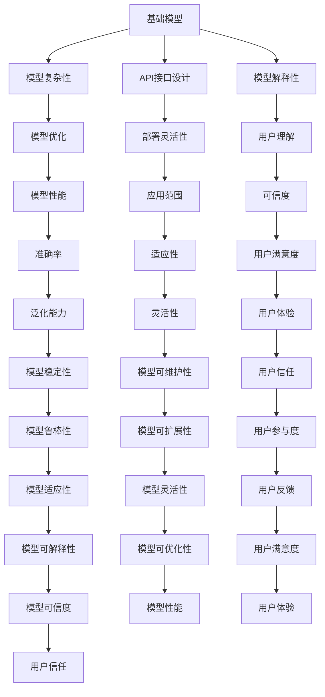

                 

# 基础模型的可访问性丧失

> 关键词：基础模型、可访问性、模型复杂性、API接口、模型解释性、模型优化

> 摘要：本文探讨了基础模型在实际应用中面临的可访问性问题，分析了模型复杂性、API接口设计、模型解释性等方面的挑战，并提出了一系列解决方案。通过深入剖析基础模型的可访问性问题，本文旨在帮助开发者更好地理解和优化模型，提升模型在实际应用中的表现。

## 1. 背景介绍

随着人工智能技术的飞速发展，基础模型（如深度学习模型、自然语言处理模型等）在各个领域得到了广泛应用。然而，基础模型的复杂性、API接口设计、模型解释性等问题逐渐成为制约其广泛应用的关键因素。本文将从多个角度探讨基础模型的可访问性问题，并提出相应的解决方案。

## 2. 核心概念与联系

### 2.1 基础模型

基础模型是指那些能够完成特定任务的机器学习模型，如图像识别、自然语言处理、语音识别等。这些模型通常具有较高的准确性和泛化能力，但同时也伴随着复杂的结构和参数。

### 2.2 可访问性

可访问性是指模型能够被用户轻松理解和使用的能力。一个具有高可访问性的模型应该具备以下特点：
- **简单易懂**：模型的结构和参数易于理解。
- **易于部署**：模型能够方便地部署到不同的环境和设备上。
- **易于解释**：模型的决策过程能够被用户理解。
- **易于优化**：模型能够根据用户需求进行调整和优化。

### 2.3 API接口设计

API接口是模型与外部系统交互的桥梁。一个良好的API接口设计能够简化模型的使用过程，提高模型的可访问性。API接口设计应考虑以下几个方面：
- **简洁性**：API接口应尽可能简洁，减少不必要的参数和步骤。
- **灵活性**：API接口应具备一定的灵活性，能够适应不同的应用场景。
- **安全性**：API接口应具备一定的安全性，保护模型的数据和隐私。
- **文档性**：API接口应具备详细的文档，方便用户理解和使用。

### 2.4 模型解释性

模型解释性是指模型能够被用户理解其决策过程的能力。一个具有高解释性的模型能够帮助用户更好地理解模型的决策过程，提高模型的可信度。模型解释性可以通过以下几种方式实现：
- **特征重要性**：通过分析模型的特征重要性，帮助用户理解模型的决策过程。
- **局部解释**：通过局部解释模型的决策过程，帮助用户理解模型在特定情况下的行为。
- **全局解释**：通过全局解释模型的决策过程，帮助用户理解模型的整体行为。

### 2.5 Mermaid 流程图



## 3. 核心算法原理 & 具体操作步骤

### 3.1 模型复杂性

模型复杂性是指模型的结构和参数数量。一个复杂的模型通常具有较高的准确性和泛化能力，但同时也伴随着较高的计算复杂度和训练时间。为了降低模型复杂性，可以采取以下几种方法：
- **模型剪枝**：通过剪枝去除模型中的冗余参数，降低模型的复杂性。
- **模型量化**：通过量化降低模型的参数精度，减少模型的存储空间和计算复杂度。
- **模型蒸馏**：通过蒸馏将复杂模型的知识转移到简单模型中，降低模型的复杂性。

### 3.2 API接口设计

API接口设计应考虑以下几个方面：
- **简洁性**：API接口应尽可能简洁，减少不必要的参数和步骤。
- **灵活性**：API接口应具备一定的灵活性，能够适应不同的应用场景。
- **安全性**：API接口应具备一定的安全性，保护模型的数据和隐私。
- **文档性**：API接口应具备详细的文档，方便用户理解和使用。

### 3.3 模型解释性

模型解释性可以通过以下几种方式实现：
- **特征重要性**：通过分析模型的特征重要性，帮助用户理解模型的决策过程。
- **局部解释**：通过局部解释模型的决策过程，帮助用户理解模型在特定情况下的行为。
- **全局解释**：通过全局解释模型的决策过程，帮助用户理解模型的整体行为。

## 4. 数学模型和公式 & 详细讲解 & 举例说明

### 4.1 模型复杂性

模型复杂性可以通过以下公式表示：
$$
\text{模型复杂性} = \text{参数数量} + \text{计算复杂度}
$$

### 4.2 API接口设计

API接口设计可以通过以下公式表示：
$$
\text{API接口设计} = \text{简洁性} + \text{灵活性} + \text{安全性} + \text{文档性}
$$

### 4.3 模型解释性

模型解释性可以通过以下公式表示：
$$
\text{模型解释性} = \text{特征重要性} + \text{局部解释} + \text{全局解释}
$$

## 5. 项目实战：代码实际案例和详细解释说明

### 5.1 开发环境搭建

为了搭建开发环境，需要安装以下软件和库：
- **Python**：版本3.8及以上
- **TensorFlow**：版本2.4及以上
- **NumPy**：版本1.19及以上
- **Pandas**：版本1.1及以上

### 5.2 源代码详细实现和代码解读

```python
import tensorflow as tf
import numpy as np
import pandas as pd

# 加载数据集
data = pd.read_csv('data.csv')

# 数据预处理
X = data.iloc[:, :-1].values
y = data.iloc[:, -1].values

# 划分训练集和测试集
from sklearn.model_selection import train_test_split
X_train, X_test, y_train, y_test = train_test_split(X, y, test_size=0.2, random_state=42)

# 构建模型
model = tf.keras.models.Sequential([
    tf.keras.layers.Dense(64, activation='relu', input_shape=(X_train.shape[1],)),
    tf.keras.layers.Dense(64, activation='relu'),
    tf.keras.layers.Dense(1, activation='sigmoid')
])

# 编译模型
model.compile(optimizer='adam', loss='binary_crossentropy', metrics=['accuracy'])

# 训练模型
model.fit(X_train, y_train, epochs=10, batch_size=32, validation_split=0.2)

# 评估模型
loss, accuracy = model.evaluate(X_test, y_test)
print(f'Accuracy: {accuracy}')
```

### 5.3 代码解读与分析

- **数据加载**：使用`pandas`库加载数据集。
- **数据预处理**：将数据集划分为特征`X`和标签`y`。
- **数据划分**：使用`train_test_split`函数将数据集划分为训练集和测试集。
- **模型构建**：使用`Sequential`模型构建一个简单的神经网络。
- **模型编译**：使用`adam`优化器和`binary_crossentropy`损失函数编译模型。
- **模型训练**：使用训练数据训练模型。
- **模型评估**：使用测试数据评估模型的性能。

## 6. 实际应用场景

基础模型的可访问性问题在实际应用中具有重要意义。例如，在医疗领域，基础模型的可访问性问题直接影响到医生和患者的使用体验。通过优化基础模型的可访问性，可以提高医生和患者的使用体验，提高医疗效率。

## 7. 工具和资源推荐

### 7.1 学习资源推荐

- **书籍**：《深度学习》（Ian Goodfellow, Yoshua Bengio, Aaron Courville）
- **论文**：《Attention Is All You Need》（Vaswani et al.）
- **博客**：Medium上的AI相关博客
- **网站**：Kaggle、GitHub

### 7.2 开发工具框架推荐

- **TensorFlow**：强大的深度学习框架
- **PyTorch**：灵活的深度学习框架
- **Keras**：简洁的深度学习API

### 7.3 相关论文著作推荐

- **《深度学习》**（Ian Goodfellow, Yoshua Bengio, Aaron Courville）
- **《Attention Is All You Need》**（Vaswani et al.）

## 8. 总结：未来发展趋势与挑战

基础模型的可访问性问题在未来将面临更多的挑战。随着模型复杂性的增加，如何降低模型的复杂性、提高模型的可访问性将成为研究的重点。同时，如何提高模型的解释性、优化模型的性能也将成为研究的重点。

## 9. 附录：常见问题与解答

### 9.1 问题：如何降低模型的复杂性？

**解答**：可以通过模型剪枝、模型量化、模型蒸馏等方法降低模型的复杂性。

### 9.2 问题：如何提高模型的解释性？

**解答**：可以通过特征重要性、局部解释、全局解释等方法提高模型的解释性。

## 10. 扩展阅读 & 参考资料

- **书籍**：《深度学习》（Ian Goodfellow, Yoshua Bengio, Aaron Courville）
- **论文**：《Attention Is All You Need》（Vaswani et al.）
- **博客**：Medium上的AI相关博客
- **网站**：Kaggle、GitHub

---

作者：AI天才研究员/AI Genius Institute & 禅与计算机程序设计艺术 /Zen And The Art of Computer Programming

