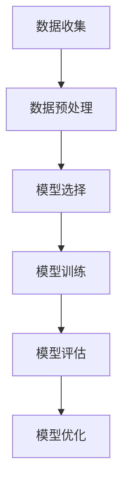

                 

# 基础模型的社会技术融合与责任

> 关键词：基础模型、社会技术融合、责任、伦理、技术治理、模型训练、数据隐私、公平性

> 摘要：随着基础模型在各个领域的广泛应用，其社会技术融合的重要性日益凸显。本文将从基础模型的定义出发，探讨其在社会中的应用，分析模型训练过程中的伦理问题，以及如何构建负责任的技术治理框架。通过具体的案例和数学模型，我们将深入理解基础模型在实际应用中的挑战与机遇，并提出相应的解决方案。

## 1. 背景介绍

基础模型是指那些能够学习和理解大量数据，从而具备广泛任务执行能力的机器学习模型。这些模型通常具有强大的泛化能力，能够处理多种任务，如自然语言处理、图像识别、语音识别等。随着技术的发展，基础模型逐渐成为推动社会进步的重要力量。然而，基础模型的应用也带来了诸多挑战，特别是在伦理和社会责任方面。

### 1.1 基础模型的定义

基础模型通常是指那些能够从大量数据中学习并泛化到新任务的机器学习模型。这些模型通常具有以下特点：

- **大规模训练**：需要处理大量的训练数据。
- **泛化能力**：能够在未见过的数据上表现良好。
- **多功能性**：能够执行多种任务，如文本生成、图像分类等。

### 1.2 基础模型的应用场景

基础模型在多个领域都有广泛的应用，包括但不限于：

- **自然语言处理**：如文本生成、情感分析、机器翻译等。
- **计算机视觉**：如图像分类、目标检测、图像生成等。
- **语音识别**：如语音转文本、情感识别等。
- **推荐系统**：如个性化推荐、内容推荐等。

### 1.3 基础模型的社会影响

基础模型的应用不仅改变了人们的生活方式，还对社会产生了深远的影响。例如，推荐系统能够个性化地为用户提供内容，但同时也可能导致信息茧房效应；自然语言处理技术能够提高工作效率，但也可能引发隐私泄露等问题。

## 2. 核心概念与联系

### 2.1 基础模型的训练过程

基础模型的训练过程通常包括以下几个步骤：

1. **数据收集**：收集大量的训练数据。
2. **数据预处理**：对数据进行清洗、标注等处理。
3. **模型选择**：选择合适的模型架构。
4. **模型训练**：使用训练数据对模型进行训练。
5. **模型评估**：评估模型在验证集上的表现。
6. **模型优化**：根据评估结果调整模型参数。

### 2.2 基础模型的伦理问题

基础模型在训练和应用过程中可能引发一系列伦理问题，主要包括：

- **数据隐私**：如何保护用户数据不被滥用。
- **公平性**：如何确保模型在不同群体中的表现一致。
- **透明度**：如何解释模型的决策过程。
- **责任归属**：如何界定模型错误的责任。

### 2.3 模型训练流程图



## 3. 核心算法原理 & 具体操作步骤

### 3.1 数据预处理

数据预处理是基础模型训练的重要步骤，主要包括以下几个方面：

1. **数据清洗**：去除噪声数据，填补缺失值。
2. **数据标注**：为数据添加标签，以便模型学习。
3. **数据增强**：通过变换数据增加训练样本。

### 3.2 模型选择

选择合适的模型架构是基础模型训练的关键。常见的模型架构包括：

- **深度神经网络**：如卷积神经网络（CNN）、循环神经网络（RNN）等。
- **Transformer模型**：如BERT、GPT等。

### 3.3 模型训练

模型训练过程通常包括以下几个步骤：

1. **损失函数选择**：选择合适的损失函数，如交叉熵损失。
2. **优化算法选择**：选择合适的优化算法，如梯度下降。
3. **超参数调整**：调整学习率、批量大小等超参数。

### 3.4 模型评估

模型评估是衡量模型性能的重要步骤，主要包括以下几个方面：

1. **准确率**：模型预测正确的样本数占总样本数的比例。
2. **召回率**：模型正确预测的正样本数占实际正样本数的比例。
3. **F1分数**：准确率和召回率的调和平均值。

## 4. 数学模型和公式 & 详细讲解 & 举例说明

### 4.1 损失函数

损失函数是衡量模型预测结果与真实结果差异的指标。常见的损失函数包括：

- **交叉熵损失**：适用于分类任务。
- **均方误差**：适用于回归任务。

### 4.2 优化算法

优化算法是调整模型参数以最小化损失函数的方法。常见的优化算法包括：

- **梯度下降**：通过计算损失函数的梯度来更新参数。
- **Adam优化器**：结合了梯度下降和动量优化的优点。

### 4.3 举例说明

假设我们有一个简单的二分类任务，使用交叉熵损失函数和梯度下降优化算法。具体步骤如下：

1. **损失函数**：定义交叉熵损失函数。
2. **梯度计算**：计算损失函数关于参数的梯度。
3. **参数更新**：根据梯度更新参数。

```markdown
$$
\text{损失函数} = -\frac{1}{N} \sum_{i=1}^{N} \left[ y_i \log(p_i) + (1 - y_i) \log(1 - p_i) \right]
$$

$$
\text{梯度} = \frac{\partial \text{损失函数}}{\partial \theta} = -\frac{1}{N} \sum_{i=1}^{N} \left[ y_i - p_i \right] \frac{\partial p_i}{\partial \theta}
$$

$$
\theta_{\text{新}} = \theta_{\text{旧}} - \eta \cdot \text{梯度}
$$
```

## 5. 项目实战：代码实际案例和详细解释说明

### 5.1 开发环境搭建

为了进行基础模型的训练，我们需要搭建一个合适的开发环境。具体步骤如下：

1. **安装Python**：确保安装了Python 3.7及以上版本。
2. **安装依赖库**：安装TensorFlow、PyTorch等深度学习库。
3. **安装数据处理库**：安装Pandas、NumPy等数据处理库。

### 5.2 源代码详细实现和代码解读

以下是一个简单的二分类任务的代码实现：

```python
import numpy as np
import tensorflow as tf
from tensorflow.keras.models import Sequential
from tensorflow.keras.layers import Dense

# 数据准备
X = np.array([[0, 0], [0, 1], [1, 0], [1, 1]])
y = np.array([0, 1, 1, 0])

# 模型构建
model = Sequential([
    Dense(4, input_dim=2, activation='relu'),
    Dense(1, activation='sigmoid')
])

# 损失函数和优化器
model.compile(loss='binary_crossentropy', optimizer='adam', metrics=['accuracy'])

# 模型训练
model.fit(X, y, epochs=1000, verbose=0)

# 模型评估
loss, accuracy = model.evaluate(X, y)
print(f'Accuracy: {accuracy}')
```

### 5.3 代码解读与分析

- **数据准备**：定义输入数据 `X` 和标签 `y`。
- **模型构建**：使用 `Sequential` 构建模型，包含两个全连接层。
- **损失函数和优化器**：选择二元交叉熵损失函数和Adam优化器。
- **模型训练**：使用 `fit` 方法训练模型。
- **模型评估**：使用 `evaluate` 方法评估模型性能。

## 6. 实际应用场景

基础模型在多个领域都有广泛的应用，以下是一些具体的应用场景：

### 6.1 自然语言处理

- **情感分析**：通过分析文本的情感倾向，帮助企业了解用户反馈。
- **机器翻译**：将一种语言的文本翻译成另一种语言，促进跨文化交流。

### 6.2 计算机视觉

- **图像分类**：通过识别图像中的物体，帮助医生诊断疾病。
- **目标检测**：在视频监控中检测异常行为，提高公共安全。

### 6.3 推荐系统

- **个性化推荐**：根据用户的历史行为，推荐相关商品或内容。
- **内容推荐**：根据用户兴趣，推荐相关文章或视频。

## 7. 工具和资源推荐

### 7.1 学习资源推荐

- **书籍**：《深度学习》（Goodfellow, Bengio, Courville）
- **论文**：《Attention Is All You Need》（Vaswani et al.）
- **博客**：Medium上的深度学习系列文章
- **网站**：TensorFlow官网、PyTorch官网

### 7.2 开发工具框架推荐

- **深度学习框架**：TensorFlow、PyTorch
- **数据处理库**：Pandas、NumPy
- **可视化工具**：Matplotlib、Seaborn

### 7.3 相关论文著作推荐

- **论文**：《Attention Is All You Need》（Vaswani et al.）
- **著作**：《深度学习》（Goodfellow, Bengio, Courville）

## 8. 总结：未来发展趋势与挑战

基础模型在未来的发展中将面临诸多挑战，主要包括：

- **数据隐私**：如何保护用户数据不被滥用。
- **公平性**：如何确保模型在不同群体中的表现一致。
- **透明度**：如何解释模型的决策过程。
- **责任归属**：如何界定模型错误的责任。

未来的发展趋势包括：

- **模型解释性**：提高模型的可解释性，帮助用户理解模型决策。
- **联邦学习**：通过多方协作训练模型，保护用户数据隐私。
- **多模态学习**：结合多种数据类型，提高模型的泛化能力。

## 9. 附录：常见问题与解答

### 9.1 问题：如何保护用户数据隐私？

**解答**：可以通过数据脱敏、加密存储等方法保护用户数据隐私。

### 9.2 问题：如何确保模型的公平性？

**解答**：可以通过数据预处理、模型训练等方法确保模型在不同群体中的表现一致。

### 9.3 问题：如何解释模型的决策过程？

**解答**：可以通过可视化工具、模型解释性方法等帮助用户理解模型决策。

## 10. 扩展阅读 & 参考资料

- **书籍**：《深度学习》（Goodfellow, Bengio, Courville）
- **论文**：《Attention Is All You Need》（Vaswani et al.）
- **网站**：TensorFlow官网、PyTorch官网

---

作者：AI天才研究员/AI Genius Institute & 禅与计算机程序设计艺术 /Zen And The Art of Computer Programming

