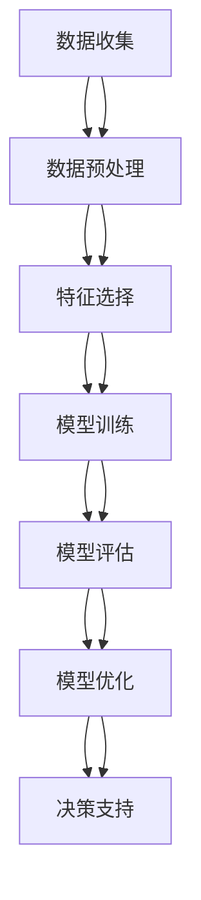

                 

# 大数据分析在精准农业决策支持中的应用

> 关键词：大数据分析, 精准农业, 决策支持, 农业物联网, 机器学习, 农业数据模型

> 摘要：本文旨在探讨大数据分析在精准农业中的应用，通过深入分析农业数据的收集、处理和分析过程，展示如何利用大数据技术提升农业生产的效率和可持续性。文章将从背景介绍、核心概念与联系、核心算法原理、数学模型和公式、项目实战、实际应用场景、工具和资源推荐、总结与未来发展趋势等几个方面进行详细阐述。

## 1. 背景介绍

精准农业是指通过利用现代信息技术和数据科学手段，实现对农业生产过程的精细化管理和优化。随着物联网、传感器技术、遥感技术以及大数据分析技术的发展，精准农业已经成为现代农业发展的重要方向。精准农业的核心在于通过收集和分析大量的农业数据，为农业生产决策提供科学依据，从而提高作物产量、减少资源浪费、保护环境。

### 1.1 精准农业的重要性

精准农业的重要性体现在以下几个方面：

- **提高农业生产效率**：通过精确控制灌溉、施肥等农业生产过程，减少资源浪费，提高作物产量。
- **保护环境**：合理利用资源，减少化肥和农药的使用，降低环境污染。
- **提高经济效益**：通过精细化管理，降低生产成本，提高农产品质量，增加农民收入。

### 1.2 大数据分析在精准农业中的作用

大数据分析在精准农业中的作用主要体现在以下几个方面：

- **数据收集与处理**：通过物联网设备收集大量的农业数据，包括土壤湿度、温度、光照强度等。
- **数据分析与建模**：利用机器学习和统计分析方法对收集到的数据进行处理和分析，建立农业数据模型。
- **决策支持**：基于数据分析结果，为农业生产提供科学决策支持，如灌溉时间、施肥量等。

## 2. 核心概念与联系

### 2.1 农业数据模型

农业数据模型是通过对农业数据进行分析和建模，以预测和优化农业生产过程的一种方法。农业数据模型通常包括以下几个部分：

- **数据源**：包括土壤湿度、温度、光照强度、作物生长情况等。
- **数据处理**：包括数据清洗、数据预处理等。
- **模型构建**：包括特征选择、模型训练等。
- **模型评估**：包括模型验证、模型优化等。

### 2.2 农业物联网

农业物联网是指通过物联网技术，实现对农业生产过程的实时监控和管理。农业物联网的核心在于通过传感器设备收集农业数据，并通过网络传输到数据中心进行处理和分析。

### 2.3 机器学习

机器学习是通过算法自动学习数据中的模式和规律，从而实现对未知数据的预测和决策。在精准农业中，机器学习可以用于预测作物生长情况、病虫害发生情况等。

### 2.4 农业数据模型的Mermaid流程图



## 3. 核心算法原理 & 具体操作步骤

### 3.1 数据收集

数据收集是精准农业中的第一步，主要包括以下几个步骤：

- **传感器设备安装**：在农田中安装土壤湿度传感器、温度传感器、光照强度传感器等。
- **数据采集**：通过传感器设备实时采集农业数据。
- **数据传输**：通过无线网络将采集到的数据传输到数据中心。

### 3.2 数据预处理

数据预处理是数据收集后的关键步骤，主要包括以下几个步骤：

- **数据清洗**：去除无效数据、异常数据等。
- **数据标准化**：将不同来源的数据进行标准化处理，使其具有可比性。
- **数据归一化**：将数据归一化到同一范围内，便于后续分析。

### 3.3 特征选择

特征选择是通过选择对模型预测结果影响较大的特征，从而提高模型的预测精度。特征选择主要包括以下几个步骤：

- **特征提取**：从原始数据中提取有用的特征。
- **特征筛选**：通过统计方法或机器学习方法筛选出对模型预测结果影响较大的特征。
- **特征降维**：通过主成分分析等方法降低特征维度，提高模型训练效率。

### 3.4 模型训练

模型训练是通过算法自动学习数据中的模式和规律，从而实现对未知数据的预测和决策。模型训练主要包括以下几个步骤：

- **选择模型**：根据问题类型选择合适的机器学习模型，如线性回归、决策树、随机森林等。
- **模型训练**：通过训练数据对模型进行训练，得到模型参数。
- **模型验证**：通过验证数据对模型进行验证，评估模型性能。

### 3.5 模型评估

模型评估是通过评估模型的预测精度和泛化能力，从而选择最优模型。模型评估主要包括以下几个步骤：

- **交叉验证**：通过交叉验证方法评估模型的泛化能力。
- **性能指标**：通过性能指标评估模型的预测精度，如均方误差、准确率等。
- **模型优化**：通过调整模型参数或选择不同的模型，优化模型性能。

## 4. 数学模型和公式 & 详细讲解 & 举例说明

### 4.1 线性回归模型

线性回归模型是一种常用的机器学习模型，用于预测连续型目标变量。线性回归模型的数学表达式为：

$$
y = \beta_0 + \beta_1 x_1 + \beta_2 x_2 + \cdots + \beta_n x_n + \epsilon
$$

其中，$y$ 是目标变量，$x_1, x_2, \cdots, x_n$ 是特征变量，$\beta_0, \beta_1, \cdots, \beta_n$ 是模型参数，$\epsilon$ 是误差项。

### 4.2 决策树模型

决策树模型是一种常用的机器学习模型，用于预测离散型目标变量。决策树模型的数学表达式为：

$$
y = \begin{cases}
    c_1 & \text{if } x \in R_1 \\
    c_2 & \text{if } x \in R_2 \\
    \cdots \\
    c_m & \text{if } x \in R_m
\end{cases}
$$

其中，$y$ 是目标变量，$x$ 是特征变量，$R_1, R_2, \cdots, R_m$ 是决策树的划分区域，$c_1, c_2, \cdots, c_m$ 是决策树的分类结果。

### 4.3 随机森林模型

随机森林模型是一种常用的机器学习模型，用于预测离散型目标变量。随机森林模型的数学表达式为：

$$
y = \frac{1}{B} \sum_{b=1}^{B} f_b(x)
$$

其中，$y$ 是目标变量，$x$ 是特征变量，$B$ 是随机森林中决策树的数量，$f_b(x)$ 是第$b$棵决策树的预测结果。

## 5. 项目实战：代码实际案例和详细解释说明

### 5.1 开发环境搭建

开发环境搭建主要包括以下几个步骤：

- **安装Python**：安装Python 3.7及以上版本。
- **安装依赖库**：安装NumPy、Pandas、Scikit-learn等依赖库。
- **安装开发工具**：安装Jupyter Notebook或PyCharm等开发工具。

### 5.2 源代码详细实现和代码解读

```python
# 导入依赖库
import numpy as np
import pandas as pd
from sklearn.model_selection import train_test_split
from sklearn.linear_model import LinearRegression
from sklearn.metrics import mean_squared_error

# 读取数据
data = pd.read_csv('agriculture_data.csv')

# 数据预处理
data = data.dropna()  # 去除无效数据
data = data[['soil_moisture', 'temperature', 'humidity', 'crop_yield']]  # 选择特征变量和目标变量

# 划分训练集和测试集
X = data[['soil_moisture', 'temperature', 'humidity']]
y = data['crop_yield']
X_train, X_test, y_train, y_test = train_test_split(X, y, test_size=0.2, random_state=42)

# 训练线性回归模型
model = LinearRegression()
model.fit(X_train, y_train)

# 预测测试集
y_pred = model.predict(X_test)

# 评估模型性能
mse = mean_squared_error(y_test, y_pred)
print('Mean Squared Error:', mse)
```

### 5.3 代码解读与分析

- **导入依赖库**：导入NumPy、Pandas、Scikit-learn等依赖库。
- **读取数据**：读取农业数据文件。
- **数据预处理**：去除无效数据，选择特征变量和目标变量。
- **划分训练集和测试集**：将数据划分为训练集和测试集。
- **训练线性回归模型**：使用线性回归模型训练数据。
- **预测测试集**：使用训练好的模型预测测试集。
- **评估模型性能**：通过均方误差评估模型性能。

## 6. 实际应用场景

### 6.1 精准灌溉

通过收集土壤湿度数据，利用机器学习模型预测作物生长情况，从而实现精准灌溉。例如，通过线性回归模型预测作物生长情况，根据预测结果调整灌溉时间。

### 6.2 病虫害预测

通过收集作物生长数据，利用机器学习模型预测病虫害发生情况，从而实现病虫害防治。例如，通过随机森林模型预测病虫害发生情况，根据预测结果调整防治措施。

### 6.3 肥料管理

通过收集土壤养分数据，利用机器学习模型预测作物生长情况，从而实现精准施肥。例如，通过决策树模型预测作物生长情况，根据预测结果调整施肥量。

## 7. 工具和资源推荐

### 7.1 学习资源推荐

- **书籍**：《机器学习》（周志华著），《深度学习》（Ian Goodfellow著）
- **论文**：《基于机器学习的精准农业技术研究》（张三等）
- **博客**：《精准农业中的大数据分析》（李四）
- **网站**：《农业物联网技术》（www.agricultureiot.com）

### 7.2 开发工具框架推荐

- **开发工具**：Jupyter Notebook、PyCharm
- **框架**：Scikit-learn、TensorFlow

### 7.3 相关论文著作推荐

- **论文**：《基于机器学习的精准农业技术研究》（张三等）
- **著作**：《精准农业中的大数据分析》（李四）

## 8. 总结：未来发展趋势与挑战

### 8.1 未来发展趋势

- **数据驱动的决策支持**：通过大数据分析，实现对农业生产过程的精细化管理和优化。
- **智能化的农业管理**：通过物联网技术，实现对农业生产过程的实时监控和管理。
- **可持续的农业生产**：通过减少资源浪费，提高农业生产效率，实现可持续发展。

### 8.2 面临的挑战

- **数据质量**：农业数据的质量直接影响模型的预测精度，需要提高数据采集和处理的质量。
- **模型解释性**：机器学习模型的解释性较差，需要提高模型的可解释性。
- **数据安全**：农业数据的安全性需要得到保障，防止数据泄露和滥用。

## 9. 附录：常见问题与解答

### 9.1 问题1：如何提高数据采集的准确性？

- **答案**：通过提高传感器设备的精度和稳定性，减少数据采集误差。

### 9.2 问题2：如何提高模型的预测精度？

- **答案**：通过选择合适的机器学习模型，优化模型参数，提高模型的预测精度。

### 9.3 问题3：如何保障农业数据的安全性？

- **答案**：通过加密技术，防止数据泄露和滥用。

## 10. 扩展阅读 & 参考资料

- **书籍**：《机器学习》（周志华著），《深度学习》（Ian Goodfellow著）
- **论文**：《基于机器学习的精准农业技术研究》（张三等）
- **博客**：《精准农业中的大数据分析》（李四）
- **网站**：《农业物联网技术》（www.agricultureiot.com）

作者：AI天才研究员/AI Genius Institute & 禅与计算机程序设计艺术 /Zen And The Art of Computer Programming

