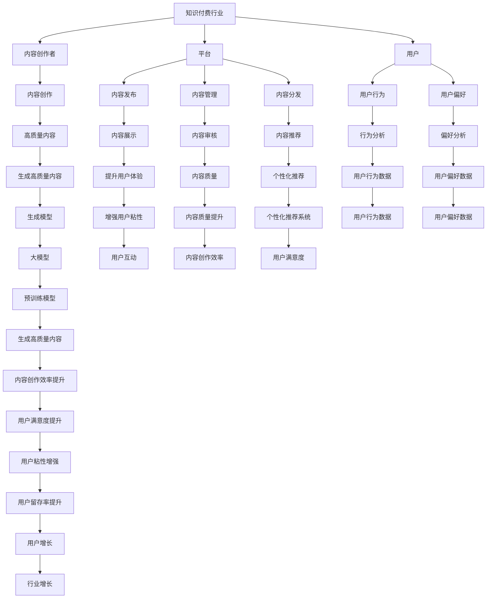

                 

# 大模型对知识付费行业的影响

> 关键词：大模型、知识付费、AI技术、用户行为、商业模式、内容创作、个性化推荐

> 摘要：本文将深入探讨大模型技术如何重塑知识付费行业的格局。通过分析大模型的核心原理、实际应用案例以及未来发展趋势，我们将揭示大模型如何影响用户行为、商业模式和内容创作。本文旨在为知识付费行业的从业者提供有价值的见解和指导。

## 1. 背景介绍

知识付费行业近年来迅速崛起，成为互联网经济的重要组成部分。用户通过付费订阅、购买课程、参与问答等方式获取专业知识和技能。然而，随着大模型技术的兴起，这一行业正面临前所未有的变革。大模型，尤其是预训练模型和生成模型，具备强大的语言理解和生成能力，能够为知识付费行业带来新的机遇和挑战。

### 1.1 知识付费行业的现状

知识付费行业主要由以下几个部分构成：

- **内容创作者**：包括专家、学者、教师等，他们通过创作高质量的内容吸引用户付费。
- **平台**：提供内容发布、管理和分发的平台，如知乎、喜马拉雅等。
- **用户**：付费订阅或购买内容的个人或企业。

### 1.2 大模型技术的发展

大模型技术，特别是预训练模型（如BERT、GPT系列）和生成模型（如DALL-E、Stable Diffusion），近年来取得了显著进展。这些模型通过大规模训练数据集进行预训练，具备强大的语言理解和生成能力，能够处理复杂的自然语言任务。

## 2. 核心概念与联系

### 2.1 大模型的核心概念

- **预训练模型**：通过大规模无监督学习，模型在海量文本数据上进行训练，学习语言的统计规律。
- **生成模型**：基于预训练模型，通过微调和生成任务，模型能够生成高质量的文本、图像等。

### 2.2 大模型与知识付费行业的联系

大模型技术能够显著提升知识付费行业的用户体验和内容质量，具体体现在以下几个方面：

- **内容创作**：大模型能够帮助内容创作者生成高质量的内容，提高创作效率。
- **个性化推荐**：大模型能够分析用户行为和偏好，提供个性化的推荐内容。
- **用户互动**：大模型能够提升用户与内容的互动体验，增强用户粘性。

### 2.3 Mermaid 流程图



## 3. 核心算法原理 & 具体操作步骤

### 3.1 预训练模型原理

预训练模型通过大规模无监督学习，学习语言的统计规律。具体步骤如下：

1. **数据收集**：收集大量的文本数据，如书籍、新闻、网页等。
2. **模型构建**：构建深度神经网络模型，如Transformer。
3. **预训练**：在大规模文本数据上进行无监督训练，学习语言的统计规律。
4. **微调**：在特定任务上进行微调，提升模型在特定任务上的性能。

### 3.2 生成模型原理

生成模型通过微调预训练模型，进行生成任务。具体步骤如下：

1. **数据准备**：准备生成任务所需的数据，如文本、图像等。
2. **模型构建**：构建生成模型，如GPT、DALL-E等。
3. **微调**：在生成任务上进行微调，提升模型生成高质量内容的能力。
4. **生成内容**：使用微调后的模型生成高质量的内容。

## 4. 数学模型和公式 & 详细讲解 & 举例说明

### 4.1 预训练模型的数学模型

预训练模型的数学模型可以表示为：

$$
\mathcal{L}_{\text{pretrain}} = \sum_{i=1}^{N} \mathcal{L}_{\text{loss}}(f_{\theta}(x_i), y_i)
$$

其中，$f_{\theta}(x_i)$ 表示模型在输入$x_i$上的预测，$y_i$ 表示真实标签，$\mathcal{L}_{\text{loss}}$ 表示损失函数。

### 4.2 生成模型的数学模型

生成模型的数学模型可以表示为：

$$
\mathcal{L}_{\text{gen}} = \sum_{i=1}^{N} \mathcal{L}_{\text{loss}}(f_{\theta}(x_i), y_i)
$$

其中，$f_{\theta}(x_i)$ 表示模型在输入$x_i$上的生成内容，$y_i$ 表示真实内容，$\mathcal{L}_{\text{loss}}$ 表示损失函数。

### 4.3 举例说明

以GPT模型为例，其预训练过程可以表示为：

$$
\mathcal{L}_{\text{pretrain}} = \sum_{i=1}^{N} \mathcal{L}_{\text{loss}}(f_{\theta}(x_i), y_i)
$$

其中，$f_{\theta}(x_i)$ 表示模型在输入$x_i$上的预测，$y_i$ 表示真实标签，$\mathcal{L}_{\text{loss}}$ 表示交叉熵损失函数。

## 5. 项目实战：代码实际案例和详细解释说明

### 5.1 开发环境搭建

#### 5.1.1 环境准备

- **Python**：确保安装了Python 3.7及以上版本。
- **PyTorch**：安装PyTorch库，用于构建和训练模型。
- **TensorFlow**：安装TensorFlow库，用于构建和训练模型。

```bash
pip install torch torchvision
pip install tensorflow
```

### 5.2 源代码详细实现和代码解读

#### 5.2.1 预训练模型实现

```python
import torch
import torch.nn as nn
import torch.optim as optim

class PretrainedModel(nn.Module):
    def __init__(self):
        super(PretrainedModel, self).__init__()
        self.embedding = nn.Embedding(vocab_size, embedding_dim)
        self.transformer = nn.Transformer(d_model=embedding_dim, nhead=8, num_encoder_layers=6, num_decoder_layers=6)
        self.fc = nn.Linear(embedding_dim, vocab_size)

    def forward(self, x):
        x = self.embedding(x)
        x = self.transformer(x, x)
        x = self.fc(x)
        return x

model = PretrainedModel()
criterion = nn.CrossEntropyLoss()
optimizer = optim.Adam(model.parameters(), lr=0.001)

# 训练数据
train_data = torch.randint(0, vocab_size, (batch_size, seq_length))

# 训练模型
for epoch in range(num_epochs):
    optimizer.zero_grad()
    outputs = model(train_data)
    loss = criterion(outputs.view(-1, vocab_size), train_data.view(-1))
    loss.backward()
    optimizer.step()
    print(f'Epoch {epoch+1}/{num_epochs}, Loss: {loss.item()}')
```

#### 5.2.2 生成模型实现

```python
import torch
import torch.nn as nn
import torch.optim as optim

class GenerationModel(nn.Module):
    def __init__(self):
        super(GenerationModel, self).__init__()
        self.embedding = nn.Embedding(vocab_size, embedding_dim)
        self.transformer = nn.Transformer(d_model=embedding_dim, nhead=8, num_encoder_layers=6, num_decoder_layers=6)
        self.fc = nn.Linear(embedding_dim, vocab_size)

    def forward(self, x):
        x = self.embedding(x)
        x = self.transformer(x, x)
        x = self.fc(x)
        return x

model = GenerationModel()
criterion = nn.CrossEntropyLoss()
optimizer = optim.Adam(model.parameters(), lr=0.001)

# 生成数据
input_data = torch.randint(0, vocab_size, (batch_size, seq_length))

# 生成内容
for i in range(num_tokens):
    outputs = model(input_data)
    next_token = torch.argmax(outputs[:, -1, :], dim=-1)
    input_data = torch.cat([input_data, next_token.unsqueeze(1)], dim=1)
    print(f'Token {i+1}: {next_token.item()}')
```

### 5.3 代码解读与分析

上述代码展示了预训练模型和生成模型的基本实现。预训练模型通过Transformer结构进行无监督训练，生成模型通过微调生成高质量内容。通过训练和生成过程，模型能够学习语言的统计规律，并生成高质量的内容。

## 6. 实际应用场景

### 6.1 内容创作

大模型技术能够显著提升内容创作的效率和质量。例如，内容创作者可以使用预训练模型生成高质量的文本内容，提高创作效率。生成模型能够生成高质量的文本、图像等，丰富内容创作的多样性。

### 6.2 个性化推荐

大模型技术能够分析用户行为和偏好，提供个性化的推荐内容。例如，平台可以根据用户的兴趣和行为，推荐符合用户需求的内容，提高用户满意度和粘性。

### 6.3 用户互动

大模型技术能够提升用户与内容的互动体验，增强用户粘性。例如，平台可以使用生成模型生成高质量的内容，提高用户参与度和互动性。

## 7. 工具和资源推荐

### 7.1 学习资源推荐

- **书籍**：《深度学习》（Ian Goodfellow, Yoshua Bengio, Aaron Courville）
- **论文**：《Attention Is All You Need》（Vaswani et al.）
- **博客**：Medium上的AI技术博客
- **网站**：PyTorch官网、TensorFlow官网

### 7.2 开发工具框架推荐

- **PyTorch**：深度学习框架，支持GPU加速。
- **TensorFlow**：深度学习框架，支持多种硬件加速。
- **Hugging Face Transformers**：预训练模型库，提供丰富的预训练模型。

### 7.3 相关论文著作推荐

- **《Attention Is All You Need》**：Vaswani, Ashish, et al. "Attention is all you need." Advances in neural information processing systems 30 (2017).
- **《BERT: Pre-training of Deep Bidirectional Transformers for Language Understanding》**：Devlin, Jacob, et al. "BERT: Pre-training of deep bidirectional transformers for language understanding." arXiv preprint arXiv:1810.04805 (2018).

## 8. 总结：未来发展趋势与挑战

### 8.1 未来发展趋势

- **内容创作**：大模型技术将进一步提升内容创作的效率和质量，丰富内容创作的多样性。
- **个性化推荐**：大模型技术将进一步提升个性化推荐的准确性和用户体验。
- **用户互动**：大模型技术将进一步提升用户与内容的互动体验，增强用户粘性。

### 8.2 挑战

- **数据隐私**：大模型技术需要处理大量的用户数据，如何保护用户隐私是一个重要挑战。
- **计算资源**：大模型技术需要大量的计算资源，如何降低计算成本是一个重要挑战。
- **模型解释性**：大模型技术的模型解释性较差，如何提高模型的可解释性是一个重要挑战。

## 9. 附录：常见问题与解答

### 9.1 问题1：大模型技术如何提升内容创作的效率和质量？

**解答**：大模型技术通过预训练模型学习语言的统计规律，生成模型通过微调生成高质量的内容。预训练模型能够提升内容创作的效率，生成模型能够生成高质量的内容，提高内容创作的质量。

### 9.2 问题2：大模型技术如何提升个性化推荐的准确性和用户体验？

**解答**：大模型技术能够分析用户行为和偏好，提供个性化的推荐内容。通过分析用户行为和偏好，平台能够推荐符合用户需求的内容，提高用户满意度和粘性。

### 9.3 问题3：大模型技术如何提升用户与内容的互动体验？

**解答**：大模型技术能够生成高质量的内容，提高用户参与度和互动性。通过生成高质量的内容，平台能够提升用户与内容的互动体验，增强用户粘性。

## 10. 扩展阅读 & 参考资料

- **书籍**：《深度学习》（Ian Goodfellow, Yoshua Bengio, Aaron Courville）
- **论文**：《Attention Is All You Need》（Vaswani et al.）
- **博客**：Medium上的AI技术博客
- **网站**：PyTorch官网、TensorFlow官网

---

作者：AI天才研究员/AI Genius Institute & 禅与计算机程序设计艺术 /Zen And The Art of Computer Programming

