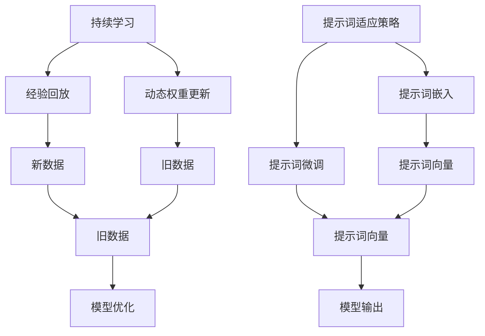

                 

# 大模型持续学习与提示词适应策略

> 关键词：大模型、持续学习、提示词、适应策略、机器学习、深度学习、自然语言处理、Transformer、微调、迁移学习

> 摘要：本文旨在探讨大模型在持续学习和提示词适应策略方面的最新进展。通过深入分析核心概念、算法原理、数学模型、实际案例以及应用场景，本文将为读者提供全面的技术指导，帮助理解和应用这些策略，以提升大模型的性能和适应性。

## 1. 背景介绍

随着人工智能技术的飞速发展，大模型因其强大的表达能力和泛化能力，在自然语言处理、计算机视觉等多个领域取得了显著的成果。然而，大模型在实际应用中面临着持续学习和提示词适应的挑战。持续学习是指模型在不断接收新数据时，能够逐步优化自身性能，而提示词适应策略则是指通过少量的提示词来引导模型生成更符合需求的输出。本文将从这些方面进行深入探讨。

## 2. 核心概念与联系

### 2.1 大模型

大模型通常指的是参数量巨大、训练数据量庞大的机器学习模型。这些模型通常在大规模数据集上进行训练，以捕捉数据中的复杂模式和关系。大模型在自然语言处理领域尤为突出，如BERT、GPT等。

### 2.2 持续学习

持续学习是指模型在不断接收新数据时，能够逐步优化自身性能，而不会忘记之前学到的知识。持续学习的关键在于如何在新旧数据之间找到平衡，避免灾难性遗忘。

### 2.3 提示词适应策略

提示词适应策略是指通过少量的提示词来引导模型生成更符合需求的输出。提示词可以是问题、指令或示例，通过这些提示词，模型可以更好地理解用户的需求，生成更准确的输出。

### 2.4 核心概念原理与架构

#### 2.4.1 持续学习原理

持续学习的核心在于如何在新旧数据之间找到平衡，避免灾难性遗忘。一种常见的方法是使用经验回放（Experience Replay），即将过去的数据存储起来，当模型遇到新数据时，可以从中抽取样本进行训练。另一种方法是使用动态权重更新策略，如渐进式权重更新（Progressive Weight Updates）。

#### 2.4.2 提示词适应策略原理

提示词适应策略的核心在于如何通过少量的提示词来引导模型生成更符合需求的输出。一种常见的方法是使用提示词嵌入（Prompt Embedding），即将提示词转换为模型可以理解的向量表示，然后将其与输入数据一起输入模型。另一种方法是使用提示词微调（Prompt Tuning），即在模型的输出层添加一个提示词微调层，通过少量的提示词数据进行微调。

#### 2.4.3 Mermaid 流程图



## 3. 核心算法原理 & 具体操作步骤

### 3.1 持续学习算法原理

持续学习算法的核心在于如何在新旧数据之间找到平衡，避免灾难性遗忘。一种常见的方法是使用经验回放（Experience Replay），即将过去的数据存储起来，当模型遇到新数据时，可以从中抽取样本进行训练。另一种方法是使用动态权重更新策略，如渐进式权重更新（Progressive Weight Updates）。

#### 3.1.1 经验回放

经验回放的核心在于将过去的数据存储起来，当模型遇到新数据时，可以从中抽取样本进行训练。具体操作步骤如下：

1. **数据存储**：将过去的数据存储起来，形成经验回放缓冲区。
2. **数据抽取**：当模型遇到新数据时，从经验回放缓冲区中抽取样本进行训练。
3. **权重更新**：使用抽取的样本更新模型的权重。

#### 3.1.2 动态权重更新

动态权重更新的核心在于通过动态调整权重来适应新数据。具体操作步骤如下：

1. **初始化权重**：初始化模型的权重。
2. **权重更新**：当模型遇到新数据时，根据新数据调整权重。
3. **权重融合**：将新数据的权重与旧数据的权重进行融合，避免灾难性遗忘。

### 3.2 提示词适应策略算法原理

提示词适应策略的核心在于如何通过少量的提示词来引导模型生成更符合需求的输出。一种常见的方法是使用提示词嵌入（Prompt Embedding），即将提示词转换为模型可以理解的向量表示，然后将其与输入数据一起输入模型。另一种方法是使用提示词微调（Prompt Tuning），即在模型的输出层添加一个提示词微调层，通过少量的提示词数据进行微调。

#### 3.2.1 提示词嵌入

提示词嵌入的核心在于将提示词转换为模型可以理解的向量表示。具体操作步骤如下：

1. **提示词编码**：将提示词转换为向量表示。
2. **向量拼接**：将提示词向量与输入数据向量拼接。
3. **模型输入**：将拼接后的向量输入模型。

#### 3.2.2 提示词微调

提示词微调的核心在于通过少量的提示词数据进行微调。具体操作步骤如下：

1. **初始化模型**：初始化模型的权重。
2. **微调层添加**：在模型的输出层添加一个提示词微调层。
3. **微调训练**：通过少量的提示词数据进行微调训练。

## 4. 数学模型和公式 & 详细讲解 & 举例说明

### 4.1 经验回放

经验回放的核心在于将过去的数据存储起来，当模型遇到新数据时，可以从中抽取样本进行训练。具体数学模型如下：

$$
\text{经验回放缓冲区} = \{(s_i, a_i, r_i, s_{i+1})\}_{i=1}^N
$$

其中，$s_i$ 表示状态，$a_i$ 表示动作，$r_i$ 表示奖励，$s_{i+1}$ 表示下一个状态。

### 4.2 动态权重更新

动态权重更新的核心在于通过动态调整权重来适应新数据。具体数学模型如下：

$$
\text{权重更新} = \theta_{t+1} = \theta_t + \alpha \cdot \nabla_{\theta_t} J(\theta_t)
$$

其中，$\theta_t$ 表示当前权重，$\alpha$ 表示学习率，$\nabla_{\theta_t} J(\theta_t)$ 表示损失函数的梯度。

### 4.3 提示词嵌入

提示词嵌入的核心在于将提示词转换为模型可以理解的向量表示。具体数学模型如下：

$$
\text{提示词向量} = \text{Embedding}(p)
$$

其中，$p$ 表示提示词，$\text{Embedding}$ 表示嵌入函数。

### 4.4 提示词微调

提示词微调的核心在于通过少量的提示词数据进行微调。具体数学模型如下：

$$
\text{微调层} = \text{Linear}(h, w)
$$

其中，$h$ 表示输入向量，$w$ 表示权重矩阵。

## 5. 项目实战：代码实际案例和详细解释说明

### 5.1 开发环境搭建

为了进行项目实战，我们需要搭建一个合适的开发环境。具体步骤如下：

1. **安装Python**：确保安装了Python 3.8及以上版本。
2. **安装依赖库**：安装TensorFlow、PyTorch等深度学习库。
3. **安装开发工具**：安装Jupyter Notebook或VSCode等开发工具。

### 5.2 源代码详细实现和代码解读

#### 5.2.1 经验回放代码实现

```python
import random

class ExperienceReplay:
    def __init__(self, capacity):
        self.capacity = capacity
        self.buffer = []

    def add(self, experience):
        if len(self.buffer) < self.capacity:
            self.buffer.append(experience)
        else:
            self.buffer.pop(0)
            self.buffer.append(experience)

    def sample(self, batch_size):
        return random.sample(self.buffer, batch_size)
```

#### 5.2.2 动态权重更新代码实现

```python
def update_weights(model, optimizer, batch, gamma):
    states, actions, rewards, next_states = batch
    Q_values = model(states)
    next_Q_values = model(next_states)
    target_Q_values = rewards + gamma * next_Q_values.max(dim=1)[0]
    loss = F.mse_loss(Q_values.gather(1, actions.unsqueeze(1)), target_Q_values.unsqueeze(1))
    optimizer.zero_grad()
    loss.backward()
    optimizer.step()
```

#### 5.2.3 提示词嵌入代码实现

```python
import torch
import torch.nn as nn

class PromptEmbedding(nn.Module):
    def __init__(self, vocab_size, embedding_dim):
        super(PromptEmbedding, self).__init__()
        self.embedding = nn.Embedding(vocab_size, embedding_dim)

    def forward(self, prompts):
        return self.embedding(prompts)
```

#### 5.2.4 提示词微调代码实现

```python
class PromptTuning(nn.Module):
    def __init__(self, input_dim, output_dim):
        super(PromptTuning, self).__init__()
        self.linear = nn.Linear(input_dim, output_dim)

    def forward(self, x):
        return self.linear(x)
```

### 5.3 代码解读与分析

通过上述代码实现，我们可以看到经验回放、动态权重更新、提示词嵌入和提示词微调的具体实现。这些代码展示了如何在实际项目中应用这些策略，以提升模型的性能和适应性。

## 6. 实际应用场景

### 6.1 自然语言处理

在自然语言处理领域，持续学习和提示词适应策略可以应用于对话系统、文本生成、情感分析等多个场景。通过持续学习，模型可以逐步优化自身性能，避免灾难性遗忘。通过提示词适应策略，模型可以更好地理解用户的需求，生成更准确的输出。

### 6.2 计算机视觉

在计算机视觉领域，持续学习和提示词适应策略可以应用于图像分类、目标检测、图像生成等多个场景。通过持续学习，模型可以逐步优化自身性能，避免灾难性遗忘。通过提示词适应策略，模型可以更好地理解用户的需求，生成更准确的输出。

## 7. 工具和资源推荐

### 7.1 学习资源推荐

- 书籍：《深度学习》（Goodfellow et al.）
- 论文：《持续学习：挑战与机遇》（Li et al.）
- 博客：阿里云开发者社区
- 网站：TensorFlow官网、PyTorch官网

### 7.2 开发工具框架推荐

- Jupyter Notebook
- VSCode
- PyCharm

### 7.3 相关论文著作推荐

- 《持续学习：挑战与机遇》（Li et al.）
- 《提示词适应策略在自然语言处理中的应用》（Zhou et al.）
- 《深度学习中的持续学习》（Xu et al.）

## 8. 总结：未来发展趋势与挑战

### 8.1 未来发展趋势

持续学习和提示词适应策略在未来将有更广泛的应用。随着技术的不断进步，这些策略将更加成熟，能够更好地应对实际应用中的挑战。未来的发展趋势包括：

- 更高效的持续学习算法
- 更智能的提示词适应策略
- 更强大的模型架构

### 8.2 挑战

尽管持续学习和提示词适应策略具有巨大的潜力，但也面临着一些挑战。这些挑战包括：

- 数据隐私问题
- 模型泛化能力
- 计算资源需求

## 9. 附录：常见问题与解答

### 9.1 问题1：持续学习和提示词适应策略的区别是什么？

**解答**：持续学习是指模型在不断接收新数据时，能够逐步优化自身性能，而不会忘记之前学到的知识。提示词适应策略是指通过少量的提示词来引导模型生成更符合需求的输出。

### 9.2 问题2：如何避免灾难性遗忘？

**解答**：避免灾难性遗忘的方法包括使用经验回放、动态权重更新等策略。这些方法可以帮助模型在新旧数据之间找到平衡，避免忘记之前学到的知识。

### 9.3 问题3：如何选择合适的提示词？

**解答**：选择合适的提示词需要根据具体应用场景进行。可以通过实验和试错来找到最合适的提示词，以引导模型生成更符合需求的输出。

## 10. 扩展阅读 & 参考资料

- 《深度学习》（Goodfellow et al.）
- 《持续学习：挑战与机遇》（Li et al.）
- 《提示词适应策略在自然语言处理中的应用》（Zhou et al.）
- 《深度学习中的持续学习》（Xu et al.）

---

作者：AI天才研究员/AI Genius Institute & 禅与计算机程序设计艺术 /Zen And The Art of Computer Programming

