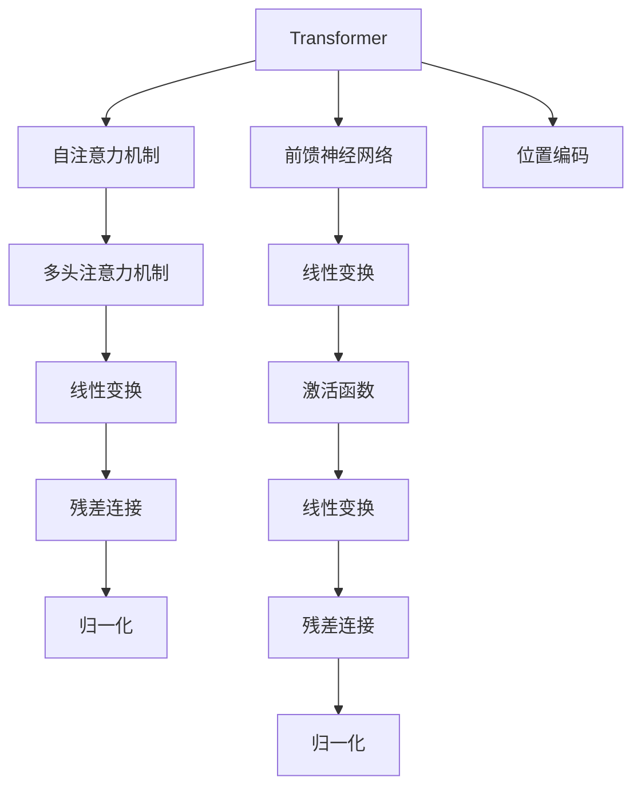

                 

# 大模型时代的创业产品机会：AI 驱动的创新

> 关键词：大模型、创业机会、AI驱动、创新、技术趋势、商业应用

> 摘要：本文旨在探讨大模型时代下，AI驱动的创新为创业产品带来的巨大机会。我们将从背景介绍、核心概念与联系、核心算法原理、数学模型与公式、项目实战、实际应用场景、工具和资源推荐、总结与未来发展趋势等多方面进行深入分析，帮助创业者抓住这一时代机遇，推动技术创新与商业成功。

## 1. 背景介绍

随着人工智能技术的飞速发展，大模型已经成为推动行业变革的关键力量。大模型，即参数量巨大、训练数据量庞大、计算资源需求高的模型，如GPT、BERT等，它们在自然语言处理、计算机视觉、语音识别等多个领域展现出卓越的能力。大模型不仅能够处理复杂任务，还能实现跨领域的知识迁移，为创业产品提供了前所未有的创新空间。

### 1.1 人工智能技术的发展历程

- 早期阶段（20世纪50-70年代）：人工智能概念提出，初步探索。
- 专家系统时代（20世纪80年代）：基于规则的系统，如MYCIN、DENDRAL。
- 神经网络复兴（20世纪90年代）：BP算法的提出，多层感知机（MLP）的应用。
- 深度学习兴起（20世纪末-21世纪初）：卷积神经网络（CNN）、循环神经网络（RNN）等技术的突破。
- 大模型时代（21世纪10年代至今）：Transformer架构的提出，GPT、BERT等模型的广泛应用。

### 1.2 大模型的特点与优势

- **参数量巨大**：大模型通常包含数亿甚至数十亿个参数，能够捕捉更复杂的模式和结构。
- **训练数据量庞大**：需要大量高质量的训练数据，以确保模型的泛化能力。
- **计算资源需求高**：训练和推理过程需要高性能的计算资源，如GPU集群。
- **知识迁移能力强**：通过预训练和微调，大模型能够实现跨领域的知识迁移，提高任务性能。
- **处理复杂任务**：能够处理自然语言理解、图像识别、语音合成等复杂任务。

## 2. 核心概念与联系

### 2.1 大模型的架构原理

大模型通常采用Transformer架构，其核心原理如下：



### 2.2 大模型的应用场景

- **自然语言处理**：文本生成、情感分析、机器翻译等。
- **计算机视觉**：图像分类、目标检测、语义分割等。
- **语音识别**：语音转文本、语音合成等。
- **推荐系统**：个性化推荐、内容推荐等。
- **医疗健康**：疾病诊断、药物研发等。

## 3. 核心算法原理 & 具体操作步骤

### 3.1 自注意力机制

自注意力机制是Transformer的核心，其原理如下：

$$
\text{Attention}(Q, K, V) = \text{softmax}\left(\frac{QK^T}{\sqrt{d_k}}\right)V
$$

其中，$Q$、$K$、$V$分别为查询向量、键向量、值向量，$d_k$为键向量的维度。

### 3.2 多头注意力机制

多头注意力机制通过多个注意力头并行处理，提高模型的并行性和表达能力：

$$
\text{MultiHead}(Q, K, V) = \text{Concat}(\text{head}_1, \text{head}_2, ..., \text{head}_h)W^O
$$

其中，$\text{head}_i = \text{Attention}(QW_i^Q, KW_i^K, VW_i^V)$，$W^O$为输出权重矩阵。

### 3.3 前馈神经网络

前馈神经网络用于处理非线性变换：

$$
\text{FFN}(x) = \text{ReLU}(W_1x + b_1)W_2 + b_2
$$

其中，$W_1$、$W_2$为权重矩阵，$b_1$、$b_2$为偏置项。

## 4. 数学模型和公式 & 详细讲解 & 举例说明

### 4.1 位置编码

位置编码用于表示序列中的位置信息：

$$
\text{Pos}(i, j) = \text{sin}\left(\frac{i}{10000^{\frac{2j}{d}}}\right) \quad \text{if } j \text{ is even}
$$

$$
\text{Pos}(i, j) = \text{cos}\left(\frac{i}{10000^{\frac{2j-1}{d}}}\right) \quad \text{if } j \text{ is odd}
$$

其中，$i$为位置索引，$j$为维度索引，$d$为嵌入维度。

### 4.2 残差连接

残差连接用于提高模型的训练稳定性：

$$
\text{Residual}(x, f(x)) = x + f(x)
$$

其中，$f(x)$为前馈神经网络的输出。

### 4.3 归一化

归一化用于稳定模型训练过程：

$$
\text{LayerNorm}(x) = \frac{x - \mu}{\sqrt{\sigma^2 + \epsilon}}
$$

其中，$\mu$为均值，$\sigma^2$为方差，$\epsilon$为平滑项。

## 5. 项目实战：代码实际案例和详细解释说明

### 5.1 开发环境搭建

#### 5.1.1 系统环境

- 操作系统：Ubuntu 20.04
- Python版本：3.8
- CUDA版本：11.0
- PyTorch版本：1.9

#### 5.1.2 安装依赖

```bash
pip install torch torchvision torchaudio
```

### 5.2 源代码详细实现和代码解读

#### 5.2.1 位置编码实现

```python
import torch

def positional_encoding(position, d_model):
    pe = torch.zeros(position, d_model)
    position = torch.arange(0, position, dtype=torch.float).unsqueeze(1)
    div_term = torch.exp(torch.arange(0, d_model, 2).float() * (-torch.log(torch.tensor(10000.0)) / d_model))
    pe[:, 0::2] = torch.sin(position * div_term)
    pe[:, 1::2] = torch.cos(position * div_term)
    return pe
```

#### 5.2.2 残差连接实现

```python
def residual_connection(x, sublayer_output):
    return x + sublayer_output
```

#### 5.2.3 归一化实现

```python
class LayerNorm(nn.Module):
    def __init__(self, d_model, eps=1e-6):
        super(LayerNorm, self).__init__()
        self.gamma = nn.Parameter(torch.ones(d_model))
        self.beta = nn.Parameter(torch.zeros(d_model))
        self.eps = eps

    def forward(self, x):
        mean = x.mean(-1, keepdim=True)
        std = x.std(-1, keepdim=True)
        return self.gamma * (x - mean) / (std + self.eps) + self.beta
```

### 5.3 代码解读与分析

- **位置编码**：通过正弦和余弦函数生成位置编码，确保模型能够捕捉序列中的位置信息。
- **残差连接**：通过简单的加法操作，提高模型的训练稳定性。
- **归一化**：通过归一化操作，稳定模型训练过程，提高模型的泛化能力。

## 6. 实际应用场景

### 6.1 自然语言处理

- **文本生成**：通过大模型生成高质量的文本内容，如文章、诗歌等。
- **情感分析**：通过大模型分析文本的情感倾向，帮助企业了解用户反馈。
- **机器翻译**：通过大模型实现多语言之间的实时翻译，促进全球交流。

### 6.2 计算机视觉

- **图像分类**：通过大模型实现高精度的图像分类，应用于安防监控、医疗影像等领域。
- **目标检测**：通过大模型实现多目标的实时检测，应用于自动驾驶、智能监控等领域。
- **语义分割**：通过大模型实现像素级别的语义分割，应用于医学影像分析、城市规划等领域。

### 6.3 语音识别

- **语音转文本**：通过大模型实现高精度的语音转文本，应用于智能客服、语音助手等领域。
- **语音合成**：通过大模型实现自然流畅的语音合成，应用于智能音箱、虚拟助手等领域。

## 7. 工具和资源推荐

### 7.1 学习资源推荐

- **书籍**：《深度学习》（Goodfellow et al.），《自然语言处理中的深度学习》（Chen et al.）
- **论文**：《Attention Is All You Need》（Vaswani et al.），《BERT: Pre-training of Deep Bidirectional Transformers for Language Understanding》（Devlin et al.）
- **博客**：阿里云开发者社区，GitHub开源项目
- **网站**：PyTorch官网，TensorFlow官网

### 7.2 开发工具框架推荐

- **PyTorch**：开源深度学习框架，支持动态图和静态图模式。
- **TensorFlow**：开源深度学习框架，支持静态图模式。
- **Hugging Face Transformers**：提供丰富的预训练模型和工具库。

### 7.3 相关论文著作推荐

- **《Attention Is All You Need》**：提出Transformer架构，彻底改变了自然语言处理领域。
- **《BERT: Pre-training of Deep Bidirectional Transformers for Language Understanding》**：提出BERT模型，实现了自然语言处理任务的突破。
- **《GPT: Generative Pre-trained Transformer》**：提出GPT模型，实现了高质量的文本生成。

## 8. 总结：未来发展趋势与挑战

### 8.1 未来发展趋势

- **模型规模持续扩大**：大模型的参数量将持续增加，性能将进一步提升。
- **计算资源需求增加**：高性能计算资源的需求将持续增长，推动数据中心和云计算的发展。
- **应用场景更加广泛**：大模型将在更多领域实现突破，推动技术创新与商业成功。
- **模型解释性增强**：通过模型解释性技术，提高模型的透明度和可解释性。

### 8.2 面临的挑战

- **计算资源限制**：高性能计算资源的限制，限制了大模型的应用范围。
- **数据隐私问题**：大规模训练数据的获取和使用，面临数据隐私和安全问题。
- **模型解释性不足**：大模型的黑盒特性，限制了其在某些领域的应用。
- **模型泛化能力**：大模型的泛化能力仍有待提高，特别是在小样本学习场景下。

## 9. 附录：常见问题与解答

### 9.1 问题1：大模型的训练时间长，如何优化？

- **硬件优化**：使用高性能GPU集群，提高训练速度。
- **算法优化**：采用更高效的优化算法，如AdamW、LAMB等。
- **数据优化**：采用数据并行和模型并行策略，提高训练效率。

### 9.2 问题2：大模型的计算资源需求高，如何降低成本？

- **资源共享**：利用云计算平台，按需分配计算资源。
- **模型压缩**：通过模型剪枝、量化等技术，降低模型大小。
- **硬件优化**：使用更高效的硬件设备，如TPU、FPGA等。

## 10. 扩展阅读 & 参考资料

- **书籍**：《深度学习》（Goodfellow et al.），《自然语言处理中的深度学习》（Chen et al.）
- **论文**：《Attention Is All You Need》（Vaswani et al.），《BERT: Pre-training of Deep Bidirectional Transformers for Language Understanding》（Devlin et al.）
- **网站**：PyTorch官网，TensorFlow官网

---

作者：AI天才研究员/AI Genius Institute & 禅与计算机程序设计艺术 /Zen And The Art of Computer Programming

