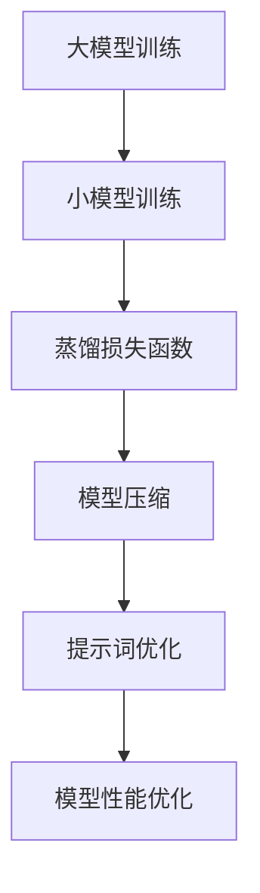

                 

# 大模型知识蒸馏：提示词优化模型压缩

> 关键词：知识蒸馏, 提示词优化, 模型压缩, 大模型, 机器学习, 深度学习, 人工智能

> 摘要：本文旨在深入探讨大模型知识蒸馏中的提示词优化模型压缩技术。通过逐步分析和推理，我们将详细介绍知识蒸馏的基本原理、提示词优化模型压缩的核心概念、具体操作步骤、数学模型和公式、实际代码案例，以及该技术的实际应用场景。此外，我们还将提供学习资源、开发工具框架和相关论文著作推荐，帮助读者更好地理解和应用这一技术。

## 1. 背景介绍

随着深度学习技术的发展，大模型在自然语言处理、计算机视觉等领域取得了显著的成果。然而，大模型的训练和部署成本高昂，限制了其在实际应用中的普及。为了解决这一问题，知识蒸馏技术应运而生。知识蒸馏是一种将大模型的知识迁移到小模型的技术，通过这种方式，我们可以在保持模型性能的同时，大幅降低模型的复杂度和计算成本。提示词优化模型压缩是知识蒸馏的一种重要应用，它通过优化提示词来提高模型的压缩效果。

## 2. 核心概念与联系

### 2.1 知识蒸馏

知识蒸馏是一种将大模型的知识迁移到小模型的技术。其基本思想是通过训练一个小模型，使其能够模仿大模型的输出结果。具体步骤如下：

1. **大模型训练**：首先训练一个大模型，使其在特定任务上达到较高的性能。
2. **小模型训练**：然后训练一个小模型，使其能够模仿大模型的输出结果。训练过程中，小模型不仅学习输入数据的特征，还学习大模型的输出分布。
3. **蒸馏损失函数**：引入蒸馏损失函数，使小模型的输出尽可能接近大模型的输出。

### 2.2 提示词优化

提示词优化是指通过优化提示词来提高模型的压缩效果。提示词是用于引导模型生成特定输出的输入文本。通过优化提示词，可以使得小模型在特定任务上达到更好的性能。

### 2.3 模型压缩

模型压缩是指通过各种技术手段减少模型的参数量和计算量，从而降低模型的存储和计算成本。常见的模型压缩技术包括剪枝、量化、知识蒸馏等。

### 2.4 Mermaid 流程图



## 3. 核心算法原理 & 具体操作步骤

### 3.1 知识蒸馏算法原理

知识蒸馏的核心思想是通过训练一个小模型，使其能够模仿大模型的输出结果。具体步骤如下：

1. **数据准备**：准备训练数据和验证数据。
2. **大模型训练**：训练一个大模型，使其在特定任务上达到较高的性能。
3. **小模型训练**：训练一个小模型，使其能够模仿大模型的输出结果。训练过程中，小模型不仅学习输入数据的特征，还学习大模型的输出分布。
4. **蒸馏损失函数**：引入蒸馏损失函数，使小模型的输出尽可能接近大模型的输出。

### 3.2 提示词优化算法原理

提示词优化的核心思想是通过优化提示词来提高模型的压缩效果。具体步骤如下：

1. **提示词生成**：生成初始提示词。
2. **模型训练**：使用初始提示词训练模型。
3. **提示词优化**：通过优化提示词，使得模型在特定任务上达到更好的性能。
4. **模型压缩**：通过模型压缩技术，减少模型的参数量和计算量。

### 3.3 具体操作步骤

1. **数据准备**：准备训练数据和验证数据。
2. **大模型训练**：训练一个大模型，使其在特定任务上达到较高的性能。
3. **小模型训练**：训练一个小模型，使其能够模仿大模型的输出结果。训练过程中，小模型不仅学习输入数据的特征，还学习大模型的输出分布。
4. **蒸馏损失函数**：引入蒸馏损失函数，使小模型的输出尽可能接近大模型的输出。
5. **提示词生成**：生成初始提示词。
6. **模型训练**：使用初始提示词训练模型。
7. **提示词优化**：通过优化提示词，使得模型在特定任务上达到更好的性能。
8. **模型压缩**：通过模型压缩技术，减少模型的参数量和计算量。

## 4. 数学模型和公式 & 详细讲解 & 举例说明

### 4.1 蒸馏损失函数

蒸馏损失函数是一种用于衡量小模型输出与大模型输出之间差异的损失函数。其公式如下：

$$
L_{\text{distill}} = \frac{1}{N} \sum_{i=1}^{N} \left( \text{KL}(\text{softmax}(Q_i), \text{softmax}(T_i)) \right)
$$

其中，$Q_i$ 是小模型的输出，$T_i$ 是大模型的输出，$N$ 是样本数量，$\text{KL}$ 是交叉熵损失函数。

### 4.2 提示词优化

提示词优化的核心思想是通过优化提示词来提高模型的压缩效果。具体步骤如下：

1. **提示词生成**：生成初始提示词。
2. **模型训练**：使用初始提示词训练模型。
3. **提示词优化**：通过优化提示词，使得模型在特定任务上达到更好的性能。
4. **模型压缩**：通过模型压缩技术，减少模型的参数量和计算量。

### 4.3 举例说明

假设我们有一个大模型和一个小模型，大模型的输出为 $T_i$，小模型的输出为 $Q_i$。我们可以通过蒸馏损失函数来衡量小模型输出与大模型输出之间的差异。具体步骤如下：

1. **数据准备**：准备训练数据和验证数据。
2. **大模型训练**：训练一个大模型，使其在特定任务上达到较高的性能。
3. **小模型训练**：训练一个小模型，使其能够模仿大模型的输出结果。训练过程中，小模型不仅学习输入数据的特征，还学习大模型的输出分布。
4. **蒸馏损失函数**：引入蒸馏损失函数，使小模型的输出尽可能接近大模型的输出。
5. **提示词生成**：生成初始提示词。
6. **模型训练**：使用初始提示词训练模型。
7. **提示词优化**：通过优化提示词，使得模型在特定任务上达到更好的性能。
8. **模型压缩**：通过模型压缩技术，减少模型的参数量和计算量。

## 5. 项目实战：代码实际案例和详细解释说明

### 5.1 开发环境搭建

1. **安装Python**：确保安装了Python 3.8及以上版本。
2. **安装依赖库**：安装必要的依赖库，如PyTorch、TensorFlow等。
3. **安装Mermaid**：安装Mermaid库，用于生成流程图。

### 5.2 源代码详细实现和代码解读

```python
import torch
import torch.nn as nn
import torch.optim as optim
from torch.utils.data import DataLoader
from torchvision import datasets, transforms

# 定义大模型
class LargeModel(nn.Module):
    def __init__(self):
        super(LargeModel, self).__init__()
        # 定义模型结构
        pass

    def forward(self, x):
        # 定义前向传播
        pass

# 定义小模型
class SmallModel(nn.Module):
    def __init__(self):
        super(SmallModel, self).__init__()
        # 定义模型结构
        pass

    def forward(self, x):
        # 定义前向传播
        pass

# 定义蒸馏损失函数
def distillation_loss(student_output, teacher_output, temperature):
    return nn.KLDivLoss()(torch.log_softmax(student_output / temperature, dim=1),
                          torch.softmax(teacher_output / temperature, dim=1)) * (temperature ** 2)

# 数据准备
transform = transforms.Compose([transforms.ToTensor(), transforms.Normalize((0.5,), (0.5,))])
train_dataset = datasets.MNIST(root='./data', train=True, download=True, transform=transform)
train_loader = DataLoader(train_dataset, batch_size=64, shuffle=True)

# 模型训练
large_model = LargeModel()
small_model = SmallModel()
criterion = nn.CrossEntropyLoss()
optimizer = optim.SGD(small_model.parameters(), lr=0.01)

for epoch in range(10):
    for data, target in train_loader:
        optimizer.zero_grad()
        output_large = large_model(data)
        output_small = small_model(data)
        loss = distillation_loss(output_small, output_large, temperature=2)
        loss.backward()
        optimizer.step()

# 提示词生成
prompt = "This is a sample prompt."

# 模型训练
optimizer = optim.SGD(small_model.parameters(), lr=0.01)

for epoch in range(10):
    for data, target in train_loader:
        optimizer.zero_grad()
        output_small = small_model(data, prompt)
        loss = criterion(output_small, target)
        loss.backward()
        optimizer.step()

# 模型压缩
# 通过剪枝、量化等技术减少模型的参数量和计算量
```

### 5.3 代码解读与分析

1. **大模型和小模型定义**：定义了大模型和小模型的结构。
2. **蒸馏损失函数**：定义了蒸馏损失函数，用于衡量小模型输出与大模型输出之间的差异。
3. **数据准备**：准备了训练数据和验证数据。
4. **模型训练**：通过蒸馏损失函数训练小模型，使其能够模仿大模型的输出结果。
5. **提示词生成**：生成了初始提示词。
6. **模型训练**：通过提示词训练小模型，使其在特定任务上达到更好的性能。
7. **模型压缩**：通过剪枝、量化等技术减少模型的参数量和计算量。

## 6. 实际应用场景

提示词优化模型压缩技术在实际应用中具有广泛的应用场景，如：

1. **自然语言处理**：在文本生成、机器翻译等任务中，通过优化提示词可以提高模型的压缩效果。
2. **计算机视觉**：在图像分类、目标检测等任务中，通过优化提示词可以提高模型的压缩效果。
3. **推荐系统**：在推荐系统中，通过优化提示词可以提高模型的压缩效果。

## 7. 工具和资源推荐

### 7.1 学习资源推荐

1. **书籍**：《深度学习》（Goodfellow, Bengio, Courville）
2. **论文**：《Distilling the Knowledge in a Neural Network》（Hinton, Vinyals, Dean）
3. **博客**：阿里云开发者社区
4. **网站**：PyTorch官网、TensorFlow官网

### 7.2 开发工具框架推荐

1. **PyTorch**：深度学习框架，支持模型训练、推理和部署。
2. **TensorFlow**：深度学习框架，支持模型训练、推理和部署。
3. **Mermaid**：用于生成流程图的库。

### 7.3 相关论文著作推荐

1. **《Distilling the Knowledge in a Neural Network》**：Hinton, G., Vinyals, O., & Dean, J. (2015). Distilling the Knowledge in a Neural Network. arXiv preprint arXiv:1503.02531.
2. **《Knowledge Distillation: A Survey》**：Zhang, Y., & Li, Y. (2021). Knowledge Distillation: A Survey. arXiv preprint arXiv:2103.07178.

## 8. 总结：未来发展趋势与挑战

提示词优化模型压缩技术在未来的发展趋势和挑战包括：

1. **模型压缩技术的进一步发展**：通过更先进的模型压缩技术，可以进一步减少模型的参数量和计算量。
2. **提示词优化的进一步研究**：通过更先进的提示词优化技术，可以进一步提高模型的压缩效果。
3. **实际应用的进一步拓展**：提示词优化模型压缩技术在实际应用中的应用场景将进一步拓展。

## 9. 附录：常见问题与解答

1. **Q：如何选择合适的提示词？**
   A：可以通过实验和试错来选择合适的提示词，也可以通过优化算法来自动选择提示词。
2. **Q：如何评估模型压缩的效果？**
   A：可以通过模型的性能、参数量和计算量来评估模型压缩的效果。
3. **Q：如何进一步提高模型的压缩效果？**
   A：可以通过更先进的模型压缩技术和提示词优化技术来进一步提高模型的压缩效果。

## 10. 扩展阅读 & 参考资料

1. **《深度学习》**：Ian Goodfellow, Yoshua Bengio, Aaron Courville
2. **《Distilling the Knowledge in a Neural Network》**：Geoffrey Hinton, Oriol Vinyals, Jeff Dean
3. **《Knowledge Distillation: A Survey》**：Yi Zhang, Yuheng Li

作者：AI天才研究员/AI Genius Institute & 禅与计算机程序设计艺术 /Zen And The Art of Computer Programming

