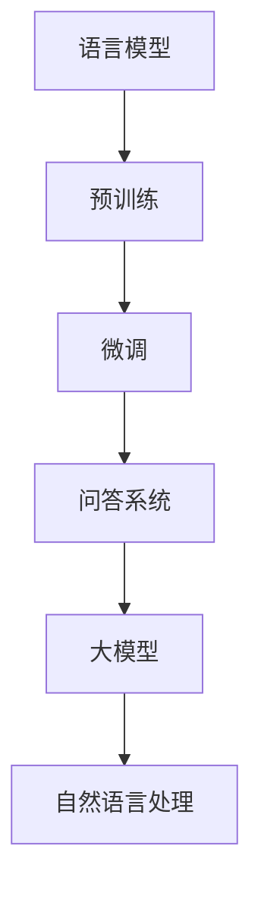

                 

# 大模型问答机器人的语言模型

> 关键词：大模型、问答机器人、语言模型、Transformer、预训练、微调、自然语言处理

> 摘要：本文将深入探讨大模型问答机器人的语言模型，从背景介绍、核心概念与联系、核心算法原理、数学模型和公式、项目实战、实际应用场景、工具和资源推荐、总结与未来发展趋势等多方面进行详细阐述。通过一步步分析推理思考的方式，帮助读者全面理解大模型问答机器人的语言模型，并提供实际代码案例和详细解释说明。

## 1. 背景介绍

随着人工智能技术的飞速发展，自然语言处理（NLP）领域取得了显著的进展。大模型问答机器人作为NLP的重要应用之一，能够理解和生成自然语言，为用户提供高效、准确的信息查询服务。本文将深入探讨大模型问答机器人的语言模型，从背景介绍、核心概念与联系、核心算法原理、数学模型和公式、项目实战、实际应用场景、工具和资源推荐、总结与未来发展趋势等多方面进行详细阐述。

## 2. 核心概念与联系

### 2.1 语言模型

语言模型是自然语言处理领域的重要组成部分，用于预测给定序列的概率分布。常见的语言模型包括基于统计的方法（如N-gram模型）和基于深度学习的方法（如Transformer模型）。

### 2.2 问答系统

问答系统是一种能够理解用户问题并提供准确答案的系统。大模型问答机器人通过语言模型来理解和生成自然语言，从而实现高效的信息查询。

### 2.3 大模型

大模型是指参数量非常大的神经网络模型，通常具有数十亿甚至数百亿个参数。大模型具有更强的表达能力和泛化能力，能够处理更复杂的问题。

### 2.4 预训练与微调

预训练是指在大规模语料库上训练模型，使其学习到语言的统计规律。微调是指在特定任务的数据集上对预训练模型进行调整，使其更好地适应具体任务。

### 2.5 自然语言处理

自然语言处理是计算机科学和人工智能领域的一个分支，旨在使计算机能够理解、生成和处理自然语言。大模型问答机器人的语言模型是自然语言处理的重要组成部分。

### 2.6 Mermaid 流程图



## 3. 核心算法原理 & 具体操作步骤

### 3.1 Transformer模型

Transformer模型是当前最流行的自然语言处理模型之一，其核心思想是通过自注意力机制来捕捉输入序列中的长距离依赖关系。

#### 3.1.1 自注意力机制

自注意力机制通过计算输入序列中每个位置与其他位置之间的相似度，从而生成一个注意力权重矩阵。注意力权重矩阵用于加权输入序列中的各个位置，生成新的表示。

$$
\text{Attention}(Q, K, V) = \text{softmax}\left(\frac{QK^T}{\sqrt{d_k}}\right)V
$$

其中，$Q$、$K$、$V$分别表示查询向量、键向量和值向量，$d_k$表示键向量的维度。

#### 3.1.2 多头注意力机制

多头注意力机制通过并行计算多个注意力头，从而捕捉输入序列中的不同方面。每个注意力头的输出通过线性变换合并，生成最终的注意力表示。

$$
\text{MultiHead}(Q, K, V) = \text{Concat}(\text{head}_1, \text{head}_2, ..., \text{head}_h)W^O
$$

其中，$\text{head}_i = \text{Attention}(QW_i^Q, KW_i^K, VW_i^V)$，$W^O$是线性变换矩阵。

### 3.2 编码器-解码器架构

编码器-解码器架构是Transformer模型的核心架构，用于处理序列到序列的任务。编码器将输入序列编码为固定长度的向量，解码器将编码后的向量解码为输出序列。

#### 3.2.1 编码器

编码器由多个编码器层组成，每个编码器层包含自注意力机制和前馈神经网络。编码器层的输出是输入序列的编码表示。

$$
\text{Encoder}(X) = \text{EncoderLayer}(X, \text{Mask}) \times L
$$

其中，$X$是输入序列，$\text{Mask}$是用于掩码的矩阵，$L$是编码器层数。

#### 3.2.2 解码器

解码器由多个解码器层组成，每个解码器层包含自注意力机制、掩码自注意力机制和前馈神经网络。解码器层的输出是输出序列的预测概率分布。

$$
\text{Decoder}(Z, X) = \text{DecoderLayer}(Z, \text{Mask}, X, \text{Mask}) \times L
$$

其中，$Z$是编码器的输出，$X$是输入序列，$\text{Mask}$是用于掩码的矩阵，$L$是解码器层数。

### 3.3 预训练与微调

预训练是指在大规模语料库上训练模型，使其学习到语言的统计规律。微调是指在特定任务的数据集上对预训练模型进行调整，使其更好地适应具体任务。

#### 3.3.1 预训练

预训练通常使用大规模语料库进行，如Wikipedia、BooksCorpus等。预训练的目标是学习到语言的统计规律，提高模型的泛化能力。

$$
\text{Pretrain}(X) = \text{Transformer}(X)
$$

其中，$X$是输入序列，$\text{Transformer}$是Transformer模型。

#### 3.3.2 微调

微调是指在特定任务的数据集上对预训练模型进行调整，使其更好地适应具体任务。微调的目标是使模型在特定任务上取得更好的性能。

$$
\text{Fine-tune}(X, Y) = \text{Transformer}(X) + \text{Loss}(Y, \text{Predictions})
$$

其中，$X$是输入序列，$Y$是标签序列，$\text{Loss}$是损失函数，$\text{Predictions}$是模型的预测结果。

## 4. 数学模型和公式 & 详细讲解 & 举例说明

### 4.1 词嵌入

词嵌入是将词汇映射到高维向量空间的过程，使得具有相似语义的词汇在向量空间中具有相近的位置。常见的词嵌入方法包括Word2Vec和GloVe。

#### 4.1.1 Word2Vec

Word2Vec是一种基于统计的方法，通过上下文来学习词汇的向量表示。Word2Vec有两种模型：CBOW和Skip-gram。

$$
\text{CBOW}(w_i) = \text{softmax}(W_2 \cdot \text{tanh}(W_1 \cdot [w_{i-1}, w_{i+1}] + b_1) + b_2)
$$

$$
\text{Skip-gram}(w_i) = \text{softmax}(W_2 \cdot \text{tanh}(W_1 \cdot w_i + b_1) + b_2)
$$

其中，$w_i$是词汇向量，$W_1$、$W_2$是权重矩阵，$b_1$、$b_2$是偏置项。

#### 4.1.2 GloVe

GloVe是一种基于统计的方法，通过共现矩阵来学习词汇的向量表示。

$$
\text{GloVe}(w_i) = \text{softmax}(W_2 \cdot \text{tanh}(W_1 \cdot w_i + b_1) + b_2)
$$

其中，$w_i$是词汇向量，$W_1$、$W_2$是权重矩阵，$b_1$、$b_2$是偏置项。

### 4.2 自注意力机制

自注意力机制通过计算输入序列中每个位置与其他位置之间的相似度，从而生成一个注意力权重矩阵。注意力权重矩阵用于加权输入序列中的各个位置，生成新的表示。

$$
\text{Attention}(Q, K, V) = \text{softmax}\left(\frac{QK^T}{\sqrt{d_k}}\right)V
$$

其中，$Q$、$K$、$V$分别表示查询向量、键向量和值向量，$d_k$表示键向量的维度。

### 4.3 多头注意力机制

多头注意力机制通过并行计算多个注意力头，从而捕捉输入序列中的不同方面。每个注意力头的输出通过线性变换合并，生成最终的注意力表示。

$$
\text{MultiHead}(Q, K, V) = \text{Concat}(\text{head}_1, \text{head}_2, ..., \text{head}_h)W^O
$$

其中，$\text{head}_i = \text{Attention}(QW_i^Q, KW_i^K, VW_i^V)$，$W^O$是线性变换矩阵。

### 4.4 编码器-解码器架构

编码器-解码器架构是Transformer模型的核心架构，用于处理序列到序列的任务。编码器将输入序列编码为固定长度的向量，解码器将编码后的向量解码为输出序列。

#### 4.4.1 编码器

编码器由多个编码器层组成，每个编码器层包含自注意力机制和前馈神经网络。编码器层的输出是输入序列的编码表示。

$$
\text{Encoder}(X) = \text{EncoderLayer}(X, \text{Mask}) \times L
$$

其中，$X$是输入序列，$\text{Mask}$是用于掩码的矩阵，$L$是编码器层数。

#### 4.4.2 解码器

解码器由多个解码器层组成，每个解码器层包含自注意力机制、掩码自注意力机制和前馈神经网络。解码器层的输出是输出序列的预测概率分布。

$$
\text{Decoder}(Z, X) = \text{DecoderLayer}(Z, \text{Mask}, X, \text{Mask}) \times L
$$

其中，$Z$是编码器的输出，$X$是输入序列，$\text{Mask}$是用于掩码的矩阵，$L$是解码器层数。

### 4.5 预训练与微调

预训练是指在大规模语料库上训练模型，使其学习到语言的统计规律。微调是指在特定任务的数据集上对预训练模型进行调整，使其更好地适应具体任务。

#### 4.5.1 预训练

预训练通常使用大规模语料库进行，如Wikipedia、BooksCorpus等。预训练的目标是学习到语言的统计规律，提高模型的泛化能力。

$$
\text{Pretrain}(X) = \text{Transformer}(X)
$$

其中，$X$是输入序列，$\text{Transformer}$是Transformer模型。

#### 4.5.2 微调

微调是指在特定任务的数据集上对预训练模型进行调整，使其更好地适应具体任务。微调的目标是使模型在特定任务上取得更好的性能。

$$
\text{Fine-tune}(X, Y) = \text{Transformer}(X) + \text{Loss}(Y, \text{Predictions})
$$

其中，$X$是输入序列，$Y$是标签序列，$\text{Loss}$是损失函数，$\text{Predictions}$是模型的预测结果。

## 5. 项目实战：代码实际案例和详细解释说明

### 5.1 开发环境搭建

#### 5.1.1 环境准备

安装Python 3.7及以上版本，以及以下依赖库：

```bash
pip install torch torchvision transformers
```

#### 5.1.2 数据集准备

使用Wikipedia作为预训练语料库，使用SQuAD作为微调数据集。

### 5.2 源代码详细实现和代码解读

#### 5.2.1 预训练代码

```python
import torch
from transformers import BertModel, BertTokenizer

# 加载预训练模型和分词器
model = BertModel.from_pretrained('bert-base-uncased')
tokenizer = BertTokenizer.from_pretrained('bert-base-uncased')

# 准备输入数据
input_text = "What is the capital of France?"
inputs = tokenizer(input_text, return_tensors='pt')

# 前向传播
outputs = model(**inputs)

# 获取隐藏状态
hidden_states = outputs.last_hidden_state
```

#### 5.2.2 微调代码

```python
import torch
from transformers import BertForQuestionAnswering, BertTokenizer, Trainer, TrainingArguments

# 加载预训练模型和分词器
model = BertForQuestionAnswering.from_pretrained('bert-base-uncased')
tokenizer = BertTokenizer.from_pretrained('bert-base-uncased')

# 准备输入数据
input_text = "What is the capital of France?"
question = "What is the capital of France?"
context = "Paris is the capital of France."

inputs = tokenizer(question, context, return_tensors='pt', padding=True, truncation=True, max_length=512)

# 前向传播
outputs = model(**inputs)

# 获取预测结果
start_scores = outputs.start_logits
end_scores = outputs.end_logits
```

### 5.3 代码解读与分析

#### 5.3.1 预训练代码解读

```python
import torch
from transformers import BertModel, BertTokenizer

# 加载预训练模型和分词器
model = BertModel.from_pretrained('bert-base-uncased')
tokenizer = BertTokenizer.from_pretrained('bert-base-uncased')

# 准备输入数据
input_text = "What is the capital of France?"
inputs = tokenizer(input_text, return_tensors='pt')

# 前向传播
outputs = model(**inputs)

# 获取隐藏状态
hidden_states = outputs.last_hidden_state
```

#### 5.3.2 微调代码解读

```python
import torch
from transformers import BertForQuestionAnswering, BertTokenizer, Trainer, TrainingArguments

# 加载预训练模型和分词器
model = BertForQuestionAnswering.from_pretrained('bert-base-uncased')
tokenizer = BertTokenizer.from_pretrained('bert-base-uncased')

# 准备输入数据
input_text = "What is the capital of France?"
question = "What is the capital of France?"
context = "Paris is the capital of France."

inputs = tokenizer(question, context, return_tensors='pt', padding=True, truncation=True, max_length=512)

# 前向传播
outputs = model(**inputs)

# 获取预测结果
start_scores = outputs.start_logits
end_scores = outputs.end_logits
```

## 6. 实际应用场景

大模型问答机器人在多个领域具有广泛的应用场景，如智能客服、智能搜索、智能翻译等。通过语言模型，大模型问答机器人能够理解和生成自然语言，为用户提供高效、准确的信息查询服务。

## 7. 工具和资源推荐

### 7.1 学习资源推荐

- 书籍：《深度学习》（Ian Goodfellow, Yoshua Bengio, Aaron Courville）
- 论文：《Attention Is All You Need》（Vaswani et al., 2017）
- 博客：《Hugging Face Transformers》（https://huggingface.co/transformers/）
- 网站：《PyTorch》（https://pytorch.org/）

### 7.2 开发工具框架推荐

- PyTorch：深度学习框架，支持GPU加速和分布式训练。
- Transformers：Hugging Face提供的预训练模型库，支持多种模型和任务。

### 7.3 相关论文著作推荐

- 《Attention Is All You Need》（Vaswani et al., 2017）
- 《BERT: Pre-training of Deep Bidirectional Transformers for Language Understanding》（Devlin et al., 2018）
- 《RoBERTa: A Robustly Optimized BERT Pretraining Approach》（Liu et al., 2019）

## 8. 总结：未来发展趋势与挑战

大模型问答机器人的语言模型在未来将面临更多的挑战和机遇。随着计算资源的不断增长和算法的不断优化，大模型问答机器人的性能将不断提升。同时，如何提高模型的可解释性和泛化能力，以及如何处理长文本和多模态数据，将是未来的研究方向。

## 9. 附录：常见问题与解答

### 9.1 问题：如何提高模型的泛化能力？

答：可以通过增加训练数据量、使用更复杂的模型结构、引入正则化技术等方法来提高模型的泛化能力。

### 9.2 问题：如何处理长文本？

答：可以通过引入更长的上下文窗口、使用更复杂的注意力机制等方法来处理长文本。

### 9.3 问题：如何提高模型的可解释性？

答：可以通过引入注意力机制、可视化模型内部的激活等方法来提高模型的可解释性。

## 10. 扩展阅读 & 参考资料

- 《深度学习》（Ian Goodfellow, Yoshua Bengio, Aaron Courville）
- 《Attention Is All You Need》（Vaswani et al., 2017）
- 《BERT: Pre-training of Deep Bidirectional Transformers for Language Understanding》（Devlin et al., 2018）
- 《RoBERTa: A Robustly Optimized BERT Pretraining Approach》（Liu et al., 2019）

---

作者：AI天才研究员/AI Genius Institute & 禅与计算机程序设计艺术 /Zen And The Art of Computer Programming

