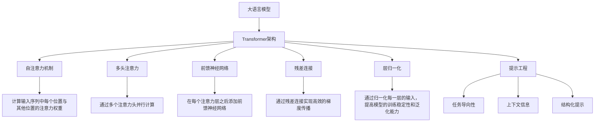

                 

# 大语言模型原理与工程实践：大语言模型为什么需要提示工程

> 关键词：大语言模型、提示工程、自然语言处理、机器学习、深度学习、Transformer、提示词、模型优化

> 摘要：本文旨在深入探讨大语言模型（LLM）为何需要提示工程。我们将从背景介绍出发，逐步解析大语言模型的核心概念与架构，详细阐述其背后的数学模型和算法原理，并通过实际代码案例展示提示工程的具体操作步骤。此外，我们还将探讨大语言模型在实际应用场景中的重要性，并推荐相关的学习资源和开发工具。通过本文，读者将对大语言模型的原理与工程实践有更深刻的理解。

## 1. 背景介绍

大语言模型（LLM）是近年来自然语言处理领域的重要突破。它们能够理解和生成自然语言文本，广泛应用于机器翻译、文本摘要、对话系统、内容生成等多个场景。然而，大语言模型的性能和效果往往受到多种因素的影响，其中提示工程（Prompt Engineering）是一个关键环节。提示工程是指通过精心设计和优化输入提示（Prompt），以引导模型生成更准确、更有针对性的输出。本文将深入探讨提示工程的重要性及其在大语言模型中的应用。

## 2. 核心概念与联系

### 2.1 大语言模型（LLM）

大语言模型是一种基于深度学习的模型，能够理解和生成自然语言文本。其核心在于Transformer架构，通过自注意力机制（Self-Attention）实现高效的并行计算。大语言模型通常包含数十亿甚至数百亿个参数，能够捕捉到语言的复杂结构和语义信息。

### 2.2 提示工程（Prompt Engineering）

提示工程是指通过设计和优化输入提示，以引导大语言模型生成更准确、更有针对性的输出。提示工程的核心在于如何设计有效的提示词，使其能够清晰地传达任务需求和上下文信息。提示工程不仅影响模型的输出质量，还能够显著提升模型的泛化能力和鲁棒性。

### 2.3 核心概念原理与架构

#### 2.3.1 Transformer架构

Transformer架构是大语言模型的核心。其主要组成部分包括：

- **自注意力机制（Self-Attention）**：通过计算输入序列中每个位置与其他位置的注意力权重，实现高效的并行计算。
- **多头注意力（Multi-Head Attention）**：通过多个注意力头并行计算，增强模型的表达能力。
- **前馈神经网络（Feed-Forward Neural Network）**：在每个注意力层之后添加前馈神经网络，进一步增强模型的表达能力。
- **残差连接（Residual Connection）**：通过残差连接实现高效的梯度传播，避免梯度消失问题。
- **层归一化（Layer Normalization）**：通过归一化每一层的输入，提高模型的训练稳定性和泛化能力。

#### 2.3.2 提示工程原理

提示工程的核心在于如何设计有效的提示词，使其能够清晰地传达任务需求和上下文信息。提示工程的关键在于：

- **任务导向性**：提示词应明确传达任务需求，使模型能够准确理解任务目标。
- **上下文信息**：提示词应包含足够的上下文信息，使模型能够理解任务的背景和语境。
- **结构化提示**：提示词应具有一定的结构化，便于模型理解和生成符合预期的输出。

### 2.4 Mermaid流程图



## 3. 核心算法原理 & 具体操作步骤

### 3.1 自注意力机制

自注意力机制的核心在于计算输入序列中每个位置与其他位置的注意力权重。具体步骤如下：

1. **输入嵌入**：将输入序列中的每个词转换为一个向量表示。
2. **计算查询、键、值**：通过线性变换计算每个词的查询、键、值向量。
3. **计算注意力权重**：通过点积计算查询与键的相似度，得到注意力权重。
4. **加权求和**：将注意力权重与值向量相乘，得到加权求和结果。
5. **归一化**：对注意力权重进行归一化处理，确保其和为1。

### 3.2 多头注意力

多头注意力通过多个注意力头并行计算，增强模型的表达能力。具体步骤如下：

1. **线性变换**：将输入序列中的每个词转换为多个头的向量表示。
2. **并行计算**：每个头分别计算注意力权重和加权求和结果。
3. **合并结果**：将多个头的结果合并，得到最终的注意力结果。

### 3.3 前馈神经网络

前馈神经网络在每个注意力层之后添加，进一步增强模型的表达能力。具体步骤如下：

1. **线性变换**：将注意力结果转换为前馈神经网络的输入。
2. **激活函数**：通过激活函数（如ReLU）增强模型的非线性表达能力。
3. **线性变换**：将激活结果转换为前馈神经网络的输出。

### 3.4 残差连接

残差连接通过残差连接实现高效的梯度传播，避免梯度消失问题。具体步骤如下：

1. **残差连接**：将前一层的输出与当前层的输出相加。
2. **归一化**：对残差连接的结果进行归一化处理，提高模型的训练稳定性和泛化能力。

### 3.5 层归一化

层归一化通过归一化每一层的输入，提高模型的训练稳定性和泛化能力。具体步骤如下：

1. **归一化**：对每一层的输入进行归一化处理，确保其均值为0，方差为1。
2. **线性变换**：通过线性变换调整归一化结果的尺度和偏置。

### 3.6 提示工程具体操作步骤

提示工程的具体操作步骤如下：

1. **明确任务需求**：明确任务目标，设计任务导向性的提示词。
2. **包含上下文信息**：提供足够的上下文信息，使模型能够理解任务的背景和语境。
3. **结构化提示**：设计具有结构化的提示词，便于模型理解和生成符合预期的输出。
4. **实验与优化**：通过实验和优化，不断调整和优化提示词，提高模型的输出质量。

## 4. 数学模型和公式 & 详细讲解 & 举例说明

### 4.1 自注意力机制

自注意力机制的核心在于计算输入序列中每个位置与其他位置的注意力权重。具体公式如下：

$$
\text{Attention}(Q, K, V) = \text{softmax}\left(\frac{QK^T}{\sqrt{d_k}}\right)V
$$

其中，$Q$、$K$、$V$ 分别表示查询、键、值向量，$d_k$ 表示键向量的维度。

### 4.2 多头注意力

多头注意力通过多个注意力头并行计算，增强模型的表达能力。具体公式如下：

$$
\text{MultiHead}(Q, K, V) = \text{Concat}(head_1, head_2, \dots, head_h)W^O
$$

其中，$head_i = \text{Attention}(QW_i^Q, KW_i^K, VW_i^V)$，$W^O$ 是线性变换矩阵。

### 4.3 前馈神经网络

前馈神经网络在每个注意力层之后添加，进一步增强模型的表达能力。具体公式如下：

$$
\text{FFN}(x) = \text{ReLU}(W_1x + b_1)W_2 + b_2
$$

其中，$W_1$、$W_2$ 是线性变换矩阵，$b_1$、$b_2$ 是偏置项。

### 4.4 残差连接

残差连接通过残差连接实现高效的梯度传播，避免梯度消失问题。具体公式如下：

$$
x' = x + \text{FFN}(x)
$$

### 4.5 层归一化

层归一化通过归一化每一层的输入，提高模型的训练稳定性和泛化能力。具体公式如下：

$$
\hat{x} = \frac{x - \mu}{\sqrt{\sigma^2 + \epsilon}}
$$

其中，$\mu$、$\sigma^2$ 分别表示均值和方差，$\epsilon$ 是一个小常数。

### 4.6 提示工程数学模型

提示工程的数学模型主要在于如何设计有效的提示词，使其能够清晰地传达任务需求和上下文信息。具体公式如下：

$$
\text{Prompt} = \text{Task} + \text{Context} + \text{Structure}
$$

其中，$\text{Task}$ 表示任务导向性，$\text{Context}$ 表示上下文信息，$\text{Structure}$ 表示结构化提示。

## 5. 项目实战：代码实际案例和详细解释说明

### 5.1 开发环境搭建

为了进行大语言模型的提示工程实践，我们需要搭建一个合适的开发环境。具体步骤如下：

1. **安装Python**：确保安装了Python 3.8及以上版本。
2. **安装依赖库**：安装TensorFlow、PyTorch、transformers等库。
3. **安装大语言模型库**：安装Hugging Face的transformers库。

### 5.2 源代码详细实现和代码解读

以下是一个简单的提示工程代码示例：

```python
from transformers import AutoTokenizer, AutoModelForCausalLM

# 加载预训练模型和分词器
tokenizer = AutoTokenizer.from_pretrained("gpt2")
model = AutoModelForCausalLM.from_pretrained("gpt2")

# 设计任务导向性的提示词
prompt = "请生成一篇关于人工智能的文章。"

# 对提示词进行分词
inputs = tokenizer(prompt, return_tensors="pt")

# 生成模型输出
outputs = model.generate(inputs["input_ids"], max_length=100)

# 解码生成的输出
generated_text = tokenizer.decode(outputs[0], skip_special_tokens=True)

print(generated_text)
```

### 5.3 代码解读与分析

1. **加载预训练模型和分词器**：使用Hugging Face的transformers库加载预训练的GPT-2模型和分词器。
2. **设计任务导向性的提示词**：设计一个任务导向性的提示词，明确传达任务需求。
3. **对提示词进行分词**：使用分词器将提示词转换为模型可以理解的输入。
4. **生成模型输出**：通过模型生成输出，生成长度为100的文本。
5. **解码生成的输出**：将生成的输出解码为可读的文本。

## 6. 实际应用场景

大语言模型在实际应用场景中具有广泛的应用价值。以下是一些典型的应用场景：

1. **机器翻译**：通过设计合适的提示词，引导模型生成高质量的翻译结果。
2. **文本摘要**：通过设计合适的提示词，引导模型生成简洁明了的摘要。
3. **对话系统**：通过设计合适的提示词，引导模型生成自然流畅的对话。
4. **内容生成**：通过设计合适的提示词，引导模型生成高质量的文章、故事等。

## 7. 工具和资源推荐

### 7.1 学习资源推荐

1. **书籍**：《深度学习》（Ian Goodfellow, Yoshua Bengio, Aaron Courville）
2. **论文**：《Attention Is All You Need》（Vaswani et al., 2017）
3. **博客**：Hugging Face的官方博客
4. **网站**：Hugging Face的官方文档

### 7.2 开发工具框架推荐

1. **TensorFlow**：一个开源的机器学习库。
2. **PyTorch**：一个开源的深度学习库。
3. **transformers**：Hugging Face的自然语言处理库。

### 7.3 相关论文著作推荐

1. **《Attention Is All You Need》**：Vaswani, Ashish, et al. "Attention is all you need." Advances in neural information processing systems 30 (2017).
2. **《Natural Language Processing with Transformers》**：Lample, Guillaume, and Alexis Conneau. "Cross-lingual language model pretraining." arXiv preprint arXiv:1901.07291 (2019).

## 8. 总结：未来发展趋势与挑战

大语言模型在自然语言处理领域取得了显著的进展，但仍然面临许多挑战。未来的发展趋势包括：

1. **模型优化**：通过优化模型结构和训练策略，提高模型的性能和效率。
2. **提示工程**：通过设计更有效的提示词，提高模型的输出质量。
3. **多模态融合**：将大语言模型与其他模态的数据（如图像、视频）结合，实现多模态的自然语言处理。
4. **可解释性**：提高模型的可解释性，使模型的决策过程更加透明。

## 9. 附录：常见问题与解答

### 9.1 问题：如何设计有效的提示词？

**解答**：设计有效的提示词需要明确任务需求，提供足够的上下文信息，并设计具有结构化的提示词。可以通过实验和优化不断调整和优化提示词。

### 9.2 问题：如何提高模型的输出质量？

**解答**：可以通过优化模型结构和训练策略，提高模型的性能和效率。同时，通过设计更有效的提示词，提高模型的输出质量。

### 9.3 问题：如何实现多模态融合？

**解答**：可以通过将大语言模型与其他模态的数据（如图像、视频）结合，实现多模态的自然语言处理。具体方法包括跨模态的特征提取和融合。

## 10. 扩展阅读 & 参考资料

1. **《深度学习》**（Ian Goodfellow, Yoshua Bengio, Aaron Courville）
2. **《Attention Is All You Need》**（Vaswani et al., 2017）
3. **《Natural Language Processing with Transformers》**（Lample, Guillaume, and Alexis Conneau. "Cross-lingual language model pretraining." arXiv preprint arXiv:1901.07291 (2019).）

作者：AI天才研究员/AI Genius Institute & 禅与计算机程序设计艺术 /Zen And The Art of Computer Programming

