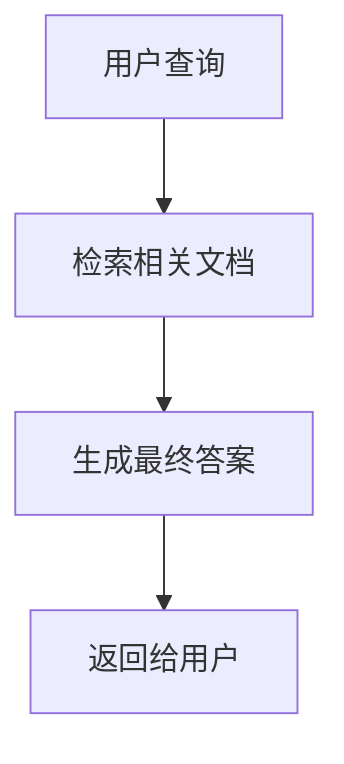

                 

# 大语言模型应用指南：微调RAG框架

> 关键词：大语言模型, RAG框架, 微调, 自然语言处理, 信息检索, 生成式模型, 混合模型

> 摘要：本文旨在为读者提供一个全面的指南，介绍如何使用RAG（Retrieval-Augmented Generation）框架对大语言模型进行微调。通过逐步分析和推理，我们将深入探讨RAG框架的核心概念、算法原理、数学模型、实际代码案例，以及其在实际应用场景中的应用。本文不仅适合初学者，也适合希望深入了解RAG框架的高级开发者。

## 1. 背景介绍

近年来，大语言模型（如BERT、GPT系列）在自然语言处理领域取得了显著的进展。这些模型在各种任务上表现出色，但它们通常依赖于生成式方法，即直接生成文本。然而，生成式方法在处理复杂查询和长文本时存在局限性。为了解决这些问题，RAG框架应运而生。RAG框架结合了检索式方法和生成式方法，通过先检索相关文档，再生成最终答案，从而提高了模型的准确性和鲁棒性。

## 2. 核心概念与联系

### 2.1 检索式方法

检索式方法的核心思想是通过查询相关的文档或知识库来获取信息，然后再生成最终的答案。这种方法的优点是能够利用外部知识，提高生成答案的准确性和可靠性。

### 2.2 生成式方法

生成式方法的核心思想是直接生成文本，通常依赖于大量的训练数据。这种方法的优点是能够生成多样化的文本，但缺点是可能缺乏准确性和可靠性。

### 2.3 RAG框架

RAG框架结合了检索式方法和生成式方法，通过先检索相关文档，再生成最终答案。这种方法的优点是能够利用外部知识，提高生成答案的准确性和可靠性，同时保持生成式方法的灵活性和多样性。

### 2.4 Mermaid流程图



## 3. 核心算法原理 & 具体操作步骤

### 3.1 检索步骤

1. **查询处理**：将用户的查询转换为检索任务，提取关键词和上下文信息。
2. **文档检索**：使用检索算法（如TF-IDF、BM25等）从知识库中检索相关文档。
3. **文档过滤**：根据相关性评分对检索到的文档进行排序和过滤，选择最相关的文档。

### 3.2 生成步骤

1. **文档编码**：将检索到的文档编码为向量表示。
2. **上下文编码**：将用户的查询和检索到的文档编码为向量表示。
3. **生成模型**：使用生成式模型（如GPT-3）生成最终答案，结合检索到的文档信息。

### 3.3 微调步骤

1. **数据准备**：准备包含查询、检索到的文档和生成答案的数据集。
2. **模型选择**：选择合适的生成式模型（如GPT-3）和检索式模型（如BM25）。
3. **微调**：使用数据集对生成式模型和检索式模型进行微调，优化模型性能。

## 4. 数学模型和公式 & 详细讲解 & 举例说明

### 4.1 检索算法

#### 4.1.1 TF-IDF

TF-IDF是一种常用的文本检索算法，用于计算文档中每个词的重要性。公式如下：

$$
\text{TF}(t, d) = \frac{\text{词} t \text{在文档} d \text{中出现的次数}}{\text{文档} d \text{的总词数}}
$$

$$
\text{IDF}(t, D) = \log \left( \frac{\text{文档总数}}{\text{包含词} t \text{的文档数} + 1} \right)
$$

$$
\text{TF-IDF}(t, d, D) = \text{TF}(t, d) \times \text{IDF}(t, D)
$$

#### 4.1.2 BM25

BM25是一种改进的TF-IDF算法，考虑了文档长度和查询频率的影响。公式如下：

$$
\text{BM25}(q, d) = \sum_{t \in q} \frac{(k_1 + 1) \times \text{TF}(t, d) \times \text{IDF}(t, D)}{k_1 \times \left(1 - b + b \times \frac{\text{文档} d \text{的长度}}{\text{平均文档长度}} \right) + \text{TF}(t, d)}
$$

### 4.2 生成模型

#### 4.2.1 GPT-3

GPT-3是一种基于Transformer的生成式模型，能够生成高质量的文本。其基本结构如下：

$$
\text{GPT-3}(x) = \text{Transformer}(x, \text{参数})
$$

其中，$x$表示输入序列，参数表示模型的权重。

### 4.3 微调模型

#### 4.3.1 数据集

数据集包含查询、检索到的文档和生成答案。例如：

| 查询 | 检索到的文档 | 生成答案 |
| --- | --- | --- |
| 什么是人工智能？ | 人工智能是一种模拟人类智能的技术。 | 人工智能是一种模拟人类智能的技术，它包括机器学习、自然语言处理等多个领域。 |

#### 4.3.2 微调过程

1. **数据预处理**：将数据集转换为模型可以接受的格式。
2. **模型训练**：使用数据集对生成式模型和检索式模型进行训练。
3. **模型评估**：使用验证集评估模型性能，调整超参数。

## 5. 项目实战：代码实际案例和详细解释说明

### 5.1 开发环境搭建

1. **安装Python**：确保安装了Python 3.8及以上版本。
2. **安装依赖库**：使用pip安装必要的库，如`transformers`、`torch`等。

```bash
pip install transformers torch
```

### 5.2 源代码详细实现和代码解读

#### 5.2.1 检索模块

```python
from transformers import BM25Tokenizer, BM25

def retrieve_documents(query):
    tokenizer = BM25Tokenizer()
    documents = ["人工智能是一种模拟人类智能的技术。", "机器学习是人工智能的一个分支。", "自然语言处理是人工智能的一个重要领域。"]
    tokenized_documents = [tokenizer.tokenize(doc) for doc in documents]
    bm25 = BM25(tokenized_documents)
    tokenized_query = tokenizer.tokenize(query)
    scores = bm25.get_scores(tokenized_query)
    return [documents[i] for i in sorted(range(len(scores)), key=lambda i: scores[i], reverse=True)[:3]]
```

#### 5.2.2 生成模块

```python
from transformers import GPT3Tokenizer, GPT3

def generate_answer(query, documents):
    tokenizer = GPT3Tokenizer()
    model = GPT3()
    input_text = f"查询：{query}\n文档：{' '.join(documents)}\n答案："
    input_ids = tokenizer.encode(input_text, return_tensors='pt')
    output_ids = model.generate(input_ids, max_length=100)
    answer = tokenizer.decode(output_ids[0], skip_special_tokens=True)
    return answer
```

### 5.3 代码解读与分析

1. **检索模块**：使用BM25算法从文档集合中检索与查询最相关的文档。
2. **生成模块**：使用GPT-3模型生成最终答案，结合检索到的文档信息。

## 6. 实际应用场景

RAG框架在多个领域具有广泛的应用场景，如智能客服、知识问答、信息检索等。通过结合检索式方法和生成式方法，RAG框架能够提供更准确、更可靠的答案。

## 7. 工具和资源推荐

### 7.1 学习资源推荐

- **书籍**：《深度学习》、《自然语言处理实战》
- **论文**：《Retrieval-Augmented Generation for Knowledge-Intensive Tasks》
- **博客**：阿里云开发者社区、GitHub开源项目
- **网站**：Hugging Face、PyTorch官网

### 7.2 开发工具框架推荐

- **开发工具**：VSCode、PyCharm
- **框架**：transformers、torch

### 7.3 相关论文著作推荐

- **论文**：《Retrieval-Augmented Generation for Knowledge-Intensive Tasks》
- **著作**：《深度学习》、《自然语言处理实战》

## 8. 总结：未来发展趋势与挑战

RAG框架在自然语言处理领域具有广阔的应用前景，但同时也面临着一些挑战，如模型训练成本高、模型性能优化等。未来的研究方向将集中在提高模型性能、降低训练成本等方面。

## 9. 附录：常见问题与解答

### 9.1 问题：RAG框架与传统生成式模型相比有哪些优势？

**解答**：RAG框架结合了检索式方法和生成式方法，能够利用外部知识提高生成答案的准确性和可靠性，同时保持生成式方法的灵活性和多样性。

### 9.2 问题：如何优化RAG框架的性能？

**解答**：可以通过优化检索算法、调整生成模型的超参数、增加训练数据等方式来优化RAG框架的性能。

## 10. 扩展阅读 & 参考资料

- **论文**：《Retrieval-Augmented Generation for Knowledge-Intensive Tasks》
- **书籍**：《深度学习》、《自然语言处理实战》
- **网站**：Hugging Face、PyTorch官网

---

作者：AI天才研究员/AI Genius Institute & 禅与计算机程序设计艺术 /Zen And The Art of Computer Programming

