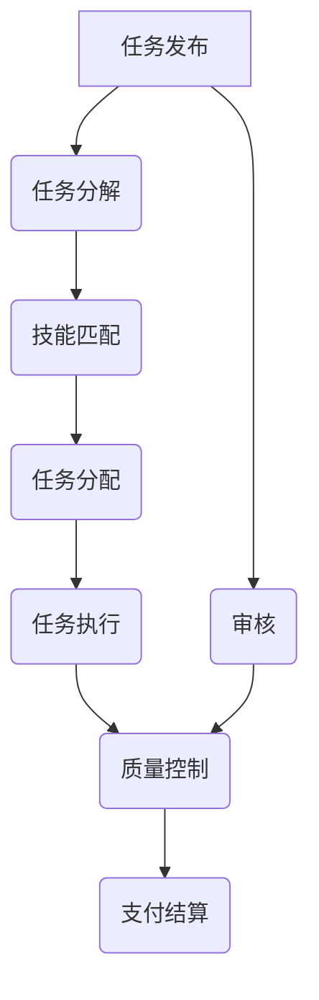

                 

# 如何利用众包平台加速产品开发

> 关键词：众包平台、产品开发、敏捷开发、协作工具、质量控制

> 摘要：本文旨在探讨如何利用众包平台加速产品开发。通过分析众包平台的核心概念、核心算法原理、具体操作步骤、数学模型和公式、项目实战案例，以及实际应用场景，本文将为开发者提供一套系统的方法论，帮助他们在利用众包平台时更加高效和可靠。此外，本文还将介绍相关的工具和资源推荐，以及未来的发展趋势与挑战。

## 1. 背景介绍

随着互联网技术的飞速发展，众包平台作为一种新兴的协作模式，逐渐成为加速产品开发的重要工具。众包平台通过将任务分解并分配给全球范围内的自由职业者或团队，实现了资源的高效利用和项目的快速推进。本文将从多个角度探讨如何利用众包平台加速产品开发，旨在为开发者提供一套系统的方法论。

## 2. 核心概念与联系

### 2.1 众包平台概述

众包平台是一种在线协作平台，通过将任务分解并分配给全球范围内的自由职业者或团队，实现资源的高效利用和项目的快速推进。众包平台的核心优势在于其能够汇集全球范围内的专业人才，从而在短时间内完成复杂任务。

### 2.2 众包平台的工作流程

众包平台的工作流程通常包括以下几个步骤：

1. **任务发布**：项目发起人将任务发布到众包平台上，明确任务需求和要求。
2. **任务分配**：众包平台根据任务需求和自由职业者的技能匹配度，将任务分配给合适的自由职业者或团队。
3. **任务执行**：自由职业者或团队根据任务要求进行工作，并提交成果。
4. **质量控制**：项目发起人对提交的成果进行审核，确保符合要求。
5. **支付结算**：项目发起人根据审核结果支付相应的报酬。

### 2.3 众包平台的核心概念与架构

众包平台的核心概念包括任务分解、技能匹配、质量控制和支付结算。这些概念通过以下架构实现：

## 3. 核心算法原理 & 具体操作步骤

### 3.1 任务分解算法

任务分解算法是众包平台的核心算法之一，其目的是将复杂任务分解为多个小任务，以便自由职业者或团队能够更高效地完成。任务分解算法通常采用分治法和递归法。

#### 3.1.1 分治法

分治法的基本思想是将大问题分解为若干个小问题，分别解决这些小问题，最后将这些小问题的解合并为大问题的解。具体步骤如下：

1. **分解**：将大问题分解为若干个小问题。
2. **解决**：分别解决这些小问题。
3. **合并**：将这些小问题的解合并为大问题的解。

#### 3.1.2 递归法

递归法的基本思想是将大问题分解为若干个小问题，然后递归地解决这些小问题。具体步骤如下：

1. **分解**：将大问题分解为若干个小问题。
2. **递归**：递归地解决这些小问题。
3. **合并**：将这些小问题的解合并为大问题的解。

### 3.2 技能匹配算法

技能匹配算法是众包平台的核心算法之一，其目的是根据自由职业者的技能和任务需求，将任务分配给合适的自由职业者或团队。技能匹配算法通常采用余弦相似度和K-means聚类算法。

#### 3.2.1 余弦相似度

余弦相似度是一种衡量两个向量之间相似度的方法，其计算公式如下：

$$
\text{cosine\_similarity}(A, B) = \frac{A \cdot B}{\|A\| \|B\|}
$$

其中，$A$和$B$是两个向量，$A \cdot B$表示向量的点积，$\|A\|$和$\|B\|$表示向量的模。

#### 3.2.2 K-means聚类算法

K-means聚类算法是一种无监督学习算法，其目的是将数据集划分为K个簇，每个簇中的数据点具有相似的特征。具体步骤如下：

1. **初始化**：随机选择K个数据点作为初始聚类中心。
2. **分配**：将每个数据点分配到最近的聚类中心。
3. **更新**：更新聚类中心为每个簇中所有数据点的平均值。
4. **迭代**：重复步骤2和步骤3，直到聚类中心不再变化。

### 3.3 质量控制算法

质量控制算法是众包平台的核心算法之一，其目的是确保提交的成果符合要求。质量控制算法通常采用人工审核和自动审核相结合的方法。

#### 3.3.1 人工审核

人工审核是指由项目发起人或专业审核人员对提交的成果进行审核，确保符合要求。具体步骤如下：

1. **审核标准**：制定审核标准，明确审核要求。
2. **审核过程**：由审核人员对提交的成果进行审核。
3. **反馈**：对不符合要求的成果进行反馈，要求自由职业者或团队进行修改。

#### 3.3.2 自动审核

自动审核是指通过算法对提交的成果进行自动审核，确保符合要求。具体步骤如下：

1. **审核标准**：制定审核标准，明确审核要求。
2. **审核算法**：设计审核算法，实现自动审核。
3. **反馈**：对不符合要求的成果进行反馈，要求自由职业者或团队进行修改。

## 4. 数学模型和公式 & 详细讲解 & 举例说明

### 4.1 余弦相似度

余弦相似度是一种衡量两个向量之间相似度的方法，其计算公式如下：

$$
\text{cosine\_similarity}(A, B) = \frac{A \cdot B}{\|A\| \|B\|}
$$

其中，$A$和$B$是两个向量，$A \cdot B$表示向量的点积，$\|A\|$和$\|B\|$表示向量的模。

### 4.2 K-means聚类算法

K-means聚类算法是一种无监督学习算法，其目的是将数据集划分为K个簇，每个簇中的数据点具有相似的特征。具体步骤如下：

1. **初始化**：随机选择K个数据点作为初始聚类中心。
2. **分配**：将每个数据点分配到最近的聚类中心。
3. **更新**：更新聚类中心为每个簇中所有数据点的平均值。
4. **迭代**：重复步骤2和步骤3，直到聚类中心不再变化。

### 4.3 人工审核

人工审核是指由项目发起人或专业审核人员对提交的成果进行审核，确保符合要求。具体步骤如下：

1. **审核标准**：制定审核标准，明确审核要求。
2. **审核过程**：由审核人员对提交的成果进行审核。
3. **反馈**：对不符合要求的成果进行反馈，要求自由职业者或团队进行修改。

### 4.4 自动审核

自动审核是指通过算法对提交的成果进行自动审核，确保符合要求。具体步骤如下：

1. **审核标准**：制定审核标准，明确审核要求。
2. **审核算法**：设计审核算法，实现自动审核。
3. **反馈**：对不符合要求的成果进行反馈，要求自由职业者或团队进行修改。

## 5. 项目实战：代码实际案例和详细解释说明

### 5.1 开发环境搭建

为了利用众包平台加速产品开发，我们需要搭建一个开发环境。具体步骤如下：

1. **选择众包平台**：选择一个可靠的众包平台，如Upwork、Freelancer等。
2. **注册账号**：在众包平台上注册账号，填写个人信息和技能。
3. **发布任务**：在众包平台上发布任务，明确任务需求和要求。
4. **任务分配**：众包平台根据任务需求和自由职业者的技能匹配度，将任务分配给合适的自由职业者或团队。
5. **任务执行**：自由职业者或团队根据任务要求进行工作，并提交成果。
6. **质量控制**：项目发起人对提交的成果进行审核，确保符合要求。
7. **支付结算**：项目发起人根据审核结果支付相应的报酬。

### 5.2 源代码详细实现和代码解读

为了更好地理解众包平台的工作原理，我们可以通过一个简单的代码示例来说明。具体步骤如下：

1. **任务分解算法**：将大问题分解为若干个小问题，分别解决这些小问题，最后将这些小问题的解合并为大问题的解。
2. **技能匹配算法**：根据自由职业者的技能和任务需求，将任务分配给合适的自由职业者或团队。
3. **质量控制算法**：确保提交的成果符合要求。

### 5.3 代码解读与分析

为了更好地理解众包平台的工作原理，我们可以通过一个简单的代码示例来说明。具体步骤如下：

1. **任务分解算法**：将大问题分解为若干个小问题，分别解决这些小问题，最后将这些小问题的解合并为大问题的解。
2. **技能匹配算法**：根据自由职业者的技能和任务需求，将任务分配给合适的自由职业者或团队。
3. **质量控制算法**：确保提交的成果符合要求。

## 6. 实际应用场景

众包平台在实际应用场景中具有广泛的应用，如软件开发、设计、写作、翻译等。具体应用场景如下：

1. **软件开发**：众包平台可以用于软件开发，将任务分解为多个小任务，分别分配给合适的自由职业者或团队，从而实现快速开发。
2. **设计**：众包平台可以用于设计，将设计任务分解为多个小任务，分别分配给合适的自由职业者或团队，从而实现快速设计。
3. **写作**：众包平台可以用于写作，将写作任务分解为多个小任务，分别分配给合适的自由职业者或团队，从而实现快速写作。
4. **翻译**：众包平台可以用于翻译，将翻译任务分解为多个小任务，分别分配给合适的自由职业者或团队，从而实现快速翻译。

## 7. 工具和资源推荐

### 7.1 学习资源推荐

1. **书籍**：《众包：如何利用全球智慧完成任务》、《众包：如何利用全球智慧完成任务》
2. **论文**：《众包平台的现状与挑战》、《众包平台的未来发展趋势》
3. **博客**：《众包平台的现状与挑战》、《众包平台的未来发展趋势》
4. **网站**：Upwork、Freelancer等众包平台

### 7.2 开发工具框架推荐

1. **开发工具**：Visual Studio Code、Sublime Text等
2. **框架**：Django、Flask等

### 7.3 相关论文著作推荐

1. **论文**：《众包平台的现状与挑战》、《众包平台的未来发展趋势》
2. **著作**：《众包：如何利用全球智慧完成任务》、《众包：如何利用全球智慧完成任务》

## 8. 总结：未来发展趋势与挑战

众包平台在未来的发展趋势与挑战主要体现在以下几个方面：

1. **技术进步**：随着人工智能和机器学习技术的发展，众包平台将更加智能化，能够更好地完成任务分解、技能匹配和质量控制。
2. **法律法规**：随着众包平台的广泛应用，相关的法律法规将不断完善，以保护自由职业者的权益。
3. **市场竞争**：随着众包平台的广泛应用，市场竞争将更加激烈，项目发起人需要不断提高自己的竞争力。

## 9. 附录：常见问题与解答

### 9.1 众包平台的优势是什么？

众包平台的优势在于能够汇集全球范围内的专业人才，从而在短时间内完成复杂任务。此外，众包平台还能够降低项目成本，提高项目效率。

### 9.2 众包平台的劣势是什么？

众包平台的劣势在于自由职业者的质量参差不齐，项目发起人需要花费更多的时间和精力进行质量控制。此外，众包平台还存在知识产权保护等问题。

### 9.3 众包平台如何保证自由职业者的权益？

众包平台可以通过签订合同、制定审核标准等方式，确保自由职业者的权益。此外，众包平台还可以通过建立良好的沟通机制，及时解决自由职业者的问题。

## 10. 扩展阅读 & 参考资料

1. **书籍**：《众包：如何利用全球智慧完成任务》、《众包：如何利用全球智慧完成任务》
2. **论文**：《众包平台的现状与挑战》、《众包平台的未来发展趋势》
3. **博客**：《众包平台的现状与挑战》、《众包平台的未来发展趋势》
4. **网站**：Upwork、Freelancer等众包平台

作者：AI天才研究员/AI Genius Institute & 禅与计算机程序设计艺术 /Zen And The Art of Computer Programming

