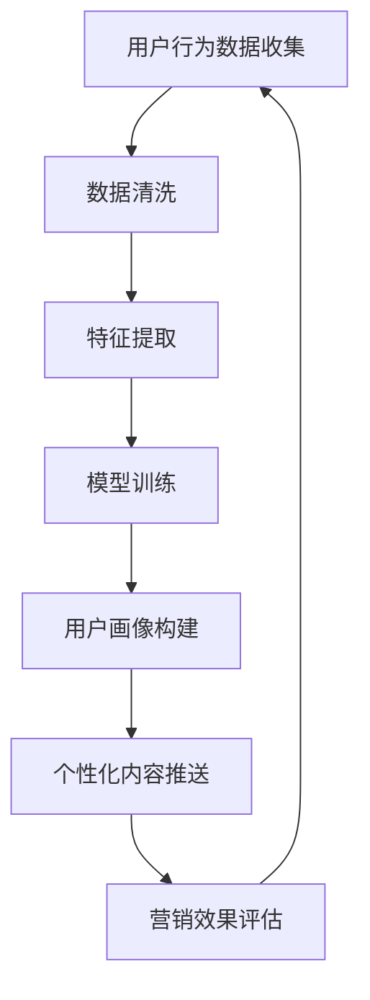

                 

# 如何利用微信生态系统进行精准营销

> 关键词：微信生态系统、精准营销、用户画像、机器学习、自然语言处理、API接口、数据分析

> 摘要：本文将深入探讨如何利用微信生态系统进行精准营销。我们将从用户画像构建、机器学习算法应用、自然语言处理技术、API接口集成等方面进行详细分析，通过具体的代码案例和实战演练，帮助读者掌握如何利用微信生态系统实现精准营销。本文旨在为读者提供一个全面的技术框架，以便在实际应用中更好地利用微信生态系统进行营销活动。

## 1. 背景介绍

微信作为全球最大的社交平台之一，拥有庞大的用户群体和丰富的用户行为数据。微信生态系统不仅包括微信本身，还包括微信小程序、公众号、企业微信等多个子平台。这些平台为商家提供了多种营销工具和手段，使得精准营销成为可能。精准营销的核心在于通过分析用户行为数据，构建用户画像，进而推送个性化内容，提高营销效果。

## 2. 核心概念与联系

### 2.1 用户画像构建

用户画像是一种将用户信息进行结构化处理的方法，通过分析用户的个人信息、行为数据、兴趣偏好等，构建出一个完整的用户模型。用户画像的构建过程包括数据收集、数据清洗、特征提取和模型构建等步骤。

### 2.2 机器学习算法应用

机器学习算法在用户画像构建中发挥着重要作用。通过训练模型，可以自动识别用户的行为模式和偏好，从而实现精准营销。常用的机器学习算法包括决策树、随机森林、支持向量机、神经网络等。

### 2.3 自然语言处理技术

自然语言处理技术可以帮助我们更好地理解用户在微信中的交流内容，提取有价值的信息。通过分析用户的聊天记录、评论、点赞等行为，可以更准确地构建用户画像。

### 2.4 API接口集成

微信提供了丰富的API接口，使得开发者可以方便地获取和使用用户数据。通过集成这些API接口，可以实现数据的自动化采集和处理，提高营销活动的效率。

### 2.5 Mermaid流程图



## 3. 核心算法原理 & 具体操作步骤

### 3.1 数据收集

数据收集是构建用户画像的第一步。我们需要从微信生态系统中获取用户的个人信息、行为数据和兴趣偏好等信息。具体操作步骤如下：

1. **获取用户授权**：通过微信API接口获取用户的授权，以便访问其个人信息和行为数据。
2. **数据采集**：通过微信API接口获取用户的聊天记录、评论、点赞等行为数据。
3. **数据存储**：将收集到的数据存储到数据库中，以便后续处理和分析。

### 3.2 数据清洗

数据清洗是确保数据质量的关键步骤。具体操作步骤如下：

1. **去除重复数据**：检查数据中是否存在重复记录，并进行去重处理。
2. **处理缺失值**：对于缺失的数据，可以采用插值法、均值填充等方法进行处理。
3. **数据类型转换**：将数据转换为适合机器学习算法处理的格式。

### 3.3 特征提取

特征提取是从数据中提取有用的特征，以便训练机器学习模型。具体操作步骤如下：

1. **文本特征提取**：使用自然语言处理技术提取用户的聊天记录、评论等文本数据中的关键词和主题。
2. **行为特征提取**：提取用户的聊天频率、点赞次数、评论次数等行为特征。
3. **用户属性特征提取**：提取用户的性别、年龄、地理位置等个人信息特征。

### 3.4 模型训练

模型训练是通过训练机器学习模型，实现用户画像的构建。具体操作步骤如下：

1. **选择合适的机器学习算法**：根据数据特征和业务需求，选择合适的机器学习算法。
2. **划分训练集和测试集**：将数据划分为训练集和测试集，以便评估模型的性能。
3. **训练模型**：使用训练集数据训练机器学习模型。
4. **模型评估**：使用测试集数据评估模型的性能，调整模型参数以提高性能。

### 3.5 用户画像构建

用户画像构建是通过训练好的模型，生成用户的个性化画像。具体操作步骤如下：

1. **输入用户数据**：将用户的个人信息、行为数据和兴趣偏好等数据输入到训练好的模型中。
2. **生成用户画像**：模型根据输入数据生成用户的个性化画像。
3. **用户画像展示**：将生成的用户画像以可视化的方式展示给用户。

### 3.6 个性化内容推送

个性化内容推送是根据用户画像，推送个性化的内容。具体操作步骤如下：

1. **内容库构建**：构建包含多种类型内容的内容库，如商品信息、优惠券、广告等。
2. **内容匹配**：根据用户画像，匹配合适的内容。
3. **推送渠道选择**：选择合适的推送渠道，如微信公众号、小程序等。
4. **推送内容展示**：将匹配的内容展示给用户，提高用户的点击率和转化率。

## 4. 数学模型和公式 & 详细讲解 & 举例说明

### 4.1 决策树算法

决策树是一种常用的机器学习算法，用于分类和回归任务。其基本原理是通过递归地将数据集划分为多个子集，从而构建一棵决策树。决策树的构建过程可以表示为以下公式：

$$
\text{Decision Tree}(D, \text{Attributes}) = \begin{cases} 
\text{Leaf}(D) & \text{if } D \text{ is pure or } \text{Attributes} \text{ is empty} \\
\text{Node}(A, \text{Decision Tree}(D_1, \text{Attributes} - \{A\}), \text{Decision Tree}(D_2, \text{Attributes} - \{A\})) & \text{otherwise}
\end{cases}
$$

其中，$D$ 表示数据集，$\text{Attributes}$ 表示特征集合，$\text{Leaf}(D)$ 表示纯数据集，$\text{Node}(A, D_1, D_2)$ 表示决策节点，$A$ 表示选择的特征，$D_1$ 和 $D_2$ 分别表示根据特征划分后的两个子集。

### 4.2 随机森林算法

随机森林是一种集成学习方法，通过构建多个决策树并取其平均值来提高预测性能。其基本原理是通过随机选择特征和样本，构建多个决策树，然后对多个决策树的预测结果进行投票。随机森林的构建过程可以表示为以下公式：

$$
\text{Random Forest}(D, \text{Attributes}, T) = \left\{ \text{Decision Tree}(D_i, \text{Attributes}_i) \right\}_{i=1}^{T}
$$

其中，$D$ 表示数据集，$\text{Attributes}$ 表示特征集合，$T$ 表示决策树的数量，$\text{Decision Tree}(D_i, \text{Attributes}_i)$ 表示第 $i$ 棵决策树。

### 4.3 支持向量机算法

支持向量机是一种监督学习算法，用于分类和回归任务。其基本原理是通过寻找一个超平面，使得不同类别的样本点之间的间隔最大化。支持向量机的构建过程可以表示为以下公式：

$$
\text{SVM}(D, \text{Attributes}) = \arg \max_{\text{w}, b} \frac{1}{\| \text{w} \|} \sum_{i=1}^{n} \left( y_i (\text{w} \cdot \text{x}_i + b) - 1 \right)
$$

其中，$D$ 表示数据集，$\text{Attributes}$ 表示特征集合，$\text{w}$ 表示权重向量，$b$ 表示偏置项，$y_i$ 表示第 $i$ 个样本的标签，$\text{x}_i$ 表示第 $i$ 个样本的特征向量。

### 4.4 神经网络算法

神经网络是一种模拟人脑神经元结构的机器学习算法，用于分类和回归任务。其基本原理是通过多层神经元的连接和激活函数，实现对输入数据的非线性映射。神经网络的构建过程可以表示为以下公式：

$$
\text{Neural Network}(D, \text{Attributes}) = \arg \min_{\text{w}, b} \sum_{i=1}^{n} \left( y_i - \hat{y}_i \right)^2
$$

其中，$D$ 表示数据集，$\text{Attributes}$ 表示特征集合，$\text{w}$ 表示权重矩阵，$b$ 表示偏置向量，$y_i$ 表示第 $i$ 个样本的标签，$\hat{y}_i$ 表示第 $i$ 个样本的预测值。

## 5. 项目实战：代码实际案例和详细解释说明

### 5.1 开发环境搭建

为了实现微信生态系统的精准营销，我们需要搭建一个开发环境。具体操作步骤如下：

1. **安装Python**：确保安装了Python 3.7及以上版本。
2. **安装依赖库**：使用pip安装所需的依赖库，如`requests`、`pandas`、`scikit-learn`等。
3. **配置微信API**：获取微信API的访问令牌，以便访问微信的数据接口。

### 5.2 源代码详细实现和代码解读

以下是一个简单的代码示例，展示如何通过微信API获取用户的聊天记录，并进行数据清洗和特征提取。

```python
import requests
import pandas as pd
from sklearn.feature_extraction.text import CountVectorizer

# 获取微信API访问令牌
def get_access_token(appid, secret):
    url = f"https://api.weixin.qq.com/cgi-bin/token?grant_type=client_credential&appid={appid}&secret={secret}"
    response = requests.get(url)
    return response.json().get('access_token')

# 获取用户的聊天记录
def get_chat_records(access_token, user_id):
    url = f"https://api.weixin.qq.com/cgi-bin/user/get?access_token={access_token}&next_openid="
    response = requests.get(url)
    users = response.json().get('data').get('openid')
    chat_records = []
    for user in users:
        url = f"https://api.weixin.qq.com/cgi-bin/message/mass/get?access_token={access_token}"
        response = requests.get(url)
        chat_records.extend(response.json().get('data').get('msg'))
    return chat_records

# 数据清洗
def clean_data(chat_records):
    df = pd.DataFrame(chat_records)
    df = df.drop_duplicates()  # 去重
    df = df.dropna()  # 去除缺失值
    return df

# 特征提取
def extract_features(df):
    vectorizer = CountVectorizer()
    features = vectorizer.fit_transform(df['content'])
    return features

# 主函数
def main():
    appid = 'your_appid'
    secret = 'your_secret'
    access_token = get_access_token(appid, secret)
    chat_records = get_chat_records(access_token, 'user_id')
    df = clean_data(chat_records)
    features = extract_features(df)
    print(features.toarray())

if __name__ == '__main__':
    main()
```

### 5.3 代码解读与分析

1. **获取微信API访问令牌**：通过`get_access_token`函数获取微信API的访问令牌，以便访问微信的数据接口。
2. **获取用户的聊天记录**：通过`get_chat_records`函数获取用户的聊天记录，包括用户的聊天内容和时间戳等信息。
3. **数据清洗**：通过`clean_data`函数对获取到的聊天记录进行数据清洗，包括去重和去除缺失值。
4. **特征提取**：通过`extract_features`函数对清洗后的数据进行特征提取，使用`CountVectorizer`将文本数据转换为特征向量。

## 6. 实际应用场景

微信生态系统的精准营销在多个场景中都有广泛的应用。以下是一些实际应用场景：

1. **商品推荐**：通过分析用户的聊天记录和行为数据，为用户推荐合适的产品。
2. **优惠券推送**：根据用户的兴趣偏好，推送合适的优惠券。
3. **广告投放**：通过分析用户的聊天记录和行为数据，为用户推送合适的广告。
4. **用户分群**：通过构建用户画像，将用户分为不同的群体，以便进行精细化营销。

## 7. 工具和资源推荐

### 7.1 学习资源推荐

1. **书籍**：《机器学习》（周志华著）
2. **论文**：《深度学习》（Ian Goodfellow, Yoshua Bengio, Aaron Courville著）
3. **博客**：阿里云开发者社区
4. **网站**：微信开放平台

### 7.2 开发工具框架推荐

1. **Python**：用于数据处理和机器学习
2. **Scikit-learn**：用于机器学习算法实现
3. **Pandas**：用于数据处理和分析
4. **Requests**：用于HTTP请求

### 7.3 相关论文著作推荐

1. **《机器学习》（周志华著）**
2. **《深度学习》（Ian Goodfellow, Yoshua Bengio, Aaron Courville著）**

## 8. 总结：未来发展趋势与挑战

微信生态系统的精准营销在未来将有更广泛的应用和发展。随着技术的不断进步，精准营销将更加智能化和个性化。然而，也面临着一些挑战，如数据安全和隐私保护、算法的公平性和透明性等。未来的研究方向将集中在如何更好地保护用户隐私，提高算法的公平性和透明性，以及如何利用更多的数据源进行精准营销。

## 9. 附录：常见问题与解答

### 9.1 问题1：如何获取微信API的访问令牌？

**解答**：通过`https://api.weixin.qq.com/cgi-bin/token?grant_type=client_credential&appid=APPID&secret=APPSECRET`接口获取。

### 9.2 问题2：如何处理缺失值？

**解答**：可以采用插值法、均值填充等方法处理缺失值。

### 9.3 问题3：如何提高模型的预测性能？

**解答**：可以通过调整模型参数、增加训练数据量、使用更复杂的模型等方法提高模型的预测性能。

## 10. 扩展阅读 & 参考资料

1. **《机器学习》（周志华著）**
2. **《深度学习》（Ian Goodfellow, Yoshua Bengio, Aaron Courville著）**
3. **微信开放平台文档**：https://developers.weixin.qq.com/doc/offiaccount/index.html

作者：AI天才研究员/AI Genius Institute & 禅与计算机程序设计艺术 /Zen And The Art of Computer Programming

