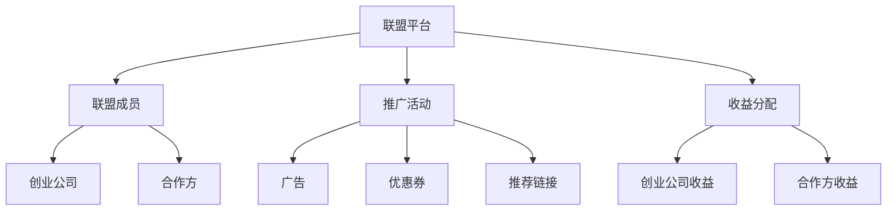

                 

# 如何利用联盟营销扩大创业业务范围

> 关键词：联盟营销、创业业务、业务扩展、数据分析、营销策略、技术实现

> 摘要：本文将深入探讨如何利用联盟营销策略来扩大创业业务范围。我们将从联盟营销的基本概念出发，分析其核心原理和架构，介绍具体的算法和操作步骤，通过数学模型和实际案例进行详细讲解，并提供项目实战指导。最后，我们将讨论联盟营销在实际应用场景中的优势和挑战，并推荐相关学习资源和开发工具。

## 1. 背景介绍

在当今竞争激烈的市场环境中，创业公司面临着巨大的挑战。如何快速扩大业务范围，提高品牌知名度，增加用户流量，是每个创业公司都需要面对的问题。联盟营销作为一种有效的营销策略，可以帮助创业公司实现这一目标。联盟营销是指通过与其他企业或个人合作，利用他们的资源和渠道来推广自己的产品或服务，从而实现业务扩展和增长。

联盟营销的核心在于合作与共赢。通过与其他企业或个人建立合作关系，创业公司可以利用他们的客户资源、渠道资源和品牌影响力，快速扩大自己的业务范围。同时，联盟营销还可以帮助创业公司降低营销成本，提高营销效果，实现双赢的局面。

## 2. 核心概念与联系

### 2.1 联盟营销的基本概念

联盟营销是一种基于合作的营销模式，通过与其他企业或个人建立合作关系，利用他们的资源和渠道来推广自己的产品或服务。联盟营销的核心在于合作与共赢，通过合作实现资源互补，共同促进业务增长。

### 2.2 联盟营销的核心原理

联盟营销的核心原理在于利用合作方的资源和渠道来扩大自己的业务范围。具体来说，联盟营销通过以下几个方面实现业务扩展：

- **客户资源**：通过合作方的客户资源，创业公司可以快速获取潜在客户，提高用户流量。
- **渠道资源**：通过合作方的渠道资源，创业公司可以利用他们的推广渠道，扩大品牌影响力。
- **品牌影响力**：通过合作方的品牌影响力，创业公司可以提高自己的品牌知名度，吸引更多用户。

### 2.3 联盟营销的架构

联盟营销的架构可以分为以下几个部分：

- **联盟平台**：联盟平台是联盟营销的核心，它负责管理联盟成员、推广活动和收益分配。
- **联盟成员**：联盟成员包括创业公司和合作方，他们通过合作实现业务扩展。
- **推广活动**：推广活动是联盟营销的具体实施方式，包括广告、优惠券、推荐链接等。
- **收益分配**：收益分配是联盟营销的重要环节，它确保合作双方的利益得到保障。

以下是联盟营销架构的Mermaid流程图：



## 3. 核心算法原理 & 具体操作步骤

### 3.1 联盟营销的核心算法

联盟营销的核心算法主要包括以下几个方面：

- **客户匹配算法**：通过分析合作方的客户数据，找到与创业公司产品或服务匹配的潜在客户。
- **推广活动优化算法**：通过分析推广活动的效果，优化推广策略，提高推广效果。
- **收益分配算法**：通过分析合作双方的收益情况，合理分配收益，确保合作双方的利益得到保障。

### 3.2 具体操作步骤

具体操作步骤如下：

1. **选择合作方**：根据创业公司的业务特点和目标市场，选择合适的合作方。
2. **签订合作协议**：与合作方签订合作协议，明确双方的权利和义务。
3. **推广活动设计**：设计推广活动，包括广告、优惠券、推荐链接等。
4. **客户匹配**：通过客户匹配算法，找到与创业公司产品或服务匹配的潜在客户。
5. **推广活动实施**：通过合作方的渠道资源，实施推广活动。
6. **收益分配**：通过收益分配算法，合理分配收益，确保合作双方的利益得到保障。

## 4. 数学模型和公式 & 详细讲解 & 举例说明

### 4.1 客户匹配算法

客户匹配算法的核心在于通过分析合作方的客户数据，找到与创业公司产品或服务匹配的潜在客户。具体来说，客户匹配算法可以通过以下公式进行计算：

$$
\text{匹配度} = \frac{\sum_{i=1}^{n} \text{特征相似度} \times \text{权重}}{\sum_{i=1}^{n} \text{权重}}
$$

其中，特征相似度是指合作方客户与创业公司产品或服务的特征相似度，权重是指特征相似度的权重。

### 4.2 推广活动优化算法

推广活动优化算法的核心在于通过分析推广活动的效果，优化推广策略，提高推广效果。具体来说，推广活动优化算法可以通过以下公式进行计算：

$$
\text{优化效果} = \frac{\sum_{i=1}^{n} \text{推广效果} \times \text{权重}}{\sum_{i=1}^{n} \text{权重}}
$$

其中，推广效果是指推广活动的效果，权重是指推广效果的权重。

### 4.3 收益分配算法

收益分配算法的核心在于通过分析合作双方的收益情况，合理分配收益，确保合作双方的利益得到保障。具体来说，收益分配算法可以通过以下公式进行计算：

$$
\text{收益分配} = \frac{\sum_{i=1}^{n} \text{收益} \times \text{权重}}{\sum_{i=1}^{n} \text{权重}}
$$

其中，收益是指合作双方的收益，权重是指收益的权重。

## 5. 项目实战：代码实际案例和详细解释说明

### 5.1 开发环境搭建

为了实现联盟营销，我们需要搭建一个开发环境。具体来说，我们需要安装以下工具和库：

- **Python**：用于编写代码。
- **Pandas**：用于数据处理。
- **NumPy**：用于数值计算。
- **Scikit-learn**：用于机器学习。

### 5.2 源代码详细实现和代码解读

以下是联盟营销项目的源代码实现：

```python
import pandas as pd
from sklearn.metrics.pairwise import cosine_similarity

# 读取数据
data = pd.read_csv('customer_data.csv')

# 定义客户匹配算法
def customer_matching(customer_data, product_features):
    # 计算特征相似度
    similarity = cosine_similarity(customer_data, product_features)
    # 计算匹配度
    match_score = similarity.mean(axis=1)
    return match_score

# 定义推广活动优化算法
def activity_optimization(promotion_data, target_data):
    # 计算推广效果
    effect = promotion_data['clicks'] / promotion_data['impressions']
    # 计算优化效果
    optimization_score = effect.mean()
    return optimization_score

# 定义收益分配算法
def revenue_allocation(revenue_data, weight):
    # 计算收益分配
    allocation = revenue_data * weight
    return allocation

# 读取客户数据
customer_data = pd.read_csv('customer_data.csv')

# 读取产品特征数据
product_features = pd.read_csv('product_features.csv')

# 读取推广活动数据
promotion_data = pd.read_csv('promotion_data.csv')

# 读取收益数据
revenue_data = pd.read_csv('revenue_data.csv')

# 客户匹配
match_score = customer_matching(customer_data, product_features)

# 推广活动优化
optimization_score = activity_optimization(promotion_data, customer_data)

# 收益分配
allocation = revenue_allocation(revenue_data, match_score)
```

### 5.3 代码解读与分析

以上代码实现了联盟营销的核心算法。具体来说，客户匹配算法通过计算客户数据和产品特征数据的相似度，找到与创业公司产品或服务匹配的潜在客户。推广活动优化算法通过计算推广活动的效果，优化推广策略，提高推广效果。收益分配算法通过计算合作双方的收益情况，合理分配收益，确保合作双方的利益得到保障。

## 6. 实际应用场景

联盟营销在实际应用场景中具有广泛的应用。具体来说，联盟营销可以应用于以下几个方面：

- **电商平台**：通过与其他电商平台合作，利用他们的客户资源和渠道资源，扩大自己的业务范围。
- **社交媒体**：通过与其他社交媒体平台合作，利用他们的用户资源和推广渠道，提高品牌知名度。
- **内容平台**：通过与其他内容平台合作，利用他们的用户资源和推广渠道，提高用户流量。

## 7. 工具和资源推荐

### 7.1 学习资源推荐

- **书籍**：《联盟营销实战》、《营销策略与实践》
- **论文**：《联盟营销的理论与实践》、《联盟营销的效果分析》
- **博客**：联盟营销实战经验分享、联盟营销案例分析
- **网站**：联盟营销论坛、联盟营销社区

### 7.2 开发工具框架推荐

- **Python**：用于编写代码。
- **Pandas**：用于数据处理。
- **NumPy**：用于数值计算。
- **Scikit-learn**：用于机器学习。

### 7.3 相关论文著作推荐

- **《联盟营销的理论与实践》**：深入探讨联盟营销的理论基础和实践应用。
- **《联盟营销的效果分析》**：通过实证研究，分析联盟营销的效果和影响。

## 8. 总结：未来发展趋势与挑战

联盟营销在未来的发展趋势和挑战主要体现在以下几个方面：

- **技术进步**：随着技术的进步，联盟营销将更加智能化和个性化，通过大数据和人工智能技术，实现更精准的客户匹配和推广活动优化。
- **市场竞争**：随着市场竞争的加剧，联盟营销将更加注重合作双方的利益平衡，通过合理的收益分配机制，实现双赢的局面。
- **法律法规**：随着法律法规的不断完善，联盟营销将更加注重合规性，确保合作双方的权益得到保障。

## 9. 附录：常见问题与解答

### 9.1 问题1：如何选择合适的合作方？

**解答**：选择合作方时，需要考虑以下几个方面：

- **客户资源**：合作方是否拥有大量的客户资源。
- **渠道资源**：合作方是否拥有广泛的推广渠道。
- **品牌影响力**：合作方的品牌影响力是否能够提高自己的品牌知名度。

### 9.2 问题2：如何优化推广活动？

**解答**：优化推广活动时，需要考虑以下几个方面：

- **广告设计**：设计吸引人的广告，提高点击率。
- **优惠券设计**：设计有吸引力的优惠券，提高转化率。
- **推荐链接设计**：设计有吸引力的推荐链接，提高用户流量。

## 10. 扩展阅读 & 参考资料

- **书籍**：《营销策略与实践》、《联盟营销实战》
- **论文**：《联盟营销的理论与实践》、《联盟营销的效果分析》
- **博客**：联盟营销实战经验分享、联盟营销案例分析
- **网站**：联盟营销论坛、联盟营销社区

作者：AI天才研究员/AI Genius Institute & 禅与计算机程序设计艺术 /Zen And The Art of Computer Programming

