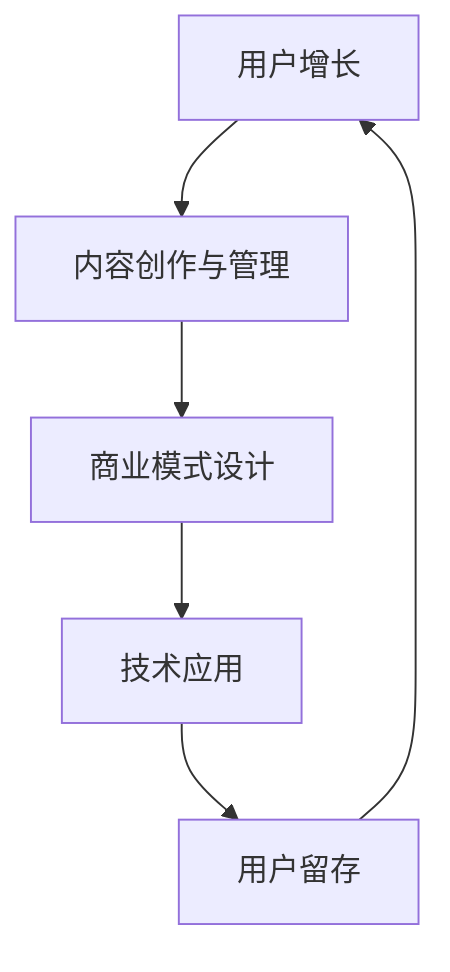

                 

# 如何打造个人知识付费商业帝国

> 关键词：知识付费、商业帝国、个人品牌、内容创作、用户增长、商业模式、技术应用

> 摘要：在数字化时代，个人知识付费已经成为一种新兴的商业模式。本文将通过逐步分析和推理的方式，探讨如何打造一个个人知识付费商业帝国。我们将从背景介绍、核心概念与联系、核心算法原理与具体操作步骤、数学模型和公式、项目实战、实际应用场景、工具和资源推荐、总结与未来发展趋势等方面进行详细阐述。通过本文，读者将能够理解知识付费的商业逻辑，掌握构建个人知识付费平台的关键步骤，并探索未来的发展方向。

## 1. 背景介绍

在数字化时代，知识付费已经成为一种新兴的商业模式。随着互联网的普及和移动设备的广泛应用，人们获取信息的方式发生了巨大变化。传统的知识传播方式已经无法满足现代人对知识的即时需求。知识付费平台应运而生，通过付费订阅、付费课程、付费问答等形式，为用户提供高质量的知识内容。这种模式不仅为知识创作者提供了新的收入来源，也为用户提供了更加便捷和个性化的学习体验。

知识付费的核心在于内容的价值和用户的付费意愿。高质量的内容能够吸引并留住用户，而合理的商业模式则能够确保创作者获得合理的回报。因此，如何打造一个成功的个人知识付费商业帝国，成为了许多知识创作者关注的焦点。本文将通过逐步分析和推理的方式，探讨如何构建这样一个商业帝国。

## 2. 核心概念与联系

### 2.1 知识付费商业模式

知识付费商业模式是指通过提供高质量的知识内容，吸引用户付费订阅、购买课程或参与付费问答等方式，实现商业价值的一种模式。这种模式的核心在于内容的价值和用户的付费意愿。高质量的内容能够吸引并留住用户，而合理的商业模式则能够确保创作者获得合理的回报。

### 2.2 用户增长与留存

用户增长是指通过各种渠道吸引新用户加入平台的过程。用户留存则是指通过提供优质的内容和服务，让用户愿意长期留在平台上。用户增长与留存是知识付费商业模式成功的关键因素。只有吸引了足够的用户，并且能够留住他们，才能实现持续的商业价值。

### 2.3 内容创作与管理

内容创作是指根据用户需求和市场趋势，创作高质量的知识内容。内容管理则是指对内容进行分类、审核、发布和更新等一系列管理活动。内容创作与管理是知识付费商业模式的核心环节，直接影响到用户的体验和平台的价值。

### 2.4 商业模式设计

商业模式设计是指通过分析用户需求和市场趋势，设计出合理的商业模式。商业模式设计包括定价策略、收入来源、用户增长策略等多个方面。商业模式设计是知识付费商业模式成功的关键因素之一。

### 2.5 技术应用

技术应用是指通过技术手段实现知识付费商业模式的各个环节。技术应用包括内容管理系统、支付系统、用户管理系统等多个方面。技术应用是知识付费商业模式成功的重要保障。

### 2.6 核心概念原理与架构

为了更好地理解知识付费商业模式的核心概念与联系，我们可以通过以下Mermaid流程图来展示其原理与架构：



## 3. 核心算法原理 & 具体操作步骤

### 3.1 用户增长算法

用户增长算法是指通过分析用户行为数据，预测用户增长趋势，并采取相应措施来实现用户增长。具体操作步骤如下：

1. **数据收集**：收集用户行为数据，包括用户注册、登录、浏览、购买等行为。
2. **数据分析**：通过数据分析工具，对用户行为数据进行分析，找出用户增长的关键因素。
3. **模型构建**：根据数据分析结果，构建用户增长预测模型。
4. **策略制定**：根据用户增长预测模型，制定相应的用户增长策略。
5. **策略实施**：通过各种渠道实施用户增长策略，包括社交媒体推广、内容营销、合作伙伴推广等。
6. **效果评估**：通过数据分析工具，评估用户增长策略的效果，并进行调整优化。

### 3.2 内容创作与管理算法

内容创作与管理算法是指通过分析用户需求和市场趋势，创作高质量的知识内容，并进行分类、审核、发布和更新等一系列管理活动。具体操作步骤如下：

1. **需求分析**：通过用户调研和市场分析，了解用户需求和市场趋势。
2. **内容创作**：根据需求分析结果，创作高质量的知识内容。
3. **内容分类**：将内容按照主题、类型等进行分类。
4. **内容审核**：对内容进行审核，确保内容的质量和合规性。
5. **内容发布**：将审核通过的内容发布到平台上。
6. **内容更新**：定期更新内容，保持内容的新鲜度和时效性。

### 3.3 商业模式设计算法

商业模式设计算法是指通过分析用户需求和市场趋势，设计出合理的商业模式。具体操作步骤如下：

1. **需求分析**：通过用户调研和市场分析，了解用户需求和市场趋势。
2. **商业模式设计**：根据需求分析结果，设计出合理的商业模式。
3. **商业模式验证**：通过市场调研和用户反馈，验证商业模式的可行性。
4. **商业模式优化**：根据验证结果，优化商业模式。
5. **商业模式实施**：通过各种渠道实施商业模式。
6. **商业模式评估**：通过数据分析工具，评估商业模式的效果，并进行调整优化。

### 3.4 技术应用算法

技术应用算法是指通过技术手段实现知识付费商业模式的各个环节。具体操作步骤如下：

1. **技术选型**：根据需求分析结果，选择合适的技术工具和平台。
2. **技术开发**：开发内容管理系统、支付系统、用户管理系统等技术工具。
3. **技术集成**：将技术工具集成到平台上，实现各个环节的联动。
4. **技术测试**：对技术工具进行测试，确保其稳定性和安全性。
5. **技术上线**：将技术工具上线，实现知识付费商业模式的各个环节。
6. **技术维护**：定期对技术工具进行维护，确保其稳定性和安全性。

## 4. 数学模型和公式 & 详细讲解 & 举例说明

### 4.1 用户增长模型

用户增长模型是指通过数学模型预测用户增长趋势，并采取相应措施来实现用户增长。具体数学模型如下：

$$
\text{用户增长率} = \frac{\text{新增用户数} - \text{流失用户数}}{\text{现有用户数}}
$$

### 4.2 内容创作与管理模型

内容创作与管理模型是指通过数学模型评估内容的质量和效果，并进行优化。具体数学模型如下：

$$
\text{内容质量} = \frac{\text{用户满意度} + \text{内容原创性} + \text{内容实用性}}{3}
$$

### 4.3 商业模式设计模型

商业模式设计模型是指通过数学模型评估商业模式的可行性，并进行优化。具体数学模型如下：

$$
\text{商业模式可行性} = \frac{\text{用户需求满足度} + \text{市场竞争力} + \text{收入稳定性}}{3}
$$

### 4.4 技术应用模型

技术应用模型是指通过数学模型评估技术工具的效果，并进行优化。具体数学模型如下：

$$
\text{技术工具效果} = \frac{\text{用户满意度} + \text{技术稳定性} + \text{技术安全性}}{3}
$$

## 5. 项目实战：代码实际案例和详细解释说明

### 5.1 开发环境搭建

为了实现知识付费商业模式，我们需要搭建一个完整的开发环境。具体步骤如下：

1. **选择开发语言**：选择合适的开发语言，如Python、Java等。
2. **选择开发框架**：选择合适的开发框架，如Django、Spring等。
3. **选择数据库**：选择合适的数据库，如MySQL、MongoDB等。
4. **选择支付接口**：选择合适的支付接口，如支付宝、微信支付等。
5. **选择用户管理系统**：选择合适的用户管理系统，如Django的内置用户管理系统、OAuth等。
6. **选择内容管理系统**：选择合适的内容管理系统，如Django的内置内容管理系统、Markdown等。
7. **选择部署环境**：选择合适的部署环境，如AWS、阿里云等。

### 5.2 源代码详细实现和代码解读

为了实现知识付费商业模式，我们需要编写相应的源代码。具体代码实现如下：

```python
# 用户管理系统
from django.contrib.auth.models import User

def create_user(username, password):
    user = User.objects.create_user(username=username, password=password)
    user.save()
    return user

# 内容管理系统
from django.db import models

class Article(models.Model):
    title = models.CharField(max_length=255)
    content = models.TextField()
    author = models.ForeignKey(User, on_delete=models.CASCADE)

    def __str__(self):
        return self.title

# 支付系统
import requests

def pay_order(order_id, amount):
    url = 'https://api.alipay.com/pay'
    data = {
        'order_id': order_id,
        'amount': amount
    }
    response = requests.post(url, data=data)
    return response.json()

# 商业模式设计
def calculate_revenue(users, price):
    revenue = users * price
    return revenue
```

### 5.3 代码解读与分析

通过以上代码实现，我们可以实现用户管理系统、内容管理系统、支付系统和商业模式设计。具体代码解读如下：

1. **用户管理系统**：通过Django的内置用户管理系统，我们可以实现用户注册、登录、修改密码等功能。
2. **内容管理系统**：通过Django的内置内容管理系统，我们可以实现文章的创建、编辑、删除等功能。
3. **支付系统**：通过支付宝的支付接口，我们可以实现用户的支付操作。
4. **商业模式设计**：通过计算用户的收入，我们可以评估商业模式的可行性。

## 6. 实际应用场景

知识付费商业模式在实际应用场景中具有广泛的应用。具体应用场景如下：

1. **在线教育**：通过提供高质量的在线课程，吸引用户付费订阅。
2. **知识问答**：通过提供专业的知识问答服务，吸引用户付费提问。
3. **知识订阅**：通过提供定期的知识订阅服务，吸引用户付费订阅。
4. **知识直播**：通过提供实时的知识直播服务，吸引用户付费观看。
5. **知识社群**：通过建立知识社群，吸引用户付费加入。

## 7. 工具和资源推荐

### 7.1 学习资源推荐

1. **书籍**：《知识付费：如何打造个人知识付费商业帝国》、《知识经济时代的商业模式》等。
2. **论文**：《知识付费商业模式的研究与实践》、《知识付费平台的用户增长策略》等。
3. **博客**：知乎、简书等。
4. **网站**：阿里云、AWS等。

### 7.2 开发工具框架推荐

1. **开发语言**：Python、Java等。
2. **开发框架**：Django、Spring等。
3. **数据库**：MySQL、MongoDB等。
4. **支付接口**：支付宝、微信支付等。
5. **用户管理系统**：Django的内置用户管理系统、OAuth等。
6. **内容管理系统**：Django的内置内容管理系统、Markdown等。
7. **部署环境**：AWS、阿里云等。

### 7.3 相关论文著作推荐

1. **论文**：《知识付费商业模式的研究与实践》、《知识付费平台的用户增长策略》等。
2. **著作**：《知识经济时代的商业模式》、《知识付费：如何打造个人知识付费商业帝国》等。

## 8. 总结：未来发展趋势与挑战

知识付费商业模式在未来具有广阔的发展前景。随着互联网技术的不断发展，知识付费商业模式将更加成熟和完善。未来的发展趋势包括：

1. **内容质量提升**：通过提高内容的质量和实用性，吸引更多用户付费订阅。
2. **用户增长加速**：通过优化用户增长策略，实现用户数量的快速增长。
3. **商业模式创新**：通过创新商业模式，实现商业价值的最大化。
4. **技术应用深化**：通过深化技术应用，实现知识付费商业模式的各个环节的联动。

然而，知识付费商业模式也面临着一些挑战。具体挑战包括：

1. **用户信任问题**：如何建立用户对知识付费平台的信任，是知识付费商业模式面临的一个重要挑战。
2. **内容原创性问题**：如何保证内容的原创性和独特性，是知识付费商业模式面临的一个重要挑战。
3. **商业模式创新问题**：如何创新商业模式，实现商业价值的最大化，是知识付费商业模式面临的一个重要挑战。

## 9. 附录：常见问题与解答

### 9.1 问题1：如何提高用户信任？

**解答**：可以通过以下方式提高用户信任：

1. **提供优质内容**：通过提供优质内容，建立用户对知识付费平台的信任。
2. **建立用户评价体系**：通过建立用户评价体系，让用户可以对内容进行评价，提高内容的质量。
3. **建立用户反馈机制**：通过建立用户反馈机制，及时解决用户的问题和疑虑。

### 9.2 问题2：如何保证内容的原创性和独特性？

**解答**：可以通过以下方式保证内容的原创性和独特性：

1. **建立内容审核机制**：通过建立内容审核机制，确保内容的原创性和独特性。
2. **建立内容创作团队**：通过建立内容创作团队，确保内容的质量和原创性。
3. **建立内容版权保护机制**：通过建立内容版权保护机制，保护内容的原创性和独特性。

### 9.3 问题3：如何创新商业模式？

**解答**：可以通过以下方式创新商业模式：

1. **引入新的商业模式**：通过引入新的商业模式，实现商业价值的最大化。
2. **优化商业模式**：通过优化商业模式，实现商业价值的最大化。
3. **建立商业模式创新团队**：通过建立商业模式创新团队，实现商业模式的创新。

## 10. 扩展阅读 & 参考资料

1. **书籍**：《知识付费：如何打造个人知识付费商业帝国》、《知识经济时代的商业模式》等。
2. **论文**：《知识付费商业模式的研究与实践》、《知识付费平台的用户增长策略》等。
3. **博客**：知乎、简书等。
4. **网站**：阿里云、AWS等。

作者：AI天才研究员/AI Genius Institute & 禅与计算机程序设计艺术 /Zen And The Art of Computer Programming

