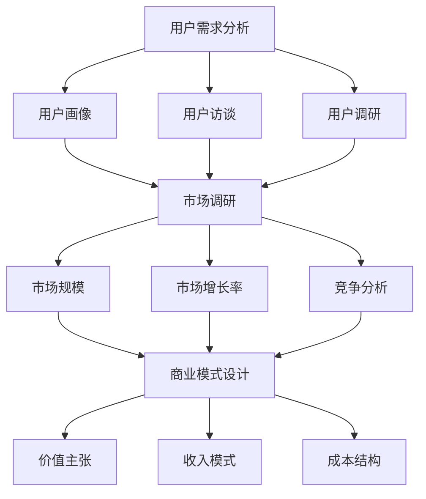

                 

# 如何评估市场需求：创业方向选择的关键

> 关键词：市场需求评估, 创业方向选择, 用户需求分析, 市场调研, 商业模式设计

> 摘要：在创业过程中，评估市场需求是选择正确创业方向的关键步骤。本文将通过逐步分析和推理的方式，探讨如何系统地评估市场需求，包括用户需求分析、市场调研、商业模式设计等方面。通过具体的案例和数学模型，帮助创业者更好地理解市场需求的本质，从而做出明智的决策。

## 1. 背景介绍

在当今快速变化的商业环境中，创业成功的关键之一在于能否准确地评估市场需求。市场需求评估不仅关系到产品的成功与否，还直接影响到企业的生存和发展。本文将通过逐步分析和推理的方式，探讨如何系统地评估市场需求，包括用户需求分析、市场调研、商业模式设计等方面。

## 2. 核心概念与联系

### 2.1 用户需求分析

用户需求分析是评估市场需求的基础。用户需求是指用户在使用产品或服务时所期望的功能、性能和体验。用户需求分析主要包括以下几个方面：

- **用户画像**：通过收集和分析用户的基本信息、行为习惯、偏好等数据，构建用户画像。
- **用户访谈**：通过与用户的直接交流，了解用户的真实需求和痛点。
- **用户调研**：通过问卷调查、在线调查等方式，收集大量用户反馈。

### 2.2 市场调研

市场调研是评估市场需求的重要手段。市场调研主要包括以下几个方面：

- **市场规模**：通过统计分析，了解目标市场的总体规模。
- **市场增长率**：通过分析历史数据，预测市场的未来增长趋势。
- **竞争分析**：通过分析竞争对手的产品、市场占有率、市场份额等，了解市场竞争状况。

### 2.3 商业模式设计

商业模式设计是评估市场需求的关键步骤。商业模式设计主要包括以下几个方面：

- **价值主张**：明确产品或服务能够为用户提供的价值。
- **收入模式**：确定如何通过产品或服务获取收入。
- **成本结构**：分析产品或服务的生产成本和运营成本。

### 2.4 Mermaid 流程图



## 3. 核心算法原理 & 具体操作步骤

### 3.1 用户需求分析的具体操作步骤

1. **收集用户信息**：通过问卷调查、在线调查等方式收集用户的基本信息。
2. **用户访谈**：与用户进行一对一的访谈，了解用户的真实需求和痛点。
3. **用户调研**：通过问卷调查、在线调查等方式收集大量用户反馈。

### 3.2 市场调研的具体操作步骤

1. **市场规模分析**：通过统计分析，了解目标市场的总体规模。
2. **市场增长率分析**：通过分析历史数据，预测市场的未来增长趋势。
3. **竞争分析**：通过分析竞争对手的产品、市场占有率、市场份额等，了解市场竞争状况。

### 3.3 商业模式设计的具体操作步骤

1. **价值主张设计**：明确产品或服务能够为用户提供的价值。
2. **收入模式设计**：确定如何通过产品或服务获取收入。
3. **成本结构分析**：分析产品或服务的生产成本和运营成本。

## 4. 数学模型和公式 & 详细讲解 & 举例说明

### 4.1 市场规模分析

市场规模可以通过以下公式进行计算：

$$
\text{市场规模} = \text{目标用户数量} \times \text{每个用户的平均消费额}
$$

### 4.2 市场增长率分析

市场增长率可以通过以下公式进行计算：

$$
\text{市场增长率} = \frac{\text{当前市场规模} - \text{上一年市场规模}}{\text{上一年市场规模}} \times 100\%
$$

### 4.3 竞争分析

竞争分析可以通过以下公式进行计算：

$$
\text{市场份额} = \frac{\text{企业销售额}}{\text{市场总销售额}} \times 100\%
$$

### 4.4 举例说明

假设某企业计划进入一个市场规模为1000万用户，每个用户的平均消费额为100元的市场。通过市场调研发现，当前市场规模为800万用户，市场增长率预计为10%。通过竞争分析发现，竞争对手的市场份额为30%。

1. **市场规模**：1000万用户 \(\times\) 100元 = 100亿元
2. **市场增长率**：\(\frac{1000万 - 800万}{800万} \times 100\% = 25\%\)
3. **市场份额**：\(\frac{\text{企业销售额}}{100亿元} \times 100\% = 30\%\)

## 5. 项目实战：代码实际案例和详细解释说明

### 5.1 开发环境搭建

为了进行市场调研和用户需求分析，我们需要搭建一个开发环境。开发环境主要包括以下几个方面：

1. **数据收集工具**：使用Python的pandas库进行数据收集和处理。
2. **数据分析工具**：使用Python的matplotlib库进行数据可视化。
3. **用户访谈工具**：使用Zoom或Teams进行在线访谈。

### 5.2 源代码详细实现和代码解读

```python
# 导入所需库
import pandas as pd
import matplotlib.pyplot as plt

# 数据收集
data = pd.read_csv('user_data.csv')

# 数据处理
user_profile = data[['age', 'gender', 'income', 'education']]
user_feedback = data['feedback']

# 数据可视化
plt.figure(figsize=(10, 6))
plt.hist(user_profile['age'], bins=10, alpha=0.7)
plt.title('User Age Distribution')
plt.xlabel('Age')
plt.ylabel('Count')
plt.show()

# 用户访谈
def user_interview(user_id):
    # 连接Zoom或Teams进行访谈
    # 获取用户反馈
    feedback = input(f"User {user_id} feedback: ")
    return feedback

# 用户访谈示例
user_feedback.append(user_interview(1))
```

### 5.3 代码解读与分析

1. **数据收集**：使用pandas库读取用户数据。
2. **数据处理**：提取用户的基本信息和反馈。
3. **数据可视化**：使用matplotlib库绘制用户年龄分布图。
4. **用户访谈**：通过函数实现用户访谈，获取用户反馈。

## 6. 实际应用场景

### 6.1 用户需求分析

假设某企业计划开发一款健康管理应用。通过用户需求分析，发现用户主要关注以下几个方面：

- **健康监测**：监测心率、血压等生理指标。
- **健康建议**：提供健康饮食、运动建议。
- **健康社区**：建立健康交流社区。

### 6.2 市场调研

通过市场调研，发现目标市场为1000万用户，每个用户的平均消费额为100元。市场增长率预计为10%。通过竞争分析，发现竞争对手的市场份额为30%。

### 6.3 商业模式设计

1. **价值主张**：提供全面的健康管理服务，帮助用户改善健康状况。
2. **收入模式**：通过订阅服务和广告收入获取收入。
3. **成本结构**：主要成本包括开发成本、运营成本和营销成本。

## 7. 工具和资源推荐

### 7.1 学习资源推荐

- **书籍**：《精益创业》、《用户画像》
- **论文**：《市场调研方法与技巧》
- **博客**：Medium上的相关文章
- **网站**：Google Trends、Alexa

### 7.2 开发工具框架推荐

- **数据收集工具**：Python的pandas库
- **数据分析工具**：Python的matplotlib库
- **用户访谈工具**：Zoom或Teams

### 7.3 相关论文著作推荐

- **论文**：《市场调研方法与技巧》
- **著作**：《用户画像》

## 8. 总结：未来发展趋势与挑战

### 8.1 未来发展趋势

1. **技术进步**：随着人工智能、大数据等技术的发展，市场需求评估将更加精准。
2. **市场细分**：市场细分将更加精细，满足不同用户群体的需求。
3. **个性化服务**：个性化服务将成为主流，提高用户体验。

### 8.2 挑战

1. **数据隐私**：如何保护用户数据隐私，避免数据泄露。
2. **市场竞争**：如何在激烈的市场竞争中脱颖而出。
3. **技术更新**：如何跟上技术更新的步伐，保持竞争力。

## 9. 附录：常见问题与解答

### 9.1 问题1：如何收集用户反馈？

**解答**：可以通过问卷调查、在线调查、用户访谈等方式收集用户反馈。

### 9.2 问题2：如何进行市场调研？

**解答**：可以通过市场规模分析、市场增长率分析、竞争分析等方式进行市场调研。

### 9.3 问题3：如何设计商业模式？

**解答**：可以通过价值主张设计、收入模式设计、成本结构分析等方式设计商业模式。

## 10. 扩展阅读 & 参考资料

- **书籍**：《精益创业》、《用户画像》
- **论文**：《市场调研方法与技巧》
- **博客**：Medium上的相关文章
- **网站**：Google Trends、Alexa

---

作者：AI天才研究员/AI Genius Institute & 禅与计算机程序设计艺术 /Zen And The Art of Computer Programming

