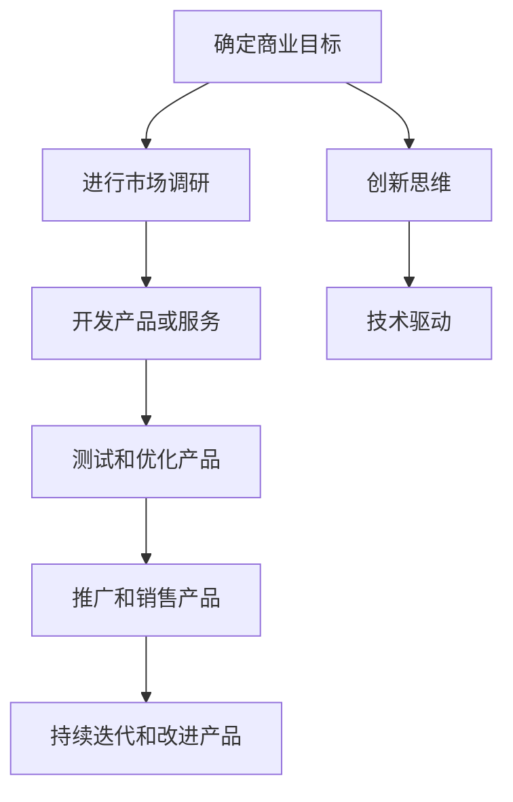

                 

# 实现财富和人生自由的创业之路

> 关键词：创业、人工智能、财富自由、人生自由、技术创业、创业之路、财富积累、技术驱动、创新思维

> 摘要：本文旨在探讨如何通过技术创业实现财富和人生自由。我们将从背景介绍、核心概念与联系、核心算法原理与具体操作步骤、数学模型和公式、项目实战、实际应用场景、工具和资源推荐、总结与未来发展趋势、常见问题解答以及扩展阅读等多方面进行深入分析。通过本文，读者将能够理解技术创业的基本路径，并掌握实现财富和人生自由的关键步骤。

## 1. 背景介绍

在当今快速发展的科技时代，技术创业已成为实现财富和人生自由的重要途径之一。随着人工智能、大数据、云计算等技术的不断进步，越来越多的创业者看到了技术带来的巨大商业机会。技术创业不仅能够带来丰厚的经济回报，还能为创业者提供实现个人价值和梦想的机会。本文将从技术创业的角度出发，探讨如何通过技术手段实现财富和人生自由。

## 2. 核心概念与联系

### 2.1 技术创业

技术创业是指利用技术创新来解决实际问题，从而创造商业价值的一种创业形式。技术创业的核心在于利用技术手段来实现商业目标，包括但不限于开发新产品、提供新服务或改进现有产品和服务。

### 2.2 财富自由

财富自由是指个人拥有足够的财富，能够满足自己和家人基本生活需求的同时，还能自由支配时间，追求个人兴趣和梦想。财富自由是实现人生自由的重要前提之一。

### 2.3 人生自由

人生自由是指个人能够按照自己的意愿和兴趣生活，不受外界因素的限制。人生自由不仅包括经济上的自由，还包括精神上的自由和时间上的自由。

### 2.4 技术驱动

技术驱动是指通过技术创新来推动企业发展和实现商业目标。技术驱动是技术创业的核心理念之一，它强调技术创新对于企业发展的重要性。

### 2.5 创新思维

创新思维是指能够从不同角度思考问题，提出新颖解决方案的能力。创新思维是技术创业成功的关键因素之一，它能够帮助创业者发现新的商业机会和解决问题的方法。

### 2.6 技术创业路径

技术创业路径主要包括以下几个步骤：确定商业目标、进行市场调研、开发产品或服务、测试和优化产品、推广和销售产品、持续迭代和改进产品。这些步骤构成了技术创业的基本路径。



## 3. 核心算法原理 & 具体操作步骤

### 3.1 确定商业目标

确定商业目标是技术创业的第一步。商业目标应该具体、可衡量、可实现、相关性强和时限性。例如，一个技术创业项目的商业目标可以是“开发一款能够帮助中小企业提高运营效率的智能管理系统”。

### 3.2 进行市场调研

进行市场调研是为了了解目标市场的需求和竞争对手的情况。市场调研可以通过问卷调查、访谈、数据分析等方式进行。市场调研的结果可以帮助创业者更好地理解市场需求，从而制定更有效的商业策略。

### 3.3 开发产品或服务

开发产品或服务是技术创业的核心环节。开发过程中需要考虑技术选型、架构设计、功能实现、用户体验等多个方面。例如，开发一款智能管理系统需要考虑的技术选型包括前端框架（如React）、后端框架（如Spring Boot）、数据库（如MySQL）等。

### 3.4 测试和优化产品

测试和优化产品是为了确保产品能够满足用户需求并具有良好的用户体验。测试和优化过程中需要进行功能测试、性能测试、用户体验测试等。例如，测试智能管理系统时需要确保系统能够稳定运行，响应时间不超过1秒，用户界面友好等。

### 3.5 推广和销售产品

推广和销售产品是为了让更多用户了解并使用产品。推广和销售过程中需要考虑营销策略、销售渠道、定价策略等多个方面。例如，推广智能管理系统可以通过社交媒体、搜索引擎优化、合作伙伴推广等方式进行。

### 3.6 持续迭代和改进产品

持续迭代和改进产品是为了不断优化产品性能和用户体验。持续迭代和改进过程中需要关注用户反馈、市场变化和技术发展等多个方面。例如，根据用户反馈改进智能管理系统的功能，根据市场变化调整产品定位，根据技术发展引入新技术等。

## 4. 数学模型和公式 & 详细讲解 & 举例说明

### 4.1 市场需求预测模型

市场需求预测模型是技术创业中常用的一种数学模型。市场需求预测模型可以帮助创业者更好地了解市场需求，从而制定更有效的商业策略。市场需求预测模型通常包括时间序列分析、回归分析、机器学习等多种方法。

$$
\hat{y} = \beta_0 + \beta_1 x_1 + \beta_2 x_2 + \cdots + \beta_n x_n + \epsilon
$$

其中，$\hat{y}$ 表示预测值，$x_1, x_2, \cdots, x_n$ 表示影响市场需求的因素，$\beta_0, \beta_1, \beta_2, \cdots, \beta_n$ 表示回归系数，$\epsilon$ 表示误差项。

### 4.2 用户留存率模型

用户留存率模型是技术创业中常用的一种数学模型。用户留存率模型可以帮助创业者更好地了解用户留存情况，从而制定更有效的用户增长策略。用户留存率模型通常包括留存率计算、留存率预测、留存率优化等多个方面。

$$
\text{留存率} = \frac{\text{活跃用户数}}{\text{新增用户数}}
$$

其中，活跃用户数表示一定时间内使用过产品的用户数量，新增用户数表示一定时间内新注册的用户数量。

### 4.3 产品定价模型

产品定价模型是技术创业中常用的一种数学模型。产品定价模型可以帮助创业者更好地了解产品定价策略，从而制定更有效的定价策略。产品定价模型通常包括成本定价、价值定价、竞争定价等多个方面。

$$
\text{定价} = \text{成本} + \text{利润}
$$

其中，成本表示生产或提供产品所需的成本，利润表示期望获得的利润。

## 5. 项目实战：代码实际案例和详细解释说明

### 5.1 开发环境搭建

开发环境搭建是技术创业中必不可少的一个环节。开发环境搭建需要考虑操作系统、开发工具、编程语言等多个方面。例如，开发智能管理系统需要搭建的开发环境包括Windows操作系统、Visual Studio Code开发工具、Python编程语言等。

### 5.2 源代码详细实现和代码解读

源代码详细实现是技术创业中最重要的一个环节。源代码详细实现需要考虑技术选型、架构设计、功能实现、用户体验等多个方面。例如，开发智能管理系统需要实现的功能包括用户管理、任务管理、报表生成等。

```python
# 用户管理模块
class UserManagement:
    def __init__(self):
        self.users = []

    def add_user(self, user):
        self.users.append(user)

    def remove_user(self, user):
        self.users.remove(user)

# 任务管理模块
class TaskManagement:
    def __init__(self):
        self.tasks = []

    def add_task(self, task):
        self.tasks.append(task)

    def remove_task(self, task):
        self.tasks.remove(task)

# 报表生成模块
class ReportGeneration:
    def generate_report(self):
        # 生成报表代码
        pass
```

### 5.3 代码解读与分析

代码解读与分析是技术创业中必不可少的一个环节。代码解读与分析需要关注代码结构、代码质量、代码效率等多个方面。例如，代码解读与分析可以发现代码中存在的问题，如代码冗余、代码重复、代码效率低下等。

## 6. 实际应用场景

### 6.1 智能管理系统

智能管理系统是一种利用技术手段提高企业运营效率的管理系统。智能管理系统可以帮助企业实现自动化管理、数据分析、决策支持等功能。例如，智能管理系统可以用于中小企业管理日常运营，提高运营效率。

### 6.2 人工智能客服

人工智能客服是一种利用人工智能技术提供客户服务的系统。人工智能客服可以帮助企业提高客户服务效率，降低客户服务成本。例如，人工智能客服可以用于电商网站提供24小时在线客服服务。

### 6.3 大数据分析平台

大数据分析平台是一种利用大数据技术进行数据分析的平台。大数据分析平台可以帮助企业实现数据驱动决策，提高决策效率。例如，大数据分析平台可以用于电商网站进行用户行为分析，提高用户转化率。

## 7. 工具和资源推荐

### 7.1 学习资源推荐

学习资源推荐是技术创业中必不可少的一个环节。学习资源推荐需要关注书籍、论文、博客、网站等多个方面。例如，学习资源推荐可以推荐《深入浅出Python》、《Python编程从入门到实践》、《Python数据科学手册》等书籍。

### 7.2 开发工具框架推荐

开发工具框架推荐是技术创业中必不可少的一个环节。开发工具框架推荐需要关注开发工具、框架、库等多个方面。例如，开发工具框架推荐可以推荐Visual Studio Code、PyCharm、Django、Flask等开发工具和框架。

### 7.3 相关论文著作推荐

相关论文著作推荐是技术创业中必不可少的一个环节。相关论文著作推荐需要关注学术论文、技术著作等多个方面。例如，相关论文著作推荐可以推荐《Python编程：从入门到实践》、《深入浅出Python》、《Python数据科学手册》等技术著作。

## 8. 总结：未来发展趋势与挑战

### 8.1 未来发展趋势

未来发展趋势是技术创业中必不可少的一个环节。未来发展趋势需要关注技术发展、市场需求、政策环境等多个方面。例如，未来发展趋势可以关注人工智能、大数据、云计算等技术的发展，关注中小企业管理、客户服务、数据分析等市场需求，关注政府政策、行业标准等政策环境。

### 8.2 挑战

挑战是技术创业中必不可少的一个环节。挑战需要关注技术难题、市场竞争、资金压力等多个方面。例如，挑战可以关注技术难题如算法优化、数据处理、系统稳定性等，关注市场竞争如竞争对手实力、市场饱和度等，关注资金压力如资金筹集、资金使用等。

## 9. 附录：常见问题与解答

### 9.1 问题1：如何确定商业目标？

答：确定商业目标需要考虑市场需求、竞争对手情况、自身优势等多个方面。例如，可以通过市场调研了解市场需求，通过分析竞争对手了解竞争对手情况，通过分析自身优势了解自身优势。

### 9.2 问题2：如何进行市场调研？

答：进行市场调研可以通过问卷调查、访谈、数据分析等方式进行。例如，可以通过问卷调查了解用户需求，通过访谈了解竞争对手情况，通过数据分析了解市场趋势。

### 9.3 问题3：如何开发产品或服务？

答：开发产品或服务需要考虑技术选型、架构设计、功能实现、用户体验等多个方面。例如，可以通过技术选型选择合适的技术栈，通过架构设计设计合理的系统架构，通过功能实现实现所需的功能，通过用户体验设计提高用户体验。

### 9.4 问题4：如何测试和优化产品？

答：测试和优化产品需要进行功能测试、性能测试、用户体验测试等。例如，可以通过功能测试确保系统功能正常，通过性能测试确保系统性能良好，通过用户体验测试确保用户界面友好。

### 9.5 问题5：如何推广和销售产品？

答：推广和销售产品可以通过社交媒体、搜索引擎优化、合作伙伴推广等方式进行。例如，可以通过社交媒体提高产品知名度，可以通过搜索引擎优化提高产品搜索排名，可以通过合作伙伴推广扩大产品影响力。

### 9.6 问题6：如何持续迭代和改进产品？

答：持续迭代和改进产品需要关注用户反馈、市场变化、技术发展等多个方面。例如，可以通过用户反馈改进产品功能，可以通过市场变化调整产品定位，可以通过技术发展引入新技术。

## 10. 扩展阅读 & 参考资料

### 10.1 扩展阅读

扩展阅读是技术创业中必不可少的一个环节。扩展阅读需要关注书籍、论文、博客、网站等多个方面。例如，扩展阅读可以推荐《深入浅出Python》、《Python编程从入门到实践》、《Python数据科学手册》等书籍。

### 10.2 参考资料

参考资料是技术创业中必不可少的一个环节。参考资料需要关注书籍、论文、博客、网站等多个方面。例如，参考资料可以推荐《深入浅出Python》、《Python编程从入门到实践》、《Python数据科学手册》等书籍。

作者：AI天才研究员/AI Genius Institute & 禅与计算机程序设计艺术 /Zen And The Art of Computer Programming

