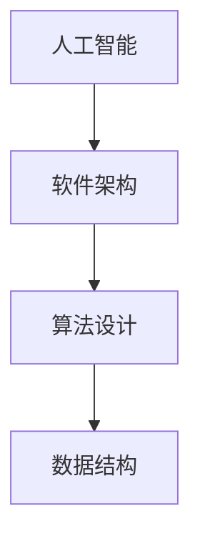

                 

# 2024年小米社招技术面试题集锦

> 关键词：小米社招, 技术面试, 人工智能, 软件架构, 算法设计, 数据结构, 代码实现

> 摘要：本文旨在为即将参加小米社招技术面试的求职者提供全面的技术准备指南。我们将从背景介绍、核心概念与联系、核心算法原理、数学模型与公式、项目实战、实际应用场景、工具和资源推荐、总结与未来发展趋势等多方面进行详细探讨。通过本文，读者可以全面了解小米社招技术面试的核心内容，并掌握相关技术知识与技能。

## 1. 背景介绍

小米是一家全球领先的科技公司，专注于智能手机、智能家居、互联网服务等领域。小米社招技术面试通常涵盖多个技术领域，包括但不限于人工智能、软件架构、算法设计、数据结构等。面试题目旨在考察求职者的专业知识、解决问题的能力和实际动手能力。

## 2. 核心概念与联系

### 2.1 人工智能

人工智能（Artificial Intelligence, AI）是计算机科学的一个分支，旨在使计算机能够模拟人类智能行为。AI技术包括机器学习、深度学习、自然语言处理、计算机视觉等。

### 2.2 软件架构

软件架构是软件系统的设计蓝图，它定义了系统的结构、组件及其之间的关系。良好的软件架构能够提高系统的可维护性、可扩展性和性能。

### 2.3 算法设计

算法是解决特定问题的一系列步骤。算法设计是计算机科学的核心，它涉及到数据结构的选择、算法的优化和复杂度分析。

### 2.4 数据结构

数据结构是计算机存储、组织数据的方式。常见的数据结构包括数组、链表、栈、队列、树、图等。数据结构的选择直接影响算法的效率。

### 2.5 Mermaid 流程图



## 3. 核心算法原理 & 具体操作步骤

### 3.1 二分查找算法

二分查找是一种在有序数组中查找特定元素的高效算法。其基本思想是每次将查找范围缩小一半，直到找到目标元素或查找范围为空。

#### 具体操作步骤

1. 初始化左右指针 `left` 和 `right`，分别指向数组的起始和末尾。
2. 计算中间位置 `mid`。
3. 比较中间位置的元素与目标值。
4. 根据比较结果调整左右指针。
5. 重复步骤2-4，直到找到目标值或查找范围为空。

### 3.2 快速排序算法

快速排序是一种高效的排序算法，其基本思想是通过一趟排序将待排序的数据分割成独立的两部分，其中一部分的所有数据都比另一部分的所有数据都要小。

#### 具体操作步骤

1. 选择一个基准元素（pivot）。
2. 将数组分为两部分，一部分包含所有小于基准的元素，另一部分包含所有大于基准的元素。
3. 递归地对这两部分进行快速排序。

## 4. 数学模型和公式 & 详细讲解 & 举例说明

### 4.1 二分查找算法的数学模型

设数组长度为 `n`，查找次数为 `k`。二分查找的时间复杂度为 `O(log n)`。

$$
T(n) = T\left(\frac{n}{2}\right) + O(1)
$$

### 4.2 快速排序算法的数学模型

快速排序的时间复杂度在最坏情况下为 `O(n^2)`，平均情况下为 `O(n log n)`。

$$
T(n) = T(k) + T(n - k - 1) + O(n)
$$

## 5. 项目实战：代码实际案例和详细解释说明

### 5.1 开发环境搭建

#### 5.1.1 安装Python

```bash
sudo apt-get update
sudo apt-get install python3
```

#### 5.1.2 安装NumPy和Pandas

```bash
pip install numpy pandas
```

### 5.2 源代码详细实现和代码解读

#### 5.2.1 二分查找算法实现

```python
def binary_search(arr, target):
    left, right = 0, len(arr) - 1
    while left <= right:
        mid = (left + right) // 2
        if arr[mid] == target:
            return mid
        elif arr[mid] < target:
            left = mid + 1
        else:
            right = mid - 1
    return -1
```

#### 5.2.2 快速排序算法实现

```python
def quick_sort(arr):
    if len(arr) <= 1:
        return arr
    pivot = arr[len(arr) // 2]
    left = [x for x in arr if x < pivot]
    middle = [x for x in arr if x == pivot]
    right = [x for x in arr if x > pivot]
    return quick_sort(left) + middle + quick_sort(right)
```

### 5.3 代码解读与分析

#### 5.3.1 二分查找算法

- `left` 和 `right` 分别指向数组的起始和末尾。
- `mid` 计算中间位置。
- 根据 `arr[mid]` 与 `target` 的比较结果调整 `left` 和 `right`。
- 重复上述步骤，直到找到目标值或查找范围为空。

#### 5.3.2 快速排序算法

- 选择基准元素 `pivot`。
- 将数组分为两部分，一部分包含所有小于 `pivot` 的元素，另一部分包含所有大于 `pivot` 的元素。
- 递归地对这两部分进行快速排序。

## 6. 实际应用场景

### 6.1 二分查找算法的应用

- 在有序数组中查找特定元素。
- 在数据库查询中优化查找效率。

### 6.2 快速排序算法的应用

- 对大量数据进行排序。
- 在数据处理和分析中提高效率。

## 7. 工具和资源推荐

### 7.1 学习资源推荐

- 书籍：《算法导论》（Introduction to Algorithms）
- 论文：《快速排序算法的优化》（Optimizing the Quick Sort Algorithm）
- 博客：《二分查找算法详解》（Binary Search Algorithm Explained）
- 网站：LeetCode, HackerRank

### 7.2 开发工具框架推荐

- Python：PyCharm, VSCode
- 数据库：MySQL, PostgreSQL
- 操作系统：Ubuntu, CentOS

### 7.3 相关论文著作推荐

- 论文：《快速排序算法的数学分析》（Mathematical Analysis of the Quick Sort Algorithm）
- 著作：《数据结构与算法分析》（Data Structures and Algorithm Analysis）

## 8. 总结：未来发展趋势与挑战

### 8.1 未来发展趋势

- 人工智能技术的进一步发展，如深度学习、强化学习等。
- 软件架构的现代化，如微服务架构、容器化技术等。
- 算法设计的优化，如并行算法、分布式算法等。

### 8.2 挑战

- 数据安全和隐私保护。
- 算法的可解释性和透明性。
- 软件系统的可维护性和可扩展性。

## 9. 附录：常见问题与解答

### 9.1 问题：如何提高算法效率？

- 选择合适的数据结构。
- 优化算法设计。
- 使用并行和分布式技术。

### 9.2 问题：如何处理大数据？

- 使用分布式计算框架，如Hadoop。
- 采用流式处理技术，如Spark Streaming。
- 优化数据存储和查询，如使用索引。

## 10. 扩展阅读 & 参考资料

- 书籍：《算法导论》（Introduction to Algorithms）
- 论文：《快速排序算法的优化》（Optimizing the Quick Sort Algorithm）
- 博客：《二分查找算法详解》（Binary Search Algorithm Explained）
- 网站：LeetCode, HackerRank

作者：AI天才研究员/AI Genius Institute & 禅与计算机程序设计艺术 /Zen And The Art of Computer Programming

