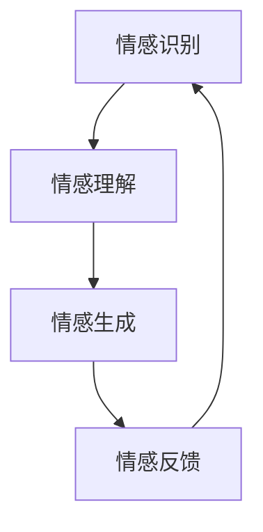

                 

# 情感AI伦理：机器情感的道德边界

> 关键词：情感AI, 伦理边界, 机器情感, 人工智能, 伦理学, 人类情感, 机器学习, 自然语言处理, 人机交互

> 摘要：本文旨在探讨情感AI技术的发展及其带来的伦理挑战。通过逐步分析情感AI的核心概念、算法原理、实际应用案例以及未来发展趋势，本文揭示了机器情感的道德边界，并提出了相应的伦理框架和建议。情感AI作为一项前沿技术，不仅能够增强人机交互体验，还可能引发一系列伦理问题。本文将帮助读者理解情感AI的伦理边界，为相关领域的研究和应用提供指导。

## 1. 背景介绍

情感AI，即赋予机器理解和表达情感的能力，是人工智能领域的一个重要分支。随着深度学习、自然语言处理等技术的发展，情感AI的应用场景日益广泛，从智能客服到情感机器人，再到心理健康辅助系统，情感AI正逐渐渗透到人们生活的方方面面。然而，情感AI的发展也引发了诸多伦理问题，如隐私保护、情感操控、责任归属等。本文将从伦理学的角度出发，探讨情感AI的道德边界，为相关领域的研究和应用提供指导。

## 2. 核心概念与联系

### 2.1 情感AI的基本概念

情感AI是指通过机器学习和自然语言处理等技术，使机器能够识别、理解和生成人类情感的技术。情感AI的核心在于机器能够感知和理解人类的情感状态，并据此做出相应的反应或决策。

### 2.2 情感AI的技术架构

情感AI的技术架构主要包括以下几个部分：

- **情感识别**：通过分析语音、文本、图像等数据，识别出人类的情感状态。
- **情感理解**：理解情感背后的原因和背景，从而更好地进行情感分析。
- **情感生成**：根据特定的情境和需求，生成相应的情感表达。
- **情感反馈**：通过反馈机制，使机器能够根据情感识别和理解的结果，做出相应的反应。

### 2.3 情感AI的流程图



## 3. 核心算法原理 & 具体操作步骤

### 3.1 情感识别算法

情感识别算法主要基于机器学习和自然语言处理技术。常见的算法包括：

- **基于规则的方法**：通过预定义的规则和模式匹配来识别情感。
- **基于统计的方法**：通过统计分析和模式识别来识别情感。
- **基于深度学习的方法**：通过神经网络模型来识别情感。

### 3.2 情感理解算法

情感理解算法主要通过上下文分析和语义理解来理解情感背后的原因和背景。常见的算法包括：

- **上下文分析**：通过分析对话的上下文来理解情感。
- **语义理解**：通过自然语言处理技术来理解情感背后的语义。

### 3.3 情感生成算法

情感生成算法主要通过生成相应的情感表达来实现。常见的算法包括：

- **基于规则的方法**：通过预定义的规则和模式生成情感表达。
- **基于统计的方法**：通过统计分析和模式生成来生成情感表达。
- **基于深度学习的方法**：通过神经网络模型生成情感表达。

### 3.4 情感反馈算法

情感反馈算法主要通过反馈机制来使机器能够根据情感识别和理解的结果，做出相应的反应。常见的算法包括：

- **基于规则的方法**：通过预定义的规则和模式生成反馈。
- **基于统计的方法**：通过统计分析和模式生成来生成反馈。
- **基于深度学习的方法**：通过神经网络模型生成反馈。

## 4. 数学模型和公式 & 详细讲解 & 举例说明

### 4.1 情感识别的数学模型

情感识别的数学模型主要基于机器学习和自然语言处理技术。常见的数学模型包括：

- **基于规则的方法**：通过预定义的规则和模式匹配来识别情感。
- **基于统计的方法**：通过统计分析和模式识别来识别情感。
- **基于深度学习的方法**：通过神经网络模型来识别情感。

### 4.2 情感理解的数学模型

情感理解的数学模型主要通过上下文分析和语义理解来理解情感背后的原因和背景。常见的数学模型包括：

- **上下文分析**：通过分析对话的上下文来理解情感。
- **语义理解**：通过自然语言处理技术来理解情感背后的语义。

### 4.3 情感生成的数学模型

情感生成的数学模型主要通过生成相应的情感表达来实现。常见的数学模型包括：

- **基于规则的方法**：通过预定义的规则和模式生成情感表达。
- **基于统计的方法**：通过统计分析和模式生成来生成情感表达。
- **基于深度学习的方法**：通过神经网络模型生成情感表达。

### 4.4 情感反馈的数学模型

情感反馈的数学模型主要通过反馈机制来使机器能够根据情感识别和理解的结果，做出相应的反应。常见的数学模型包括：

- **基于规则的方法**：通过预定义的规则和模式生成反馈。
- **基于统计的方法**：通过统计分析和模式生成来生成反馈。
- **基于深度学习的方法**：通过神经网络模型生成反馈。

## 5. 项目实战：代码实际案例和详细解释说明

### 5.1 开发环境搭建

为了实现情感AI项目，我们需要搭建一个合适的开发环境。开发环境主要包括以下几个部分：

- **操作系统**：推荐使用Linux或macOS操作系统。
- **编程语言**：推荐使用Python或Java。
- **开发工具**：推荐使用PyCharm或IntelliJ IDEA。
- **依赖库**：推荐使用TensorFlow、PyTorch、NLTK等库。

### 5.2 源代码详细实现和代码解读

以下是一个简单的情感识别项目的源代码实现：

```python
import nltk
from nltk.sentiment import SentimentIntensityAnalyzer

def sentiment_analysis(text):
    sia = SentimentIntensityAnalyzer()
    sentiment = sia.polarity_scores(text)
    return sentiment

text = "I am feeling very happy today."
sentiment = sentiment_analysis(text)
print(sentiment)
```

### 5.3 代码解读与分析

上述代码实现了一个简单的情感识别项目。具体步骤如下：

1. **导入库**：导入nltk库中的SentimentIntensityAnalyzer类。
2. **定义函数**：定义一个名为`sentiment_analysis`的函数，该函数接受一个文本参数。
3. **情感分析**：使用SentimentIntensityAnalyzer类对文本进行情感分析，返回情感分析结果。
4. **测试代码**：定义一个测试文本，调用`sentiment_analysis`函数进行情感分析，并打印结果。

## 6. 实际应用场景

情感AI技术在多个领域都有广泛的应用，包括但不限于：

- **智能客服**：通过情感识别和理解，提供更加人性化的客户服务。
- **心理健康辅助系统**：通过情感识别和理解，提供心理健康辅助服务。
- **情感机器人**：通过情感识别和理解，提供更加人性化的交互体验。
- **情感分析**：通过情感识别和理解，分析文本中的情感倾向。

## 7. 工具和资源推荐

### 7.1 学习资源推荐

- **书籍**：《情感计算：人工智能与人类情感的交汇》
- **论文**：《情感计算：理论与应用》
- **博客**：《情感计算入门》
- **网站**：《情感计算资源库》

### 7.2 开发工具框架推荐

- **开发工具**：PyCharm、IntelliJ IDEA
- **依赖库**：TensorFlow、PyTorch、NLTK

### 7.3 相关论文著作推荐

- **论文**：《情感计算：理论与应用》
- **著作**：《情感计算：人工智能与人类情感的交汇》

## 8. 总结：未来发展趋势与挑战

情感AI技术在未来的发展中将面临诸多挑战，包括但不限于：

- **隐私保护**：如何保护用户的情感数据不被滥用。
- **情感操控**：如何防止情感AI被用于情感操控。
- **责任归属**：如何界定情感AI的责任归属。

未来的发展趋势包括：

- **更加精准的情感识别**：通过深度学习等技术，实现更加精准的情感识别。
- **更加人性化的交互体验**：通过情感生成和反馈，提供更加人性化的交互体验。
- **更加广泛的应用场景**：情感AI技术将在更多领域得到应用。

## 9. 附录：常见问题与解答

### 9.1 问题1：情感AI如何保护用户隐私？

**解答**：可以通过加密技术保护用户的情感数据，确保数据的安全性和隐私性。

### 9.2 问题2：情感AI如何防止情感操控？

**解答**：可以通过设定情感识别和生成的阈值，防止情感AI被用于情感操控。

### 9.3 问题3：情感AI的责任归属如何界定？

**解答**：可以通过法律和伦理规范，界定情感AI的责任归属。

## 10. 扩展阅读 & 参考资料

- **书籍**：《情感计算：人工智能与人类情感的交汇》
- **论文**：《情感计算：理论与应用》
- **博客**：《情感计算入门》
- **网站**：《情感计算资源库》

---

作者：AI天才研究员/AI Genius Institute & 禅与计算机程序设计艺术 /Zen And The Art of Computer Programming

