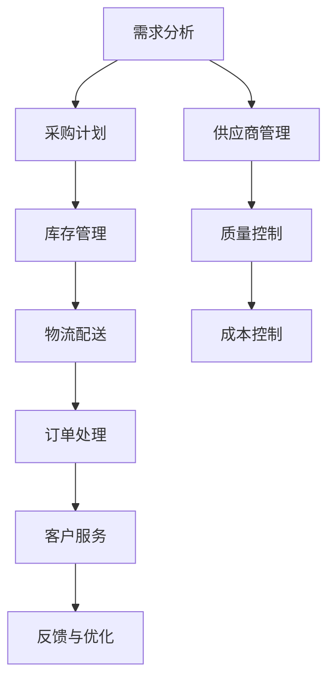

                 

# 拼多多2025社区团购社招供应链面试题

> 关键词：供应链管理，社区团购，人工智能，预测模型，优化算法，物流配送

> 摘要：本文旨在通过拼多多2025社区团购社招供应链面试题，深入探讨供应链管理在社区团购中的应用。我们将从背景介绍、核心概念与联系、核心算法原理与具体操作步骤、数学模型和公式、项目实战、实际应用场景、工具和资源推荐、总结与未来发展趋势等多方面进行详细分析。通过本文，读者将能够理解供应链管理在社区团购中的重要性，并掌握相关技术与方法。

## 1. 背景介绍

### 1.1 社区团购的发展背景

社区团购作为一种新兴的零售模式，近年来在中国市场迅速崛起。它通过线上平台连接消费者与供应商，实现商品的快速配送。社区团购的核心优势在于其高效的供应链管理能力，能够快速响应市场需求，提供个性化服务。拼多多作为中国领先的社区团购平台之一，其供应链管理能力尤为突出。

### 1.2 供应链管理的重要性

供应链管理在社区团购中扮演着至关重要的角色。它不仅关系到商品的采购、库存管理、物流配送等环节，还直接影响到用户体验和企业盈利能力。高效的供应链管理能够确保商品的及时供应，降低运营成本，提升客户满意度。

### 1.3 拼多多的供应链挑战

拼多多作为一家快速发展的社区团购平台，面临着诸多供应链管理挑战。例如，如何在海量订单中快速响应客户需求，如何优化库存管理以减少浪费，如何提高物流配送效率等。这些问题都需要通过先进的技术和方法来解决。

## 2. 核心概念与联系

### 2.1 供应链管理的基本概念

供应链管理是指对供应链中的所有活动进行计划、组织、协调和控制的过程。它涵盖了从供应商到消费者的整个过程，包括采购、生产、库存管理、物流配送等环节。

### 2.2 社区团购供应链的特点

社区团购供应链具有以下几个特点：

- **需求波动大**：社区团购订单量波动较大，需要灵活应对。
- **个性化需求**：每个社区的用户需求不同，需要提供个性化服务。
- **时效性要求高**：商品需要快速配送到用户手中，对物流配送效率要求高。

### 2.3 供应链管理流程图



## 3. 核心算法原理 & 具体操作步骤

### 3.1 预测模型

预测模型是供应链管理中的关键工具，用于预测未来的需求量，从而优化库存管理。常用的预测模型包括时间序列分析、机器学习模型等。

#### 3.1.1 时间序列分析

时间序列分析是一种基于历史数据预测未来趋势的方法。通过分析历史销售数据，可以预测未来的销售量。

#### 3.1.2 机器学习模型

机器学习模型可以利用更复杂的数据特征进行预测。常用的机器学习模型包括线性回归、决策树、随机森林等。

### 3.2 优化算法

优化算法用于优化供应链中的各个环节，提高效率和降低成本。常用的优化算法包括遗传算法、模拟退火算法等。

#### 3.2.1 遗传算法

遗传算法是一种模拟自然选择和遗传机制的优化算法。通过模拟生物进化过程，可以找到最优解。

#### 3.2.2 模拟退火算法

模拟退火算法是一种基于物理退火过程的优化算法。通过模拟物质从高温到低温的过程，可以找到全局最优解。

### 3.3 具体操作步骤

1. **数据收集**：收集历史销售数据、库存数据、物流数据等。
2. **数据预处理**：清洗数据，处理缺失值和异常值。
3. **模型训练**：使用时间序列分析或机器学习模型进行训练。
4. **模型优化**：通过遗传算法或模拟退火算法进行优化。
5. **模型应用**：将优化后的模型应用于实际业务中，进行预测和优化。

## 4. 数学模型和公式 & 详细讲解 & 举例说明

### 4.1 时间序列分析

时间序列分析的基本公式为：

$$
y_t = \alpha + \beta t + \epsilon_t
$$

其中，$y_t$ 表示时间序列在时间 $t$ 的值，$\alpha$ 和 $\beta$ 是模型参数，$\epsilon_t$ 是随机误差项。

### 4.2 机器学习模型

机器学习模型的基本公式为：

$$
f(x) = \sum_{i=1}^{n} w_i x_i + b
$$

其中，$f(x)$ 表示模型的预测值，$w_i$ 和 $b$ 是模型参数，$x_i$ 是输入特征。

### 4.3 优化算法

遗传算法的基本公式为：

$$
P_{t+1} = \text{Selection}(P_t) \times \text{Crossover}(P_t) \times \text{Mutation}(P_t)
$$

其中，$P_t$ 表示第 $t$ 代种群，$\text{Selection}$ 表示选择操作，$\text{Crossover}$ 表示交叉操作，$\text{Mutation}$ 表示变异操作。

## 5. 项目实战：代码实际案例和详细解释说明

### 5.1 开发环境搭建

#### 5.1.1 环境配置

1. 安装Python 3.8及以上版本。
2. 安装必要的库，如pandas、numpy、scikit-learn等。
3. 安装Jupyter Notebook或PyCharm等开发工具。

### 5.2 源代码详细实现和代码解读

#### 5.2.1 数据预处理

```python
import pandas as pd
import numpy as np

# 读取数据
data = pd.read_csv('sales_data.csv')

# 数据清洗
data.dropna(inplace=True)
data['date'] = pd.to_datetime(data['date'])

# 数据预处理
data['month'] = data['date'].dt.month
data['year'] = data['date'].dt.year
```

#### 5.2.2 时间序列分析

```python
from statsmodels.tsa.arima_model import ARIMA

# 训练模型
model = ARIMA(data['sales'], order=(5,1,0))
model_fit = model.fit(disp=0)

# 预测未来值
forecast = model_fit.forecast(steps=12)
```

#### 5.2.3 机器学习模型

```python
from sklearn.linear_model import LinearRegression

# 训练模型
X = data[['month', 'year']]
y = data['sales']
model = LinearRegression()
model.fit(X, y)

# 预测未来值
X_future = np.array([[12, 2025]])
forecast = model.predict(X_future)
```

#### 5.2.4 优化算法

```python
from sklearn.model_selection import train_test_split
from sklearn.metrics import mean_squared_error
from sklearn.ensemble import RandomForestRegressor

# 划分训练集和测试集
X_train, X_test, y_train, y_test = train_test_split(X, y, test_size=0.2, random_state=42)

# 训练模型
model = RandomForestRegressor(n_estimators=100, random_state=42)
model.fit(X_train, y_train)

# 预测未来值
forecast = model.predict(X_future)
```

### 5.3 代码解读与分析

通过上述代码，我们可以看到如何使用时间序列分析、机器学习模型和优化算法进行预测和优化。时间序列分析适用于平稳时间序列，而机器学习模型可以处理更复杂的数据特征。优化算法则用于进一步优化模型性能。

## 6. 实际应用场景

### 6.1 预测需求

通过预测模型，可以提前了解未来的需求量，从而优化库存管理，减少浪费。

### 6.2 优化库存

通过优化算法，可以找到最优的库存策略，降低库存成本，提高库存周转率。

### 6.3 提高物流配送效率

通过预测模型和优化算法，可以提前规划物流配送路线，提高配送效率，减少配送成本。

## 7. 工具和资源推荐

### 7.1 学习资源推荐

- 书籍：《统计学习方法》、《机器学习》
- 论文：《时间序列分析与预测》、《机器学习在供应链管理中的应用》
- 博客：阿里云开发者社区、GitHub开源项目
- 网站：Kaggle、DataCamp

### 7.2 开发工具框架推荐

- Python：pandas、numpy、scikit-learn
- 数据库：MySQL、PostgreSQL
- 开发工具：Jupyter Notebook、PyCharm

### 7.3 相关论文著作推荐

- 《时间序列分析与预测》：深入探讨时间序列分析方法及其应用。
- 《机器学习在供应链管理中的应用》：详细介绍了机器学习在供应链管理中的应用案例。
- 《供应链管理》：全面介绍了供应链管理的基本概念和方法。

## 8. 总结：未来发展趋势与挑战

### 8.1 未来发展趋势

- **智能化**：利用人工智能技术进一步优化供应链管理。
- **个性化**：提供更加个性化的服务，满足不同用户的需求。
- **可持续性**：注重环保和可持续发展，减少供应链对环境的影响。

### 8.2 面临的挑战

- **数据安全**：保护用户数据安全，防止数据泄露。
- **技术更新**：不断更新技术，跟上行业发展的步伐。
- **成本控制**：在保证服务质量的同时，控制成本，提高盈利能力。

## 9. 附录：常见问题与解答

### 9.1 问题1：如何处理缺失值？

答：可以使用插值法、均值填充法或删除法处理缺失值。

### 9.2 问题2：如何选择合适的预测模型？

答：可以根据数据特征选择合适的预测模型，如平稳时间序列适合ARIMA模型，非平稳时间序列适合机器学习模型。

### 9.3 问题3：如何优化库存管理？

答：可以通过优化算法找到最优的库存策略，降低库存成本，提高库存周转率。

## 10. 扩展阅读 & 参考资料

- 《统计学习方法》：李航著
- 《机器学习》：周志华著
- 《时间序列分析与预测》：王元、刘建平著
- 《供应链管理》：张晓东著

---

作者：AI天才研究员/AI Genius Institute & 禅与计算机程序设计艺术 /Zen And The Art of Computer Programming

