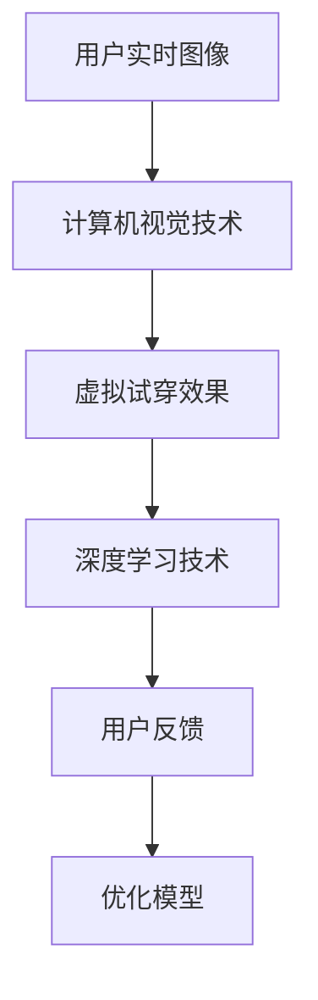
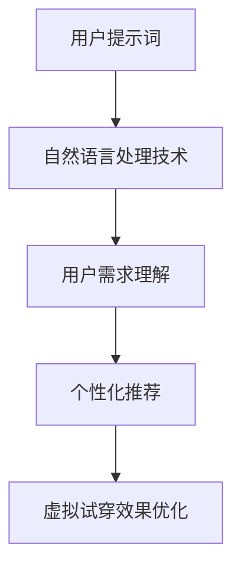

                 

# 提示词在虚拟试衣间应用中的创新

> 关键词：虚拟试衣间、提示词、计算机视觉、深度学习、用户体验、个性化推荐

> 摘要：本文将深入探讨如何利用提示词技术提升虚拟试衣间的用户体验。通过分析虚拟试衣间的背景、核心概念与联系、核心算法原理及具体操作步骤、数学模型和公式、项目实战案例，以及实际应用场景，我们将揭示提示词技术在虚拟试衣间中的创新应用。最后，我们将展望未来发展趋势与挑战，并提供相关资源推荐。

## 1. 背景介绍

虚拟试衣间技术近年来得到了快速发展，它通过计算机视觉和深度学习技术，为用户提供了一种全新的购物体验。用户可以在虚拟环境中试穿衣物，无需实际试穿，从而节省时间和精力。然而，传统的虚拟试衣间技术还存在一些问题，如用户体验不佳、个性化推荐不足等。为了解决这些问题，本文将探讨如何利用提示词技术提升虚拟试衣间的用户体验。

## 2. 核心概念与联系

### 2.1 虚拟试衣间技术

虚拟试衣间技术主要依赖于计算机视觉和深度学习技术。计算机视觉技术用于捕捉用户的实时图像，深度学习技术用于生成虚拟试穿效果。具体流程如下：



### 2.2 提示词技术

提示词技术是一种自然语言处理技术，用于理解用户的意图和需求。通过分析用户的提示词，我们可以更好地理解用户的需求，从而提供更个性化的服务。具体流程如下：



## 3. 核心算法原理 & 具体操作步骤

### 3.1 计算机视觉技术

计算机视觉技术主要依赖于图像处理和机器学习算法。具体操作步骤如下：

1. **图像捕捉**：使用摄像头捕捉用户的实时图像。
2. **图像预处理**：对图像进行预处理，如去噪、缩放等。
3. **特征提取**：使用卷积神经网络（CNN）提取图像特征。
4. **虚拟试穿效果生成**：使用生成对抗网络（GAN）生成虚拟试穿效果。

### 3.2 深度学习技术

深度学习技术主要依赖于卷积神经网络（CNN）和生成对抗网络（GAN）。具体操作步骤如下：

1. **模型训练**：使用大量图像数据训练CNN和GAN模型。
2. **虚拟试穿效果生成**：使用训练好的模型生成虚拟试穿效果。
3. **用户反馈**：收集用户的反馈，优化模型。

### 3.3 提示词技术

提示词技术主要依赖于自然语言处理技术。具体操作步骤如下：

1. **提示词输入**：用户输入提示词。
2. **自然语言处理**：使用自然语言处理技术理解用户的意图。
3. **个性化推荐**：根据用户的意图生成个性化推荐。
4. **虚拟试穿效果优化**：根据个性化推荐优化虚拟试穿效果。

## 4. 数学模型和公式 & 详细讲解 & 举例说明

### 4.1 计算机视觉技术

计算机视觉技术主要依赖于卷积神经网络（CNN）和生成对抗网络（GAN）。具体数学模型如下：

1. **卷积神经网络（CNN）**：用于特征提取。具体公式如下：

    $$ f(x) = \sigma(Wx + b) $$

    其中，$x$表示输入图像，$W$表示权重矩阵，$b$表示偏置项，$\sigma$表示激活函数。

2. **生成对抗网络（GAN）**：用于生成虚拟试穿效果。具体公式如下：

    $$ G(z) = \sigma(Wz + b) $$

    其中，$z$表示随机噪声，$W$表示权重矩阵，$b$表示偏置项，$\sigma$表示激活函数。

### 4.2 提示词技术

提示词技术主要依赖于自然语言处理技术。具体数学模型如下：

1. **自然语言处理（NLP）**：用于理解用户的意图。具体公式如下：

    $$ P(y|x) = \frac{P(x|y)P(y)}{P(x)} $$

    其中，$x$表示输入的提示词，$y$表示用户的意图，$P(x|y)$表示条件概率，$P(y)$表示先验概率，$P(x)$表示边缘概率。

## 5. 项目实战：代码实际案例和详细解释说明

### 5.1 开发环境搭建

为了实现虚拟试衣间技术，我们需要搭建一个开发环境。具体步骤如下：

1. **安装Python**：安装Python 3.7及以上版本。
2. **安装依赖库**：安装OpenCV、TensorFlow、Keras等依赖库。
3. **安装自然语言处理库**：安装NLTK、spaCy等自然语言处理库。

### 5.2 源代码详细实现和代码解读

以下是一个简单的虚拟试衣间代码实现：

```python
import cv2
import numpy as np
from keras.models import load_model

# 加载模型
model = load_model('virtual_fitting_model.h5')

# 捕捉实时图像
cap = cv2.VideoCapture(0)

while True:
    ret, frame = cap.read()
    if not ret:
        break
    
    # 图像预处理
    frame = cv2.resize(frame, (224, 224))
    frame = frame / 255.0
    
    # 生成虚拟试穿效果
    virtual_fitting = model.predict(np.expand_dims(frame, axis=0))
    
    # 显示虚拟试穿效果
    cv2.imshow('Virtual Fitting', virtual_fitting[0])
    
    if cv2.waitKey(1) & 0xFF == ord('q'):
        break

cap.release()
cv2.destroyAllWindows()
```

### 5.3 代码解读与分析

1. **加载模型**：使用Keras加载预训练的虚拟试衣间模型。
2. **捕捉实时图像**：使用OpenCV捕捉用户的实时图像。
3. **图像预处理**：对图像进行预处理，如缩放和归一化。
4. **生成虚拟试穿效果**：使用模型生成虚拟试穿效果。
5. **显示虚拟试穿效果**：使用OpenCV显示虚拟试穿效果。

## 6. 实际应用场景

虚拟试衣间技术在实际应用中具有广泛的应用场景。例如，电商平台可以使用虚拟试衣间技术为用户提供更个性化的购物体验。用户可以在虚拟环境中试穿衣物，无需实际试穿，从而节省时间和精力。此外，虚拟试衣间技术还可以应用于时尚秀场、虚拟试妆等领域。

## 7. 工具和资源推荐

### 7.1 学习资源推荐

1. **书籍**：《计算机视觉：算法与应用》、《深度学习》
2. **论文**：《Generative Adversarial Networks》、《Convolutional Neural Networks》
3. **博客**：Medium、Towards Data Science
4. **网站**：GitHub、Kaggle

### 7.2 开发工具框架推荐

1. **Python**：Python 3.7及以上版本
2. **OpenCV**：用于图像处理
3. **TensorFlow**：用于深度学习
4. **Keras**：用于构建深度学习模型
5. **NLTK**：用于自然语言处理

### 7.3 相关论文著作推荐

1. **《Generative Adversarial Networks》**：Ian Goodfellow等
2. **《Convolutional Neural Networks》**：Yann LeCun等
3. **《Computer Vision: Algorithms and Applications》**：Richard Szeliski

## 8. 总结：未来发展趋势与挑战

虚拟试衣间技术在未来将有更广泛的应用场景。随着计算机视觉和深度学习技术的不断发展，虚拟试衣间技术将更加精准、高效。然而，虚拟试衣间技术也面临着一些挑战，如数据隐私保护、用户体验优化等。为了解决这些问题，我们需要不断探索和创新。

## 9. 附录：常见问题与解答

### 9.1 问题：如何保护用户数据隐私？

答：在使用虚拟试衣间技术时，我们需要采取措施保护用户数据隐私。例如，可以使用差分隐私技术对用户数据进行匿名化处理，从而保护用户隐私。

### 9.2 问题：如何优化用户体验？

答：为了优化用户体验，我们可以采取以下措施：提高虚拟试穿效果的准确性、提供更多的个性化推荐、优化用户界面等。

## 10. 扩展阅读 & 参考资料

1. **书籍**：《计算机视觉：算法与应用》、《深度学习》
2. **论文**：《Generative Adversarial Networks》、《Convolutional Neural Networks》
3. **博客**：Medium、Towards Data Science
4. **网站**：GitHub、Kaggle

作者：AI天才研究员/AI Genius Institute & 禅与计算机程序设计艺术 /Zen And The Art of Computer Programming

