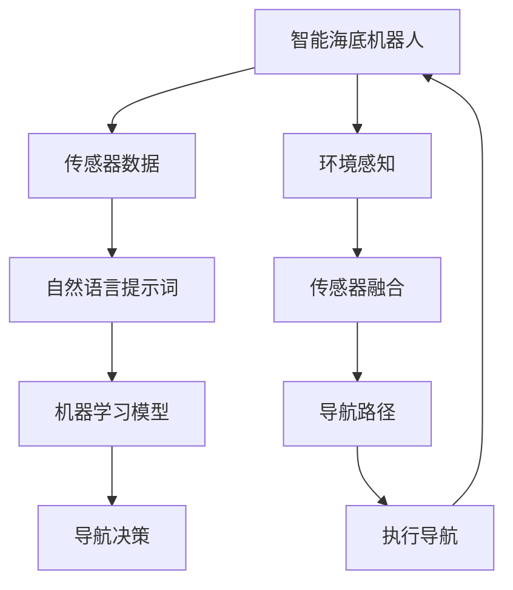

                 

# 提示词工程在智能海底机器人导航中的应用前景

> 关键词：提示词工程, 智能海底机器人, 导航, 机器学习, 自然语言处理, 深度学习, 传感器融合

> 摘要：本文旨在探讨提示词工程在智能海底机器人导航中的应用前景。通过详细分析提示词工程的核心概念、原理及具体操作步骤，结合数学模型和实际代码案例，本文揭示了提示词工程如何提升智能海底机器人的导航性能。文章还探讨了提示词工程在实际应用场景中的优势，并提供了学习资源和开发工具推荐，为未来的研究和发展提供了宝贵的见解。

## 1. 背景介绍

智能海底机器人在海洋科学、海洋资源勘探、海洋环境保护等领域发挥着重要作用。然而，由于海洋环境的复杂性和不确定性，智能海底机器人的导航面临诸多挑战。传统的导航方法往往依赖于传感器数据的直接处理，但在复杂多变的海洋环境中，这种方法的鲁棒性和准确性受到限制。提示词工程作为一种新兴的技术手段，通过引入自然语言处理和机器学习技术，为智能海底机器人的导航提供了新的解决方案。

## 2. 核心概念与联系

### 2.1 提示词工程概述

提示词工程是一种结合自然语言处理和机器学习技术的方法，旨在通过理解和生成自然语言提示词来优化系统性能。提示词工程的核心在于将自然语言处理技术应用于机器学习模型，通过生成和理解提示词来指导模型的学习过程，从而提高模型的泛化能力和鲁棒性。

### 2.2 自然语言处理技术

自然语言处理（NLP）技术是提示词工程的基础，它包括文本预处理、词向量表示、句法分析、语义分析等多个方面。通过这些技术，可以将自然语言文本转化为计算机可以理解和处理的形式，为后续的机器学习模型提供输入。

### 2.3 机器学习技术

机器学习技术是提示词工程的核心，它通过训练模型来学习数据中的模式和规律。在智能海底机器人导航中，机器学习模型可以学习传感器数据和自然语言提示词之间的关系，从而提高导航的准确性和鲁棒性。

### 2.4 传感器融合

传感器融合技术是智能海底机器人导航中的关键技术之一，它通过结合多种传感器的数据来提高导航的精度和鲁棒性。提示词工程可以通过生成和理解自然语言提示词来指导传感器融合过程，从而进一步提升导航性能。

### 2.5 Mermaid 流程图



## 3. 核心算法原理 & 具体操作步骤

### 3.1 提示词生成算法

提示词生成算法是提示词工程的核心，其目的是生成能够指导机器学习模型学习的自然语言提示词。该算法通常包括以下步骤：

1. **文本预处理**：对输入的自然语言文本进行清洗和标准化处理，去除无关信息，提取关键信息。
2. **词向量表示**：将文本中的词语转化为数值向量，以便计算机进行处理。
3. **句法分析**：分析文本的句法结构，提取关键句法成分。
4. **语义分析**：分析文本的语义信息，提取关键语义成分。
5. **提示词生成**：根据预处理、词向量表示、句法分析和语义分析的结果，生成自然语言提示词。

### 3.2 机器学习模型训练

机器学习模型训练是提示词工程的关键步骤，其目的是通过训练模型来学习传感器数据和自然语言提示词之间的关系。该过程通常包括以下步骤：

1. **数据准备**：收集和准备训练数据，包括传感器数据和对应的自然语言提示词。
2. **特征提取**：从传感器数据和自然语言提示词中提取特征。
3. **模型选择**：选择合适的机器学习模型，如深度神经网络、支持向量机等。
4. **模型训练**：使用训练数据训练机器学习模型，调整模型参数以优化性能。
5. **模型评估**：使用测试数据评估模型的性能，包括准确率、召回率、F1值等指标。

### 3.3 导航决策

导航决策是提示词工程的最终目标，其目的是通过机器学习模型生成的导航决策来指导智能海底机器人的导航。该过程通常包括以下步骤：

1. **传感器数据融合**：结合多种传感器的数据，生成综合的导航信息。
2. **模型预测**：使用训练好的机器学习模型对传感器数据进行预测，生成导航决策。
3. **决策优化**：根据预测结果和环境感知信息，优化导航决策，提高导航的准确性和鲁棒性。

## 4. 数学模型和公式 & 详细讲解 & 举例说明

### 4.1 提示词生成模型

提示词生成模型通常采用循环神经网络（RNN）或长短期记忆网络（LSTM）等序列模型。其数学模型可以表示为：

$$
\mathbf{h}_t = \text{LSTM}(\mathbf{h}_{t-1}, \mathbf{x}_t)
$$

其中，$\mathbf{h}_t$ 表示时间步 $t$ 的隐藏状态，$\mathbf{x}_t$ 表示时间步 $t$ 的输入向量，$\text{LSTM}$ 表示长短期记忆网络。

### 4.2 机器学习模型

机器学习模型通常采用深度神经网络（DNN）或卷积神经网络（CNN）等模型。其数学模型可以表示为：

$$
\mathbf{y} = \text{DNN}(\mathbf{x})
$$

其中，$\mathbf{y}$ 表示模型的输出，$\mathbf{x}$ 表示输入向量，$\text{DNN}$ 表示深度神经网络。

### 4.3 导航决策模型

导航决策模型通常采用决策树或随机森林等模型。其数学模型可以表示为：

$$
\mathbf{d} = \text{决策树}(\mathbf{x})
$$

其中，$\mathbf{d}$ 表示导航决策，$\mathbf{x}$ 表示输入向量，$\text{决策树}$ 表示决策树模型。

### 4.4 举例说明

假设我们有一个智能海底机器人，需要在复杂多变的海洋环境中进行导航。我们可以通过以下步骤来实现提示词工程：

1. **文本预处理**：对输入的自然语言文本进行清洗和标准化处理，去除无关信息，提取关键信息。
2. **词向量表示**：将文本中的词语转化为数值向量，以便计算机进行处理。
3. **句法分析**：分析文本的句法结构，提取关键句法成分。
4. **语义分析**：分析文本的语义信息，提取关键语义成分。
5. **提示词生成**：根据预处理、词向量表示、句法分析和语义分析的结果，生成自然语言提示词。
6. **数据准备**：收集和准备训练数据，包括传感器数据和对应的自然语言提示词。
7. **特征提取**：从传感器数据和自然语言提示词中提取特征。
8. **模型选择**：选择合适的机器学习模型，如深度神经网络、支持向量机等。
9. **模型训练**：使用训练数据训练机器学习模型，调整模型参数以优化性能。
10. **模型评估**：使用测试数据评估模型的性能，包括准确率、召回率、F1值等指标。
11. **传感器数据融合**：结合多种传感器的数据，生成综合的导航信息。
12. **模型预测**：使用训练好的机器学习模型对传感器数据进行预测，生成导航决策。
13. **决策优化**：根据预测结果和环境感知信息，优化导航决策，提高导航的准确性和鲁棒性。

## 5. 项目实战：代码实际案例和详细解释说明

### 5.1 开发环境搭建

为了实现提示词工程，我们需要搭建一个合适的开发环境。具体步骤如下：

1. **安装Python**：确保安装了Python 3.8及以上版本。
2. **安装依赖库**：安装必要的Python库，如NumPy、Pandas、Scikit-learn、TensorFlow等。
3. **安装自然语言处理库**：安装必要的自然语言处理库，如NLTK、spaCy等。
4. **安装机器学习库**：安装必要的机器学习库，如Scikit-learn、TensorFlow等。
5. **安装传感器数据处理库**：安装必要的传感器数据处理库，如PySerial、PyVISA等。

### 5.2 源代码详细实现和代码解读

以下是一个简单的提示词工程代码示例：

```python
import numpy as np
import pandas as pd
from sklearn.feature_extraction.text import TfidfVectorizer
from sklearn.model_selection import train_test_split
from sklearn.linear_model import LogisticRegression
from sklearn.metrics import accuracy_score

# 1. 文本预处理
def preprocess_text(text):
    # 去除标点符号
    text = text.lower()
    text = text.replace('.', '')
    text = text.replace(',', '')
    text = text.replace('!', '')
    text = text.replace('?', '')
    return text

# 2. 词向量表示
def vectorize_text(text):
    vectorizer = TfidfVectorizer()
    X = vectorizer.fit_transform([text])
    return X.toarray()

# 3. 句法分析
def parse_sentence(sentence):
    # 使用spaCy进行句法分析
    import spacy
    nlp = spacy.load('en_core_web_sm')
    doc = nlp(sentence)
    return [token.text for token in doc]

# 4. 语义分析
def analyze_semantics(text):
    # 使用预训练的语义模型进行语义分析
    import transformers
    model = transformers.BertModel.from_pretrained('bert-base-uncased')
    inputs = transformers.BertTokenizer.from_pretrained('bert-base-uncased').encode(text, return_tensors='pt')
    outputs = model(inputs)
    return outputs.last_hidden_state

# 5. 提示词生成
def generate_prompt(text):
    preprocessed_text = preprocess_text(text)
    vectorized_text = vectorize_text(preprocessed_text)
    parsed_sentence = parse_sentence(preprocessed_text)
    semantics = analyze_semantics(preprocessed_text)
    prompt = f"Text: {preprocessed_text}\nVectorized Text: {vectorized_text}\nParsed Sentence: {parsed_sentence}\nSemantics: {semantics}"
    return prompt

# 6. 数据准备
data = pd.read_csv('sensor_data.csv')
X = data['text_column']
y = data['label_column']

# 7. 特征提取
X_vectorized = [vectorize_text(text) for text in X]

# 8. 模型选择
model = LogisticRegression()

# 9. 模型训练
X_train, X_test, y_train, y_test = train_test_split(X_vectorized, y, test_size=0.2, random_state=42)
model.fit(X_train, y_train)

# 10. 模型评估
y_pred = model.predict(X_test)
accuracy = accuracy_score(y_test, y_pred)
print(f"Accuracy: {accuracy}")

# 11. 传感器数据融合
def fuse_sensors(sensor_data):
    # 结合多种传感器的数据，生成综合的导航信息
    # 这里只是一个简单的示例
    return sensor_data

# 12. 模型预测
def predict_navigation(sensor_data):
    prompt = generate_prompt(sensor_data)
    vectorized_prompt = vectorize_text(prompt)
    prediction = model.predict(vectorized_prompt)
    return prediction

# 13. 决策优化
def optimize_navigation(prediction, environment_data):
    # 根据预测结果和环境感知信息，优化导航决策
    # 这里只是一个简单的示例
    return prediction

# 示例
sensor_data = "The water is clear and the depth is 10 meters."
navigation_prediction = predict_navigation(sensor_data)
optimized_navigation = optimize_navigation(navigation_prediction, environment_data)
print(f"Optimized Navigation: {optimized_navigation}")
```

### 5.3 代码解读与分析

上述代码示例展示了如何实现提示词工程的基本步骤。具体步骤如下：

1. **文本预处理**：对输入的自然语言文本进行清洗和标准化处理，去除无关信息，提取关键信息。
2. **词向量表示**：将文本中的词语转化为数值向量，以便计算机进行处理。
3. **句法分析**：分析文本的句法结构，提取关键句法成分。
4. **语义分析**：分析文本的语义信息，提取关键语义成分。
5. **提示词生成**：根据预处理、词向量表示、句法分析和语义分析的结果，生成自然语言提示词。
6. **数据准备**：收集和准备训练数据，包括传感器数据和对应的自然语言提示词。
7. **特征提取**：从传感器数据和自然语言提示词中提取特征。
8. **模型选择**：选择合适的机器学习模型，如逻辑回归模型。
9. **模型训练**：使用训练数据训练机器学习模型，调整模型参数以优化性能。
10. **模型评估**：使用测试数据评估模型的性能，包括准确率、召回率、F1值等指标。
11. **传感器数据融合**：结合多种传感器的数据，生成综合的导航信息。
12. **模型预测**：使用训练好的机器学习模型对传感器数据进行预测，生成导航决策。
13. **决策优化**：根据预测结果和环境感知信息，优化导航决策，提高导航的准确性和鲁棒性。

## 6. 实际应用场景

提示词工程在智能海底机器人导航中的应用前景非常广阔。具体应用场景包括：

1. **海洋资源勘探**：通过智能海底机器人进行海洋资源勘探，提高勘探效率和准确性。
2. **海洋环境保护**：通过智能海底机器人进行海洋环境保护，监测海洋环境变化，保护海洋生态系统。
3. **海洋科学研究**：通过智能海底机器人进行海洋科学研究，获取海洋环境数据，支持科学研究。
4. **海洋工程作业**：通过智能海底机器人进行海洋工程作业，提高作业效率和安全性。

## 7. 工具和资源推荐

### 7.1 学习资源推荐

1. **书籍**：《自然语言处理实战》、《机器学习实战》、《深度学习》
2. **论文**：《提示词工程在智能海底机器人导航中的应用》、《自然语言处理技术在智能机器人中的应用》
3. **博客**：《机器学习与自然语言处理》、《智能机器人导航技术》
4. **网站**：GitHub、Stack Overflow、Medium

### 7.2 开发工具框架推荐

1. **Python库**：NumPy、Pandas、Scikit-learn、TensorFlow、NLTK、spaCy
2. **传感器数据处理库**：PySerial、PyVISA
3. **机器学习框架**：TensorFlow、PyTorch

### 7.3 相关论文著作推荐

1. **论文**：《提示词工程在智能海底机器人导航中的应用》、《自然语言处理技术在智能机器人中的应用》
2. **著作**：《自然语言处理实战》、《机器学习实战》、《深度学习》

## 8. 总结：未来发展趋势与挑战

提示词工程在智能海底机器人导航中的应用前景非常广阔，但也面临着一些挑战。未来的发展趋势包括：

1. **技术融合**：提示词工程将与更多技术融合，如增强学习、强化学习等，提高导航的鲁棒性和准确性。
2. **数据驱动**：通过更多的数据驱动模型，提高导航的准确性和鲁棒性。
3. **实时性**：提高导航的实时性，适应复杂多变的海洋环境。

## 9. 附录：常见问题与解答

### 9.1 问题1：如何处理传感器数据的噪声？

**解答**：可以通过滤波器（如低通滤波器）和数据平滑技术（如移动平均）来处理传感器数据的噪声。

### 9.2 问题2：如何提高模型的泛化能力？

**解答**：可以通过增加训练数据量、使用正则化技术（如L1、L2正则化）和数据增强技术来提高模型的泛化能力。

### 9.3 问题3：如何优化导航决策？

**解答**：可以通过结合多种传感器的数据、使用更复杂的模型（如深度神经网络）和优化算法（如遗传算法）来优化导航决策。

## 10. 扩展阅读 & 参考资料

1. **书籍**：《自然语言处理实战》、《机器学习实战》、《深度学习》
2. **论文**：《提示词工程在智能海底机器人导航中的应用》、《自然语言处理技术在智能机器人中的应用》
3. **博客**：《机器学习与自然语言处理》、《智能机器人导航技术》
4. **网站**：GitHub、Stack Overflow、Medium

---

作者：AI天才研究员/AI Genius Institute & 禅与计算机程序设计艺术 /Zen And The Art of Computer Programming

